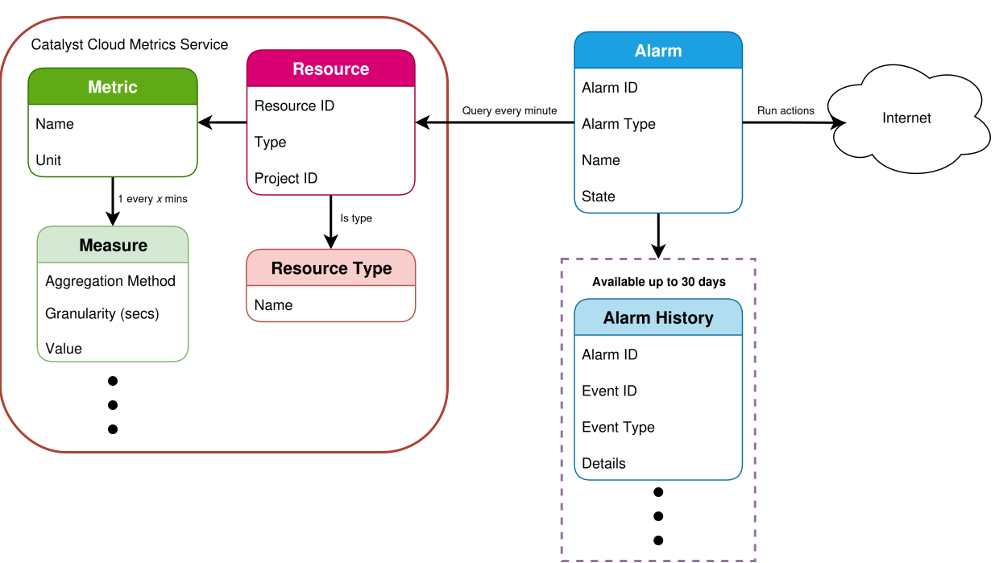

.. _alarm-overview:

########
Overview
########

This page documents how to interact with the Catalyst Cloud Alarm Service
using the OpenStack CLI, most of the useful configuration options and attributes,
and provides some examples of creating alarms for common use cases.

.. note::

  The Alarm Service has no user interface on the Catalyst Cloud dashboard at this time.

.. contents::
    :local:
    :depth: 3
    :backlinks: none

*****************
What is an alarm?
*****************

An **alarm** is an object that periodically runs **evaluations**
against metrics for one or more Catalyst Cloud resources.

The result of the evaluation gets stored as the :ref:`state <alarm-states>` of the alarm
(e.g. OK, alarm). If the latest evaluation results in a **state change** (i.e. the alarm
is triggered), the alarm is updated with the new state and any configured
:ref:`actions <alarm-actions>` are performed to notify external listeners.

.. note::

  Alarms have an **evaluation period** of 60 seconds (they are evaluated every minute).
  In practice however, the **frequency** of the metrics being monitored, and the
  **granularity** they can be queried by, determine how often an alarm's state is updated.

  For more information on how often resource metrics are generated and the available
  granularities, see the :ref:`metrics-reference`.

The Alarm Service also stores the :ref:`history <alarm-history>` of recent configuration
and state changes for all alarms for up to **30 days**.

*************
Prerequisites
*************

Setting up users
================

Catalyst Cloud users with one of the following user roles can use the Alarm Service
(for more information, see :ref:`Access Control <access_control>`):

* :ref:`project_member_role`

Setting up your environment
===========================

First, follow the instructions for :ref:`setting up the CLI Tools and SDKs <sdks_and_toolkits>`.

Make sure you have :ref:`sourced the OpenRC file for your project <source-rc-file>` in an open terminal.

Check that the ``openstack alarm`` series of commands are available.
If not, make sure the ``aodhclient`` package is installed.

.. code-block:: console

  $ openstack alarm --help
  Command "alarm" matches:
    alarm create
    alarm delete
    alarm list
    alarm quota set
    alarm quota show
    alarm show
    alarm state get
    alarm state set
    alarm update
    alarm-history search
    alarm-history show
    alarming capabilities list

It is also recommended to make sure you can access the
:ref:`Catalyst Cloud Metrics Service <metrics-getting-started>`,
as being able to query resource metrics directly will make it easier
to troubleshoot alarm configuration issues.

***************
Getting Started
***************

Alarms can be created using the ``openstack alarm create`` command,
like in the following example.

.. code-block:: bash

  openstack alarm create --name test-instance-memory \
                         --description "Alert when test-instance memory usage exceeds 768MiB" \
                         --type gnocchi_resources_threshold \
                         --resource-type instance \
                         --resource-id $(openstack server show test-instance -c id -f value) \
                         --metric memory.usage \
                         --aggregation-method mean \
                         --granularity 600 \
                         --threshold 768 \
                         --comparison-operator gt \
                         --severity critical

The following parameters are required for all alarm types:

.. list-table::
  :width: 50%
  :header-rows: 1

  * - Parameter
    - Type
    - Description
  * - ``--name <NAME>``
    - String
    - The name of the alarm.
  * - ``--type <TYPE>``
    - Enumeration
    - The type of the alarm (see :ref:`Alarm Types <alarm-types>`).

The following basic optional parameters are also available for all alarm types:

.. list-table::
  :widths: 19 7 8 18 30
  :header-rows: 1

  * - Parameter
    - Type
    - Default Value
    - Accepted Values / Examples
    - Description
  * - ``--description <DESCRIPTION>``
    - String
    - (none)
    - ``Alert when CPU usage is high``
    - A human-readable description of the alarm.
  * - ``--severity <SEVERITY>``
    - Enumeration
    - ``low``
    - ``low``, ``moderate``, ``critical``
    - The severity of the alarm, if triggered.
  * - ``--enable <ENABLE>``
    - Boolean
    - ``True``
    - ``True``, ``False``
    - Whether or not the alarm should be :ref:`enabled <alarm-enable-disable>` when created.
  * - ``--evaluation-periods <PERIODS>``
    - Integer
    - ``1``
    - Greater than 0
    - The number of recent evaluations considered when determining alarm state.

      **NOTE:** Evaluations are performed every minute, so this value corresponds
      to the last *n* minutes of alarm evaluations.

Instructions for some of the other, more complex, optional parameters
are available in :ref:`alarm-examples`.

Depending on the **alarm type**, there are additional required and optional
parameters available. For more information, see :ref:`Alarm Types <alarm-types>`.

.. _alarm-states:

******
States
******

Alarms can be in one of the following states:

.. list-table::
  :widths: 15 60
  :header-rows: 1
  :width: 75%

  * - State
    - Description
  * - ``ok``
    - The alarm has recently been evaluated with a negative result.
  * - ``alarm``
    - The alarm has recently been evaluated with a **positive** result, and has been triggered.
  * - ``insufficient data``
    - The alarm has not been evaluated yet, or the last evaluation resulted in either
      no data or not enough data to meaningfully determine the alarm state.

Depending on the configured :ref:`alarm actions <alarm-actions>`, transitions between
the above alarm states will result in one or more actions being performed.

.. _alarm-types:

*****
Types
*****

Alarms can be created as one of a number of available types.

Depending on the alarm type, different parameters are used to configure them.

.. _alarm-threshold:

Threshold alarms
================

Threshold alarms are used to monitor the value of a particular metric for one or more resources.

Metrics for threshold alarms are provided by the :ref:`Catalyst Cloud Metrics Service <metrics>`.
Any :ref:`resource type or metric <metrics-reference>` available in the Metrics Service can be
monitored using the Alarm Service.

The following parameters are available for all threshold alarms:

.. list-table::
  :header-rows: 1

  * - Parameter
    - Type
    - Default Value
    - Accepted Values / Examples
    - Description
  * - ``--threshold <THRESHOLD>``
    - Float
    - (required)
    - e.g. ``0.75``, ``75``
    - The threshold to evaluate the queried value against.
  * - ``--comparison-operator <OPERATOR>``
    - Enumeration
    - ``eq``
    - ``eq``, ``le``, ``lt``, ``ne``, ``ge``, ``gt``
    - The operator to use when checking the threshold.

.. _alarm-resource-metric-threshold:

Resource metric threshold alarms
--------------------------------

Threshold alarms monitoring a specific metric for a single resource
can be created using the ``gnocchi_resources_threshold`` alarm type.

In the below example, the alarm will monitor the memory usage on an
instance named ``test-instance``, and alert if more than 768MiB of
memory is used.

.. code-block:: bash

  openstack alarm create --name test-instance-memory \
                         --description "Alert when test-instance memory usage exceeds 768MiB" \
                         --type gnocchi_resources_threshold \
                         --resource-type instance \
                         --resource-id $(openstack server show test-instance -c id -f value) \
                         --metric memory.usage \
                         --aggregation-method mean \
                         --granularity 600 \
                         --threshold 768 \
                         --comparison-operator gt \
                         --severity critical

The following required and optional parameters are available
for resource metric threshold alarms:

.. list-table::
  :header-rows: 1

  * - Parameter
    - Type
    - Default Value
    - Accepted Values / Examples
    - Description
  * - ``--resource-type <RESOURCE-TYPE>``
    - String
    - (required)
    - See :ref:`Resource Types <metrics-reference>`
    - The type of the resource to query.
  * - ``--resource-id <RESOURCE-ID>``
    - UUID
    - (required)
    - ``40964fd9-d9db-4ebc-a0eb-afc4bd25e39d``
    - The ID of the :ref:`Metrics Service resource <metrics-resources>` to query.
  * - ``--metric <METRIC>``
    - String
    - (required)
    - See :ref:`Resource Metrics <metrics-reference>`
    - The name of the resource metric to query.
  * - ``--aggregation-method <METHOD>``
    - Enumeration
    - (required)
    - See :ref:`Aggregation Methods <metrics-aggregation-methods>`
    - The aggregation method to use for the query.
  * - ``--granularity <GRANULARITY>``
    - Integer
    - (required)
    - See :ref:`Granularity <metrics-granularity>`
    - The granularity to use for the query.

.. _alarm-resource-metric-aggregate-threshold:

Resource metric aggregate threshold alarms
------------------------------------------

Alarms can be created that monitor a single metric aggregated across multiple resources
of a particular type, using the ``gnocchi_aggregation_by_resources_threshold`` alarm type.

This has a number of potential uses, such as monitoring the quantity
of a resource consumed across an entire project e.g. network traffic.

.. code-block:: bash

  openstack alarm create --name network-traffic \
                         --description "Alert when all outbound network traffic exceeds 10GiB per hour" \
                         --type gnocchi_aggregation_by_resources_threshold \
                         --resource-type router \
                         --query '{"=": {"ended_at": null}}' \
                         --metric router.traffic.outbound.internet \
                         --aggregation-method sum \
                         --granularity 3600 \
                         --threshold 10737418240 \
                         --comparison-operator gt \
                         --severity critical

Resource metric aggregate threshold alarms are also used for
:ref:`auto-scaling on the Catalyst Cloud Orchestration Service <autoscaling-on-catalyst-cloud>`.

The following required and optional parameters are available
for resource metric aggregate threshold alarms:

.. list-table::
  :widths: 20 7 8 15 30
  :header-rows: 1

  * - Parameter
    - Type
    - Default Value
    - Accepted Values / Examples
    - Description
  * - ``--resource-type <RESOURCE-TYPE>``
    - String
    - (required)
    - See :ref:`Resource Types <metrics-reference>`
    - The type of the resource to query.
  * - ``--query <QUERY>``
    - JSON
    - (required)
    - See :ref:`Searching Resources <metrics-searching-resources>`
    - The search filter to use when querying for resources.
      Any resource attributes can be selected.

      **NOTE:** Only the JSON search query format is supported.
      Make sure to add ``{"=": {"ended_at": null}}`` to your query
      to limit results to currently active resources.
  * - ``--metric <METRIC>``
    - String
    - (required)
    - See :ref:`Resource Metrics <metrics-reference>`
    - The name of the resource metric to query.
  * - ``--aggregation-method <METHOD>``
    - Enumeration
    - (required)
    - See :ref:`Aggregation Methods <metrics-aggregation-methods>`
    - The aggregation method to use for the query.
  * - ``--granularity <GRANULARITY>``
    - Integer
    - (required)
    - See :ref:`Granularity <metrics-granularity>`
    - The granularity to use for the query.

.. _alarm-composite:

Composite alarms
================

Multiple alarm definitions of other types (e.g. threshold alarms)
can be combined into a single **composite alarm** using the ``composite`` alarm type,
for execution of actions based on a complex set of rules.

Composite rulesets are defined in JSON format, using the same parameters
as the basic alarm types but with underscores instead of hyphens.
Alarm definitions can be nested in ``{"and": [...]}`` and ``{"or": [...]}``
blocks for complex conditional evaluation.

.. code-block:: json

  {
    "or": [
      {
        "type": "gnocchi_resources_threshold",
        "resource_type": "instance",
        "resource_id": "40964fd9-d9db-4ebc-a0eb-afc4bd25e39d",
        "metric": "cpu",
        "granularity": 600,
        "threshold": 800000000,
        "comparison_operator": "gt"
      },
      {
        "type": "gnocchi_resources_threshold",
        "resource_type": "instance",
        "resource_id": "40964fd9-d9db-4ebc-a0eb-afc4bd25e39d",
        "metric": "memory.usage",
        "granularity": 600,
        "threshold": 768,
        "comparison_operator": "gt"
      }
    ]
  }

Once you have your ruleset, use the ``--composite-rule`` option to define it:

.. code-block:: bash

  openstack alarm create --name test-alarm-composite \
                         --description "Alert when any rule is in alarm" \
                         --type composite \
                         --composite-rule '{...}' \
                         --severity critical

.. _alarm-load-balancer-member:

Load balancer member health alarms
==================================

This type of alarm is used for auto-healing of load balancer members in
an auto-scaling group within a :ref:`Catalyst Cloud Orchestration Service <cloud-orchestration>` stack,
using the ``loadbalancer_member_health`` alarm type.

Alarms of this type should be managed using the stack itself.
For more information, see the documentation for
:ref:`auto-healing on the Catalyst Cloud Orchestration Service <autohealing-on-catalyst-cloud>`.

.. _alarm-actions:

*******
Actions
*******

Alarms can be configured to perform **actions** when the alarm's state changes.
Using this feature, customers are able to configure one or more webhook URLs
to be invoked as actions.

.. code-block:: bash

  openstack alarm create --name test-alarm \
                         ... \
                         --alarm-action https://api.example.com/action1 \
                         ...

Actions can be configured for the following :ref:`alarm states <alarm-states>`:

.. list-table::
  :width: 70%
  :header-rows: 1

  * - Action Type
    - Option
    - Description
  * - Alarm
    - ``--alarm-action <URL>``
    - Invoked when the alarm transitions to ``alarm`` state.
  * - OK
    - ``--ok-action <URL>``
    - Invoked when the alarm transitions to ``ok`` state.
  * - Insufficient Data
    - ``--insufficient-data-action <URL>``
    - Invoked when the alarm transitions to ``insufficient data`` state.

This makes it possible to, for example, alert on-call people on alarm state changes,
or trigger an action in an external service using the alarm.

More than one action can be defined for a given state by passing the relevant
action option multiple times:

.. code-block:: bash

  openstack alarm create --name test-alarm \
                         ... \
                         --alarm-action https://api.example.com/action1 \
                         --alarm-action https://api.example.com/action2 \
                         ...

Webhook URLs are invoked as HTTP ``POST`` requests with a JSON payload
sent in the following format.

.. code-block:: json

  {
    "alarm_name": "test-alarm",
    "alarm_id": "1d2b5565-46a7-4b9b-8992-fa4588dae274",
    "severity": "critical",
    "previous": "ok",
    "current": "alarm",
    "reason": "Transition to alarm due to 1 samples outside threshold, most recent: 2.0",
    "reason_data": {
      "type": "threshold",
      "disposition": "outside",
      "count": 1,
      "most_recent": 2.0
    }
  }

If actions should be continually run while an alarm is in a certain state,
this can be enabled with the ``--repeat-actions`` option.

.. code-block:: bash

  openstack alarm create --name test-alarm \
                         ... \
                         --alarm-action https://api.example.com/action1 \
                         --repeat-actions True

.. _alarm-history:

*******
History
*******

A history of recent changes to alarms, including configuration changes
and state transitions, is available using the ``openstack alarm-history show`` command.

.. note::

  The **alarm ID** must be used to reference an alarm when querying history.
  Alarm names cannot be used.

Alarm history is stored for up to **30 days**.

.. code-block:: console

  $ openstack alarm-history show 930ae15a-3508-4b59-8d7c-85109e543cb9
  +----------------------------+------------------+---------------------------------------------------------------------------------------------------------------------------------------------------------------+--------------------------------------+
  | timestamp                  | type             | detail                                                                                                                                                        | event_id                             |
  +----------------------------+------------------+---------------------------------------------------------------------------------------------------------------------------------------------------------------+--------------------------------------+
  | 2025-10-01T21:12:38.065341 | rule change      | {"name": "test-alarm"}                                                                                                                                        | fdda4061-f118-4174-8614-62c5fc58d865 |
  | 2025-09-23T01:02:31.559233 | state transition | {"transition_reason": "Transition to ok due to 1 samples inside threshold, most recent: 1130000000.0", "state": "ok"}                                         | bec5acae-1571-410e-a114-d7d8de0af45c |
  | 2025-09-23T01:00:31.419942 | state transition | {"transition_reason": "No datapoint for granularity 600", "state": "insufficient data"}                                                                       | 05be87d9-c916-45cf-b333-29a22e8df1c4 |
  | 2025-08-29T00:52:38.185291 | state transition | {"transition_reason": "Transition to ok due to 1 samples inside threshold, most recent: 970000000.0", "state": "ok"}                                          | 8e3aec98-2cb1-4437-95c8-adaaee121144 |
  | 2025-08-29T00:52:08.930234 | state transition | {"transition_reason": "alarm statistics retrieval failed: Unable to establish connection to https://api.nz-                                                   | 9359d781-6723-4902-a4e7-5585f6ab6a52 |
  |                            |                  | por-1.catalystcloud.io:8041/v1/resource/generic/db777358-9e93-4213-a581-d829d447dd3d/metric/cpu/measures: ('Connection aborted.', error(\"(104,               |                                      |
  |                            |                  | 'ECONNRESET')\",))", "state": "insufficient data"}                                                                                                            |                                      |
  | 2025-08-15T03:13:37.521146 | state transition | {"transition_reason": "Transition to ok due to 1 samples inside threshold, most recent: 960000000.0", "state": "ok"}                                          | 9f577079-1624-4d49-a1bc-0e998214e931 |
  | 2025-08-15T03:12:50.302191 | creation         | {"state_reason": "Not evaluated yet", "user_id": "8cc671f237e149888309495fa54d1efc", "name": "test-alarm-gnocchi", "state": "insufficient data", "timestamp": | 1d46d500-ccc4-4553-aaed-58d58d13ca48 |
  |                            |                  | "2025-08-15T03:12:50.302191", "description": "test-instance CPU usage", "enabled": true, "state_timestamp": "2025-08-15T03:12:50.302191", "rule":             |                                      |
  |                            |                  | {"evaluation_periods": 1, "metric": "cpu", "resource_id": "db777358-9e93-4213-a581-d829d447dd3d", "aggregation_method": "rate:mean", "granularity": 600,      |                                      |
  |                            |                  | "threshold": 420000000000.0, "comparison_operator": "gt", "resource_type": "instance"}, "alarm_id": "930ae15a-3508-4b59-8d7c-85109e543cb9",                   |                                      |
  |                            |                  | "time_constraints": [], "insufficient_data_actions": [], "repeat_actions": false, "ok_actions": [], "project_id": "36e3f1fb203149649354cc057e72f1a5", "type": |                                      |
  |                            |                  | "gnocchi_resources_threshold", "alarm_actions": [], "severity": "low"}                                                                                        |                                      |
  +----------------------------+------------------+---------------------------------------------------------------------------------------------------------------------------------------------------------------+--------------------------------------+

.. _alarm-common-tasks:

************
Common Tasks
************

List all alarms
===============

To list all existing alarms within your project, use the ``openstack alarm list`` command.

.. code-block:: console

  $ openstack alarm list
  +--------------------------------------+-----------------------------+------------+-------+----------+---------+
  | alarm_id                             | type                        | name       | state | severity | enabled |
  +--------------------------------------+-----------------------------+------------+-------+----------+---------+
  | 930ae15a-3508-4b59-8d7c-85109e543cb9 | gnocchi_resources_threshold | test-alarm | ok    | low      | True    |
  +--------------------------------------+-----------------------------+------------+-------+----------+---------+

.. _alarm-get-details:

Get alarm details
=================

To show all of the details for a single alarm, use the ``openstack alarm show`` command
with the alarm name or ID.

.. code-block:: bash

  openstack alarm show ${alarm}

All attributes related to the alarm are available.

.. code-block:: console

  $ openstack alarm show test-alarm
  +---------------------------+-------------------------------------------------------------------------------+
  | Field                     | Value                                                                         |
  +---------------------------+-------------------------------------------------------------------------------+
  | alarm_actions             | []                                                                            |
  | evaluate_timestamp        | 2025-10-01T21:12:38                                                           |
  | ok_actions                | []                                                                            |
  | name                      | test-alarm                                                                    |
  | severity                  | low                                                                           |
  | timestamp                 | 2025-10-01T21:12:38.065341                                                    |
  | enabled                   | True                                                                          |
  | state                     | ok                                                                            |
  | state_timestamp           | 2025-08-15T03:12:50.302191                                                    |
  | alarm_id                  | 930ae15a-3508-4b59-8d7c-85109e543cb9                                          |
  | time_constraints          | []                                                                            |
  | insufficient_data_actions | []                                                                            |
  | repeat_actions            | False                                                                         |
  | user_id                   | 8cc671f237e149888309495fa54d1efc                                              |
  | project_id                | 36e3f1fb203149649354cc057e72f1a5                                              |
  | type                      | gnocchi_resources_threshold                                                   |
  | state_reason              | Transition to ok due to 1 samples inside threshold, most recent: 1130000000.0 |
  | description               | test-instance CPU usage                                                       |
  | resource_id               | db777358-9e93-4213-a581-d829d447dd3d                                          |
  | metric                    | cpu                                                                           |
  | evaluation_periods        | 1                                                                             |
  | aggregation_method        | rate:mean                                                                     |
  | granularity               | 600                                                                           |
  | threshold                 | 420000000000.0                                                                |
  | comparison_operator       | gt                                                                            |
  | resource_type             | instance                                                                      |
  +---------------------------+-------------------------------------------------------------------------------+

.. _alarm-update:

Update an existing alarm
========================

Any attribute on an alarm can be updated without recreating the alarm,
using the same parameters as the ones used when creating an alarm.

For example, to change the threshold on an existing alarm:

.. code-block:: bash

  openstack alarm update ${alarm} --threshold 864

.. _alarm-enable-disable:

Enable/disable alarm
====================

An alarm can be disabled without deleting it.

.. code-block:: bash

  openstack alarm update ${alarm} --enabled False

While disabled the alarm will not be updated with state changes, and configured actions will not be performed.

The alarm can be re-enabled at any time by running the same command with ``--enable True``.

.. code-block:: bash

  openstack alarm update ${alarm} --enabled True

Delete an alarm
===============

To delete an alarm that is no longer required, simply run the following command
(substituting ``${alarm}`` with the alarm name or ID):

.. code-block:: bash

  openstack alarm delete ${alarm}

.. _alarm-examples:

********
Examples
********

Monitor CPU usage of an instance
================================

To monitor the CPU usage of a running instance,
a :ref:`resource metric threshold alarm <alarm-resource-metric-threshold>`
is used in conjunction with the ``cpu`` metric for :ref:`instance resources <metrics-instances>`.

The ``cpu`` metric exposes the amount of CPU time consumed by an instance, in nanoseconds.
The ``rate:mean`` aggregation method is used to get the average increase in CPU time used
over the given granularity.

Because the amount of CPU time consumed by an instance scales with both the number of
allocated vCPUs and the window of time being looked at, the threshold configured on the
alarm needs to be scaled accordingly.

.. note::

  If you resize the instance to another flavour with more or less vCPUs,
  this alarm will need to have its threshold adjusted accordingly.

The example command below shows how you can use variables and simple calculations
to set the correct values for the alarm:

.. code-block:: bash

  instance_name="test-instance"
  num_vcpus=1
  granularity=600
  cpu_util=0.75  # Percentage as a decimal (0-1)
  severify="critical"
  resource_id=$(openstack server show "${instance_name}" -c id -f value)
  openstack alarm create --name "${instance_name}-cpu-util" \
                         --description "Alert when ${instance_name} CPU utilisation exceeds $(echo "${cpu_util} * 100" | bc)%" \
                         --type gnocchi_resources_threshold \
                         --resource-type instance \
                         --resource-id ${resource_id} \
                         --metric cpu \
                         --aggregation-method rate:mean \
                         --granularity ${granularity} \
                         --threshold $(echo "1000000000 * ${num_vcpus} * ${granularity} * ${cpu_util}" | bc) \
                         --comparison-operator gt \
                         --severity ${severity}

Fully enumerated, the command would look like this:

.. code-block:: bash

  openstack alarm create --name "test-instance-cpu-util" \
                         --description "Alert when test-instance CPU utilisation exceeds 75%" \
                         --type gnocchi_resources_threshold \
                         --resource-type instance \
                         --resource-id db777358-9e93-4213-a581-d829d447dd3d \
                         --metric cpu \
                         --aggregation-method rate:mean \
                         --granularity 600 \
                         --threshold 450000000000 \
                         --comparison-operator gt \
                         --severity critical

Monitor CPU usage of all instances in a server group
====================================================

Alarms can be used to monitor the CPU usage of multiple active instances
in a **server group** (for more information, see :ref:`anti-affinity`).

To do this a :ref:`resource metric aggregate threshold alarm <alarm-resource-metric-aggregate-threshold>`
is used, in conjunction with the ``cpu`` metric for :ref:`instance resources <metrics-instances>`
and a search filter using the ``server_group`` resource attribute.

The ``cpu`` metric exposes the amount of CPU time consumed by an instance, in nanoseconds.
The ``rate:mean`` aggregation method is used to get the average increase in CPU time used
over the given granularity.

Because the query is aggregated across all instances in the server group, it looks at the
average increase in CPU time consumed by all instances. If, on average, all instances
are consuming more than the specified threshold CPU time, the alarm will trigger.

Because the amount of CPU time consumed by an instance scales with both the number of
allocated vCPUs per instance and the window of time being looked at, the threshold
configured on the alarm needs to be scaled accordingly.

.. note::

  All instances in the server group need to be the same compute flavour
  for this alarm to receive accurate metrics.

  If you resize the instances to another flavour with more or less vCPUs,
  this alarm will need to have its threshold adjusted accordingly.

The example command below shows how you can use variables and simple calculations
to set the correct values for the alarm:

.. code-block:: bash

  group_name="test-group"
  num_vcpus=1
  granularity=600
  cpu_util=0.75  # Percentage as a decimal (0-1)
  severify="critical"
  openstack alarm create --name "${group_name}-cpu-util" \
                         --description "Alert when CPU utilisation exceeds $(echo "${cpu_util} * 100" | bc)% across all instances in ${test_group}" \
                         --type gnocchi_aggregation_by_resources_threshold \
                         --resource-type instance \
                         --query "{\"and\": [{\"=\": {\"server_group\": \"${group_name}\"}}, {\"=\": {\"ended_at\": null}}]}" \
                         --metric cpu \
                         --aggregation-method rate:mean \
                         --granularity ${granularity} \
                         --threshold $(echo "1000000000 * ${num_vcpus} * ${granularity} * ${cpu_util}" | bc) \
                         --comparison-operator gt \
                         --severity ${severity}

Fully enumerated, the command would look like this:

.. code-block:: bash

  openstack alarm create --name "test-group-cpu-util" \
                         --description "Alert when CPU utilisation exceeds 75% across all instances in test-group" \
                         --type gnocchi_aggregation_by_resources_threshold \
                         --resource-type instance \
                         --query '{"and": [{"=": {"server_group": "test-group"}}, {"=": {"ended_at": null}}]}' \
                         --metric cpu \
                         --aggregation-method rate:mean \
                         --granularity 600 \
                         --threshold 450000000000 \
                         --comparison-operator gt \
                         --severity critical

Monitor memory usage of an instance
===================================

Memory usage on a single instance can be monitored using a
:ref:`resource metric threshold alarm <alarm-resource-metric-threshold>`
evaluating the ``memory.usage`` metric for :ref:`instance resources <metrics-instances>`.

The ``memory.usage`` metric exposes the amount of memory currently being used within instances,
in mebibytes (MiB). The below alarm will trigger when the memory usage for the monitored
instance exceeds 768MiB.

.. code-block:: bash

  instance_name="test-instance"
  threshold=768  # MiB
  severify="critical"
  resource_id=$(openstack server show "${instance_name}" -c id -f value)
  openstack alarm create --name "${instance_name}-memory-usage" \
                         --description "Alert when ${instance_name} memory usage exceeds ${threshold}MiB" \
                         --type gnocchi_resources_threshold \
                         --resource-type instance \
                         --resource-id ${resource_id} \
                         --metric memory.usage \
                         --aggregation-method mean \
                         --granularity 600 \
                         --threshold ${threshold} \
                         --comparison-operator gt \
                         --severity ${severity}

Fully enumerated, the command would look like this:

.. code-block:: bash

  openstack alarm create --name "test-instance-memory-usage" \
                         --description "Alert when test-instance memory usage exceeds 768MiB" \
                         --type gnocchi_resources_threshold \
                         --resource-type instance \
                         --resource-id db777358-9e93-4213-a581-d829d447dd3d \
                         --metric memory.usage \
                         --aggregation-method mean \
                         --granularity 600 \
                         --threshold 768 \
                         --comparison-operator gt \
                         --severity critical

Monitor memory usage of all instances in a server group
=======================================================

Alarms can be used to monitor the memory usage of multiple active instances
in a **server group** (for more information, see :ref:`anti-affinity`).

To do this a :ref:`resource metric aggregate threshold alarm <alarm-resource-metric-aggregate-threshold>`
is used, in conjunction with the ``memory.usage`` metric for :ref:`instance resources <metrics-instances>`
and a search filter using the ``server_group`` resource attribute.

The ``memory.usage`` metric exposes the amount of memory currently being used within instances,
in mebibytes (MiB).

Because the query is aggregated across all instances in the server group, it looks at the
average memory usage across all instances. If, on average, all instances are using more
than the specified memory threshold, the alarm will trigger.

.. note::

  All instances in the server group should be the same compute flavour
  for this alarm to accurately represent the state of the instances.

The example command below shows how you can use variables and simple calculations
to set the correct values for the alarm:

.. code-block:: bash

  group_name="test-group"
  threshold=768  # MiB
  severify="critical"
  openstack alarm create --name "${group_name}-memory-usage" \
                         --description "Alert when memory usage exceeds ${threshold}MiB across all instances in ${test_group}" \
                         --type gnocchi_aggregation_by_resources_threshold \
                         --resource-type instance \
                         --query "{\"and\": [{\"=\": {\"server_group\": \"${group_name}\"}}, {\"=\": {\"ended_at\": null}}]}" \
                         --metric memory.usage \
                         --aggregation-method mean \
                         --granularity ${granularity} \
                         --threshold ${threshold} \
                         --comparison-operator gt \
                         --severity ${severity}

Fully enumerated, the command would look like this:

.. code-block:: bash

  openstack alarm create --name "test-group-memory-usage" \
                         --description "Alert when memory usage exceeds 768MiB across all instances in test-group" \
                         --type gnocchi_aggregation_by_resources_threshold \
                         --resource-type instance \
                         --query '{"and": [{"=": {"server_group": "test-group"}}, {"=": {"ended_at": null}}]}' \
                         --metric memory.usage \
                         --aggregation-method mean \
                         --granularity 600 \
                         --threshold 768 \
                         --comparison-operator gt \
                         --severity critical

Configuring time constraints
============================

An alarm can have **time constraints** configured on it
to have it only evaluate during specific time periods,
using the ``--time-constraint`` parameter.

.. code-block:: bash

  --time-constraint 'name=<NAME>;start=<CRON>;duration=<SECONDS>[;description=<DESCRIPTION>][;timezone=<IANA-TIMEZONE>]'

The following configuration options are available:

.. list-table::
  :widths: 10 10 10 60
  :header-rows: 1

  * - Option
    - Type
    - Default
    - Description
  * - ``name``
    - String
    - (required)
    - The name of the time constraint.
  * - ``start``
    - cron expression
    - (required)
    - The start time of the time constraint period,
      defined as a cron expression.
  * - ``duration``
    - Integer
    - (required)
    - The length of the time constraint period, in seconds.
  * - ``description``
    - String
    - (none)
    - A human-readable description of the time constraint.
  * - ``timezone``
    - IANA timezone
    - ``Etc/UTC``
    - The timezone to use when applying the time constraint.

      **NOTE:** For New Zealand, use ``Pacific/Auckland``.
      Using the correct timezone allows daylight savings to
      be taken into account when required.

Here is an example of a time constraint to configure an alarm to only
run evaluations during working hours (9am-5pm on weekdays) in New Zealand time:

.. code-block:: bash

  openstack alarm create --name test-alarm \
                         ... \
                         --time-constraint 'name=workhours;start=0 9 * * 1-5;duration=28800;timezone=Pacific/Auckland'

``--time-constraint`` can be specified multiple times to set multiple time constraint ranges.
