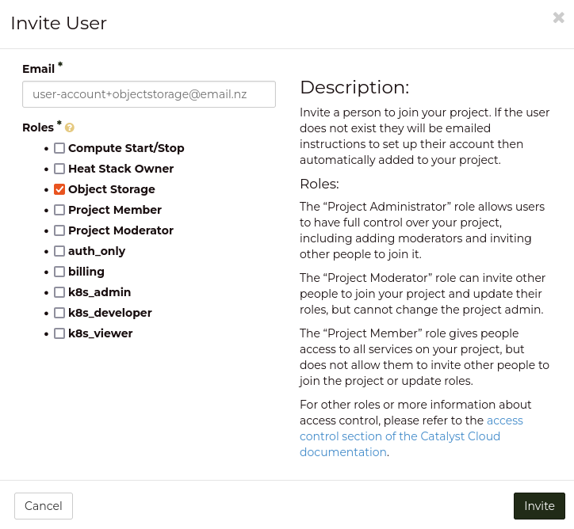

###############################
Log creation and access
###############################

.. warning::

    The following service is still in a technical preview and as such, will have
    limitations on features and scope. Any feedback is appreciated and can be
    provided through a support ticket. Thank you.

***************************************
Activating logs for your projects
***************************************

To get started using Audit logs, you will first need to activate the
logging functionality for your projects.

Prerequisites
===============

Before going further, you will need to ensure that you have :ref:`sourced an
openRC file<source-rc-file>` for your command line so that you are able to
perform the commands mentioned in the following example.

Creating a container to house your logs
=======================================

As the functionality of the audit log service allows you to aggregate logging
from multiple projects into one place, you will need to choose a location that
can store the logs from all of your projects. If you only have one project,
this step is still relevant as you will need a place for your logs to be
directed to regardless.

This means our first step is to create an object storage container that will
hold all of our logs. The reason that we choose an object storage container
over something like traditional block storage is that the object storage
service is easier to communicate with via API and will scale in size to
accommodate our logs over time.

For this example, we will create a container named *logs-repo*

.. code-block:: bash

    $ openstack container create logs-repo

.. note::

    The actions on your project will be recorded instantly, however there is a
    delay between the action being recorded and the log updating inside your
    object storage container. This delay should not be significant, but it is
    worth mentioning for any potential automation considerations.

Gather credentials for log access
=================================

Now that we have our container, we move on to the next step which is gather
credentials for your account in order to access the necessary log data.

For this step, you will need to create a new user account for your project
that only has the `Object Storage` role assigned. This is to restrict the
permissions of said user to only the object storage service as the EC2
credentials which are required for this step otherwise have a much larger reach
into the project than is required to capture the logs; and would therefore be
a security hazard.

The simplest way to create this account is to send an invitation to an existing
user account on your project with `+object-storage` appended to their email.

For example:

This will send an email to your existing account, but logically, on the cloud,
it is counted as a separate account with its own access and permissions.
Once you have this new account created, you will need to confirm that is has a
set of ec2 credentials. You can do so by sourcing the RC file associated with
this account and using the following command:

.. code-block:: bash

    # View EC2 credentials
    $ openstack ec2 credentials list -c Access -c Secret
    +----------------------------------+----------------------------------+
    | Access                           | Secret                           |
    +----------------------------------+----------------------------------+
    | 7d84281f4bc542b987ddbxxxxxxxxxxx | 100e767eeb7b48dcaf25xxxxxxxxxxxx |
    +----------------------------------+----------------------------------+

    # Optional: Create a new EC2 credential. You should have one created already, but if not then you can create them like so:
    $ openstack ec2 credentials create --user <object-storage-user>
    +------------+---------------------------------------------------------------------------------------------------------------------------------------------------------+
    | Field      | Value                                                                                                                                                   |
    +------------+---------------------------------------------------------------------------------------------------------------------------------------------------------+
    | access     | 7d84281f4bc542b987ddbxxxxxxxxxxx                                                                                                                        |
    | links      | {u'self': u'https://api.osppd.por.catalystcloud.nz:5000/v3/users/bf32a9a2c69e4d718022101e867cccec/credentials/OS-EC2/7d84281f4bc542b987ddbxxxxxxxxxxx'} |
    | project_id | 033556c5979b4c1281xxxxxxxxxxxxxx                                                                                                                        |
    | secret     | 100e767eeb7b48dcaf25xxxxxxxxxxxx                                                                                                                        |
    | trust_id   | None                                                                                                                                                    |
    | user_id    | bf32a9a2c69e4d71xxxxxxxxxxxxxxxx                                                                                                                        |
    +------------+---------------------------------------------------------------------------------------------------------------------------------------------------------+

Prepare a list of projects receive audit logs
=============================================

For this step, you will need to run the following command and save the UUID
and name of the projects which you would like audit logs applied to. If you
have multiple projects, you can still aggregate their logs into the single
container you created a the start of this tutorial.

.. code-block:: bash

    $ openstack project list

Send this information through to the Catalyst Cloud Team
==========================================================

At this stage since this service is still in a technical preview, the final
step needs to be preformed from the operations team. This means that you will
need to provide the following information in a support ticket in order for
your projects to start receiving audit logs:

#. The UUID of your object storage container
#. The user name and UUID of the object storage user who's credentials are
   needed.
#. The list of projects that you want to start receiving log data for.

.. warning::

    Do not include any information that would be sensitive or compromising,
    such as the ``secret`` in the output of the ec2 credentials command.

Once you have sent off your information to the Catalyst Cloud team and received
confirmation, you should start to see .json log files appear in your
specified container.
