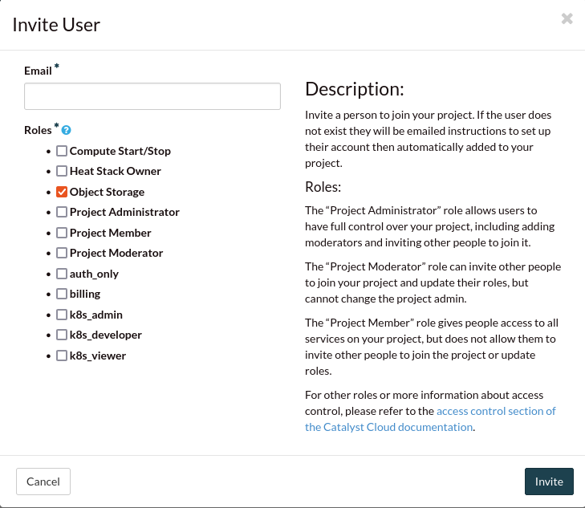
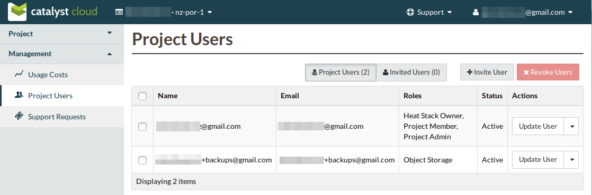

#################################
Automating backup tasks with cron
#################################

In order to make this process more useful, we could automate our backup tasks
by creating a cronjob to run backups on a regular basis, by means
of a shell script.

It is also best practice to create a separate backup user account in your cloud
project that is only given rights to access object storage. The main
justification for this is that in order to have scripts run commands unattended
it is necessary to embed plaintext password information in the scripts.

************************
Creating the backup user
************************

To create a new user account, go to ``Management -> Project Users`` in the left
hand menu of the dashboard, then click on the ``+Invite User`` button.

Fill in the Invite User form as shown, making sure the only Role selected is
Object Storage.

|

Once you receive the invite, complete the sign-in process as
the new user. There should now be a new user with Object Storage as their only
available role.

|

You can then download a copy of the backup user's OpenStack RC file: see
:ref:`source-rc-file`, which will provide the credential information for the
following section.

***************************
Creating the backup scripts
***************************

Now we can create our backup process. This will consist of:

- the backup script itself
- the variables file to control the backup script and provide authentication
  information
- the cron job to run the backup task

Here is the basic script to manage the running of a **Duplicity** backup.
Typically, this would be placed somewhere like ``/usr/local/bin``.

.. literalinclude:: _scripts/duplicity-backup.sh
  :language: bash

This script defines the control parameters such as retention and frequency for
the backup tasks as well as providing authentication information for object
storage. The previous script is expecting to find this in
``/etc/duplicity/duplicity-vars.sh``.

.. literalinclude:: _scripts/duplicity-vars.sh
  :language: bash

Then we need to define the backup definitions. Create a file with a name
relevant to the backup task in ``/etc/duplicity/backup_sources.d`` and add at
least the following two entries

.. code-block:: bash

  SRC="/path/to/files/"
  DEST="swift://<container-name>"

Depending on the nature of the thing you wish to back up, you may also need to
include pre-backup commands such as the one shown below. This is to ensure that
the data you wish to capture, in this case the contents of a gitlab repository,
have been written to disk prior to the backup task running.

.. code-block:: bash

  PRE_BACKUP_CMD="CRON=1 /opt/gitlab/bin/gitlab-rake gitlab:backup:create"

Finally you'll create a new file called ``duplicity-backup-cron``
in /etc/cron.d/. This is the cron job that will be responsible for running the
backups. See (`cron`_) for more information on this.

.. _cron: https://man7.org/linux/man-pages/man8/cron.8.html

.. code-block:: bash

  #
  35 2 * * * root /usr/local/bin/duplicity-backup.sh >> /var/log/backup/duplicity.log 2>&1
