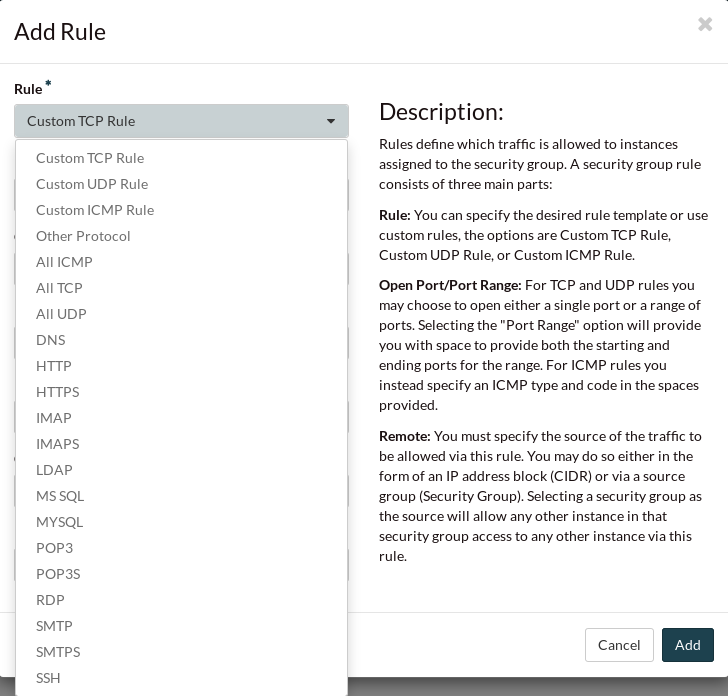

###############
Best practices
###############

***********************
Everyday considerations
***********************

Getting the correct ID
======================

For user created objects within the cloud it is always advisable to lookup ID
values before using them in any type of command to ensure that the correct
element has been identified. While it is very rare, it should be noted that it
is possible for underlying system generated cloud objects, such as flavor and
image IDs to also change.

With this in mind, if you are running commands from the CLI tools or one of the
support SDKs, it is recommended to lookup the ID before using it to ensure that
the correct object is referenced.

The following example shows how this could be done using the OpenStack CLI
tool. It queries can query both images and flavors by name to retrieve their ID
and then it also stores the resulting ID into an environment variable so that
it can be reused in subsequent commands.

.. code-block:: bash

    export CC_IMAGE_ID=$( openstack image show ubuntu-18.04-x86_64 -f value -c id )
    export CC_FLAVOR_ID=$( openstack flavor show c1.c1r2 -f value -c id )

Similar mechanisms exist for doing this with other tool sets such as Ansible,
Terraform and the various supported development SDKs.

Create an incident response playbook
====================================

An incident response playbook is a tool that companies use to deal with
issues in a routine and standardised way. There are a variety of different
playbooks you can create; Typical examples would be a guide or process of what
to do if you are using root access to avoid an causing damage to your system.
The objective of having these playbooks is to provide your staff with a routine
way of dealing with tasks and a clear path on what to do in the event of
something going wrong.

For incidents that occur with the catalyst cloud and your projects on it. We
recommended checking this documentation be one of the first steps to solving
issues. The documentation is comprehensive and deals with most of the
frequently encountered problems. Should you be unable to find your solution
here, the next step involving catalyst would be to raise a ticket via our
`support service`_

.. _`support service`: https://catalystcloud.nz/support/support-centre/

Back up data
============

This is a standard practice for any business. Making sure that if some form
of catastrophe were to befall you system, that you have backups to recover
to a working state. When it comes to the Catalyst Cloud, there are several
unique things that ensure data backup.

Our Object and Block storage services create copies of the data stored on them
and distribute these copies to the different regions available.
If any physical damage or soft corruption (bit rot) were to occur, the data
would be restored through the self-healing and self-managing storage
systems that we have.

However, you may still want to create explicit backups for your data. More
information on backups can be found under the :ref:`backups section <backups>`
of the documentation or under the section on the specific service you seek to
backup.

*****************
High availability
*****************

This document outlines the physical infrastructure and software features that
make the Catalyst Cloud highly available and resilient. It covers built-in
features that are inherited by every project and services that can be used to
enhance the availability of web applications and websites hosted on the
Catalyst Cloud.

24x7 monitoring
===============

The catalyst cloud has robust fine-grained monitoring systems in place. These
systems are monitored 24x7.

Geographic diversity
====================

The Catalyst Cloud provides multiple regions or geographical locations that you
can use to host your applications. Regions are completely independent and
isolated from each other, providing fault tolerance and geographic diversity.

From a network point of view, each region has diverse fibre paths from diverse
providers and ISPs for high availability. Power and cooling systems are also
designed for high availability and allow for maintenance to be performed
without service disruptions to customers.

For more information about our regions, please consult the
:ref:`regions <admin-region>` section of the documentation.

Compute
=======

If a physical compute node fails, our monitoring systems will detect the
failure and trigger an “evacuate” process that will restart all affected
virtual compute instances on a healthy physical server. This process usually
takes between 5 to 20 minutes which allows us to meet our 99.95% availability
SLA for individual compute instances.

Customers that require more than 99.95% availability can combine multiple
compute instances within the same region using anti-affinity groups.
Anti-affinity groups ensure that compute instances that are members of the same
group are hosted on different physical servers. This reduces the risk and
probability of multiple compute instances failing at the same time. For more
information on how to use anti-affinity, please consult :ref:`anti-affinity`.

Customers that require their applications to survive the loss of an entire
region can launch compute instances in different regions. This requires their
applications, or middleware used by their applications (such as databases), to
support this architecture.

Block storage
=============

We run a distributed storage system that by default retains three copies of
your data on different servers spread across a region (a datacenter).
We can afford to lose many disks and multiple storage nodes without losing any
data. As soon as a disk or storage node fails, our storage solution begins
recovering the data from an existing copy, always ensuring that three replicas
are present.

The storage solution is self managing and self healing, constantly placing
your data in optimal locations for data survival and resiliency. It runs
automated error checks in the background that can detect and recover a single
bit of incorrect data (bit rot), by comparing the three copies of the data and
ensuring they are identical.

The solution is designed and implemented with very high availability and data
resiliency in mind. It has no single points of failure.

Object storage
==============

Our object storage service is a fully distributed storage system, with no
single points of failure and scalable to the exabyte level. The system is
self-healing and self-managing. Data stored in object storage is asynchronously
replicated to preserve three replicas of the data in different cloud regions.
The system runs frequent CRC checks to protect data from soft corruption (bit
rot). The corruption of a single bit can be detected and automatically restored
to a healthy state. The loss of a region, server or a disk leads to the data
being quickly recovered from another disk, server or region.

Virtual routers
===============

In the same way that if a compute instance fails, if a physical network node
fails our monitoring systems will detect the failure and trigger the evacuate
process that will ensure all affected virtual router instances are restarted on
a healthy server. This process usually takes between 5 to 20 minutes.

We are working on a new feature that launches two virtual routers on separate
network nodes responding on the same IP address. Once this is complete the
failover between routers will take milliseconds which will most likely not be
noticed. Meanwhile customers requiring Higher availability are advised to
combine compute instances from multiple regions where possible.

HA Tutorials
============

There are a number of options available to Catalyst Cloud customers to enhance
application availability. Catalyst has documented these in detail:

Providing highly available instances within a region:
http://docs.catalystcloud.io/tutorials/deploying-highly-available-instances-with-keepalived.html

Techniques for region failover:
http://docs.catalystcloud.io/tutorials/region-failover-using-the-fastly-cdn.html

***********************
Security best practices
***********************

This section covers some best practices for security on the Catalyst Cloud, and
for general security business standards in the tech sector today.

Password protocols
==================

Password strength is defined by the entropy it has.
This is to say how long it takes to brute force your password. If you have a
relatively long password you would be fine. However, your passwords entropy,
goes down significantly if you use common keywords such as 'password' or
a birthday date. To ensure that your password entropy is high, a standard has
formed around passwords so that they comply with these rules:

- It is at least 18 characters in length where possible, or if a service
  only allows shorter, you should use the maximum amount of characters.
- It should contain at least one capital letter, one number and one special
  character (e.g. @,&,-,~,!)
- Do not use certain words in a password such as: Password, Secret, '123456',
  p@ssw0rd etc.

OR if you are using a passphrase instead:

- It should contain at least 4 words and be over 18 characters long.

Using a passphrase (a collection of words), rather than a password with
different symbols and numbers is also possible. The length of a
passphrase gives it the necessary entropy to be a viable alternative with the
added benefit  that you will be able to remember 4-6 words easier
than you would 18 randomly generated characters.

.. code-block:: bash

   # an example of a complex password would be
   deyp78&*fasbk!~)&(*

   # an example of a strong passphrase would be
   boatdrillchargerkeysstop
   # this could be more specific and meaningful to you, or random like the one above

The last thing about passwords that you need to be considerate of, is password
protection. Follow these rules about access to or sharing information
about passwords:

- Don't send your password over the internet to anyone.
- Don't write passwords down and store them on a physical location.
- Store any user ID's or passwords in an encrypted format.
- Do not script any passwords for automatic log in.
- Never use a previously used password.
- Change your password once every year.

Update systems often
====================

Keeping your software up to date with the most current version of
your applications and operating systems helps to keep you secure. Malicious
software that attacks files and core operating infrastructure on your
computer is consistently created; therefore your operating system and other
applications need to be constantly updated to protect yourself. It is
understandable that if you are using a legacy program or software that you may
not be able to update it but for those that you can, it is recommended you
keep them updated as regularly as possible. These updates usually include
upgrades dealing with security a large portion of the time.

Encrypting emails
=================

When sending emails that pertain to sensitive information,
they should be encrypt using a PGP key or some other form of encryption. This
not only means that it's harder for your emails to be broken into, it also
mitigates phishing attacks because your emails can be authenticated.

You should *never* send any form of private key or identification information
over emails that are not encrypted. In some cases you may need to use a
physical memory device (flash drive) to transport highly sensitive files.

Access management
=================

Access management, is a set of practices and rules that make
sure that your organisation knows exactly who has access to the resources that
you have previsioned in the cloud and what exactly these users can do with
said resources.
The Catalyst Cloud achieves a strong level of security in this regard by
the use of **Roles**. These are given to users by the project administrator and
they impose restrictions or provide privileges to users. For more information
on roles and their uses, please see the
:ref:`identity access management <identity-access-management>` section of the
documentation.

Security groups
===============

Security groups are what allow you to safely and securely access the instances
that you create on the Catalyst Cloud. When creating a security group, it
automatically has the following rules:

.. image:: assets/security-group-screenshot.png

These mean that the security group can access the internet from IPv4 and v6
with outward bound traffic. But at this stage there is no ingress traffic, you
must define that yourself. When doing so you need to be careful and understand
the type of access you wish to permit. Below is pictured the different rules
you can create to meet your needs.

The standard that we use at Catalyst is an SSH key pair which you can upload or
create via the dashboard. We use SSH keys because they provide an increased
level of security beyond restricting ports. The full process of how to create
or upload your SSH keys is documented
:ref:`here <first-instance-with-dashboard>`.

.. Warning::
   When creating an ingress rule for the security group you need to be careful
   about which ports you allow access to your instance on. Setting your port range
   to 0.0.0.0./0 will open it to the entire internet meaning that
   anyone should they find it can access your instance. The best practice for a
   secure instance is to use an SSH rule. This is because even should you expose
   it to the entire internet, without the proper SSH key pair, they would not be
   able to access the instance.

