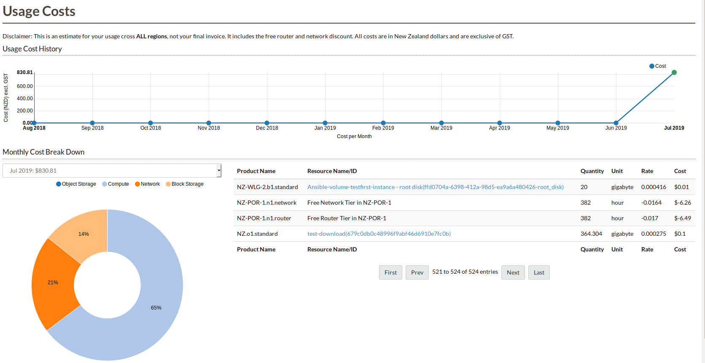

###############
Billing service
###############

There are many different ways to get your billing details using our system. The usage
costs report shows you an estimate for your usage within the current region.

It provides a breakdown per service, so you can quickly spot which services you are using
the most and where your savings opportunities are. It also shows you the aggregate cost
per month over the last twelve months, so you can identify usage patterns and project the
expected usage for the current month.

Our billing API provides an easy way to visualize your current
usage by using a python script we provide in the section below.

.. toctree::
   :maxdepth: 1

   billing/api
   billing/credit-card
   billing/separate-billing
   billing/faq

There is also a tool_ on our dashboard that you can view
your costs over time:

.. _tool: https://dashboard.cloud.catalyst.net.nz/management/billing/

