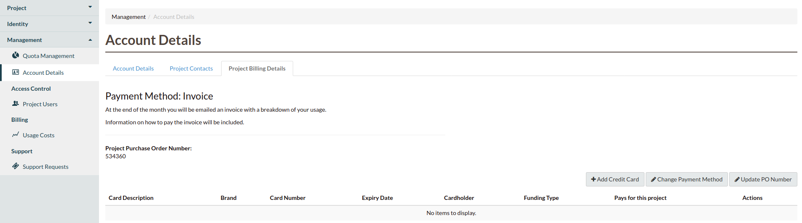
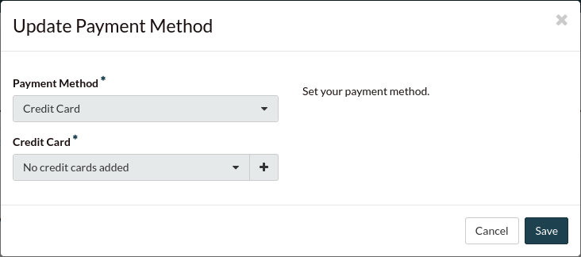
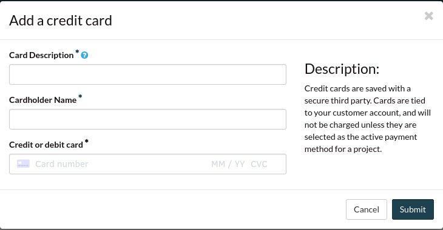
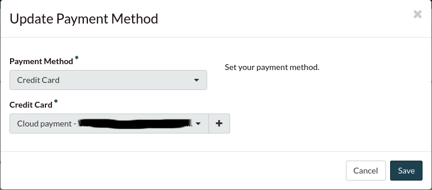
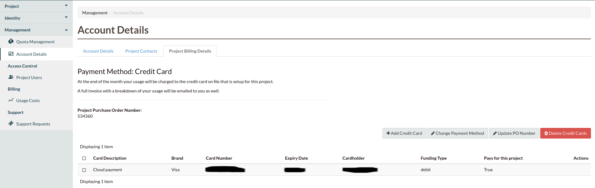
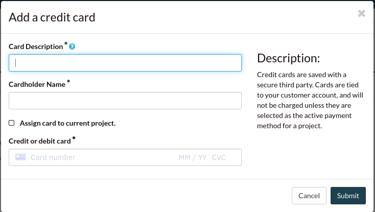
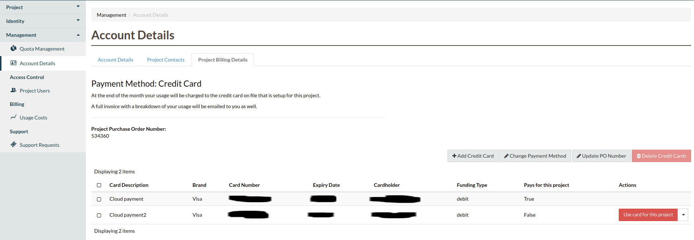
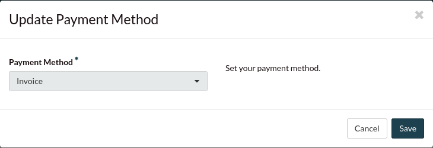
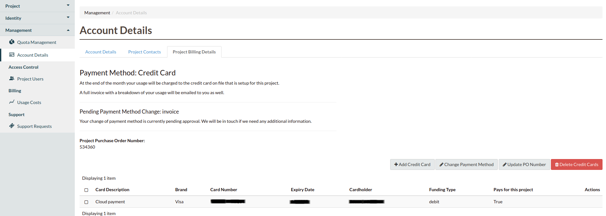

###################
Credit Card payment
###################

.. note::
   Only users with the Project Admin role will be able to view and modify the
   billing details

The Catalyst Cloud now accept payments via credit card. This section will explain how you
can setup a credit card to pay your invoices.

You and/or your billing contact will still receive a usage summary from us
each month with your usage details and a confirmation that your invoice has been paid.

Adding and switching to credit card payment
===========================================

To setup a credit card, please login_ to the dashboard and follow these steps:

1) Go to Account Details, under Management
2) Select the Project Billing Details tab

As you can see from the screenshot, your payment method should be as "Invoice".
There are a few different ways to setup your credit card payment. You can also
add a credit card without changing the payment method.

To change your active payment method to a credit card, you will need to click on
"Change payment method":

1) Under Payment Method, select Credit Card
2) As you can see you should have the message: "No credit cards added"
3) Click on "+", this will allow you to add a new credit card

1) Add the necessary information
2) Click on Submit
3) After it loads, click on Save
4) After clicking Save, the process may take 2-3 minutes to be completed.

After adding the credit card, your Project Billing Details should have been updated:

Adding a credit card
====================

.. note::
   If you have credit card payment as your selected method. You cannot delete a credit
   card that is being used by one of your projects.

You can add multiple credit cards to your account. Only the credit card you have selected
for the project will be charged, and different projects can be charged to different
credit cards.

If you already have an existing credit card, you can follow our steps to add a new credit
card:

1) On the Project Billing Details tab, under Account Details

2) Select Add Credit Card
3) It will prompt you do add a new credit card details
4) You should also have a tick box allowing to assign this credit card to the project

While you were adding a new credit card and you have not selected it as the primary
option, you can still select it in the Project Billing Details tab:

Switching to invoice payment
============================

.. note::
   Once the payment method has been approved, you will be able to delete the selected
   credit card.

You can also change back to Invoice as your payment method. The Catalyst Cloud will
receive a notification request from your project.

Before changing back to invoice method, we may reach out to you for a bit more of
information on why you have decided to make that change.

1) Login to the dashboard
2) Go to Account Details, under Management
3) Select the Project Billing Details tab

4) Click on Change Payment Method
5) Under Payment Method, select Invoice
6) Click on Save

Your Project Billing Details tab should have a pending message:

.. _login: https://dashboard.cloud.catalyst.net.nz/management/account/

