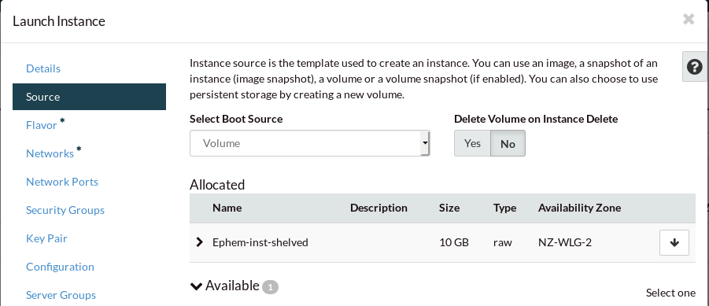

####################################################
Replacing Ephemeral storage with a Persistent Volume
####################################################

When creating an instance, you have the option to attach a persistent volume
to it, or use an ephemeral volume. If you chose an ephemeral volume this means
that when you shelve your instance, to keep your data from being flushed and
deleted, the system creates a snapshot. But each time you shelve an instance,
it creates a new snapshot that only contains a list of changes from the last.

These start to stack up if you consistently shelve your instance, which in turn
slows the process of booting up from its shelved state.
You could add a persistent volume to the instance, but this
means you now have both ephemeral and persistent storage. So even if you start
saving things to your volume, the instance will still make snapshots of the
ephemeral side.

The easiest solution to this is creating a new instance that does not contain
an ephemeral volume using a snapshot from the old instance. We detail how to
complete this action below:

Via the Dashboard
=================

Create snapshot
---------------

The first step is creating the snapshot of your instance, which is
automatically done when you shelve an instance:

.. image:: block-storage-assets/Snapshot-ephemeral.png

After this, navigate to the **Images** section of the dashboard and locate your
snapshot, for this example ours is named 'Ephemeral-instance-shelved'.
Click create volume and follow the steps to creating a volume from this
snapshot.

After this, navigate to the volume section of the dashboard and click on
launch as instance on your selected volume. In this case "Ephemeral-Snapshot"

Then go through the steps to create a new instance, making sure that when you
arrive at picking a Source, you make sure to use the volume as a source not
an image. This should be the default when making an instance from a volume.

That should be it, once your new instance is up and running you should be able
to see all of your files on the new instance, and it will have the new volume
as it's boot source.

Via the CLI
===========

The following is assumed:

* You have installed the openstack command line tools
* You have sourced an OpenRC file

Shelving instance
-----------------

The first thing you need to do is shelve your instance which will create a
current snapshot of your instance.

.. code-block:: bash

   #find the ID of the instance you want to create a snapshot of
   $ openstack server list
   +--------------------------------------+--------------------+-------------------+------------------------------------------+------------------------------+---------+
   | ID                                   | Name               | Status            | Networks                                 | Image                        | Flavor  |
   +--------------------------------------+--------------------+-------------------+------------------------------------------+------------------------------+---------+
   | 9896d5e5-116f-4aa2-b962-f7b473b080d8 | ephemeral-instance | ACTIVE            | private-net-1=10.0.0.17, 103.254.156.188 | ubuntu-18.04-x86_64          | c1.c1r1 |
   +--------------------------------------+--------------------+-------------------+------------------------------------------+------------------------------+---------+

   #then you shelve this instance
   $ openstack server shelve 9896d5e5-116f-4aa2-b962-f7b473b080d8

After this you create a volume from your snapshot.

.. code-block:: bash

   #find the correct snapshot, (the list has been truncated for readability)
   $ openstack image list | grep ephemeral
   +--------------------------------------+--------------------------------------+--------+
   | ID                                   | Name                                 | Status |
   +--------------------------------------+--------------------------------------+--------+
   | aa1e6f8d-0689-4eaf-9a13-c2c16391a82c | ephemeral-instance-shelved           | active |
   +--------------------------------------+--------------------------------------+--------+

   # then we execute the following command, changing the --image to be your snapshot.
   $ openstack volume create persistent-volume-bootable --size 20 --image aa1e6f8d-0689-4eaf-9a13-c2c16391a82c \
   --description volume-from-ephemeral-shelved --bootable --os-project-id eac679e4896146e6827ce29d755fe289 \
   --availability-zone NZ-WLG-2 --type b1.standard

At this point we now have a volume that contains all of the information from
your instance instance stored on it. From here we need to create the new
instance, using the --volume flag:

.. code-block:: bash

   # get the ID of your old instance
   $ openstack server list
   +--------------------------------------+--------------------+-------------------+------------------------------------------+------------------------------+---------+
   | ID                                   | Name               | Status            | Networks                                 | Image                        | Flavor  |
   +--------------------------------------+--------------------+-------------------+------------------------------------------+------------------------------+---------+
   | 9896d5e5-116f-4aa2-b962-f7b473b080d8 | ephemeral-instance | SHELVED_OFFLOADED | private-net-1=10.0.0.17, 103.254.156.188 | ubuntu-18.04-x86_64          | c1.c1r1 |
   +--------------------------------------+--------------------+-------------------+------------------------------------------+------------------------------+---------+

   # then we get the flavor and image ID's along with the security and network information from the previous instance
   $ openstack server show 9896d5e5-116f-4aa2-b962-f7b473b080d8
   +-----------------------------+------------------------------------------------------------+
   | Field                       | Value                                                      |
   +-----------------------------+------------------------------------------------------------+
   | OS-DCF:diskConfig           | AUTO                                                       |
   | OS-EXT-AZ:availability_zone | NZ-WLG-2                                                   |
   | OS-EXT-STS:power_state      | Shutdown                                                   |
   | OS-EXT-STS:task_state       | None                                                       |
   | OS-EXT-STS:vm_state         | shelved_offloaded                                          |
   | OS-SRV-USG:launched_at      | 2019-09-18T22:58:52.000000                                 |
   | OS-SRV-USG:terminated_at    | None                                                       |
   | accessIPv4                  |                                                            |
   | accessIPv6                  |                                                            |
   | addresses                   | private-net-1=10.0.0.17, 103.254.156.188                   |
   | config_drive                |                                                            |
   | created                     | 2019-09-16T00:21:39Z                                       |
   | flavor                      | c1.c1r1 (6371ec4a-47d1-4159-a42f-83b84b80eea7)             |
   | hostId                      |                                                            |
   | id                          | 9896d5e5-116f-4aa2-b962-f7b473b080d8                       |
   | image                       | ubuntu-18.04-x86_64 (102172df-9872-47df-b66b-2bcecb3a74b7) |
   | key_name                    | security-key                                               |
   | name                        | ephemeral-instance                                         |
   | project_id                  | eac679e4896146e6827ce29d755fe289                           |
   | properties                  |                                                            |
   | security_groups             | name='default'                                             |
   |                             | name='security-group'                                      |
   | status                      | SHELVED_OFFLOADED                                          |
   | updated                     | 2019-09-18T23:11:59Z                                       |
   | user_id                     | 8ca098df982a433ba746bc8c2d0683f5                           |
   | volumes_attached            | id='09975851-7bb4-4935-814b-2e65d19fd433'                  |
   +-----------------------------+------------------------------------------------------------+

   #You also need to get your private-net id using the following command:
   $ openstack network show private-net -f value -c id

   #We then create our new instance with these parameters.
   $ openstack server create --flavor 6371ec4a-47d1-4159-a42f-83b84b80eea7 \
   --volume 666707a2-0835-449a-a093-b14015773cd3 --nic net-id=550677db-0232-418b-aeb5-f461cf907967 \
   --security-group default --security-group security-group persistent-volume-instance

After this is completed, you should be able to assign a floating IP to your
instance and SSH to it and you'll find all of your data in tact. The only
difference now being that your instance now has a persistent volume for
storage.

.. code-block:: bash

   $ openstack floating ip list
   +--------------------------------------+---------------------+------------------+------+--------------------------------------+----------------------------------+
   | ID                                   | Floating IP Address | Fixed IP Address | Port | Floating Network                     | Project                          |
   +--------------------------------------+---------------------+------------------+------+--------------------------------------+----------------------------------+
   | 50e0c050-db2a-47bf-a478-871a84d1faa9 | 103.254.156.188     | None             | None | e0ba6b88-5360-492c-9c3d-119948356fd3 | eac679e4896146e6827ce29d755fe289 |
   +--------------------------------------+---------------------+------------------+------+--------------------------------------+----------------------------------+

   $ openstack server add floating ip persistent-volume-instance 103.254.156.188

   #Then you can SSH to your instance
   $ ssh ubuntu@103.254.156.188
