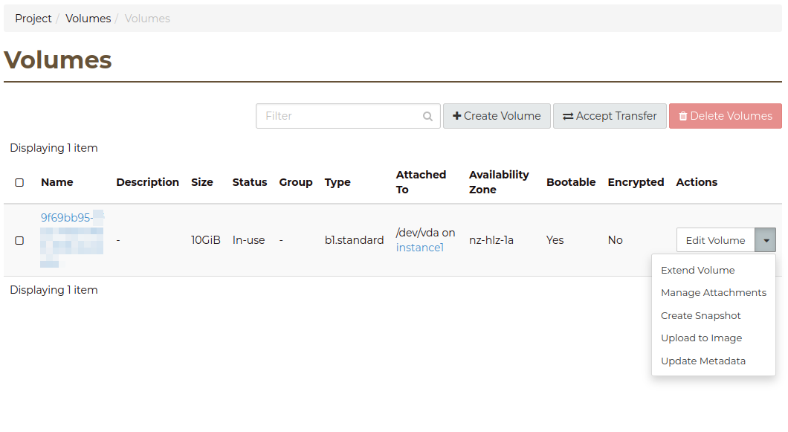
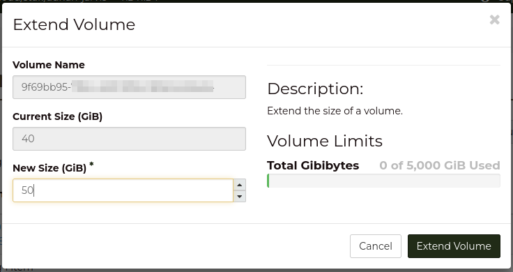

###
FAQ
###

.. _migrating-volumes:

*********************************************
How to migrate between different volume types
*********************************************

At the current time, support for changing volume type on an existing
volume is not supported. However, by creating a new volume with
the desired type, and copying data, we can switch between them.

For the purpose of this example we will assume:

* The operating system involved in Linux, and we recommend doing this
  on a system which is not booted from the original volume
* there is an existing volume attached to the instance and mounted on
  ``/data``
* a new volume of the desired new type has been attached to the instance
  and

  - has been partitioned
  - has a file system created
  - is mounted on ``/mnt/data_new``

We will be using `rsync`_ to perform the transfer as it allows us to maintain
the volumes thin provisioned nature, and preserve the nature of any sparse
files that may exist on the original disk.

The following code block is a template for you to fill in with your
requirements:

.. code-block:: bash

  rsync -avxHAXSW --numeric-ids --info=progress2 /data/ /mnt/data_new/

Where the options are:

.. code-block:: text

  -a  : all files, with permissions, etc..
  -v  : verbose, mention files
  -x  : stay on one file system
  -H  : preserve hard links (not included with -a)
  -A  : preserve ACLs/permissions (not included with -a)
  -X  : preserve extended attributes (not included with -a)
  -S  : handle sparse files, such as virtual disks, efficiently
  -W  : copy files whole (w/o delta-xfer algorithm)
  --info=progress2 : will show the overall progress info and transfer speed
  --numeric-ids : don't map uid/gid values by user/group name

.. _`rsync`: https://rsync.samba.org

*********************
How to grow a volume?
*********************

So you have been successfully using OpenStack, and now one of your volumes has
started filling up. What is the best, quickest and safest way to grow the
size of your volume?

The block storage service supports the live extension of volumes regardless of
whether that are boot volumes or additional volumes attached to your instance.

+++++++++++
Via the CLI
+++++++++++

Using the openstack command you can extend a volume by increasing the size
(in GB) using the set command.  In order for the command to support the live
volume extension the minimum version of 3.42 for the Block Storage API needs to be given:

.. code-block:: bash

  openstack --os-volume-api-version 3.42  volume set --size 40 9f69bb95-xxxx-xxxx-xxxx-xxxxxxxxxxxx

+++++++++++++++++
Via the Dashboard
+++++++++++++++++

Locate the volume in the Dashboard under the *Volumes* menu and then select the
*Extend Volume* action:

In the dialog enter the new size of the volume and click on *Extend Volume*

