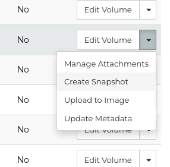
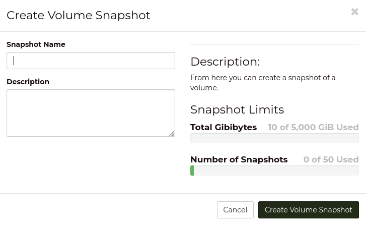
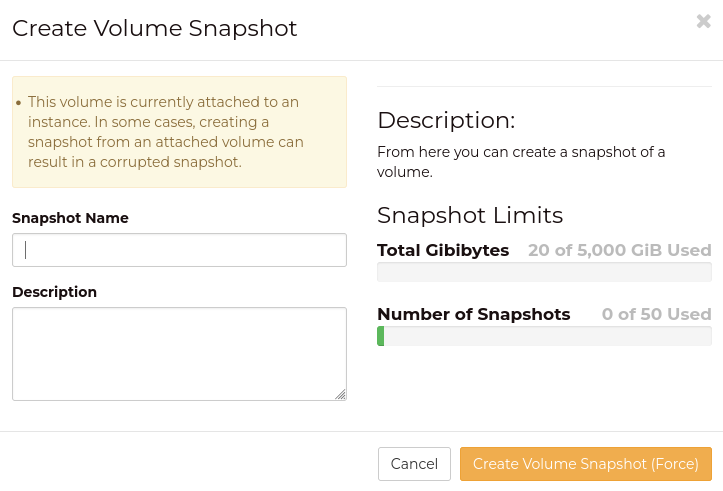
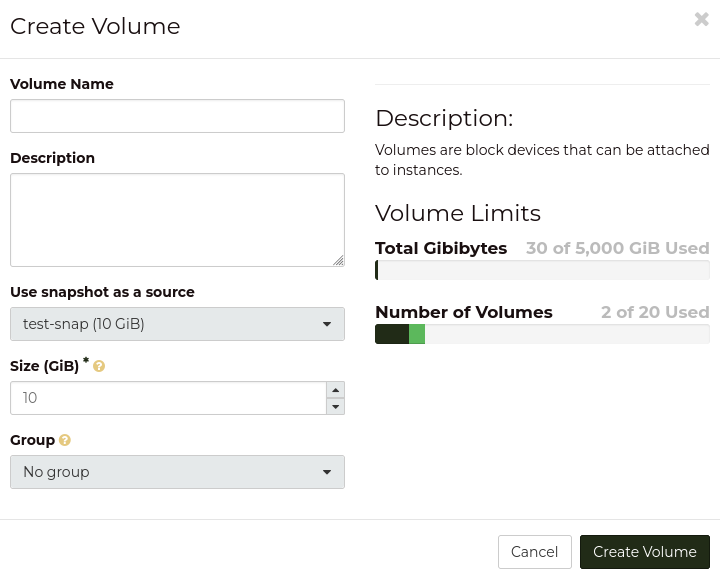

.. _using_snapshots:

###############
Using Snapshots
###############

Snapshots provide a method for you to create a point in time copy of an
instance or volume, in order for you to rapidly revert the state of your
resource to that point in time. In some cases you may be applying
changes to an instance that may not be successful, and creating a snapshot
before allows you to revert any changes you made to the OS or
software installed in the instance.

They can also be used to investigate the state of a powered-off
instance or any other storage attached to that instance in a safe
manner; by making a copy that you can attach to another machine
for analysis or investigation.

.. Note::

    Snapshots are not backups. They are stored on the same storage
    platform as your original volumes, making them unsuitable for
    disaster recovery needs. They are not the same as snapshots as
    may be named in other cloud platforms. They should not be used
    to create volumes for new machines.

Snapshots can be created from any block storage volume, however if
a volume is currently attached to an instance when a snapshot is created,
the snapshot does not interact with the operating system or software installed
in the instance in order to ensure the volume is not being written to at the
time the snapshot is taken.

Therefore, while you can create a snapshot from a running instance,
the snapshot is at best "crash consistent". That is, your snapshot will restore
an instance to roughly the same state as if the instance was turned off
uncleanly. This may complicate reverting a snapshot depending on the activity
in the instance at the time the snapshot was taken. You also have to consider
the operating system or software installed and how these will react with your
snapshot being taken while the instance is running.

To avoid inconsistencies between a snapshot and a running instance, it is a
common approach to stop applications from running, or to run commands that will
quieten the activity in the instance, before taking your snapshot .

*******************
Creating a snapshot
*******************

Creating a snapshot is easy from either the dashboard, command-line
client, or using API calls.

.. Warning::

    Creating a snapshot of a volume creates a hard dependency on the
    volume it was created from. This means, you cannot delete the volume
    the snapshot was created from until you delete all snapshots taken of
    that volume.

=====================================
Creating snapshots from the dashboard
=====================================

From the volumes page on the dashboard, select "Create Snapshot" from
the drop-down menu on the volume you want a snapshot created for.

|

For volumes which are not currently attached to any instance, you
will be prompted for a name and description for the snapshot.

However, for volumes that are currently attached to an instance (even
if that instance is shutdown or shelved), you will be warned that
a snapshot created under these conditions may be corrupted.

As noted above, snapshots of attached volumes may not be reliable to
revert from. You may need to perform steps before taking a snapshot,
such as stopping applications running inside the instance.

========================================
Creating snapshots from the command-line
========================================

.. Note::

  You must have :ref:`sourced an OpenRC file<source-rc-file>` before you can
  use any of the following methods to create a snapshot.

The following command will create a snapshot of a volume that is not
current attached.

.. literalinclude:: _scripts/cli/create-snap.sh
    :language: shell

This may return an error saying that the volume is attached. For
attached volumes, the ``--force`` flag needs to be added:

.. literalinclude:: _scripts/cli/create-snap-force.sh
    :language: shell

*********************************
Creating a volume from a snapshot
*********************************

You can create a new volume from a snapshot using the dashboard,
command-line, or API calls. Once created, you can attach this to
an existing instance.

.. Warning::

    A volume created from a snapshot has a hard dependency on
    the snapshot. This means you cannot delete a snapshot until
    all volumes created from it have also been deleted.

    We advise against using the methods described below to
    create new instances, and advise against using the "Launch as
    Instance" action available on snapshots in the dashboard.

    Instead, you should create an image of the volume and use
    that image to create any new instances you require.

=============================================
Create volume using snapshot on the dashboard
=============================================

Once you navigate to the "Snapshot" page under the "Volumes" heading
on the side bar, you will be presented with a list of your current snapshots.
The drop-down menu on a snapshot has the "Create Volume" action, which
will prompt you to provide details of the new volume:

This will then create the new volume using the snapshot.

=============================================
Create volume using snapshot via command-line
=============================================

.. Note::

  You must have :ref:`sourced an OpenRC file<source-rc-file>` before you can
  use any of the following methods to create a volume from a snapshot.

The following command will create a volume using a snapshot with the
default volume type:

.. literalinclude:: _scripts/cli/create-vol-from-snap.sh
    :language: shell
