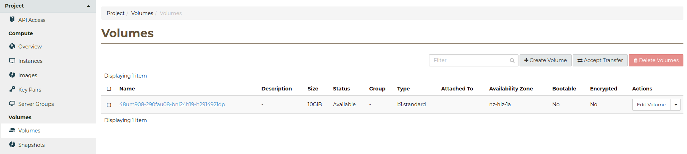

.. _using-volumes:

##########################
Creating and using volumes
##########################

***********************************
Creating a volume via the dashboard
***********************************

The easiest method to create and attach a volume to an instance would be to use
the Catalyst Cloud `web dashboard`_. From the volumes tab on the dashboard you
can create, delete, and manage your block storage volumes.

.. _web dashboard: https://../first-instance/dashboard.cloud.catalyst.net.nz

*******************************************
Creating a volume via from the command line
*******************************************

To create and attach a new volume, you can use one of the methods below:

.. Note::

  You must have :ref:`sourced an openrc file<source-rc-file>` before you can
  use any of the following methods to create or attach a volume.

.. tabs::

    .. tab:: Openstack CLI

        The following script will create a volume on your project:

        .. literalinclude:: _scripts/cli/create-volume.sh
            :language: shell
            :caption: create-volume.sh

        The next script will attach the previous volume to your instance. This
        command assumes that your volume name is unique; If you have volumes
        with duplicate names you will need to use the volume ID to attach the
        correct volume to your compute instance.

        .. literalinclude:: _scripts/cli/attach-volume.sh
            :language: shell
            :caption: attach-volume.sh

    .. tab:: Terraform

        The following assumes that you have already sourced an openRC file and
        that you have downloaded and installed terraform.

        The template file that you need to save is:

        .. literalinclude:: _scripts/terraform/terraform-block-storage.tf
            :language: shell
            :caption: terraform-block-storage.tf

        The commands you will need to use are:

        .. literalinclude:: _scripts/terraform/terraform-create.sh
            :language: shell
            :caption: terraform-create.sh

        To remove all resources associated with this terraform plan, you can use the
        following:

        .. literalinclude:: _scripts/terraform/terraform-destroy.sh
            :language: shell
            :caption: terraform-destroy.sh

**********************
Using volumes on Linux
**********************

The example below illustrates the use of a volume without LVM.

.. warning::

  Please note that this configuration is not suitable for production servers,
  but rather a demonstration that block volumes behave like regular disk drives
  attached to a server.

Once we have a command line that is connected via ssh to our instance, we check
that our disk is recognized by the OS using ``fdisk``:

.. code-block:: console

  $ sudo fdisk -l /dev/vdb
  Disk /dev/vdb: 50 GiB, 53687091200 bytes, 104857600 sectors
  Units: sectors of 1 * 512 = 512 bytes
  Sector size (logical/physical): 512 bytes / 512 bytes
  I/O size (minimum/optimal): 512 bytes / 512 bytes

Now use ``fdisk`` to create a partition on the disk:

.. code-block:: console

  $ sudo fdisk /dev/vdb

  Welcome to fdisk (util-linux 2.27.1).
  Changes will remain in memory only, until you decide to write them.
  Be careful before using the write command.

  Device does not contain a recognized partition table.
  Created a new DOS disklabel with disk identifier 0x1552cd32.

  Command (m for help): n
  Partition type
     p   primary (0 primary, 0 extended, 4 free)
     e   extended (container for logical partitions)
  Select (default p): p
  Partition number (1-4, default 1): 1
  First sector (2048-104857599, default 2048):
  Last sector, +sectors or +size{K,M,G,T,P} (2048-104857599, default 104857599):

  Created a new partition 1 of type 'Linux' and of size 50 GiB.

  Command (m for help): w
  The partition table has been altered.
  Calling ioctl() to re-read partition table.
  Syncing disks.

Check the partition using ``lsblk``:

.. code-block:: console

  $ lsblk
  NAME   MAJ:MIN RM SIZE RO TYPE MOUNTPOINT
  vda    253:0    0  10G  0 disk
  └─vda1 253:1    0  10G  0 part /
  vdb    253:16   0  50G  0 disk
  └─vdb1 253:17   0  50G  0 part

Make a new filesystem on the partition:

.. code-block:: console

  $ sudo mkfs.ext4 /dev/vdb1
  mke2fs 1.42.13 (17-May-2015)
  Creating filesystem with 5242624 4k blocks and 1310720 inodes
  Filesystem UUID: 7dec7fb6-ff38-453b-9335-0c240d179262
  Superblock backups stored on blocks:
      32768, 98304, 163840, 229376, 294912, 819200, 884736, 1605632, 2654208,
      4096000

  Allocating group tables: done
  Writing inode tables: done
  Creating journal (32768 blocks): done
  Writing superblocks and filesystem accounting information: done

Create a directory where you wish to mount this file system:

.. code-block:: console

  $ sudo mkdir /mnt/extra-disk

Mount the file system:

.. code-block:: console

  $ sudo mount /dev/vdb1 /mnt/extra-disk

Label the partition:

.. code-block:: console

  $ sudo tune2fs -L 'extra-disk' /dev/vdb1
  tune2fs 1.42.13 (17-May-2015)
  $ sudo blkid
  /dev/vda1: LABEL="cloudimg-rootfs" UUID="98c51306-83a2-49da-94a9-2a841c9f27b0" TYPE="ext4" PARTUUID="8cefe526-01"
  /dev/vdb1: LABEL="extra-disk" UUID="7dec7fb6-ff38-453b-9335-0c240d179262" TYPE="ext4" PARTUUID="235ac0e4-01"

If you want the new file system to be mounted when the system reboots then you
should add an entry to ``/etc/fstab``. For example, making sure you have sudo
privilege:

.. code-block:: console

  $ cat /etc/fstab
  LABEL=cloudimg-rootfs /               ext4    defaults    0 1
  LABEL=extra-disk      /mnt/extra-disk ext4    defaults    0 2

.. note::

  When referring to block devices in ``/etc/fstab`` it is recommended that UUID
  or volume label is used instead of using the device name explicitly. It is
  possible for device names to change after a reboot, particularly when there are
  multiple attached volumes.
