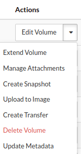
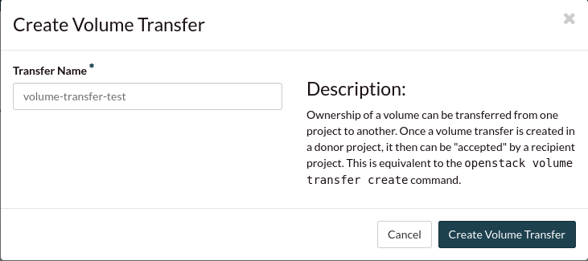
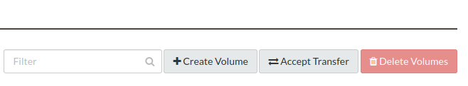
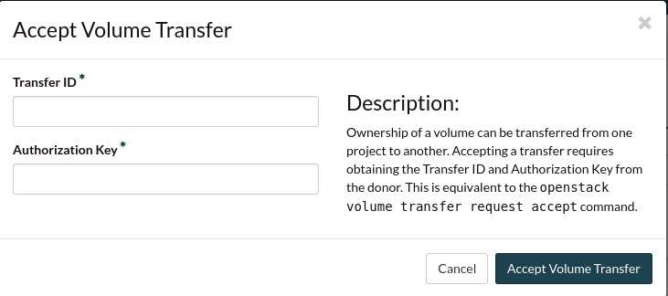

########################################
Transferring a volume to another project
########################################

In this example, we will cover how to transfer volumes between different
projects on the Catalyst Cloud.

Before we begin, there are some things that you have to check:

- Does the project your moving the volume to, have a large enough quota to
  support the new volume?
- Does the volume have any dependencies? (attachments, snapshots, images etc.)

***************************************
Transferring a volume via the dashboard
***************************************

First we have to select the volume we are wanting to transfer to our other
project:

.. image:: _assets/transfer-volume.png

Once we have our volume we click on the dropdown menu to the right and we
select the "create transfer" option from our list.

Our transfer needs a name and once this is done and you click
**Create volume transfer** a transfer ID and key will be issued to you. You
will need these to accept the transfer from your other project:

Once you have these details saved to accept the transfer, you can swap to your
other project and click on the *accept transfer* button:

Then we input our details from previously and our transfer will be complete.

***************************************
Transferring a volume via the CLI
***************************************
