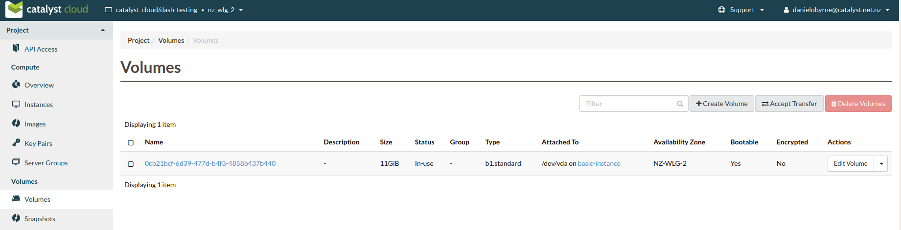

########################################
Transferring a volume to another project
########################################

In this example, we will cover how to transfer volumes between different
projects on the Catalyst Cloud. Before we begin, there are some requirements
that you have to check:

- Does your new project have a large enough quota to support the new volume?
- Does your volume have any dependencies? (attachments, snapshots, images etc.)

***************************************
Via the dashboard
***************************************

First we have to select the volume we are wanting to transfer:

Once we have our volume, we click on the dropdown menu to the right and we
select the **create transfer** option from our list.

.. image:: _assets/transfer-dropdown.png

The next step is to give our transfer a name and click
**Create volume transfer**

After this, you will see a popup appear that contains a transfer ID and key.
You will need these to accept the transfer from your other project.

Once you have these details saved, you can swap to your other project and click
on the **accept transfer** button:

.. image:: _assets/accept-transfer.png

Then we input our details that we saved and our transfer will be complete.

.. image:: _assets/input-id-and-key.png

***************************************
Via the CLI
***************************************

When using the CLI there a couple of things that you need to set up before you
can successfully transfer your volume.

#. You will need to download the openRC files from each of your instances.
#. You will need to open two different shell environments.
#. You will then need to source the two shell environments with the two different
   openRC files.

For the rest of this example we will refer to the shell that has sourced
the project which originally had our volume as ``console one``. And the shell
that has sourced the project that we are trying to move the volume too as
``console two``.

.. Note::

  You must have both of your projects sourced in the same region to be able to
  transfer a volume between them.

In console one, we use the following code to find the volume that we want to
transfer:

.. code-block:: bash

   $ openstack volume list
   +--------------------------------------+----------------------------+-----------+------+-------------------------------------------+
   | ID                                   | Name                       | Status    | Size | Attached to                               |
   +--------------------------------------+----------------------------+-----------+------+-------------------------------------------+
   | e58527cf-34d2-42bc-85fd-xxxxxxxxxxxx | transfer-example           | available |   10 |                                           |
   +--------------------------------------+----------------------------+-----------+------+-------------------------------------------+

Once we have the volume that we want to transfer, in console one, we create a
transfer request using the following:

.. code-block:: bash

   $ openstack volume transfer request create --name transfer_name <volume_ID>
   +------------+--------------------------------------+
   | Field      | Value                                |
   +------------+--------------------------------------+
   | auth_key   | XXXXXXXXXXXXXXXX                     |
   | created_at | 2020-08-10T01:28:29.581644           |
   | id         | 0ead79fc-62f2-482d-bb3e-xxxxxxxxxxxx |
   | name       | transfer_name                        |
   | volume_id  | e58527cf-34d2-42bc-85fd-xxxxxxxxxxxx |
   +------------+--------------------------------------+

Now that we have our transfer ID and our auth_key; we swap over
to console two and we use the following to accept the transfer request:

.. code-block:: bash

   $ openstack volume transfer request accept --auth-key XXXXXXXXXXXXXXXX 0ead79fc-62f2-482d-bb3e-xxxxxxxxxxxx
   +-----------+--------------------------------------+
   | Field     | Value                                |
   +-----------+--------------------------------------+
   | id        | 0ead79fc-62f2-482d-bb3e-xxxxxxxxxxxx |
   | name      | transfer_name                        |
   | volume_id | e58527cf-34d2-42bc-85fd-xxxxxxxxxxxx |
   +-----------+--------------------------------------+

If we then check on console two, for the volumes we have available, we can
see that our volume has now been transferred to our second project:

.. code-block:: bash

   $ openstack volume list
   +--------------------------------------+----------------------------+-----------+------+-------------------------------------------+
   | ID                                   | Name                       | Status    | Size | Attached to                               |
   +--------------------------------------+----------------------------+-----------+------+-------------------------------------------+
   | e58527cf-34d2-42bc-85fd-xxxxxxxxxxxx | transfer-example           | available |   10 |                                           |
   +--------------------------------------+----------------------------+-----------+------+-------------------------------------------+
