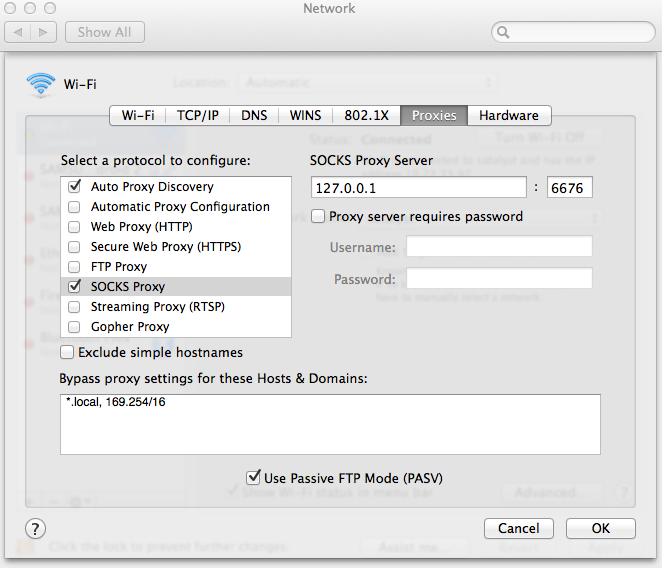
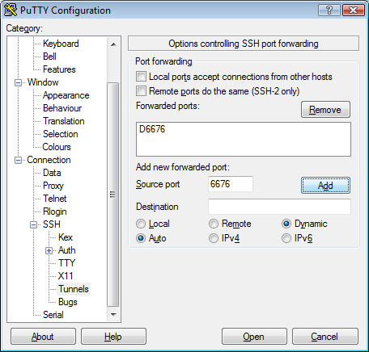
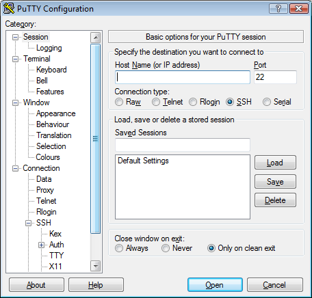

#######################
Using your cloud tunnel
#######################

A cloud tunnel is a secure way to reach our cloud dashboard and APIs from
anywhere via an encrypted and authenticated SOCKS proxy over SSH. Below you
will find instructions on how to use your cloud tunnel from different operating
systems.

You should have received the IP address of your cloud tunnel on our welcome
email. This IP will be referred to as “[ip]” here after. You can alternatively
use any compute instance running SSHD as a SOCKS proxy. All you have to do is
to replace the username and IP used in the examples below.

****************************
Establishing the SOCKS proxy
****************************

On Linux
========

On a terminal, connect to your cloud-tunnel instance using SSH with port
forwarding enabled::

  ssh -D 6676 tunnel@[ip]

You should leave this SSH session established while using the dashboard.

Now, your browser needs to be configured to use this tunnel as a proxy. The
procedure varies per browser and is described below for Firefox and Chrome.

Firefox
-------

On your browser, change its proxy settings (under Preferences, Advanced,
Network, Settings) to use the cloud-tunnel as a SOCKS proxy, as per the example
below:

.. image:: _static/ct-firefox-proxy.png
   :align: center

Chrome
------

On your browser, enter the URL chrome://settings/search#proxy and click on the
“Change proxy settings...” button. This should open your system network
settings, where you should change the Socks Host (under Network proxy) as
indicated below:

.. image:: _static/ct-chrome-proxy.png
   :align: center

On Mac
======

On a terminal, connect to your cloud-tunnel instance using SSH with port
forwarding enabled::

  ssh -D 6676 tunnel@[ip]

You should leave this SSH session established while using the dashboard.  Now,
your browser needs to be configured to use this tunnel as a proxy. The
procedure varies per browser and is described below for Safari, Chrome and
Firefox.

Safari
------

On your network settings (under system settings), change your proxy settings to
use the cloud-tunnel as a SOCKS proxy, as per the example below:

Chrome
------

On your browser, enter the URL chrome://settings/search#proxy and click on the
“Change proxy settings...” button. This should open your system network
settings, where you should change the Socks Proxy (under Proxies) as indicated
on the previous Safari example.

Firefox
-------

On your browser, change its proxy settings (under Preferences, Advanced,
Network, Settings) to use the cloud-tunnel as a SOCKS proxy, as per the example
below:

.. image:: _static/ct-firefox-proxy.png
   :align: center

On Windows
==========

In order to establish a SSH connection with your cloud tunnel you will need an
SSH client. If you do not have one, you can download and install PuTTY from:
http://the.earth.li/~sgtatham/putty/latest/x86/putty-0.63-installer.exe

After installing it, open PuTTY and connect to your cloud tunnel instance. On
the Category list, go to Connection, SSH and Tunnels. On the destination source
port, enter 6676 and select Dynamic and then click on “Add”, as indicated on
the image below.

On the category list, go back to session and enter the IP address of your cloud
tunnel instance. Click “Open” to establish the connection and enter your
username and password to log in.

You should leave this SSH session established while using the dashboard.

Now, your browser needs to be configured to use this tunnel as a proxy. The
procedure varies per browser and is described below for Internet Explorer,
Chrome and Firefox.

Internet Explorer
-----------------

On the configuration menu, open “Internet options”.

.. image:: _static/ct-ie-proxy01.png
   :align: center

On the connections tab open your “LAN settings” and click on “Advanced”.

.. image:: _static/ct-ie-proxy02.png
   :align: center

On the proxy settings screen configure the socks proxy with your local host
(127.0.0.1) and the port used for the SSH tunnel (6676) as indicated below:

.. image:: _static/ct-ie-proxy03.png
   :align: center

Chrome
------

On your browser, enter the URL chrome://settings/search#proxy and click on the
“Change proxy settings...” button. This should open your system internet
options, where you can configure a SOCKS proxy just like explained previously
on the Internet Explorer example.

Firefox
-------

On your browser, change its proxy settings (under Options, Advanced, Network,
Settings) to use the cloud-tunnel as a SOCKS proxy, as per the example below:

.. image:: _static/ct-firefox-proxy.png
   :align: center

***************************
Connecting to the dashboard
***************************

With the tunnel established and your proxy configuration done, you should now
be able to reach the cloud dashboard at https://dashboard.cloud.catalyst.net.nz
Once you have finished using the dashboard, you should remember to revert your
browser's proxy configuration back and close your SSH session.
