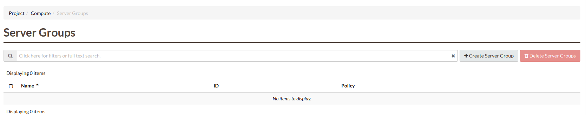
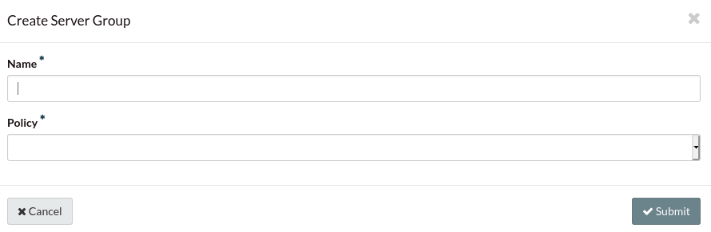
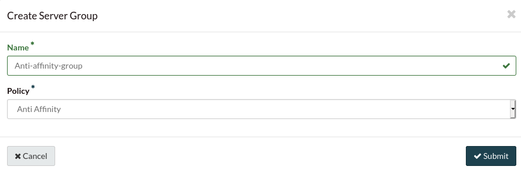
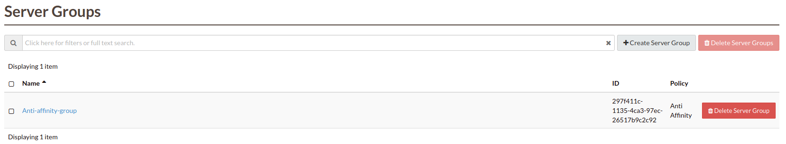
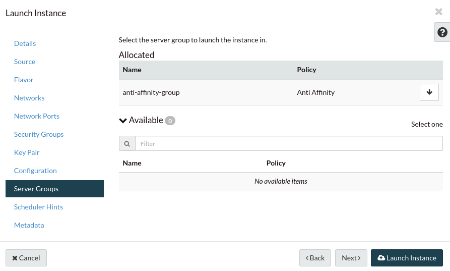

.. _anti-affinity:

############################
Using server affinity for HA
############################

Server affinity refers to the practice of ensuring compute instances are
either: allocated to the same **or** allocated to explicitly different
hypervisors (physical servers). The process of having your instances allocated
on the same hypervisor is known as server *"affinity"* and the process of
separating your instances across hypervisors is known as server
*"anti-affinity"*

*Server affinity* is useful when you want to ensure that the data transfer
amongst compute instances is as fast as possible. On the other hand it may
increase CPU contention or reduce the availability of your application
(a single server going down affects all compute instances in the group.)

Server *anti-affinity* is useful when you want to increase the availability of
an application within a region and create redundancy for your compute
instances. Compute instances in an anti-affinity group are placed on different
physical servers, ensuring that the failure of a server will not affect all
your compute instances simultaneously.

*Soft-affinity* is respectively similar to normal affinity. There is a key
different however in that this policy only *attempts* to run all servers on the
same hypervisor host. If this is not possible, this policy ensures that your
remaining servers start on as few other hypervisor hosts as possible.

*Soft anti-affinity* follows almost the same behavior as the regular
anti-affinity policy, only this policy ensures that your servers start on
as many differing hypervisor hosts as possible, even if some servers **must**
end up sharing the same hypervisor.

.. Warning::

  When deciding which server affinity type to use, please keep in mind that
  the policy behavior you choose will effect your servers behavior should a
  hypervisor experience a failure.

  * In the case of the *affinity* policy, if the hypervisor
    your instances are running on goes down then all instances that are part of
    that group may be unavailable for a period of time.
  * If you are using an *anti-affinity* policy and there is a hypervisor crash,
    an affected instance may not be migrated until another hypervisor becomes
    available that can support that same policy.

****************************************
Using the dashboard
****************************************

There are two parts to the management of server groups. The first part is the
creation of a server group, that has the policy that you want. The next is
adding instances to your server group.

Starting with the creation of your server group, we first need to navigate to
the **server groups** section of the dashboard:

From here we select **+ Create Server Group** and the following screen will
appear:

After we input a name and select the policy that we want our group to have (in
our case we will use Anti-affinity, since this is the most common policy) we
click submit and wait for our server group to build.

Once our group is created we should be able to see it from this page:

Now that we have our created Anti-affinity group, we can start adding instances
to it. It is important to note that only new instances can be added to a server
group. You cannot add instance that have already been created because the
server group cannot retroactively enforce its policies on them. You can declare
the server group you want your instance to be a part of when creating it,
from the following screen:

*****************************************************
Using programmatic methods
*****************************************************

.. Note::

  Before using any of the following methods, you will have to source your
  environment variables using an :ref:`openRC file.<configuring-the-cli>`

.. tabs::

    .. tab:: OpenStack CLI

      To create a server group:

      .. code-block:: bash

        openstack server group create --policy $policy $groupname

      Where:

      * ``$groupname`` is a name you choose (eg: app-servers)
      * ``$policy`` is ``anti-affinity``

      .. * ``$policy`` is either ``affinity`` or ``anti-affinity``

      To list server groups:

      .. code-block:: bash

        openstack server group list

      To delete a server group:

      .. code-block:: bash

        openstack server group delete $groupid

      Deleting a server group does not delete the compute instances that belong to
      the group.

      |

      Once you have created a server group, any new instances that you create
      can be added to it. You can do this by passing a hint to our cloud
      scheduler when creating your instance, to indicate it belongs to a
      server group. This is done using the ``--hint group=$GROUP_ID``
      parameter, as indicated below.

      .. code-block:: bash

        openstack server create --flavor $CC_FLAVOR_ID --image $CC_IMAGE_ID
        --key-name $KEY_NAME --security-group default --security-group $SEC_GROUP
        --nic net-id=$CC_PRIVATE_NETWORK_ID --hint group=$GROUP_ID first-instance

      .. note::

        If you receive a `No valid host was found` error, it means that the cloud
        scheduler could not find a suitable server to honour the policy of the server
        group. For example, we may not have enough capacity on the same hypervisor to
        place another instance in affinity, or enough hypervisors with sufficient
        capacity to place instances in anti-affinity.

    .. tab:: Ansible

      The example below illustrates how the ``scheduler_hints`` parameter can
      be passed in an Ansible playbook using the os_server module. This means
      when the playbook creates a compute instance, it also puts the instance
      into the desired server group:

      .. code-block:: yaml

        - name: Create a compute instance on Catalyst Cloud
          os_server:
            state: present
            name: "{{ instance_name }}"
            image: "{{ image }}"
            key_name: "{{ keypair_name }}"
            flavor: "{{ flavor }}"
            nics:
              - net-name: "{{ private_network_name }}"
            security_groups: "default,{{ security_group_name }}"
            scheduler_hints: "group=78f2aabc-e73a-4c72-88fd-xxxxxxxxxxxx"

    .. tab:: Terraform

      The following is a terraform plan that will create an anti-affinity
      server group and create an instance that is added to our server group.
      For this example we assume that you are familiar with Terraform and know
      how to use a terraform plan.

      .. Note::

        Before using this plan you will have to change some variables
        so that it fits your project.

      .. literalinclude:: _scripts/terraform/anti-affinity/terraform-variables.tf
          :language: shell
          :caption: terraform-variables.tf

    .. tab:: Heat

      For this tutorial, it is assumed that you have some knowledge of HEAT and
      know how to use HOT templates.

      The following template can be used to create an anti-affinity server
      group. Once this group is created, you can use the method described in
      the CLI section to create new instances that will use your new server
      group. We have to use the CLI method as HEAT does not natively support
      attaching instances to server groups.

      .. code-block::

        heat_template_version: 2015-04-30

        description: >
          HOT template for creating an anti-affinity server group.

        resources:

          anti_affinity_group:
            type: OS::Nova::ServerGroup
            properties:
              name: <SERVER_GROUP_NAME>
              policies: ["anti-affinity"]

      To use this script, you need to validate the template and then create
      your stack.

      .. code-block:: bash

        $ openstack orchestration template validate -t <anti-affinity-template.yaml>

        # If your template is valid, then the template will be outputted on the command line.
        # Otherwise you will get an error message you will need to fix

        # Next, we go ahead and create our stack, using the correct template

        $ openstack stack create -t <anti-affinity-template.yaml> <stack-name>

      After you have run the previous command, you can track the progress of
      your stack by using the following:

      .. code-block:: bash

        $ openstack stack event list AA-group

        2020-10-21 20:58:29Z [AA-group]: CREATE_IN_PROGRESS  Stack CREATE started
        2020-10-21 20:58:29Z [AA-group.anti_affinity_group]: CREATE_IN_PROGRESS  state changed
        2020-10-21 20:58:30Z [AA-group.anti_affinity_group]: CREATE_COMPLETE  state changed
        2020-10-21 20:58:30Z [AA-group]: CREATE_COMPLETE  Stack CREATE completed successfully

      Once the stack is at ``CREATE_COMPLETE``, you will be able to add any new
      instances that you create to your anti-affinity server group.

Via the APIs
============
Please refer to the server groups API calls at
https://docs.openstack.org/api-ref/compute/#server-groups-os-server-groups.
