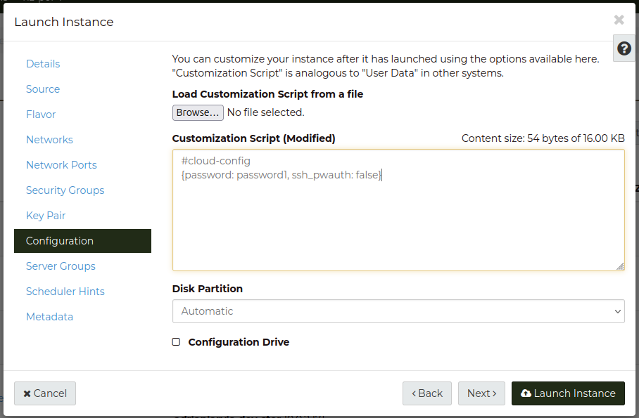
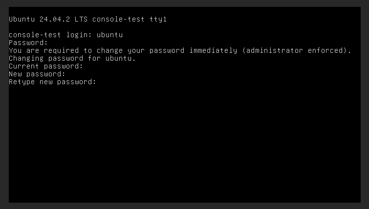

# Using the Dashboard Console with a linux instance

Using the console in the dashboard with linux instances requires that the 
instance has a user with a password.  The default behaviour is that the user for
Linux instances is created without a password and the keypair has to be used to
authenticate. To be able to use the console, we first have to have a user that 
can log into the instance with a password.


The following is one method of allowing console access by configuring the 
instance's default user to have a password.   

## Configure a password for the default user

When creating an instance the **Customization Script** can be used to configure 
the default user to have a password.

The following script will set the temporary password for the default user to 
"password1", and disables ssh password authentication for the user.

```
#cloud-config
{password: password1, ssh_pwauth: false}
```

The script can be entered in the **Configuration** step of the 
**Launch Instance** wizard.



The script uses commands that are part of the Cloud-init standard, further 
information about the standard can be found 
[here](https://cloudinit.readthedocs.io/en/latest/index.html).  

## Logging in via the console

Once the instance has been built you can then use the default user with 
password "password1" to log into the console.

The username of the default user will depend on the linux distribution, for 
Ubuntu the default user is "ubuntu".

When you first log in you will be prompted to change the password:


