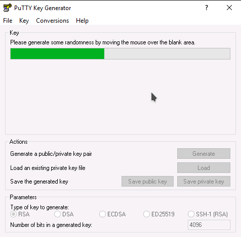
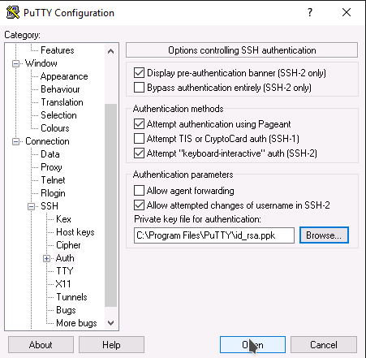

###
FAQ
###

********************************************************************
Pause, Suspend, Shelve and Shut Off Instance. What's the difference?
********************************************************************

See :ref:`stopping compute` for the differences between the methods of halting
a compute instance.

For lowering costs and long term preservation of compute instances, ``Shelve
Instance`` is the recommended option.

The cost of a running instance vs a shelved instance
====================================================

.. note::

  It is important to be aware that the ``Shelve Instance`` action will only help
  to lower the monthly costs associated with your cloud project.

The act of shelving an instance creates a snapshot of the running instance
which it stores as an image on block storage, meaning you now have an extra
volume associated with your project. Once this has been done, it stops the
instance and schedules it to be removed from memory. The cost saving when
shelving instances is due to the fact that you are no longer paying for the
compute services that a running instance uses. Instead, you are now only
paying the much cheaper cost of storing a snapshot of your image on disk.

To illustrate this, let's say you had a simple 1 vCPU 1GB RAM instance
with a 10GB disk running 24/7 for an entire month, which we will assume is
730 hours as an average.

The cost for this would be:
**$32.12 / month**

Compare that to the same instance stored as a disk image:
**$4.02 / month**

You can see that even for such a small compute instance the cost saving is
quite significant. If you were to apply this to a compute instance with
4vCPU and 16GB RAM, the monthly running cost would be:
**$285.43 / month**

so it would definitely make sense to shelve instances you don't need
to run full time.

*****************************
Locale errors on Ubuntu Linux
*****************************

When launching an Ubuntu compute instance using the images provided by
Canonical, we recommend you configure the locale using cloud-init. The
example below illustrates how the locale can be defined at boot time using the
cloud-config syntax.

.. code-block:: bash

  #cloud-config
  fqdn: instancename.example.com
  locale: en_US.UTF-8

If the locale is not configured appropriately, you may get locale related
errors, such as:

* locale.Error: unsupported locale setting
* perl: warning: Setting locale failed
* perl: warning: Please check that your locale settings

These errors can occur while installing packages or performing simple tasks on
the operating system.

If you have not defined the locale at boot time, you can still configure it
later using the following procedure.

First, ensure that your hostname is defined in ``/etc/hosts`` (sudo vi
/etc/hosts). If you only have an entry for localhost, add another entry with
the name of your compute instance, as shown below:

.. code-block:: bash

  127.0.0.1 localhost
  127.0.0.1 instancename

Use the commands below to configure and generate your locales. Replace
``en_US.UTF-8`` with your desired locale.

.. code-block:: bash

  export LC_ALL="en_US.UTF-8"
  sudo echo "LC_ALL=en_US.UTF-8" >> /etc/environment
  sudo dpkg-reconfigure locales

.. _ubuntu-minimal_dashboard_console:

*********************************************
Dashboard console and ubuntu-minimal-* images
*********************************************

Due to how Canonical is building the ``ubuntu-minimal-*`` images, those are not
compatible with the dashboard console functionality.

Canonical is building the ubuntu-minimal-* images to be lightweight with an
optimised kernel. In particular, that means those images are built with the
``kvm`` kernel compiled without support for console on the virtual terminal,
unlike the other ubuntu images that are built with the ``generic`` kernel and
with support for console on the virtual terminal.
Therefore the dashboard console will not work for instances built from the
ubuntu-minimal-* images.

Access to the dashboard console is through the ``Console`` tab once you look at
the details of an instance, or through the ``Console`` action from the dropdown
list when you're looking at the list of instances.

If you try regardless, you'll find the following message on the dashboard
console (the actual message vary slightly between ubuntu-minimal-* images,
the example below is from ``ubuntu-minimal-20.04-x86_64``):

This does not prevent the instances made from the ubuntu-minimal-* images to
boot successfully and to otherwise be used as any other Ubuntu instance.

***********************************
How to SSH from Windows using PuTTY
***********************************

This is intended as a quick guide for Windows users on how to create SSH keys
and connect via SSH to Linux instances using PuTTY and PuTTYgen.

What is PuTTY
=============

``PuTTY`` is an open source SSH client, developed originally by Simon Tatham
for the Windows platform.

This guide assumes that you have downloaded and installed the latest **msi**
package which can be found `here`_.

.. _`here`: https://www.chiark.greenend.org.uk/~sgtatham/putty/latest.html

Once the package has been installed you should have access to 2 new
applications, ``PuTTY`` which is the SSH client and ``PuTTygen`` which is the
SSH key management tool.

Creating an SSH key
===================

Launch the PuTTYgen application.

Set the Parameters as follows:

- Type : RSA
- Number of bits in generated key : 4096

Then click Generate

Move the mouse around to generate enough entropy to create the key

Once the key has been created, set a passphrase and save the private key and
the public key. In this example we will save the private key as **id_rsa.ppk**

.. image:: _static/ssh-with-putty_3.png
   :align: center

Adding your SSH key to your project
===================================

Once you have successfully created your SSH key you need to import the public
portion into your cloud project.

First highlight and copy ALL of the text in the Public key for pasting dialogue
box. Ensure you scroll to the bottom to get everything.

Next, log into the cloud dashboard, select **Key Pairs** from left
hand menu and then **Import Key Pair**. Enter a meaningful name for the key and
paste in the public key text from the previous step and **Import Key Pair**

.. image:: _static/ssh-with-putty_5.png
   :align: center

Once the key has been imported confirm that the fingerprint matches the one
shown in PuTTYgen.

Connecting with SSH and PuTTY
=============================

Once you have the new key in place in your cloud project you can launch a new
instance providing this as the keypair for authentication. For the purpose of
this example we will assume that the new instance is running Ubuntu.

Open PuTTY and navigate to ``Connection -> SSH -> Auth`` in the Category panel.

Configure the settings as shown below, any existing settings can be left as
they are.

- Allow attempted changes of username in SSH-2 : Checked
- Private key file for authentication : enter the location of the private key
  that was saved in PuTTYgen earlier.

In the Category panel switch to the session screen and enter the floating IP
address of the cloud instance you wish to connect to and click Open.

In the terminal session that appears enter the default username for the OS that
you have deployed. As we have assumed that we are running an Ubuntu instance
our username will be **ubuntu**.

.. image:: _static/ssh-with-putty_9.png
   :align: center

You will then be prompted to supply the passphrase that was used when creating
the SSH key in PuTTYgen.

.. Note::

  If this is the first time that you have connected to this server you will also
  be asked to accept the servers host key. Say **Yes** to this.

.. image:: _static/ssh-with-putty_10.png
   :align: center

You should now be logged successfully into your instance.

.. image:: _static/ssh-with-putty_11.png
   :align: center
