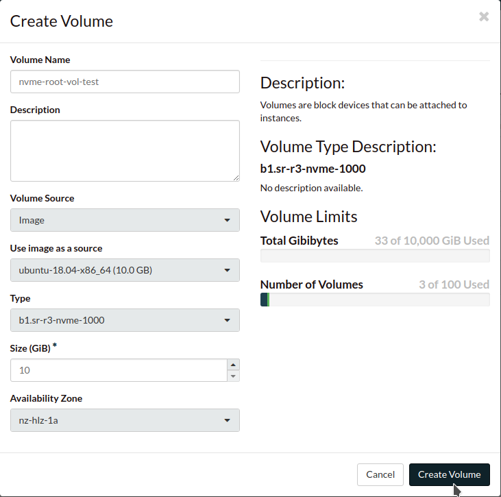
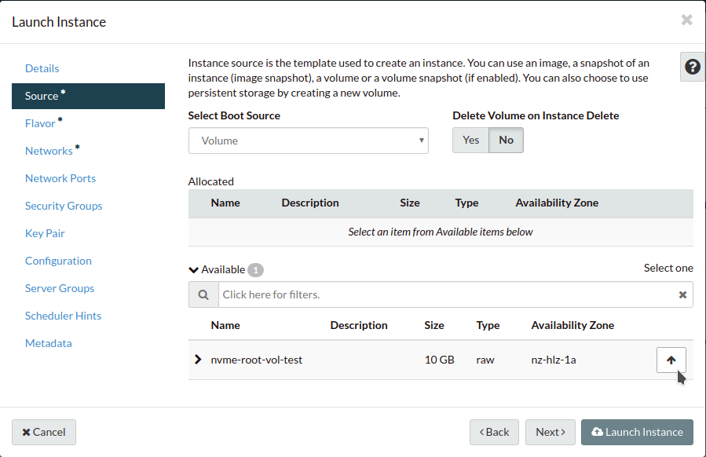
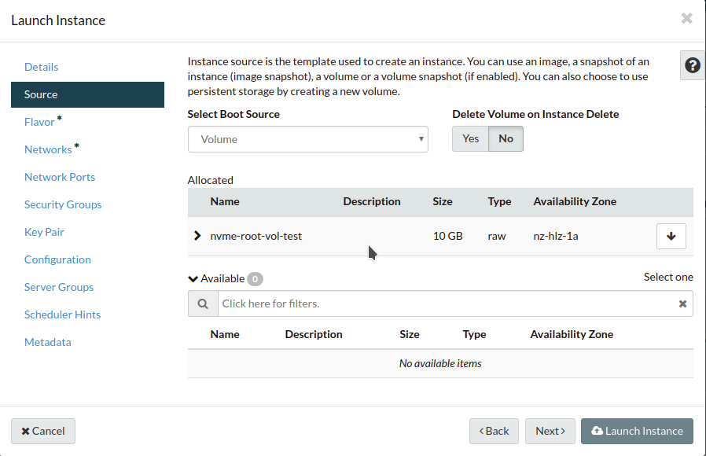

#####################
Launching an instance
#####################

*********
Root disk
*********

A root disk is used to boot the compute instance and typically contains an
operating system image.

Choosing a source
=================

When creating a new instance via the dashboard you are asked to select a
`Boot Source`. You can choose to use an image provided by Catalyst Cloud,
images uploaded by you, instance snapshots, existing volumes, or volume
snapshots:

* ``Image``: Public images are pre-configured operating system images provided
  by Catalyst Cloud or our partners. Private images are images you have
  uploaded yourself.
* ``Instance Snapshot``: Assuming you have previously created a snapshot of
  another compute instance, this option will create a new compute instance that
  is a clone of an existing compute instance (at the point the snapshot was
  taken).
* ``Volume``: Will re-attach an existing volume as the root disk of the new
  compute instance. This option assumes that the existing volume is a valid
  boot source (i.e.: contains an operating system).
* ``Volume Snapshot``: Assuming you have previously created a snapshot of a
  volume, this option will create a new root disk that is a clone of an
  existing volume (at the point in time the snapshot was taken).

Choosing the root disk type
============================

Compute instances can have their root disk backed by a ``Persistent Volume`` or
an ``Ephemeral Disk``. The table below outlines the main differences between
these two options:

+-------------------+------------------------------+--------------------------+
| Root disk type    | Life-cycle                   | Snapshots                |
+===================+==============================+==========================+
| Persistent Volume | Will continue to exist       | Snapshots will take less |
|                   | after the compute instance   | than a second to be      |
|                   | is deleted, so long the      | performed and will use   |
|                   | option `delete on terminate` | less space.              |
|                   | was not selected.            |                          |
|                   |                              | Copy on Write (CoW) is   |
|                   |                              | used for the snapshot. As|
|                   |                              | a result, the snapshot   |
|                   |                              | will depend and require  |
|                   |                              | the original volume to   |
|                   |                              | remain available.        |
+-------------------+------------------------------+--------------------------+
| Ephemeral Disk    | Will be deleted when the     | Will take longer to be   |
|                   | compute instance is deleted. | performed and will use   |
|                   |                              | more space.              |
|                   |                              |                          |
|                   |                              | A complete copy of the   |
|                   |                              | data will be created. As |
|                   |                              | a result, the snapshot   |
|                   |                              | will be independent and  |
|                   |                              | the original ephemeral   |
|                   |                              | disk can be deleted.     |
+-------------------+------------------------------+--------------------------+

By default the web dashboard will create a ``Persistent Volume``. This is the
recommended option for most use cases, and in doubt, the one that should be
selected.

``Ephemeral Disk`` is only recommended for true cloud native applications,
built using the immutable infrastructure principle, or one-off jobs.

Delete on terminate
===================

For convenience, it is possible to request the compute service to delete the
``Persistent Volume`` used for the root disk when the compute instance is
deleted. To do so, select "Yes" for "Delete Volume on Instance Delete".

.. warning::

  For production workloads it is not recommended to delete volumes automatically
  when compute instances are deleted.

.. _boot-with-nvme-volume:

Launching an instance from an NVMe volume
=========================================

In order to launch an instance from an NVMe volume we need to create a volume
of the right type based on the image that we need to run. Once this is done we
can launch a new instance from that volume.

Got into the ``Volumes`` screen and select Create Volume and set the following
as explained

* ``Volume Name``: something meaningful so it can be easily identified in
  subsequent steps.
* ``Volume Source``: needs to be set to ``Image``.
* ``Use image as source``: this option is made visible by the previous choice,
  select the OS image that you wish to run.
* ``Type``: select one of the NVMe storage tier options from the dropdown.

Here is an example using Ubuntu 18.04 as the image on a b1.sr-r3-nvme-1000
volume.

Once the volume has been successfully created we can launch the instance.

Go to the Instances page and select Launch Instance. Populate the Details
section as required.

On the Source page set ``Select Boot Source`` to ``Volume``, you should now be
able to see the volume you created in the previous step under ``Available``.

Select your volume and ensure it now appears under Allocated like this.

Complete the rest of the Launch Instance dialogue as required and launch the
instance.

******
Flavor
******

.. _flavors-information:

The compute instance "flavor" (spelt as the API spells it) defines the
type of compute, and the amount of CPU and RAM allocated to your virtual
servers. The price per hour for a compute instance varies according to
its flavor. Supported flavors can be found here:
https://catalystcloud.nz/services/iaas/compute/

Our flavors are named after the type of compute and amount of CPU and RAM
(and any other significant resources) they provide you, so you don't need
to consult our documentation to find out their specifications. We
currently provide a number of common combinations of CPU and RAM.

A virtual CPU (vCPU) is a slice of a physical CPU. How these are sliced
depend on the type of compute chosen. In general, one vCPU is mapped to
one hardware thread on the physical core. Some types of compute will
statically allocate these (assuring predictable performance), while
others will timeslice further or dynamically allocate hardware threads
as needed. This is documented in the product page about each type of
virtual server.

RAM is always allocated 1:1 with the physical RAM. We do not
oversubscribe RAM as this severely impacts on performance.

.. note::
  Some flavors have specific OS requirements which must be followed
  when using those types of servers.

  For "c2-gpu", see :ref:`gpu-support`.

***********************
Instance initialisation
***********************

An application called `cloud-init`_ is included in all images provided by 
Catalyst Cloud. This script is there to assist with instance configuration at
boot time. It communicates with the meta-data agent in the cloud and, for
example, configures the network of your compute instance as defined by you via
our APIs.

Cloud-init is very powerful. It's a de facto multi-distribution and multi-cloud
way of handling the early initialisation of a cloud instance.

When you launch a compute instance on the Catalyst Cloud, you can pass
initialisation configuration to cloud-init via "user-data" (either using the
``--user-data`` parameter of ``openstack server create``, or as a post-creation
customisation script via the web dashboard).

In the following sections, we provide examples that illustrate how to perform
common initialisation tasks with cloud-init, using different configuration
formats.

.. tabs::

    .. tab:: Cloud config format

      The following assumes that you are familiar with the Heat template and
      have installed all required dependencies.

      The cloud config format is the simplest way to accomplish initialisation tasks
      using the cloud-config syntax. The example below illustrates how to upgrade
      all packages on the first boot.

      .. code-block:: bash

        #cloud-config
        # Run a package upgrade on the first boot
        package_upgrade: true

      The example below shows cloud-init being used to change various configuration
      options during boot time, such as the hostname, locale and timezone.

      .. code-block:: bash

        #cloud-config

        # On the Catalyst Cloud, the default username for access to your instances is:
        # - CentOS: centos
        # - CoreOS: core
        # - Debian: debian
        # - Ubuntu: ubuntu
        # - Instances deployed by Heat: ec2-user
        # You can chose a different username with the "user" parameter as shown below.
        user: username

        # Set the hostname and FQDN
        fqdn: hostname.example.com
        manage_etc_hosts: true

        # Set the timezone to UTC (strongly recommended)
        timezone: UTC

        # Set the locale
        locale: en_US.UTF-8

        # Run package update and upgrade on first boot
        package_upgrade: true

        # Mount additional volumes
        mounts:
         - [ /dev/vdb, /mnt, auto ]

        # Install packages
        packages:
         - git
         - sysstat
         - htop
         - apache2

        # Run commands (in order, output displayed on the console)
        runcmd:
         - echo "Sample command"

        # Reboot when finished
        power_state:
         mode: reboot
         message: Rebooting to apply new settings

        # Save a copy of cloud-init's process output (info & errors) to a logfile
        output: {all: '| tee -a /var/log/cloud-init-output.log'}

    .. tab:: Script format

      Cloud init can be used to run scripts written in any language (bash, python,
      ruby, perl, ...) at boot time. Scripts must begin with ``#!``.

      .. code-block:: bash

        #!/bin/bash

        # Upgrade all packages
        apt-get update
        apt-get -y upgrade

        # Install apache
        apt-get -y install apache2

    .. tab:: MIME format

      The mime multi part archive format allows you to combine multiple cloud-init
      formats, files and scripts into a single file.

      The example below uses the cloud-config format to install apache and the script
      format to overwrite the index.html file of the default website:

      .. code-block:: bash

        Content-Type: multipart/mixed; boundary="===============1123581321345589144=="
        MIME-Version: 1.0

        --===============1123581321345589144==
        MIME-Version: 1.0
        Content-Type: text/cloud-config; charset="us-ascii"
        Content-Transfer-Encoding: 7bit
        Content-Disposition: attachment; filename="cloud-config.init"

        #cloud-config
        # Install packages
        packages:
         - apache2

        --===============1123581321345589144==
        MIME-Version: 1.0
        Content-Type: text/x-shellscript; charset="us-ascii"
        Content-Transfer-Encoding: 7bit
        Content-Disposition: attachment; filename="script.sh"

        #!/bin/bash
        echo "<h1>Hello world!</h1>" > /var/www/html/index.html

        --===============1123581321345589144==--

Content type options
====================

Some of the content types supported by the MIME format include:

* ``text/cloud-config``: cloud config format
* ``text/x-shellscript``: shell script (written in any language)
* ``text/x-include-url``: read content from a URL
* ``text/upstart-job``: upstart job

Cloud-init official docs
========================

For other formats and more detailed information on how to use cloud-init to
initialise your compute instances, please refer to the `cloud-init official
documentation <cloud-init>`_.

.. _cloud-init: https://cloudinit.readthedocs.io
