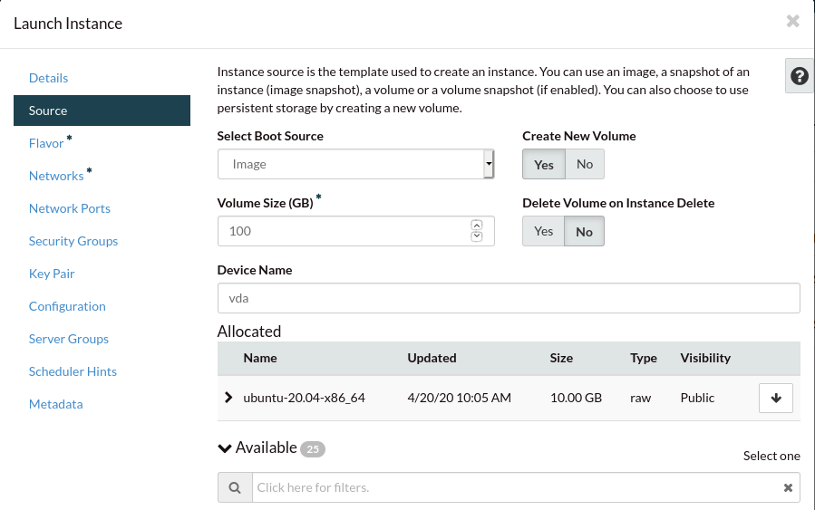

##########
Quickstart
##########

********
Overview
********

.. _quickstart_for_compute:

The purpose of this quickstart is to help you launch a compute instance that
you can test and experiment with, in order to get a better understanding of
how the compute service works.

To achieve this, we will provide a simple, single instance example using
some of the most common methods that are being used by our customers. These
are:

- The Catalyst Cloud `web dashboard`_.
- The OpenStack `command line tools`_.
- The OpenStack `Heat`_ orchestration tool.
- The Hashicorp `Terraform`_ orchestration tool.

.. _command line tools: https://docs.openstack.org/newton/user-guide/cli.html
.. _web dashboard: https://dashboard.catalystcloud.nz
.. _Heat: https://wiki.openstack.org/wiki/Heat
.. _Terraform: https://www.terraform.io/

*****************
Dashboard example
*****************

Uploading an SSH key
====================

The first thing we need to do is to make sure we have a way to access the
instances we create. We use **SSH** to allow access to our instances. You can
either import an existing public key or have Catalyst Cloud create a key
pair for you. We document both below:

.. _creating-keypair:

Creating a new key pair
=======================

If you haven't generated a SSH key pair before, Catalyst Cloud can create one
for you.

Navigate to the **Key Pairs** tab.

.. image:: ../first-instance/../first-instance/dashboard_assets/key-pair-tab.png

Select the **Create Key Pair** button.

.. image:: ../first-instance/dashboard_assets/key-pair-buttons.png

Name and create the key pair.

.. image:: ../first-instance/dashboard_assets/new-key-pair.png

Click **Copy Private Key to Clipboard** and paste it into a text file in a
secure location. Make sure the file is saved as plain text.

.. _importing-keypair:

Importing an existing key pair
==============================

If you already have an SSH key pair, you can import the public key onto
Catalyst Cloud.

Navigate to the **Key Pairs** tab.

.. image:: ../first-instance/dashboard_assets/key-pair-tab.png

Select the **Import Key Pair** button.

.. image:: ../first-instance/dashboard_assets/key-pair-buttons.png

Name the key pair, and paste your public key into the box.

.. image:: ../first-instance/dashboard_assets/import-key-pair.png

Now that you've either imported or created an SSH key pair, we can continue.

Configure instance security group
=================================

By default, instances are inaccessible from all external IP addresses on all
ports. So we'll need to create an extra security group to let us SSH into the
instance we're about to create.

Navigate to the **Security Groups** tab.

.. image:: ../first-instance/dashboard_assets/security-group-tab.png

Now we'll create a new security group, allowing SSH access.
Select **Create Security Group** , give it a name, and create it.

.. image:: ../first-instance/dashboard_assets/create-security-group.png

Now select manage rules for your new security group.

.. image:: ../first-instance/dashboard_assets/select-manage-rules.png

As you can tell, by default, security rules allow egress of all traffic and
allow no ingress of traffic. By adding additional rules we can whitelist new
types of traffic coming from new IP addresses. Note that you can assign more
than one security group to an instance.

Select add rule.

.. image:: ../first-instance/dashboard_assets/sec-rule-list.png

Here we can see the add rule screen. Many options are available to us.

.. image:: ../first-instance/dashboard_assets/add_rule_screen.png

Change the **Rule** dropdown to **SSH**. Here you can customize what **CIDR**
range you allow access to your instance from. I've left it as
**0.0.0.0/0**, to allow SSH access **from all IP addresses**. This
would be an insecure thing to do when working in a real production environment,
but I'm leaving it like this for convenience.

When you're happy, select **Add** to add the rule to the security group.

.. image:: ../first-instance/dashboard_assets/add-ssh-rule.png

We now have a security group that will allow SSH access to our soon to be
created instance.

Booting an instance
===================

We are now ready to launch our first instance! Navigate to the **Instances**
page.

.. image:: ../first-instance/dashboard_assets/instances-tab.png

Select launch instance.

.. image:: ../first-instance/dashboard_assets/launch-instance-button.png

Name your instance.

.. image:: ../first-instance/dashboard_assets/name-instance.png

Navigate to the **Source** tab.

There are many types of sources you can use for your instance. In this case,
we'll use an Image to create a standard Ubuntu installation.

.. image:: ../first-instance/dashboard_assets/vanilla-image.png

Search for Ubuntu.

Select the image for Ubuntu 20.

By default the volume will just be large enough to hold the image's files.
We'll increase it to 100GB so we have enough space for later.

Navigate to the **Flavor** tab. This is where we select the compute resources
we want to assign to our compute instance. Flavors are described in more detail
in :ref:`instance-types`.

Order the flavors by **VCPUS**, and select an appropriate size.

.. image:: ../first-instance/dashboard_assets/setting-flavor.png

Navigate to the **Security Groups** tab. Add your new security group.

.. image:: ../first-instance/dashboard_assets/setting-sec-rules.png

Navigate to the **Key Pair** tab. Your key pair should already be assigned, but
if it's not, do it now. This will inject your public key into the new instance,
so that your private key will be accepted for SSH connections.

.. image:: ../first-instance/dashboard_assets/setting-key-pair.png

All the other tabs are for advanced features, and we can safely ignore them for
now.

Select **Launch Instance**.

.. image:: ../first-instance/dashboard_assets/launching-instance.png

Finally, to make your instance accessible, we need to give it a publicly
available, static IP address, because currently the instance only has an
internal IP address from instance's subnet. These are **Floating IPs**.

Use the instance's dropdown to find the **Associate Floating IP** option and
select it.

.. image:: ../first-instance/dashboard_assets/finding-floating-ip.png

Select the **+** to create a new floating IP address.

.. image:: ../first-instance/dashboard_assets/assigning-floating-ip.png

Select **Allocate IP** to provision yourself a floating IP address.

.. image:: ../first-instance/dashboard_assets/creating-floating-ip.png

The new floating IP should already be assigned.

Select **Associate** to associate it to your instance.

.. image:: ../first-instance/dashboard_assets/set-floating-ip.png

|

Congratulations, you've now booted an instance. Now we'll connect to it with an
SSH tunnel so you can start using it.

Connect to the new instance
===========================

Before we SSH in, we should give the private SSH key the correct, more secure
permissions.

.. code-block:: bash

  $ chmod 600 <path to private key>

You can now connect to the SSH service using the floating IP that you
associated with your instance. This address is visible in
the Instances list, or under the **Floating IPs** window.

.. code-block:: bash

 $ ssh -i <path to private key> ubuntu@<your floating ip>

You should be able to SSH into, and interact with this instance as you would
any Ubuntu server.

*********************
Programmatic examples
*********************

Configuration for code blocks
=============================

The configuration we will use for these examples is based on the settings that
would be found in a brand new cloud project; which will have been provisioned
with a single network.

We will launch a compute instance using an Ubuntu 20.04 image and connect
it to the default network mentioned above. We will also create a
security group to allow inbound SSH traffic

The configuration details are as follows:

- region name : nz-hlz-1
- external network name : public-net
- internal network name : private-net
- image name: ubuntu-20.04-x86_64
- flavor name : c1.c1r1

Assumptions
===========

These examples assume the following:

- You have implemented an appropriate authentication method to allow you to
  interact with your Catalyst Cloud project. There are several options
  available to you depending on your tool of choice, some of these are:

  - Using an :ref:`OpenRC file<source-rc-file>`
  - Using a clouds.yaml file

- You have uploaded or created an SSH key.

The following is a set of different templates that you can use to create
your own compute instances. These instances will be the same as if you followed
the instructions from the :ref:`first instance <launch-first-instance>` section
of the documents.

This documentation refers to values using place holders
(such as <PRIVATE_SUBNET_ID>) You will need to change these to whichever UUID
fits your project before you run any of these templates.

.. tabs::

    .. tab:: OpenStack CLI

        .. literalinclude:: _scripts/cli/cli_basic_compute_create.sh
            :language: shell
            :caption: cli_basic_compute_create.sh

        .. literalinclude:: _scripts/cli/cli_basic_compute_destroy.sh
            :language: shell
            :caption: cli_basic_compute_destroy.sh

    .. tab:: Heat

        The following assumes that you are familiar with the Heat template and
        have installed all required dependencies.

        .. literalinclude:: _scripts/heat/heat_env.yaml
            :language: yaml
            :caption: heat_env.yaml

        .. literalinclude:: _scripts/heat/heat_basic_compute.yaml
            :language: yaml
            :caption: heat_basic_compute.yaml

    .. tab:: Terraform

        The following assumes that you have already sourced an OpenRC file and
        that you have downloaded and installed terraform.

        The template file that you need to save is:

        .. literalinclude:: _scripts/terraform/quickstart/terraform-variables.tf
            :language: shell
            :caption: terraform-variables.tf

        The commands you will need to use are:

        .. literalinclude:: _scripts/terraform/quickstart/terraform-create.sh
            :language: shell
            :caption: terraform-create.sh

        .. literalinclude:: _scripts/terraform/quickstart/terraform-destroy.sh
            :language: shell
            :caption: terraform-destroy.sh
