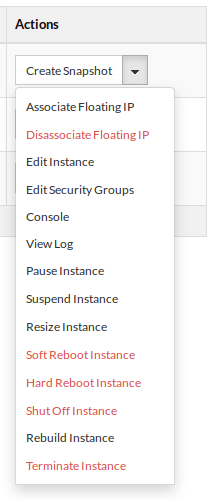
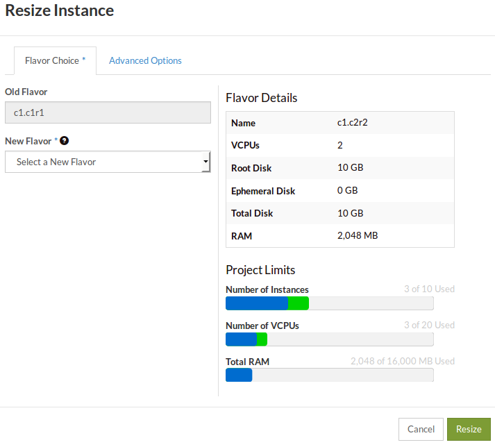
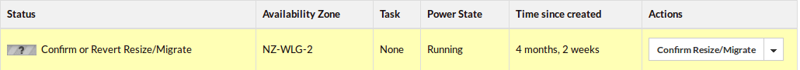

.. _resize-server:

####################
Resizing an instance
####################

The resize operation can be used to change the flavor (increase or decrease the
amount of CPU and RAM, or change the type) of a compute instance.

.. warning::

  The resize operation will shutdown the virtual server, as the effect of
  changing vCPUs, RAM, or type requires a full restart of the virtual
  server. If you need to scale your application without downtime, consider
  scaling it horizontally (add/remove compute instances) as opposed to
  vertically (add/remove resources to an existing instance).

.. note::

  Changing types, including important limitations, is discussed in more
  detail in :ref:`change-compute-type`.

*****************
Via the dashboard
*****************

To resize a compute instance, go to the Instances panel on the dashboard and
locate the instance to be resized. On the Actions column, click on the downward
arrow to list more actions and then click on Resize Instance as shown below:

The resize dialogue will pop up, allowing you to chose a new flavor.

.. note::
  Before resizing down a compute instance, please consider if you need to
  change the configuration of your applications, so they can start up with less
  resources. For example: databases and Java virtual machines are often
  configured to allocate a certain amount of memory and will fail to start if not
  enough memory is available.

The status of the instance will change to preparing to resize or migrate,
resized or migrated and finally “Confirm or Revert Resize/Migrate” as shown
below:

Once the resize operation has been completed, our cloud will prompt you to
confirm or revert the resize operation. Click on confirm to finish the resize
operation.

************************
Via the command line
************************

Before continuing, make sure that you have sourced an openRC file so that you
are able to interact with your project via the command line. If you are not
sure how to download or source your openRC file, you can follow the
:ref:`guide<command-line-interface>` from earlier in this documentation.

Once you have sourced your openRC file, we can begin gathering the
necessary info for our resize command. The first step is finding the ID of the
new flavor we want our instance to have:

.. code-block:: bash

  # The results of the following command have been truncated for brevity
  $ openstack flavor list

  +--------------------------------------+------------+--------+------+-----------+-------+-----------+
  | ID                                   | Name       |    RAM | Disk | Ephemeral | VCPUs | Is Public |
  +--------------------------------------+------------+--------+------+-----------+-------+-----------+
  | 01d5b414-14d5-4349-b823-xxxxxxxxxxxx | c1.c4r32   |  32768 |   10 |         0 |     4 | True      |
  | 02d12ad8-badc-4a41-9dae-xxxxxxxxxxxx | c1.c1r4    |   4096 |   10 |         0 |     1 | True      |
  | 0f3be84b-9d6e-44a8-8c3d-xxxxxxxxxxxx | c1.c16r16  |  16384 |   10 |         0 |    16 | True      |
  | 0f513d82-ffa0-4141-a98e-xxxxxxxxxxxx | c1.c2r6    |   6144 |   10 |         0 |     2 | True      |
  | 11a1966e-4193-4763-8148-xxxxxxxxxxxx | c1.c8r24   |  24576 |   10 |         0 |     8 | True      |
  | 1c199662-65bd-4fbe-aece-xxxxxxxxxxxx | c1.c8r64   |  65536 |   10 |         0 |     8 | True      |
  | 22afd80c-6a5e-49e6-a2c9-xxxxxxxxxxxx | c1.c4r2    |   2048 |   10 |         0 |     4 | True      |
  | 2772d378-c1c3-464c-83b9-xxxxxxxxxxxx | c1.c4r4    |   4096 |   10 |         0 |     4 | True      |
  | 2ba44887-5fe3-44cc-8bca-xxxxxxxxxxxx | c1.c2r2    |   2048 |   10 |         0 |     2 | True      |
  | 374fc408-7a30-483c-a8ce-xxxxxxxxxxxx | c1.c32r16  |  16384 |   10 |         0 |    32 | True      |
  | 3d11be79-5788-4d70-9058-xxxxxxxxxxxx | c1.c1r05   |    512 |   10 |         0 |     1 | True      |
  | 3df41a1b-fe84-4876-a1ef-xxxxxxxxxxxx | c1.c16r24  |  24576 |   10 |         0 |    16 | True      |
  | 5643df3f-7a6d-476d-b035-xxxxxxxxxxxx | c1.c32r96  |  98304 |   10 |         0 |    32 | True      |
  | 589b9451-ccc9-4b4c-b6c8-xxxxxxxxxxxx | c1.c32r256 | 262144 |   10 |         0 |    32 | True      |
  | 59ae6d98-aee7-4595-8bf0-xxxxxxxxxxxx | c1.c2r8    |   8192 |   10 |         0 |     2 | True      |
  | 5eb576f1-3f61-4121-a5a5-xxxxxxxxxxxx | c1.c4r6    |   6144 |   10 |         0 |     4 | True      |
  | 5ff0b09b-684c-4212-8edc-xxxxxxxxxxxx | c1.c2r4    |   4096 |   10 |         0 |     2 | True      |
  | 6104d093-4c74-4493-adb9-xxxxxxxxxxxx | c1.c8r32   |  32768 |   10 |         0 |     8 | True      |
  | 6371ec4a-47d1-4159-a42f-xxxxxxxxxxxx | c1.c1r1    |   1024 |   10 |         0 |     1 | True      |
  | a18d0408-f2cb-410d-a941-xxxxxxxxxxxx | c1.c1r2    |   2048 |   10 |         0 |     1 | True      |
  | ...                                  |            |        |      |           |       |           |
  +--------------------------------------+------------+--------+------+-----------+-------+-----------+

For this example we will be resizing our instance from c1.c1r1 to the c1.c1r2
flavor. For more information on flavors, their naming convention and purpose,
please refer to the previous page in this section:
:ref:`launching a compute instance<flavors-information>`.

We will now create an environment variable for our flavorID and for the
the instance we want to resize:

.. code-block:: bash

  # First, we get our current instance's ID by using the following:
  $ openstack server list

  +--------------------------------------+------------------------+---------------+--------------------------+------------------------------+---------+
  | ID                                   | Name                   | Status        | Networks                 | Image                        | Flavor  |
  +--------------------------------------+------------------------+---------------+--------------------------+------------------------------+---------+
  | c097f22f-48be-48ea-b664-xxxxxxxxxxxx | resizing-instance-test | Running       | private-net-1=10.0.0.194 | N/A (booted from volume)     | c1.c1r1 |
  +--------------------------------------+------------------------+---------------+--------------------------+------------------------------+---------+

  # Now taking both our instance ID and the flavor ID from before, we create the following variables
  $ instanceID=c097f22f-48be-48ea-b664-xxxxxxxxxxxx
  $ flavorID=a18d0408-f2cb-410d-a941-xxxxxxxxxxxx

With our variables now taken care of, we can proceed with constructing our
resize command. The basic structure of the command is
``openstack server resize <instance> --flavor``. So for our example it will
look like this:

.. code-block:: bash

  $ openstack server resize $instanceID --flavor $flavorID

Like the dashboard example, the resize command is split into two parts, one to
perform the resize and another to confirm that the resize was successful so
that the old instance may be released.

Before we confirm our resize, we have to wait for the status of our instance to
change to: ``VERIFY_RESIZE``. You can check the status of your instance using
the following:

.. code-block:: bash

  $ openstack server list
  +--------------------------------------+------------------------+-------------------+--------------------------+------------------------------+---------+
  | ID                                   | Name                   | Status            | Networks                 | Image                        | Flavor  |
  +--------------------------------------+------------------------+-------------------+--------------------------+------------------------------+---------+
  | c097f22f-48be-48ea-b664-xxxxxxxxxxxx | resizing-instance-test | VERIFY_RESIZE     | private-net-1=10.0.0.194 | N/A (booted from volume)     | c1.c1r1 |
  +--------------------------------------+------------------------+-------------------+--------------------------+------------------------------+---------+

Once our instance has the ``VERIFY_RESIZE`` status, we use the following to
confirm our resize:

.. code-block:: bash

  $ openstack server resize confirm $instanceID

  # We can then confirm that our instance has been resized by 'showing' our instance and looking at the flavor

  $ openstack server show $instanceID
  +-----------------------------+----------------------------------------------------------+
  | Field                       | Value                                                    |
  +-----------------------------+----------------------------------------------------------+
  | OS-DCF:diskConfig           | AUTO                                                     |
  | OS-EXT-AZ:availability_zone | NZ-WLG-2                                                 |
  | OS-EXT-STS:power_state      | Running                                                  |
  | OS-EXT-STS:task_state       | None                                                     |
  | OS-EXT-STS:vm_state         | active                                                   |
  | OS-SRV-USG:launched_at      | 2020-10-26T23:02:43.000000                               |
  | OS-SRV-USG:terminated_at    | None                                                     |
  | accessIPv4                  |                                                          |
  | accessIPv6                  |                                                          |
  | addresses                   | private-net-1=10.0.0.194                                 |
  | config_drive                |                                                          |
  | created                     | 2020-10-21T01:28:55Z                                     |
  | flavor                      | c1.c1r2 (a18d0408-f2cb-410d-a941-xxxxxxxxxxxx)           |
  | hostId                      | bf7da04283554bf5aaa8fcf1252c1d391709777c0cc420ac4b6aa762 |
  | id                          | c097f22f-48be-48ea-b664-xxxxxxxxxxxx                     |
  | image                       | N/A (booted from volume)                                 |
  | key_name                    | resize-instance-key                                      |
  | name                        | resizing-instance-test                                   |
  | progress                    | 0                                                        |
  | project_id                  | XXXXXXXXXXXXXXXXXXXXXXXXXXXXXXXXXX                       |
  | properties                  |                                                          |
  | security_groups             | name='default'                                           |
  |                             | name='security-group'                                    |
  | status                      | ACTIVE                                                   |
  | updated                     | 2020-10-26T23:38:10Z                                     |
  | user_id                     | 53b94a52e9dcxxxxxxx0079a9a3d6434                         |
  | volumes_attached            | id='8b661df3-f5f2-429c-9be6-xxxxxxxxxxxx'                |
  |                             | id='dae41bf1-7b33-430b-b4ae-xxxxxxxxxxxx'                |
  +-----------------------------+----------------------------------------------------------+

***************************
Via orchestration tools
***************************

Like the command line method, you will need to source an openRC file before you
continue with any of the following. Once you have your openRC file sourced, you
will be able to continue with any of the following methods.

.. tabs::

    .. tab:: Heat

      This tutorial assumes that you have some familiarity with Heat and that
      you have already constructed a template that you use to manage your
      stack.

      To resize your current instance you will need to change the "flavor"
      variable in your current template file.

      .. code-block::

          # this is a cut section of a HEAT template to show you what the flavor variable you will need to change looks like:
          ...
          servers_flavor:
          type: string
          description: Flavour for the servers
          default: c1.c1r1
          constraints:
            - custom_constraint: nova.flavor
          ...

      Once you have changed the ``default`` value of your flavor variable,
      you will then need to use the following command to update your stack:

      .. code-block::

        $ openstack stack update -t stack-template.yaml <stack-name>

      Once this command has been run, your instance should be updated with your
      new flavor.

    .. tab:: Terraform

      This tutorial assumes that you have knowledge of how terraform works and
      manages your resources. The following also assumes that you have already
      created your resources with a terraform template and you are now trying
      to change the flavor of that template to update your existing resources.

      To resize an instance using terraform, there are two things that we will
      need to change in our template. We need to update the flavor ID to match
      the new size we want to use, and we need to add an optional argument to
      our resource deceleration; to ignore the need to confirm our instance
      resize.

      First, we need to find the flavor ID that we will resize our instance to:

      .. code-block::

        # The following output has been truncated for brevity
        $ openstack flavor list

        +--------------------------------------+------------+--------+------+-----------+-------+-----------+
        | ID                                   | Name       |    RAM | Disk | Ephemeral | VCPUs | Is Public |
        +--------------------------------------+------------+--------+------+-----------+-------+-----------+
        | 01d5b414-14d5-4349-b823-xxxxxxxxxxxx | c1.c4r32   |  32768 |   10 |         0 |     4 | True      |
        | 02d12ad8-badc-4a41-9dae-xxxxxxxxxxxx | c1.c1r4    |   4096 |   10 |         0 |     1 | True      |
        | 374fc408-7a30-483c-a8ce-xxxxxxxxxxxx | c1.c32r16  |  16384 |   10 |         0 |    32 | True      |
        | 3d11be79-5788-4d70-9058-xxxxxxxxxxxx | c1.c1r05   |    512 |   10 |         0 |     1 | True      |
        | 3df41a1b-fe84-4876-a1ef-xxxxxxxxxxxx | c1.c16r24  |  24576 |   10 |         0 |    16 | True      |
        | 5643df3f-7a6d-476d-b035-xxxxxxxxxxxx | c1.c32r96  |  98304 |   10 |         0 |    32 | True      |
        | 589b9451-ccc9-4b4c-b6c8-xxxxxxxxxxxx | c1.c32r256 | 262144 |   10 |         0 |    32 | True      |
        | 59ae6d98-aee7-4595-8bf0-xxxxxxxxxxxx | c1.c2r8    |   8192 |   10 |         0 |     2 | True      |
        | 5eb576f1-3f61-4121-a5a5-xxxxxxxxxxxx | c1.c4r6    |   6144 |   10 |         0 |     4 | True      |
        | 5ff0b09b-684c-4212-8edc-xxxxxxxxxxxx | c1.c2r4    |   4096 |   10 |         0 |     2 | True      |
        | 6104d093-4c74-4493-adb9-xxxxxxxxxxxx | c1.c8r32   |  32768 |   10 |         0 |     8 | True      |
        | 6371ec4a-47d1-4159-a42f-xxxxxxxxxxxx | c1.c1r1    |   1024 |   10 |         0 |     1 | True      |
        | a18d0408-f2cb-410d-a941-xxxxxxxxxxxx | c1.c1r2    |   2048 |   10 |         0 |     1 | True      |
        | ...                                  |            |        |      |           |       |           |
        +--------------------------------------+------------+--------+------+-----------+-------+-----------+

      Once we have the flavor we want our instance to be resized to
      (for this example we will use the c1.c1r2 flavor) we need to look at our
      template and change the flavor ID that we are using. For the following
      example, we are using a template that has declared the flavor as a
      variable.

      .. code-block::

        variable "compute_flavor_ID" {
        default = "6371ec4a-47d1-4159-a42f-xxxxxxxxxxxx"
        }

        # We will replace the default value with our new flavor ID so that it will look like this:

        variable "compute_flavor_ID" {
        default = "a18d0408-f2cb-410d-a941-xxxxxxxxxxxx"
        }

      After we have changed our flavorID, we will need to add a
      ``vendor option`` to our ``openstack_compute_instance_v2`` resource so
      that we bypass the need to confirm our resize:

      .. code-block::

        # The section that we are adding is the "ignore_resize_confirmation = true"

        resource "openstack_compute_instance_v2" "instance_1" {
            name = "terraform-instance"
            #image_id = "${var.compute_image_ID}"
            flavor_id = "${var.compute_flavor_ID}"
            network {
                name = "${openstack_networking_network_v2.network_1.name}"
            }
            key_pair = "${openstack_compute_keypair_v2.keypair_1.name}"
            security_groups = ["${openstack_compute_secgroup_v2.secgroup_1.name}","default"]
            vendor_options {
              ignore_resize_confirmation = true
            }
        }

      Once this is done we can perform our terraform apply command and our
      instance should resize correctly.
