****************
SSH from Windows
****************

What is PuTTY
=============

``PuTTY`` is an open source SSH client, developed originally by Simon Tatham
for the Windows platform.

This guide assumes that you have downloaded and installed the latest **msi**
package which can be found `here`_.

.. _`here`: https://www.chiark.greenend.org.uk/~sgtatham/putty/latest.html

Once the package has been installed you should have access to 2 new
applications, ``PuTTY`` which is the SSH client and ``PuTTygen`` which is the
SSH key management tool.

Creating an SSH key
===================

Launch the PuTTYgen application.

Set the Parameters as follows:

- Type : RSA
- Number of bits in generated key : 4096

Then click Generate

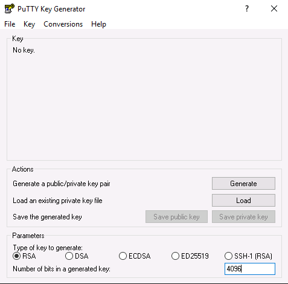

Move the mouse around to generate enough entropy to create the key

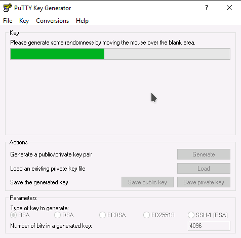

Once the key has been created, set a passphrase and save the private key and
the public key. In this example we will save the private key as **id_rsa.ppk**

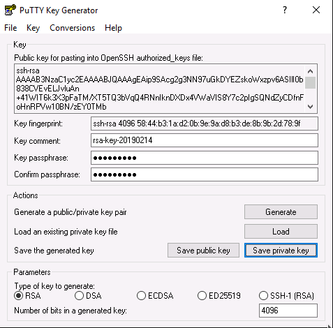

Adding your SSH key to your project
===================================

Once you have successfully created your SSH key you need to import the public
portion into your cloud project.

First highlight and copy ALL of the text in the Public key for pasting dialogue
box. Ensure you scroll to the bottom to get everything.

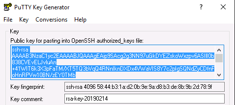

Next, log into the cloud dashboard, select **Key Pairs** from left
hand menu and then **Import Key Pair**. Enter a meaningful name for the key and
paste in the public key text from the previous step and **Import Key Pair**

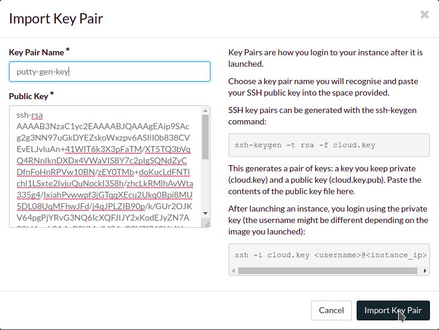

Once the key has been imported confirm that the fingerprint matches the one
shown in PuTTYgen.

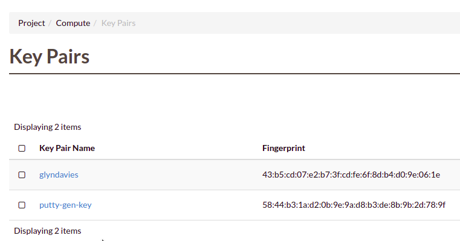

Connecting with SSH and PuTTY
=============================

Once you have the new key in place in your cloud project you can launch a new
instance providing this as the keypair for authentication. For the purpose of
this example we will assume that the new instance is running Ubuntu.

Open PuTTY and navigate to ``Connection -> SSH -> Auth`` in the Category panel.

Configure the settings as shown below, any existing settings can be left as
they are.

- Allow attempted changes of username in SSH-2 : Checked
- Private key file for authentication : enter the location of the private key
  that was saved in PuTTYgen earlier.

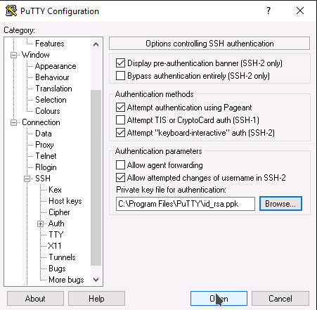

In the Category panel switch to the session screen and enter the floating IP
address of the cloud instance you wish to connect to and click Open.

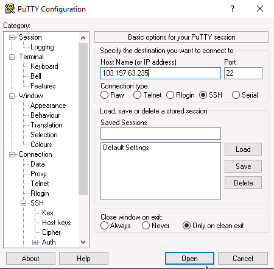

In the terminal session that appears enter the default username for the OS that
you have deployed. As we have assumed that we are running an Ubuntu instance
our username will be **ubuntu**.

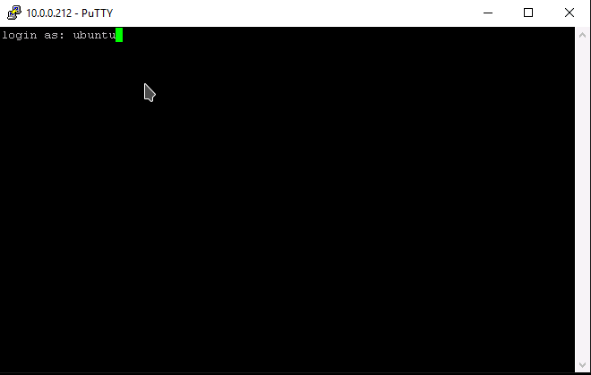

You will then be prompted to supply the passphrase that was used when creating
the SSH key in PuTTYgen.

.. Note::

  If this is the first time that you have connected to this server you will also
  be asked to accept the servers host key. Say **Yes** to this.

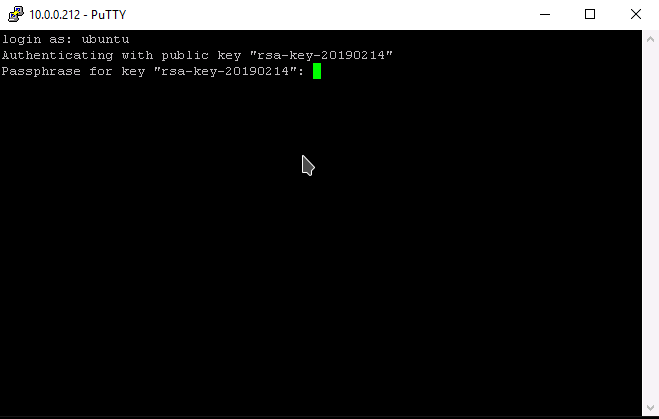

You should now be logged successfully into your instance.

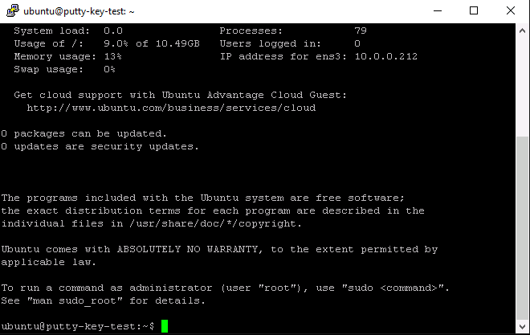
