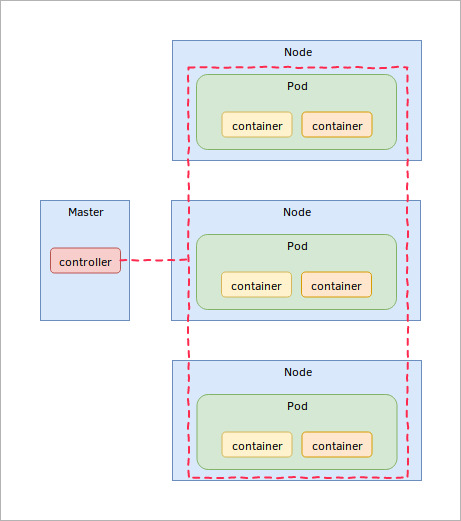

.. _controllers:

Controllers
===========
If a pod is created directly and fails to deploy or crashes it will not get rescheduled. To
overcome this problem it is possible to make use of a higher level of abstraction provided by
Kubernetes called ``controllers``.

These controllers represent different types of usage scenarios. The image below shows a
simplified representation of a Kubernetes setup with a controller managing copies of pods, for a
specific application scenario, across multiple nodes.

This means that you don’t need to be responsible for managing pod creation manually as the
controller can create and manage multiple Pods for you, taking care of such tasks as replication,
rollout and providing self-healing capabilities.

Controller types
----------------
The following controller types are the most commonly used of those that are currently available in
Kubernetes.  Each caters to a slightly different ``application pattern`` as illustrated below.

* Deployment

  - **Stateless Pattern**, when you don’t need to keep state (persistent data) in your workloads

* StatefulSet

  - **Stateful Pattern**, if some of your applications need to store data, as is the case for
    databases or message queues

* DaemonSet

  - **aemon Pattern**, you want to run daemon-like workloads such as log collection or monitoring
    daemons

* Job

  - **Batch Pattern**, for running batch processing workloads.
