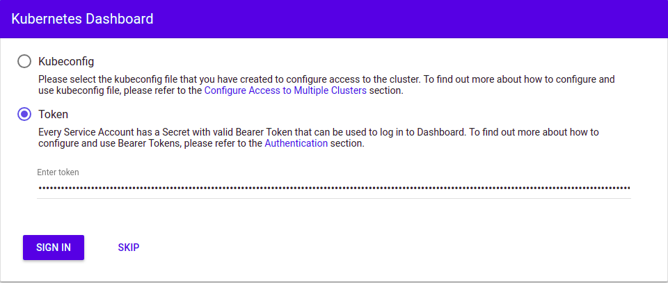
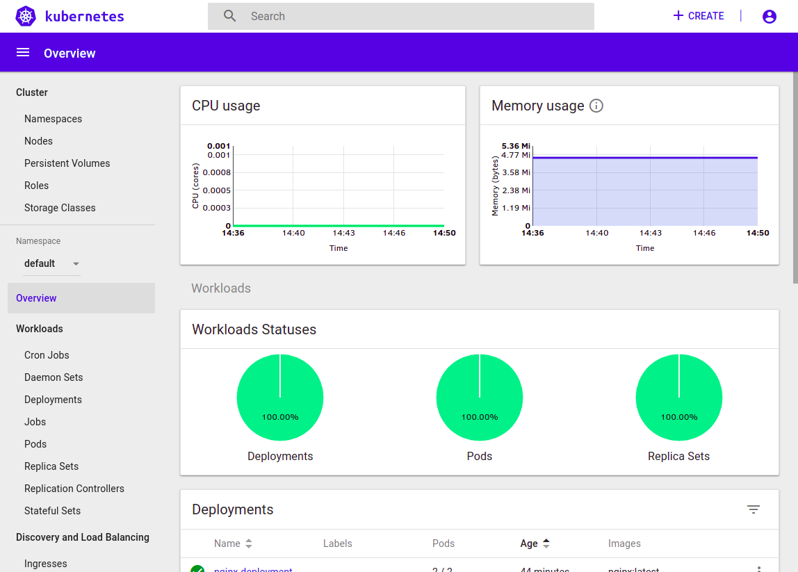

##########
Quickstart
##########
The purpose of this guide is to get those of you with existing Kubernetes experience up and
running as quickly as possible on the Catalyst Cloud.

.. Note::

  This assumes you already have a working knowledge of how to use the Openstack command line
  tools with the Catalyst Cloud and a familiarity with Kubernetes and it's related toolset.

Finding a cluster template
==========================
Then list all of the available cluster templates.

.. code-block:: bash

  $ openstack coe cluster template list
  +--------------------------------------+------+
  | uuid                                 | name |
  +--------------------------------------+------+
  | cf6f8cab-8d22-4f38-a88b-25f8a41e5b77 | k8s  |
  +--------------------------------------+------+

To view the details of a particular template.

.. code-block:: bash

  $ openstack coe cluster template show k8s
  +-----------------------+--------------------------------------+
  | Field                 | Value                                |
  +-----------------------+--------------------------------------+
  | insecure_registry     | -                                    |
  | labels                | {u'kube_tag': u'v1.11.2-1'}          |
  | updated_at            | 2018-10-05T01:06:15+00:00            |
  | floating_ip_enabled   | True                                 |
  | fixed_subnet          | -                                    |
  | master_flavor_id      | c1.c2r2                              |
  | uuid                  | cf6f8cab-8d22-4f38-a88b-25f8a41e5b77 |
  | no_proxy              | -                                    |
  | https_proxy           | -                                    |
  | tls_disabled          | False                                |
  | keypair_id            | -                                    |
  | public                | True                                 |
  | http_proxy            | -                                    |
  | docker_volume_size    | -                                    |
  | server_type           | vm                                   |
  | external_network_id   | e0ba6b88-5360-492c-9c3d-119948356fd3 |
  | cluster_distro        | fedora-atomic                        |
  | image_id              | 83833f4f-5d09-44cd-9e23-b0786fc580fd |
  | volume_driver         | cinder                               |
  | registry_enabled      | False                                |
  | docker_storage_driver | overlay2                             |
  | apiserver_port        | -                                    |
  | name                  | kubernetes-v1.11.2-development       |
  | created_at            | 2018-10-05T00:25:19+00:00            |
  | network_driver        | calico                               |
  | fixed_network         | -                                    |
  | coe                   | kubernetes                           |
  | flavor_id             | c1.c2r2                              |
  | master_lb_enabled     | False                                |
  | dns_nameserver        | 202.78.240.215                       |
  +-----------------------+--------------------------------------+

Creating a cluster
==================

To create a new cluster run the **openstack coe cluster create** command, providing the name of
the cluster to be created. It is also possible to over-ride or provide additional parameters
to the template if necessary.

.. code-block:: bash

  $ openstack coe cluster create k8s-cluster \
  --cluster-template k8s \
  --keypair testkey
  --node-count 1 \
  --master-count 1 \

  Request to create cluster c191470e-7540-43fe-af32-ad5bf84940d7 accepted

  $ openstack coe cluster list
  +--------------------------------------+-------------+----------+------------+--------------+--------------------+
  | uuid                                 | name        | keypair  | node_count | master_count | status             |
  +--------------------------------------+-------------+----------+------------+--------------+--------------------+
  | c191470e-7540-43fe-af32-ad5bf84940d7 | k8s-cluster | testkey  |          1 |            1 | CREATE_IN_PROGRESS |
  +--------------------------------------+-------------+----------+------------+--------------+--------------------+

.. Note::

  All masters and nodes are provisioned with an external floating IP at the time of creation. To
  view these details run ``openstack server list --name <cluster_name>``

Once the cluster is active it is possible to access nodes in the cluster via ssh, the ssh user
will be 'fedora' and the authentication will be using the ssh key provided in the cluster
template.

.. code-block:: bash

  $ ssh fedora@<node_ip>

.. note::

  Once a cluster template is in use it cannot be updated or deleted until all of the clusters
  using it have been terminated.

Setting up Kubernetes CLI
=========================

Getting kubectl
---------------
The  full details for getting the latest version of kubectl can be found `here`_.

.. _`kubectl`: https://kubernetes.io/docs/reference/kubectl/kubectl/
.. _`here`: https://kubernetes.io/docs/tasks/tools/install-kubectl/#kubectl-install-1

To install on Linux via the command line perform the following steps:

.. code-block:: bash

  $ curl -LO https://storage.googleapis.com/kubernetes-release/release/$(curl -s \
  https://storage.googleapis.com/kubernetes-release/release/stable.txt)/bin/linux/amd64/kubectl

  $ chmod +x ./kubectl
  $ sudo mv ./kubectl /usr/local/bin/kubectl

Cluster Access Using kubeconfig Files
=====================================
The kubectl command-line tool uses kubeconfig files to find the information it needs
to choose a cluster and communicate with the API server of a cluster.

Getting the cluster config
--------------------------
Configure native client to access cluster. You can source the output of this
command to get the native client of the corresponding COE configured to access
the cluster.

Example: ``eval $(openstack coe cluster config <cluster-name>)``

.. code-block:: bash

  $ eval $(openstack coe cluster config k8s-cluster)

This will download the necessary certificates and create a config file within the directory
that you are running the command from. If you wish to save the configuration to a different
location you can use the **--dir <directory_name>** parameter to select a different destination.

.. Note::

  If you are running multiple clusters or are deleting and re-creating cluster it is necessary to
  ensure that the current ``kubectl configuration`` is referencing the correct cluster.

Viewing the cluster
-------------------
It is possible to view details of the cluster with the following command. This will return the
address of the master and the services running there.

.. code-block:: bash

  $ kubectl cluster-info
  Kubernetes master is running at https://103.254.156.157:6443
  Heapster is running at https://103.254.156.157:6443/api/v1/namespaces/kube-system/services/heapster/proxy
  CoreDNS is running at https://103.254.156.157:6443/api/v1/namespaces/kube-system/services/kube-dns:dns/proxy

In order to view more in depth information about the cluster simply add the dump option to the
above example. This generates output suitable for debugging and diagnosing cluster problems.
By default, it redirects everything to stdout.

.. code-block:: bash

  $ kubectl cluster-info dump

Accessing the Kubernetes Dashboard
----------------------------------
By default Kubernetes provides a web based dashboard that exposes the details of a given cluster.
In order to access this it is first necessary to to retrieve the admin token for the cluster you
wish to examine.

The following command will extract the correct value from the secretes in the kube-system
namespace.

::

  $ kubectl -n kube-system describe secret $(kubectl -n kube-system get secret | grep admin-token | awk '{print $1}')
  Name:         admin-token-f5728
  Namespace:    kube-system
  Labels:       <none>
  Annotations:  kubernetes.io/service-account.name=admin
                kubernetes.io/service-account.uid=cc4416d1-ca82-11e8-8993-123456789012

  Type:  kubernetes.io/service-account-token

  Data
  ====
  ca.crt:     1054 bytes
  namespace:  11 bytes
  token:      1234567890123456789012.eyJpc3MiOiJrdWJlcm5ldGVzL3NlcnZpY2VhY2NvdW50Iiwia3ViZXJuZXRlcy5pby9zZXJ2aWNlYWNjb3VudC9uYW1lc3BhY2UiOiJrdWJlLXN5c3RlbSIsImt1YmVybmV0ZXMuaW8vc2VydmljZWFjY291bnQvc2VjcmV0Lm5hbWUiOiJhZG1pbi10b2tlbi1mNTcyOCIsImt1YmVybmV0ZXMuaW8vc2VydmljZWFjY291bnQvc2VydmljZS1hY2NvdW50Lm5hbWUiOiJhZG1pbiIsImt1YmVybmV0ZXMuaW8vc2VydmljZWFjY291bnQvc2VydmljZS1hY2NvdW50LnVpZCI6ImNjNDQxNmQxLWNhODItMTFlOC04OTkzLWZhMTYzZTEwZWY3NiIsInN1YiI6InN5c3RlbTpzZXJ2aWNlYWNjb3VudDprdWJlLXN5c3RlbTphZG1pbiJ9.ngUnhjCOnIQYOAMzyx9TbX7dM2l4ne_AMiJmUDT9fpLGaJexVuq7EHq6FVfdzllgaCINFC2AF0wlxIscqFRWgF1b1SPIdL05XStJZ9tMg4cyr6sm0XXpzgkMLsuAzsltt5GfOzMoK3o5_nqn4ijvXJiWLc4XkQ3_qEPHUtWPK9Jem7p-GDQLfF7IvxafJpBbbCR3upBQpFzn0huZlpgdo46NAuzTT6iKhccnB0IyTFVgvItHtFPFKTUAr4jeuCDNlIVfho99NBSNYM_IwI-jTMkDqIQ-cLEfB2rHD42R-wOEWztoKeuXVkGdPBGEiWNw91ZWuWKkfslYIFE5ntwHgA

In a separate terminal run the ``kubectl proxy`` command from the CLI.

.. code-block:: bash

  $ kubectl proxy
  Starting to serve on 127.0.0.1:8001

Once the proxy is ready browse to the following URL:

``http://localhost:8001/api/v1/namespaces/kube-system/services/https:kubernetes-dashboard:/proxy``

You will be prompted with a login screen, select **token** as the type and paste in the
authentication token acquired in the step above.

Once successfully authenticated you will be able to view the cluster console.

Now that we have a cluster up and running and have confirmed our access lets take a look at
running :ref:`workloads` on Kubernetes.

Managing cluster configurations
===============================

If you are running multiple clusters or rebuilding an existing cluster you will need to ensure
that your configuration is kept up to date. For more information on this see
:ref:`cluster_config` .
