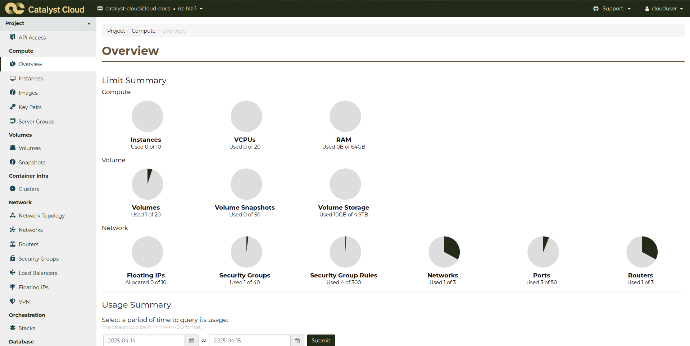

.. _cloud-dashboard:

#########
Dashboard
#########

************
Introduction
************

The web dashboard is a simple and convenient way to interact with the Catalyst
Cloud. It can be found at https://dashboard.cloud.catalyst.net.nz.

The dashboard provides a friendly and simplified interface for commonly used
services and functionality available on the Catalyst Cloud. There are however
more advanced features that are only available via the :ref:`Command Line
Interface (CLI) <command-line-interface>` or by interacting with our :ref:`APIs
<apis>`.

.. note::

  When a new feature is introduced to the Catalyst Cloud, it is first exposed
  via a REST API, followed by the Command Line Interface and finally the web
  dashboard. It usually takes a few months for it to reach the dashboard.

The major appeal of using the dashboard is it requires no programming expertise
or familiarity with command line tools. Another advantage is that the dashboard
is accessible from anywhere (not restricted to specific IP addresses like the
APIs).

*******************
Using the dashboard
*******************

There is an assumed level of understanding about the nature of the services you
are interacting with. That said, most users should be able to achieve their
desired outcomes by simply by navigating through and playing around with the
dashboard.

You can see the services provided on the left-hand sidebar. Each service has a
corresponding section in this documentation, with their own guides and
tutorials. If this is your first time interacting with our services, we
recommend you going through our :ref:`first instance tutorial
<launch-first-instance>`.

Some of the dashboard functionality beyond these services are in the buttons
along the top bar. From left to right, they let you:

* Select which project you are working on;
* Change what region your operating in;
* Access our support functions;
* Change accounts or access your account settings.

***
FAQ
***

Please refer to the FAQ items listed below before raising a support request for
the web dashbaord:

.. toctree::
   :maxdepth: 2

   dashboard/faq
