#############################
Launching your first instance
#############################

********
Overview
********

This section will demonstrate how to build an Ubuntu 14.04 server in an empty
OpenStack tenant. After you have completed the steps you will be able to log
on to the server via ssh from anywhere on the internet using an ssh key.

This section assumes that you have already setup a Catalyst Cloud account and
have been assigned a tenant and a user in that tenant who has permissions to
create the required resources.

We will document the steps required to get an instance setup, the steps are:

1. Create a Network and Subnet
2. Create a Router
3. Upload an SSH keypair
4. Launch an instance
5. Create a security group
6. Associate a floating ip
7. Log in to your instance

There are a number of different ways to provision resources on the Catalyst
Cloud. We will show you how to complete these steps using the dashboard and the
command line tools. If you are starting out it will be easiest to use the
dashboard. As you become more familiar with the Catalyst Cloud it is worth
learning how to provision resources programmatically.

You are free to use whichever method suits you, you can use these methods in
isolation or they can be combined. If you do not use the dashboard to launch
the compute instance, it can still be useful to make use of it to verify the
stack that you have created via another method.

Network Requirements
====================

Before launching an instance, it is necessary to have some network resources in
place. These may have already been created for you. In this documentation we
are going to assume your are starting from an un-configured tenant so we will
be demonstrating how to set these up from scratch.

The requirements are:

* A Network
* A Subnet with addressing and DHCP/DNS servers configured
* A Router with a gateway set and an interface in a virtual network

Catalyst operate a number of recursive DNS servers in each cloud region for
use by Catalyst Cloud instances, free of charge. They are:

+----------+------------------------------------------------+
|  Region  | DNS Servers                                    |
+==========+================================================+
| nz-por-1 | 202.78.247.197, 202.78.247.198, 202.78.247.199 |
+----------+------------------------------------------------+
| nz_wlg_2 | 202.78.240.213, 202.78.240.214, 202.78.240.215 |
+----------+------------------------------------------------+

When creating a router and network/subnet keep any network requirements in mind
when choosing addressing for your networks. You may want to build a tunnel-mode
VPN in the future to connect your OpenStack private network to another private
network. Choosing a unique subnet now will ensure you will not experience
collisions that require renumbering in the future.

Compute Flavors
===============

The flavor of an instance is the CPU, memory and disk specifications of a
compute instance. Catalyst flavors are named 'cX.cY.cZ', where X is the
'compute generation', Y is the number of vCPUs, and Z is the number of
gigabytes of memory.

.. note::

  Flavour names are identical across all regions, but the flavour IDs will
  vary.

Operating System Images
=======================

In order to create an instance, you will need to have a pre-built operating
system in the form of an Image.  Images are stored in the Image service
(Glance). The Catalyst Cloud provide a set of images for general use and also
allows you to upload your own images.

.. note::

 Image IDs for the same operating system will be different in each region.
 Further, images are periodically updated receiving new IDs over time. You
 should always look up for an image based on its name and then retrieve the ID
 for it.

Uploading an SSH key
====================

When an instance is created, OpenStack will pass an ssh key to the instance
which can be used for shell access. By default, Ubuntu will install this key
for the 'ubuntu' user. Other operating systems have different default users.

Tip: name you key using information like the username and host on which the ssh
key was generated so that it is easy to identify later.

Keypairs must be created in each region being used.

Floating IPs
============

In order to connect to our instance, we will need to allocate a floating IP
to the instance. Alternately, one could create a VPN and save some money by
avoiding floating IPs altogether. VPNs are not feasible when the instance
will be offering a service to the greater internet.

************************************************
Launching your first instance from the dashboard
************************************************

Log in to the dashboard at https://dashboard.cloud.catalyst.net.nz/

Creating the required network elements
======================================

We need to create a router and network/subnet.

Navigate to the "Routers" section and click "Create Router":

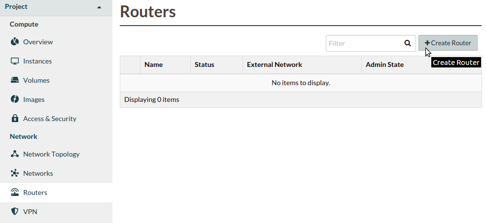

Give the router a name:

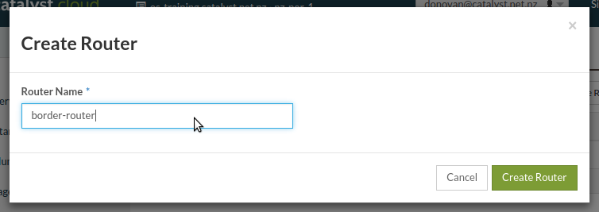

Set a gateway for the router:

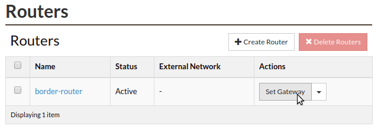

Select ``public-net`` as the external network:

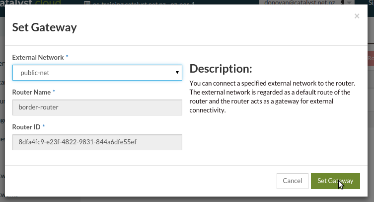

Navigate to the "Networks" section and click "Create Network":

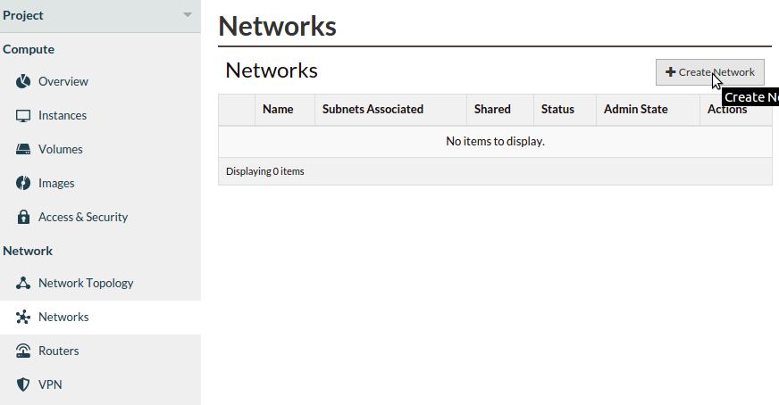

Choose a name for your network:

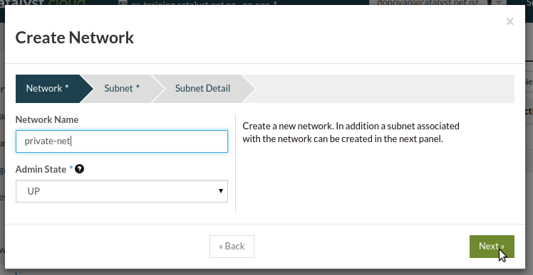

Choose an address for your subnet (CIDR notation):

.. image:: _static/fi-network-address.png
   :align: center

Specify additional attributes for the subnet including enabling DHCP,
specifying the DNS servers for your region and optionally defining an
allocation pool:

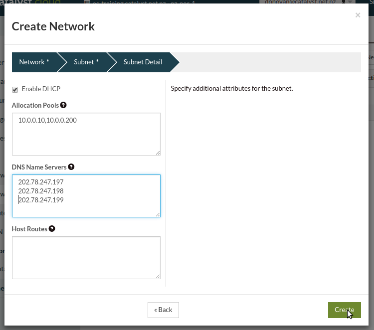

Click on the router name in the router list:

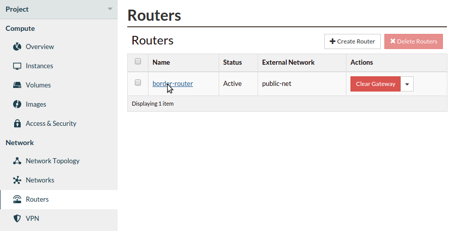

Now add an interface:

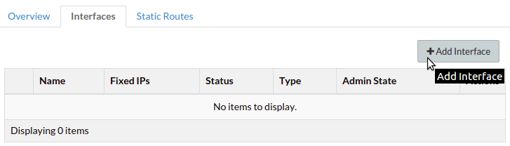

Select the correct subnet:

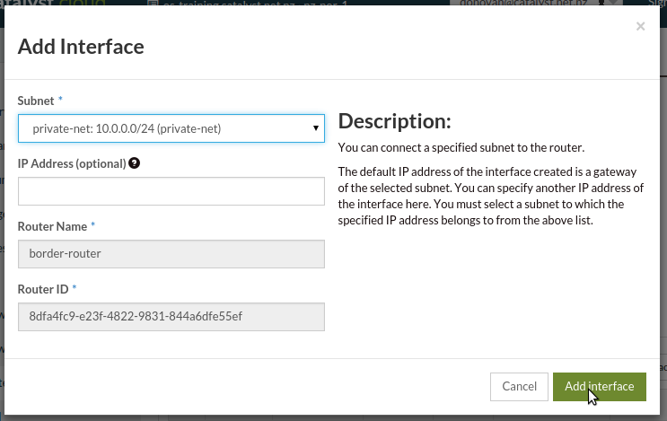

You should now have a network topology this looks like this:

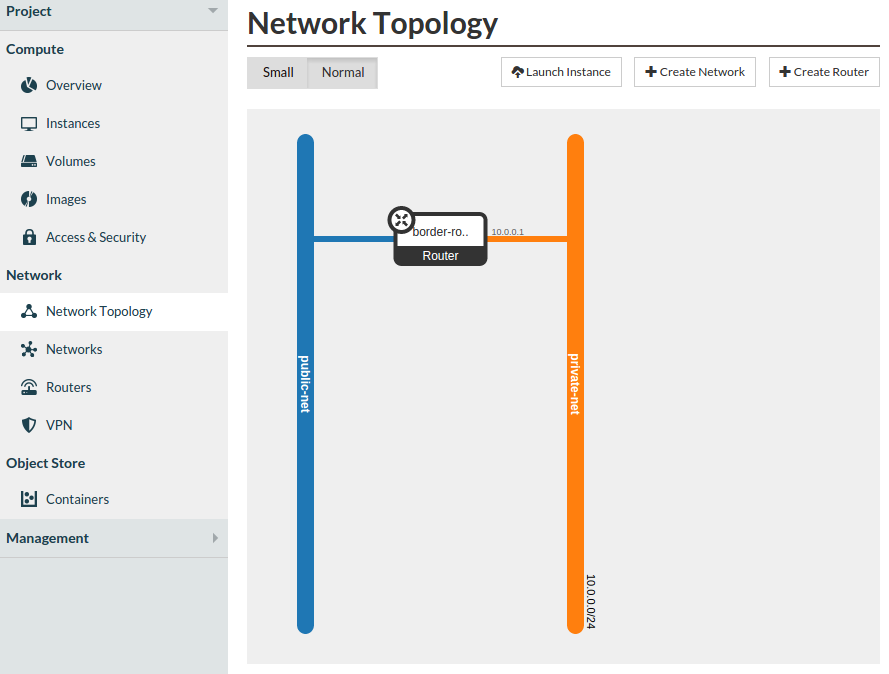

Uploading an SSH key
====================

You can either import an existing public key or have OpenStack create a key for
you, we document how to import an existing key here.

Select "Import Key Pair":

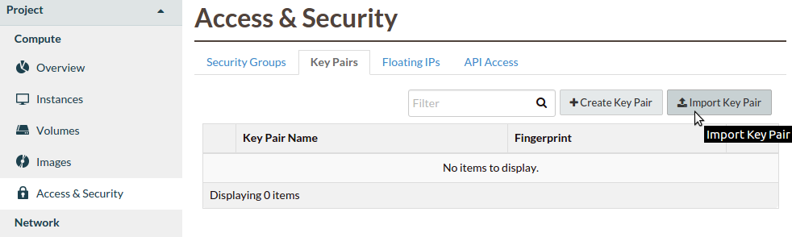

Enter your key pair name and paste your public key into the box:

.. image:: _static/fi-key-pair-import-2.png
   :align: center

Booting an Instance
===================

We are now ready to launch our first instance, select launch instance from the
instances list:

.. image:: _static/fi-instance-launch.png
   :align: center

Select an instance name and a flavour, use the default instance count of one.
Select "Boot from image", then select the ``ubuntu-14.04`` image, use the
defaults for the remaining selections. Then select the "Access & Security" tab:

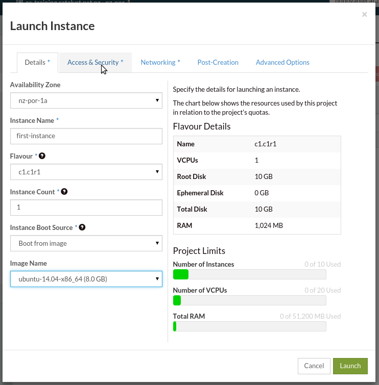

Select the key pair that you uploaded in the previous section and the default
security group. Then select the "Networking" tab.

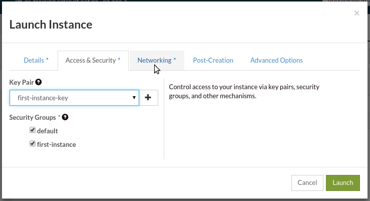

Confirm that ``private-net`` is in the selected networks and click Launch.

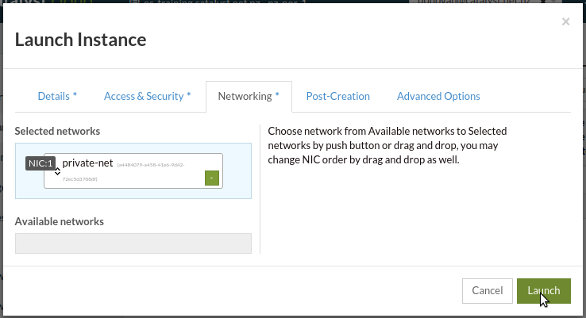

Your instance will now be built, you will see the Status, Task and Power State
change during this process which will take a few seconds. When the process is
complete the status will be "Active". We now have a running instance but there
are a few more steps required before we can login.

Allocate a Floating IP
======================

To associate a floating IP you need to navigate to the "Floating IPs" tab of
the "Access & Security" section.

If you do not have an IP allocated, first click on "Allocate IP to Project" to
obtain a public IP. Then, select an IP that is not currently mapped and click
on "Associate":

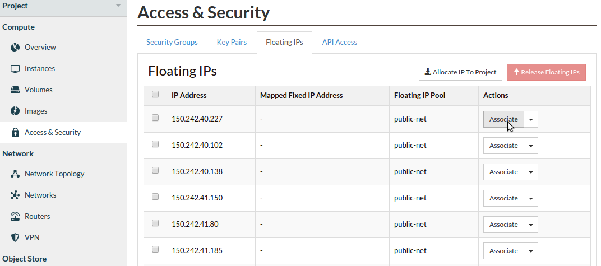

Select the port you wish to be associated with the floating IP. Ports are
equivalent to virtual network interfaces of compute instances, and are named
after the compute instance that owns it.

In this example, select the "first-instance" port and click "Associate":

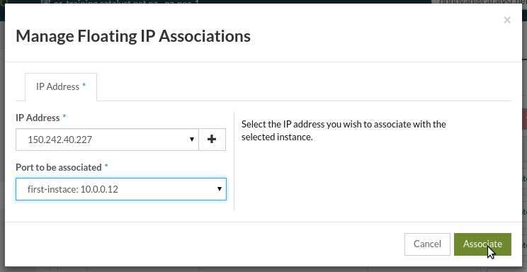

Configure Instance Security Groups
==================================

At this point, the instance is on the Internet with a routable IP address, but
you will not be able to reach it due to security group restrictions (which are
akin to a virtual firewall).

Instances are put in the 'default' security group. When unchanged, the default
security group allows all egress (outbound) traffic, but will drop all ingress
(inbound) traffic. In order to allow inbound access to our instance via ssh a
security group rule is required. Navigate to the "Access & Security" section
and click on "Manage Rules":

.. image:: _static/fi-security-group-rules-manage.png
   :align: center

Click on "Add Rule":

.. image:: _static/fi-security-group-rule-add.png
   :align: center

Enter 22 for the port number (this is the tcp port the ssh service listens on).
You can use the default values for the remainder of the options. Click "Add":

.. image:: _static/fi-security-group-rule-add-add.png
   :align: center

.. warning::

  Note that by using the CIDR 0.0.0.0/0 as a remote, you are allowing access
  from any IP to your compute instance on the port and protocol selected. This
  is often desirable when exposing a web server (eg: allow HTTP and HTTPs
  access from the Internet), but is insecure when exposing other protocols,
  such as SSH, Telnet and FTP. We strongly recommend you to limit the exposure
  of your compute instances and services to IP addresses or subnets that are
  trusted.

Connect to the new Instance
===========================

We can now connect to the ssh service using the floating public IP that we
associated with our instance earlier. This address is visible in the Instances
list or under the Floating IPs tab in Access & Security.

.. code-block:: bash

 $ ssh ubuntu@PUBLIC_IP

You should be able to interact with this instance as you would any Ubuntu
server.

***************************************************
Launching your first instance from the command line
***************************************************

This section assumes you have installed the OpenStack command line tools and
sourced an openrc file, as explained in :ref:`command-line-tools`.

.. note::

 This documentation references resource ids and nameservers like ``SUBNET_ID``
 and ``NAMESERVER_3``. When using these values in commands you will need to
 substitute the real id or nameserver address.

Creating the required network elements
======================================

Lets create a router and network/subnet:

.. code-block:: bash

 $ neutron router-create border-router
 Created a new router:
 +-----------------------+--------------------------------------+
 | Field                 | Value                                |
 +-----------------------+--------------------------------------+
 | admin_state_up        | True                                 |
 | external_gateway_info |                                      |
 | id                    | ROUTER_ID                            |
 | name                  | border-router                        |
 | status                | ACTIVE                               |
 | tenant_id             | TENANT_ID                            |
 +-----------------------+--------------------------------------+

 $ neutron router-gateway-set border-router public-net
 Set gateway for router border-router

 $ neutron net-create  10.0.0.0/24
 Created a new network:
 +----------------+--------------------------------------+
 | Field          | Value                                |
 +----------------+--------------------------------------+
 | admin_state_up | True                                 |
 | id             | NETWORK_ID                           |
 | name           | 10.0.0.0/24                          |
 | shared         | False                                |
 | status         | ACTIVE                               |
 | subnets        |                                      |
 | tenant_id      | TENANT_ID                            |
 +----------------+--------------------------------------+

 $ neutron subnet-create --name 10.0.0.0/24 --allocation-pool \
   start=10.0.0.10,end=10.0.0.200 --dns-nameserver NAMESERVER_1 \
   --dns-nameserver NAMESERVER_2 --dns-nameserver NAMESERVER_3 \
   --enable-dhcp 10.0.0.0/24 10.0.0.0/24
 Created a new subnet:
 +------------------+---------------------------------------------+
 | Field            | Value                                       |
 +------------------+---------------------------------------------+
 | allocation_pools | {"start": "10.0.0.10", "end": "10.0.0.200"} |
 | cidr             | 10.0.0.0/24                                 |
 | dns_nameservers  | NAMESERVER_1                                |
 |                  | NAMESERVER_2                                |
 |                  | NAMESERVER_3                                |
 | enable_dhcp      | True                                        |
 | gateway_ip       | 10.0.0.1                                    |
 | host_routes      |                                             |
 | id               | SUBNET_ID                                   |
 | ip_version       | 4                                           |
 | name             | 10.0.0.0/24                                 |
 | network_id       | NETWORK_ID                                  |
 | tenant_id        | TENANT_ID                                   |
 +------------------+---------------------------------------------+

 $ neutron router-interface-add border-router 10.0.0.0/24
 Added interface INTERFACE_ID to router border-router.

Choosing a Flavor
=================

The flavor of an instance is the disk, cpu, and memory specifications of an
instance.  Use 'nova flavor-list' to get a list.  Catalyst flavors are named
'cX.cY.cZ', where X is the 'compute generation', Y is the number of vCPUs,
and Z is the number of gigabytes of memory. ::

 $ nova flavor-list
 +--------------------------------------+------------------+-----------+------+-----------+------+-------+-------------+-----------+
 | ID                                   | Name             | Memory_MB | Disk | Ephemeral | Swap | VCPUs | RXTX_Factor | Is_Public |
 +--------------------------------------+------------------+-----------+------+-----------+------+-------+-------------+-----------+
 | 01b42bbc-347f-43e8-9a07-0a51105a5527 | c1.c8r8          | 8192      | 10   | 0         |      | 8     | 1.0         | True      |
 | 0c7dc485-e7cc-420d-b118-021bbafa76d7 | c1.c2r8          | 8192      | 10   | 0         |      | 2     | 1.0         | True      |
 | 1750075c-cd8a-4c87-bd06-a907db83fec6 | c1.c1r2          | 2048      | 10   | 0         |      | 1     | 1.0         | True      |
 | 1d760238-67a7-4415-ab7b-24a88a49c117 | c1.c8r32         | 32768     | 10   | 0         |      | 8     | 1.0         | True      |
 | 3931e022-24e7-4678-bc3f-ee86ec129819 | c1.c1r1          | 1024      | 8    | 0         |      | 1     | 1.0         | True      |
 | 45060aa3-3400-4da0-bd9d-9559e172f678 | c1.c4r8          | 8192      | 10   | 0         |      | 4     | 1.0         | True      |
 | 4efb43da-132e-4b50-a9d9-b73e827938a9 | c1.c2r16         | 16384     | 10   | 0         |      | 2     | 1.0         | True      |
 | 62473bef-f73b-4265-a136-e3ae87e7f1e2 | c1.c4r4          | 4096      | 10   | 0         |      | 4     | 1.0         | True      |
 | 746b8230-b763-41a6-954c-b11a29072e52 | c1.c1r4          | 4096      | 10   | 0         |      | 1     | 1.0         | True      |
 | 7b74c2c5-f131-4981-90ef-e1dc1ae51a8f | c1.c8r16         | 16384     | 10   | 0         |      | 8     | 1.0         | True      |
 | a197eac1-9565-4052-8199-dfd8f31e5553 | c1.c8r4          | 4096      | 10   | 0         |      | 8     | 1.0         | True      |
 | a80af444-9e8a-4984-9f7f-b46532052a24 | c1.c4r2          | 2048      | 10   | 0         |      | 4     | 1.0         | True      |
 | b152339e-e624-4705-9116-da9e0a6984f7 | c1.c4r16         | 16384     | 10   | 0         |      | 4     | 1.0         | True      |
 | b4a3f931-dc86-480c-b7a7-c34b2283bfe7 | c1.c4r32         | 32768     | 10   | 0         |      | 4     | 1.0         | True      |
 | c093745c-a6c7-4792-9f3d-085e7782eca6 | c1.c2r4          | 4096      | 10   | 0         |      | 2     | 1.0         | True      |
 | e3feb785-af2e-41f7-899b-6bbc4e0b526e | c1.c2r2          | 2048      | 10   | 0         |      | 2     | 1.0         | True      |
 +--------------------------------------+------------------+-----------+------+-----------+------+-------+-------------+-----------+

Let's make a small c1.c1r1 instance. (id: 3931e022-24e7-4678-bc3f-ee86ec129819)

.. note::
 These IDs will be different in each region.

Choosing an Image
=================

In order to create an instance, you will need to have a pre-built Operating
System in the form of an Image.  Images are stored in the Glance service.
Catalyst provide a set of images for general use.  If none of those are
sufficient, custom images can be uploaded to Glance by anyone. Here is an
example of how to locate a suitable image.

.. code-block:: bash

 $ glance image-list --owner 94b566de52f9423fab80ceee8c0a4a23 --is-public True
 +--------------------------------------+-----------------------+-------------+------------------+------------+--------+
 | ID                                   | Name                  | Disk Format | Container Format | Size       | Status |
 +--------------------------------------+-----------------------+-------------+------------------+------------+--------+
 | db7bff4e-0e9c-46e3-8284-341464132492 | centos-7.0-x86_64     | raw         | bare             | 8589934592 | active |
 | 05cfb4f0-b2a8-411a-8d57-c3317e6c31be | cirros-0.3.1-x86_64   | raw         | bare             | 41126400   | active |
 | f5b1388b-107e-4c91-8e84-8371e4bf3672 | coreos-494.4.0-x86_64 | raw         | bare             | 9116319744 | active |
 | 0368593a-60ef-48a3-885a-add8dfefe569 | ubuntu-14.04-x86_64   | raw         | bare             | 2361393152 | active |
 +--------------------------------------+-----------------------+-------------+------------------+------------+--------+

Let's use the ubuntu image for to create this instance.
(id: 0368593a-60ef-48a3-885a-add8dfefe569)  Note: These IDs will be different
in each region. Further, images are periodically updated.  The ID of an Ubuntu
image will change over time.

.. _uploading-an-ssh-key:

Uploading an SSH key
====================

When an instance is created, OpenStack pass an ssh key to the instance
which can be used for shell access.  By default, Ubuntu will install
this key for the 'ubuntu' user.  Other operating systems behave differently.
Use 'nova keypair-add' to upload your Public SSH key.

.. tip::
 You can name your key using information like the username and host on which the ssh key
 was generated so that it is easy to identify later.

.. code-block:: bash

 $ nova keypair-add --pub-key ~/.ssh/id_rsa.pub username-hostname
 $ nova keypair-list
 +-------------------+-------------------------------------------------+
 | Name              | Fingerprint                                     |
 +-------------------+-------------------------------------------------+
 | username-hostname | 8c:fb:ca:fd:1e:a8:90:8b:a4:a7:fb:17:7c:cc:3c:5c |
 +-------------------+-------------------------------------------------+

.. note::
 These keypairs must be created in each region being used.

Choosing a Network
==================

Use Neutron to locate the correct network to use.

.. code-block:: bash

 $ neutron net-list
 +--------------------------------------+------------+--------------------------+
 | id                                   | name       | subnets                  |
 +--------------------------------------+------------+--------------------------+
 | PUBLIC_NETWORK_ID                    | public-net | PUBLIC_SUBNET_ID         |
 | MY_NETWORK_ID                        | mynetwork  | MY_SUBNET_ID 10.0.0.0/24 |
 +--------------------------------------+------------+--------------------------+

The 'public-net' is used by routers to access the Internet.  Instances
may not be booted on this network.  Let's use mynetwork to boot our instance (id: MY_NETWORK_ID).

.. note::
 These IDs will be different in each region.

Booting an Instance
===================

Use the 'nova boot' command and supply the information we gathered in previous
steps, being sure to replace FLAVOR, IMAGE, KEY_NAME, MY_NETWORK_ID, and
INSTANCE_NAME with appropriate values.

.. code-block:: bash

 $ nova boot --flavor FLAVOR --image IMAGE --key-name KEY_NAME --nic net-id=MY_NETWORK_ID INSTANCE_NAME

After issuing that command, details about the new Instance, including its id
will be provided. ::

 +--------------------------------------+------------------------------------------------------------+
 | Property                             | Value                                                      |
 +--------------------------------------+------------------------------------------------------------+
 | OS-DCF:diskConfig                    | MANUAL                                                     |
 | OS-EXT-AZ:availability_zone          | nova                                                       |
 | OS-EXT-STS:power_state               | 0                                                          |
 | OS-EXT-STS:task_state                | scheduling                                                 |
 | OS-EXT-STS:vm_state                  | building                                                   |
 | OS-SRV-USG:launched_at               | -                                                          |
 | OS-SRV-USG:terminated_at             | -                                                          |
 | accessIPv4                           |                                                            |
 | accessIPv6                           |                                                            |
 | adminPass                            | ADMIN_PASS                                                 |
 | config_drive                         |                                                            |
 | created                              | 2015-01-14T21:16:28Z                                       |
 | flavor                               | c1.c1r1 (FLAVOR_ID)                                        |
 | hostId                               |                                                            |
 | id                                   | INSTANCE_ID                                                |
 | image                                | ubuntu-14.04-x86_64 (IMAGE_ID)                             |
 | key_name                             | username-hostname                                          |
 | metadata                             | {}                                                         |
 | name                                 | INSTANCE_NAME                                              |
 | os-extended-volumes:volumes_attached | []                                                         |
 | progress                             | 0                                                          |
 | security_groups                      | default                                                    |
 | status                               | BUILD                                                      |
 | tenant_id                            | TENANT_ID                                                  |
 | updated                              | 2015-01-14T21:16:28Z                                       |
 | user_id                              | USER_ID                                                    |
 +--------------------------------------+------------------------------------------------------------+

Note that the status is 'BUILD.'  Catalyst Cloud instances build very
quickly, but it still takes a few seconds.  Wait a few seconds and ask for
the status of this instance using the ID or name (if unique) of this
instance.

.. code-block:: bash

 $ nova show INSTANCE_ID
 +--------------------------------------+------------------------------------------------------------+
 | Property                             | Value                                                      |
 +--------------------------------------+------------------------------------------------------------+
 | OS-DCF:diskConfig                    | MANUAL                                                     |
 | OS-EXT-AZ:availability_zone          | nz-por-1a                                                  |
 | OS-EXT-STS:power_state               | 1                                                          |
 | OS-EXT-STS:task_state                | -                                                          |
 | OS-EXT-STS:vm_state                  | active                                                     |
 | OS-SRV-USG:launched_at               | 2015-01-14T21:16:49.000000                                 |
 | OS-SRV-USG:terminated_at             | -                                                          |
 | accessIPv4                           |                                                            |
 | accessIPv6                           |                                                            |
 | config_drive                         |                                                            |
 | created                              | 2015-01-14T21:16:28Z                                       |
 | flavor                               | c1.c1r1 (FLAVOR_ID)                                        |
 | hostId                               | HOSTID                                                     |
 | id                                   | INSTANCE_ID                                                |
 | image                                | ubuntu-14.04-x86_64 (IMAGE_ID)                             |
 | key_name                             | username-key                                               |
 | metadata                             | {}                                                         |
 | name                                 | INSTANCE_NAME                                              |
 | os-extended-volumes:volumes_attached | []                                                         |
 | progress                             | 0                                                          |
 | security_groups                      | default                                                    |
 | status                               | ACTIVE                                                     |
 | tenant_id                            | TENANT_ID                                                  |
 | testing network                      | 10.0.0.6                                                   |
 | updated                              | 2015-01-14T21:16:49Z                                       |
 | user_id                              | USER_ID                                                    |
 +--------------------------------------+------------------------------------------------------------+

Allocate a Floating IP
======================

In order to connect to our instance, we will need to allocate a floating IP to
the instance. Use the id of public-net (found via 'neutron net-list') and
request a new floating IP.

.. code-block:: bash

 $ neutron floatingip-create PUBLIC_NETWORK_ID
 Created a new floatingip:
 +---------------------+----------------------------+
 | Field               | Value                      |
 +---------------------+----------------------------+
 | fixed_ip_address    |                            |
 | floating_ip_address | PUBLIC_IP                  |
 | floating_network_id | PUBLIC_NETWORK_ID          |
 | id                  | FLOATING_IP_ID             |
 | port_id             |                            |
 | router_id           |                            |
 | status              | DOWN                       |
 | tenant_id           | TENANT_ID                  |
 +---------------------+----------------------------+

Now, get the port id of the instance's interface and associate the floating ip
with it.

.. code-block:: bash

 $ nova interface-list INSTANCE_NAME
 +------------+-------------+-----------------+--------------+-------------------+
 | Port State | Port ID     | Net ID          | IP addresses | MAC Addr          |
 +------------+-------------+-----------------+--------------+-------------------+
 | ACTIVE     | PORT_ID     | MY_NETWORK_ID   | 10.0.0.6     | fa:16:3e:0c:89:14 |
 +------------+-------------+-----------------+--------------+-------------------+

 $ neutron floatingip-associate FLOATING_IP_ID PORT_ID
 Associated floating IP FLOATING_IP_ID

Configure Instance Security Groups
==================================

At this point, the instance is on the Internet, with a routable IP address of
PUBLIC_IP.  By default, instances are put in the 'default' security group.
By default, this security group will drop all inbound traffic.  A security
group rule is required if inbound access is desired.

.. code-block:: bash

 $ neutron security-group-list
 +--------------------+-------------+--------------+
 | id                 | name        | description  |
 +--------------------+-------------+--------------+
 | SECURITY_GROUP_ID  | default     | default      |
 +--------------------+-------------+--------------+
 $ neutron security-group-rule-create --direction ingress \
   --protocol tcp --port-range-min 22 --port-range-max 22 \
   --remote-ip-prefix YOUR_CIDR_NETWORK SECURITY_GROUP_ID

If you are unsure of what YOUR_CIDR_NETWORK should be, ask your network admin,
or visit http://ifconfig.me and get your IP address.  Use "IP_ADDRESS/32" as
YOUR_CIDR_NETWORK to allow traffic only from your current effective IP.

Connect to the new Instance
===========================

This should be as easy as:

.. code-block:: bash

 $ ssh ubuntu@PUBLIC_IP
