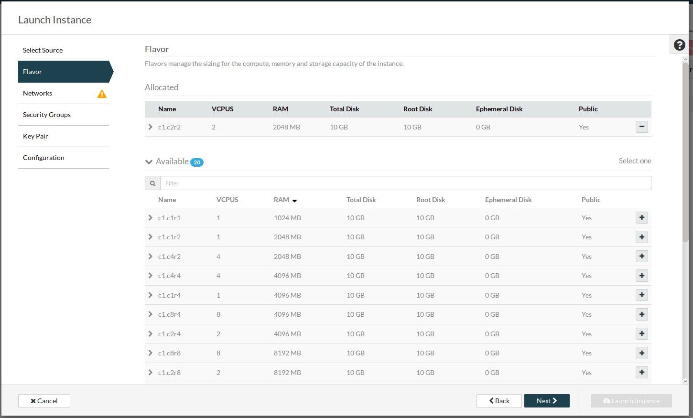

****************************************
Windows instance using the web interface
****************************************

Log in to the dashboard at https://dashboard.cloud.catalyst.net.nz/

As a new user to the Catalyst Cloud your initial cloud project will come with a pre-configured
private network and a router connected to the internet. If you have deleted this, or would like to
create additional networks then please see :ref:`creating_networks` for details on how to do that.

Otherwise, let's proceed with building your first instance.

Configure Instance Security Group
=================================

We need to create a security group and rule for our instance.

Navigate to the "Security Groups" tab of the "Access & Security" section and
click "Create Security Group":

.. image:: ../_static/fi-security-group-create-1.png
   :align: center

Enter a name and description and click "Create Security Group":

.. image:: ../_static/fi-security-group-create-2.png
   :align: center

Now click on "Manage Rules" for the group we have created:

.. image:: ../_static/fi-security-group-rules-manage.png
   :align: center

Click on “Add Rule”:

.. image:: ../_static/fi-security-group-rule-add.png
   :align: center

Create a rule to allow RDP access. This can be selected from the Rule drop down
menu, leave the defaults for the other fields. Click "Add".

.. image:: ../_static/fi-rdp-rule.png

|

.. warning::

  Note that by using the CIDR 0.0.0.0/0 as a remote, you are allowing access
  from any IP to your compute instance on the port and protocol selected. This
  is often desirable when exposing a web server (eg: allow HTTP and HTTPs
  access from the Internet), but is insecure when exposing other protocols,
  such as SSH, Telnet and FTP. We strongly recommend you to limit the exposure
  of your compute instances and services to IP addresses or subnets that are
  trusted.

Booting an Instance
===================

We are now ready to launch our first instance, select launch instance from the
instances list:

.. image:: ../_static/fi-instance-launch.png
   :align: center

When creating a windows instance you need to select the
``windows-server-2012r2-x86_64`` image from the image list first, then select
"Yes" to create new volume.  An alert symbol will appear alongside the Size(GB)
selector.  If you hover the mouse on this it will show the minimum size of the
volume required to host the windows image.  Set an appropriate volume size,
select "No" to Delete Volume on Terminate then click "Next".

.. image:: ../_static/fi-windows-volume.png
   :align: center

For a windows instance the recommended minimum flavor is ``c1.c2r2``, select
this from the list and click "Next":

Select the ``private-net`` network from the list and click "Next":

.. image:: ../_static/fi-launch-instance-networks.png
   :align: center

Select the ``first-instance-sg`` security group from the list and click "Next":

.. image:: ../_static/fi-launch-instance-security-groups.png
   :align: center

No key pair is required for a windows instance, click "Next":

Your instance will now be built, you will see the Status, Task and Power State
change during this process which will take a few seconds. When the process is
complete the status will be "Active". We now have a running instance but there
are a few more steps required before we can login.

Allocate a Floating IP
======================

To associate a floating IP you need to navigate to the "Floating IPs" tab of
the "Access & Security" section.

If you do not have an IP allocated, first click on "Allocate IP to Project" to
obtain a public IP. Then, select an IP that is not currently mapped and click
on "Associate":

.. image:: ../_static/fi-floating-ip.png
   :align: center

Select the port you wish to be associated with the floating IP. Ports are
equivalent to virtual network interfaces of compute instances, and are named
after the compute instance that owns it.

In this example, select the "first-instance" port and click "Associate":

.. image:: ../_static/fi-floating-ip-associate.png
   :align: center

Connect to the new Instance
===========================
First you need to set the Administrator password. To do this go to the
"Instances" section, click on first-instance under "Instance Name" and select
the "Console" tab.

Once the following screen loads, click on OK to continue.

.. image:: ../_static/fi-windows-login.png

You will then be prompted by the following screen to create a new administator
password.

.. image:: ../_static/fi-windows-login-2.png

Once this step has been completed it will be possible to connect to this
instance with an RDP application via the floating public IP that we
associated with our instance in the previous step. This address is visible in
the Instances list or under the Floating IPs tab in Access & Security.
