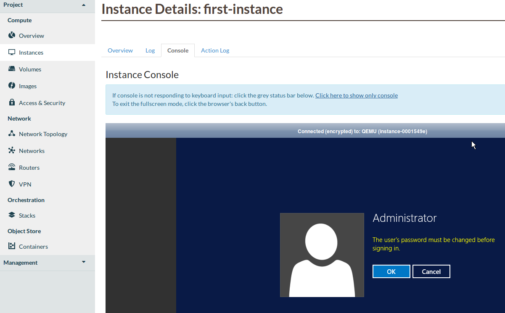

########################################
Windows instance using the web interface
########################################

Log in to the dashboard at https://dashboard.catalystcloud.nz/

As a new user to the Catalyst Cloud, your initial cloud project will come
with a pre-configured private network and a router connected to the internet.
If you have deleted this, or would like to create additional networks then
please see :ref:`creating_networks` for details on how to do that.
In addition, before trying to create a windows instance you should make sure
that a windows image exists on the server you're trying to create and instance
on. At the moment we only have our Windows images on our Porirua server.

Otherwise, let's proceed with building a windows instance.

.. Note::
  Some of the following pictures, have
  files or various servers/security groups etc. That are not standard on the
  catalyst cloud. Do not worry about their absence on your system, they will
  not affect this tutorial.

*********************************
Configure instance security group
*********************************

You will add a security group and a rule for your instance so that it can be
accessed using SSH.

Navigate to the "Security Groups" tab of the left sidebar under the "Network"
section. From there, in the upper right of the screen, click the "Create
Security Group" button.

.. image:: dashboard_assets/windows-dashboard/Security-groups.png
   :align: center

Enter a name and description and click "Create Security Group":

.. image:: dashboard_assets/windows-dashboard/create-security-group.png
   :align: center

For this example we are going to create a rule to allow RDP access.
This can be selected from the rule drop down menu. We will leave the
defaults for the other fields and then click "Add".

.. image:: dashboard_assets/windows-dashboard/Add-rules.png
   :align: center

There is no particular reason that we are using RDP for this example,
this is just to demonstrate how to pick and configure a security group
rule for your instance.

.. warning::

  Note that by using the CIDR 0.0.0.0/0 as a remote, you are allowing access
  from any IP to your compute instance on the port and protocol selected. This
  is often desirable when exposing a web server (eg: allow HTTP and HTTPs
  access from the Internet), but is insecure when exposing other protocols,
  such as RDP, SSH, Telnet and FTP. We strongly recommend you limit the exposure
  of your compute instances and services to IP addresses or subnets that are
  trusted.

*******************
Booting an instance
*******************

We are now ready to launch your first instance. Select launch instance from the
instances list:

.. image:: dashboard_assets/windows-dashboard/instance-overview.png
   :align: center

First thing that we do when creating this instance, is give it a name. For this
example we will use fi-windows.

.. image:: dashboard_assets/windows-dashboard/name-instance-screen.png
   :align: center

When creating a Windows instance you need to select the correct
image from the image list. In this example we are using
``windows-server-2016r2-x86_64``. However this could be any windows
image that is available from the image service on the cloud. The volume
size for our instance should automatically update to what is needed
to run this image.

.. image:: dashboard_assets/windows-dashboard/windows-image.png
   :align: center

Next we pick the flavor.
We recommended a minimum flavor of ``c1.c2r2`` for our Windows instances.
Select this from the list and click "Next":

.. image:: dashboard_assets/windows-dashboard/flavors.png
   :align: center

Select the ``private-net`` network from the list and click "Next":

.. image:: dashboard_assets/windows-dashboard/networks.png
   :align: center

Select the ``first-instance-sg`` security group from the list and click "Next":

.. image:: dashboard_assets/windows-dashboard/instance-security-group.png
   :align: center

No key pair is required for a Windows instance. Click "Next":

It will take a few seconds for your instance to build. You will see the Status,
Task and Power State change during this process. When complete, the status will
be "Active". You now have a running instance, but there are a few more steps
required before you can log in.

**********************
Allocate a floating IP
**********************

In order to be able to access your instance from the internet and not
just use it through the dashboard console, you will need to assign a floating
IP to the instance so that it is visible to other devices.
To associate a floating IP with your instance, you need to navigate to the
"Floating IPs" tab of the "Access & Security" section.

If an IP address has not yet been allocated, click on "Allocate IP to Project"
to obtain a public IP. Then, select an IP that is not currently mapped and
click on "Associate":

.. image:: dashboard_assets/windows-dashboard/floating-ip.png
   :align: center

Select the port you wish to be associated with the floating IP. Ports are
equivalent to virtual network interfaces of compute instances, and are named
after the compute instance that owns them.

In this example, select the "first-instance" port and click "Associate":

.. image:: dashboard_assets/windows-dashboard/manage-floating-ip.png
   :align: center

***************************
Connect to the new instance
***************************

First you must set the Administrator password. To do this, go to the
"Instances" section, click on **first-instance** under "Instance Name"
and select the "Console" tab.

Once the following screen loads, click on OK to continue.

You will then be prompted by the following screen to create a new administrator
password.

.. Note::

  If the console shown in the image above fails to load or you see errors on
  this page please ensure that your local machine and/or corporate firewall is
  allowing the following traffic.

Port information for windows firewall
=====================================

Upon completion of the previous step, it will be possible to connect to the
instance with an RDP application, as we have added the RDP security group rule. 
You can Connect via the floating public IP that you
associated with your instance in the previous step. This address is visible in
the Instances list and under the Floating IPs tab in Access & Security.

port
----

- 6080 (TCP)

for the following Catalyst Cloud API hosts
------------------------------------------

- nz-por-1: 202.78.247.202
- nz-hlz-1: 202.78.244.90
- nz_wlg_2: 202.78.240.218 & 2404:130:20:2::218
