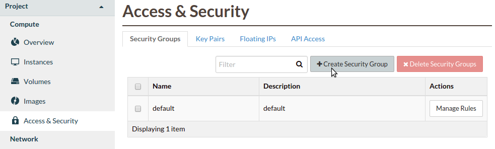
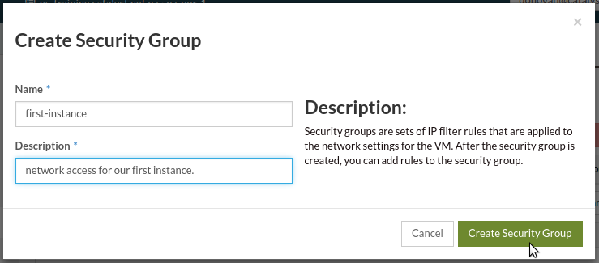
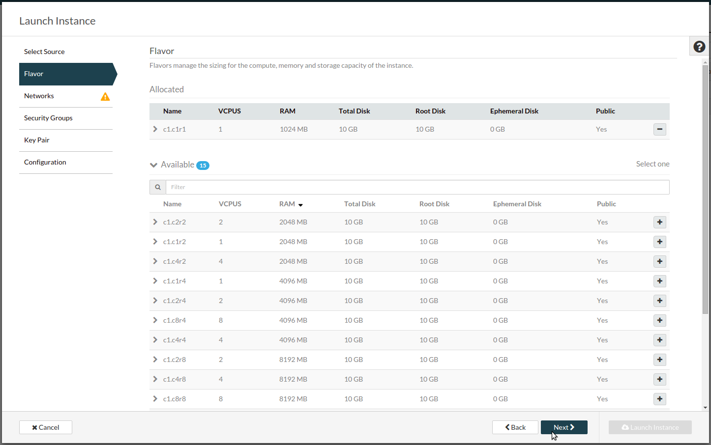
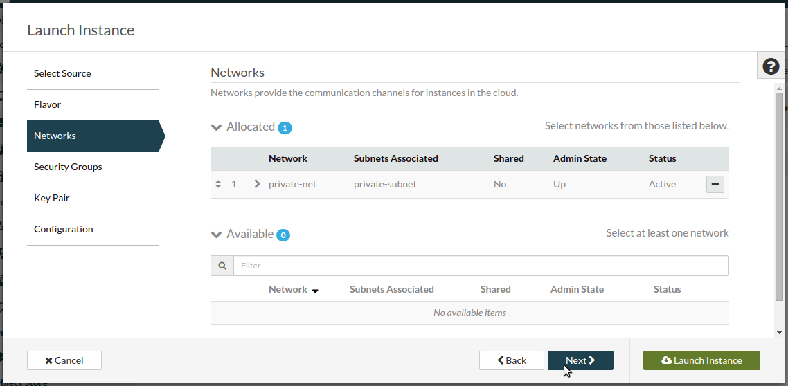
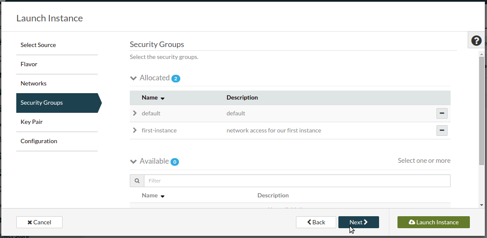
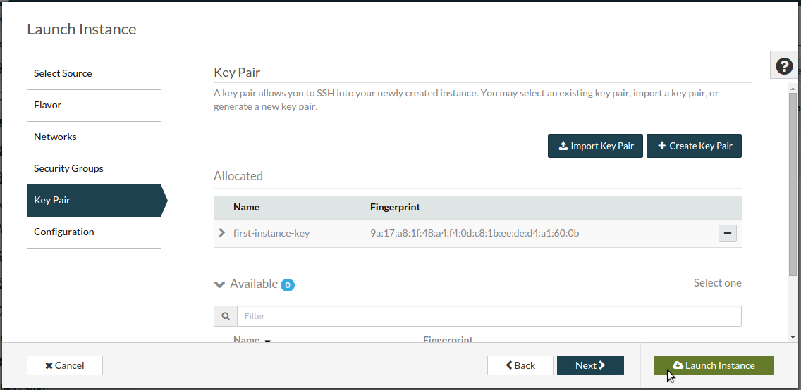

***********************
Using the web interface
***********************

Log in to the dashboard at https://dashboard.cloud.catalyst.net.nz/

Creating the required network elements
======================================

We need to create a router and network/subnet.

Navigate to the "Routers" section and click "Create Router":

.. image:: ../_static/fi-router-create.png
   :align: center

Name the router "border-router", select admin state "UP" and select
"public-net" as the external network:

.. image:: ../_static/fi-router-name.png
   :align: center

Navigate to the "Networks" section and click "Create Network":

.. image:: ../_static/fi-network-create.png
   :align: center

Name your network "private-net", select create subnet and click "Next":

.. image:: ../_static/fi-network-create-name.png
   :align: center

Name your subnet "private-subnet", choose an address for your subnet in CIDR
notation and click "Next":

.. image:: ../_static/fi-network-address.png
   :align: center

Specify additional attributes for the subnet including enabling DHCP,
specifying the :ref:`DNS Name Servers <name_servers>` for your region and
optionally defining an allocation pool:

.. image:: ../_static/fi-network-detail.png
   :align: center

Click on the router name in the router list:

.. image:: ../_static/fi-router-detail.png
   :align: center

Select the "Interfaces" tab and click "+Add Interface":

.. image:: ../_static/fi-router-interface-add.png
   :align: center

Select the correct subnet:

.. image:: ../_static/fi-router-interface-subnet.png
   :align: center

You should now have a network topology this looks like this:

.. image:: ../_static/fi-network-topology.png
   :align: center

Uploading an SSH key
====================

You can either import an existing public key or have OpenStack create a keypair
for you, we document how to import the public key from an existing keypair
here.

Select "Import Key Pair":

.. image:: ../_static/fi-key-pair-import-1.png
   :align: center

Enter your key pair name and paste your public key into the box:

.. image:: ../_static/fi-key-pair-import-2.png
   :align: center

|

.. note::

 The dashboard has two options "Create Key Pair" and "Import Key Pair". When
 you select "Create Key Pair", OpenStack creates a keypair and saves the public
 key while providing the private key to you to download. When you select
 "Import Key Pair" the dashboard provides a form where you can upload a public
 key. This option is somewhat confusingly named as you are importing a public
 key only and not a keypair, it would be more correctly named "Import Public
 Key". See the :ref:`ssh_keypairs` section of the FAQ for more information.

Configure Instance Security Group
=================================

We need to create a security group and rule for our instance.

Navigate to the "Security Groups" tab of the "Access & Security" section and
click "Create Security Group":

Enter a name and description and click "Create Security Group":

Now click on "Manage Rules" for the group we have created:

.. image:: ../_static/fi-security-group-rules-manage.png
   :align: center

Click on “Add Rule”:

.. image:: ../_static/fi-security-group-rule-add.png
   :align: center

Enter 22 for the port number (this is the TCP port the SSH service listens on).
You can use the default values for the remainder of the options. Click "Add":

.. image:: ../_static/fi-security-group-rule-add-add.png
   :align: center

|

.. warning::

  Note that by using the CIDR 0.0.0.0/0 as a remote, you are allowing access
  from any IP to your compute instance on the port and protocol selected. This
  is often desirable when exposing a web server (eg: allow HTTP and HTTPs
  access from the Internet), but is insecure when exposing other protocols,
  such as SSH, Telnet and FTP. We strongly recommend you to limit the exposure
  of your compute instances and services to IP addresses or subnets that are
  trusted.

Booting an Instance
===================

We are now ready to launch our first instance, select launch instance from the
instances list:

.. image:: ../_static/fi-instance-launch.png
   :align: center

Enter an instance name, use the default instance count of one.  Select "Image"
as the boot source and "No" for create new volume. Select the
``ubuntu-14.04-x86_64`` from the image list. Then click "Next":

.. image:: ../_static/fi-launch-instance-source.png
   :align: center

Select the ``c1.c1r1`` flavor from the list and click "Next":

Select the ``private-net`` network from the list and click "Next":

Select the ``first-instance-sg`` security group from the list and click "Next":

Select the ``first-instance-key`` key pair from the list and click "Next":

Your instance will now be built, you will see the Status, Task and Power State
change during this process which will take a few seconds. When the process is
complete the status will be "Active". We now have a running instance but there
are a few more steps required before we can login.

Allocate a Floating IP
======================

To associate a floating IP you need to navigate to the "Floating IPs" tab of
the "Access & Security" section.

If you do not have an IP allocated, first click on "Allocate IP to Project" to
obtain a public IP. Then, select an IP that is not currently mapped and click
on "Associate":

.. image:: ../_static/fi-floating-ip.png
   :align: center

Select the port you wish to be associated with the floating IP. Ports are
equivalent to virtual network interfaces of compute instances, and are named
after the compute instance that owns it.

In this example, select the "first-instance" port and click "Associate":

.. image:: ../_static/fi-floating-ip-associate.png
   :align: center

Connect to the new Instance
===========================

We can now connect to the SSH service using the floating public IP that we
associated with our instance in the previous step. This address is visible in
the Instances list or under the Floating IPs tab in Access & Security.

.. code-block:: bash

 $ ssh ubuntu@PUBLIC_IP

You should be able to interact with this instance as you would any Ubuntu
server.
