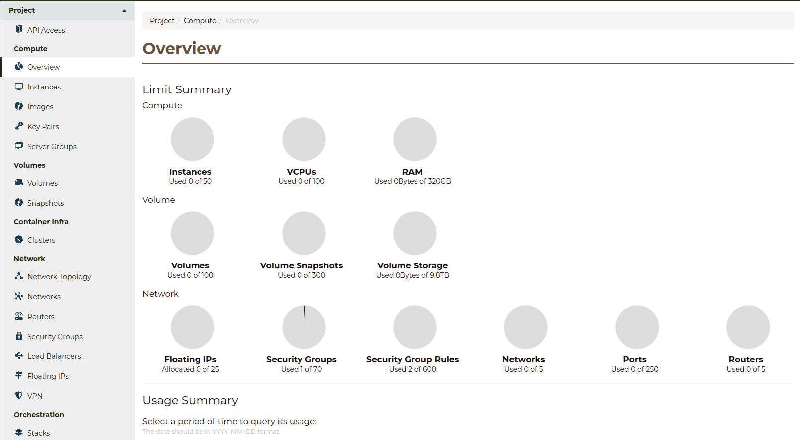

.. _access_to_catalyst_cloud:

###################################
How can I interact with my project?
###################################

In the previous section, we learned about the various services the Catalyst
Cloud offers. Now we'll learn about the various ways you can interact with
these services.

*****************
The web dashboard
*****************

The cloud dashboard is a simple way to interact with
The Catalyst Cloud. It is publicly available on the Internet and can be reached
at: https://dashboard.catalystcloud.nz

Our web dashboard is a great tool that we recommend you have a look at before
progressing. You'll notice on the left hand side the different tabs for
services that are available to you as a user, services like our images, volumes
and networking options. These are all explained in detail later, but getting
used to the layout of the dashboard can give insight into their functionality
too.

For more information on the Dashboard you can view it :ref:`here
<cloud-dashboard>`

**************************
The command line interface
**************************

The command line interface (CLI) is a very powerful, efficient way to interact
with Catalyst Cloud. To use the CLI you will need to:

1. Install the OpenStack CLI.
2. Tell the OpenStack CLI who you are, and which OpenStack cloud you want to
   connect to. This is typically done by sourcing a configuration file that
   sets environment variables to configure the CLI.

You can find instructions on how to install and set up the CLI :ref:`here
<command-line-interface>`. After which, you may want to familiarise yourself
with its functioning by following :ref:`this tutorial
<using-the-command-line-interface>` to use it to deploy a compute instance.

For more in depth documentation, the official OpenStack Client documentation is
the most thorough source of information. You can `find it here
<https://docs.openstack.org/python-openstackclient/latest/>`_.

****************
Automation tools
****************

To utilise the most valuable aspects of cloud computing, or to manage and
orchestrate a cloud computing environment at scale, automation tools are
invaluable. Because Catalyst Cloud is based on the world's most popular open
source cloud computing platform, OpenStack, many automation tools work with the
Catalyst Cloud, or have plugins to work with the Catalyst Cloud.

Among our preferred automation tools are:

- :ref:`Ansible <launching-your-first-instance-using-ansible>`
- :ref:`Puppet <bootstrapping-puppet-from-heat>`
- :ref:`Terraform <launching-your-first-instance-using-terraform>`

**********
API access
**********

Behind the scenes, all of the access methods to the Catalyst Cloud are just
accessing the Catalyst Cloud APIs. They just provide convenient abstractions to
do so. Every action you perform on the Catalyst Cloud can be performed via the
APIs.
This means that you can incorporate custom logic into your applications to
modify your infrastructure. This is important for `SaaS
<https://en.wikipedia.org/wiki/Software_as_a_service>`_ applications, or
applications that otherwise need to scale to meet demand.
To make this integration easier, the OpenStack community has developed a range
of software development kits (SDKs) for numerous languages. You can find a
list `here <https://wiki.openstack.org/wiki/SDKs>`_.

Catalyst Cloud will accept API requests (including those from the Command Line
Interface or Automation tools mentioned above) from anywhere on the Internet.

We limit the rate at which you can make API requests, to ensure that the service
is accessable to everyone equally. If you make too many requests in a short
amount of time, we will send back an HTTP error message (code 429)
indicating you have exceeded the limits. You may need to configure your
software using the API to retry in response to this error message.

|

Now that you understand how you can access the Catalyst Cloud, there are a few
small administrative concerns to be aware of before we continue.

:ref:`Previous page <services_on_the_catalyst_cloud>` - :ref:`Next page
<shared_responsibility_model>`
