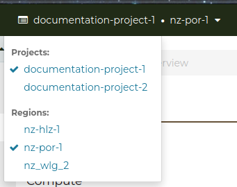
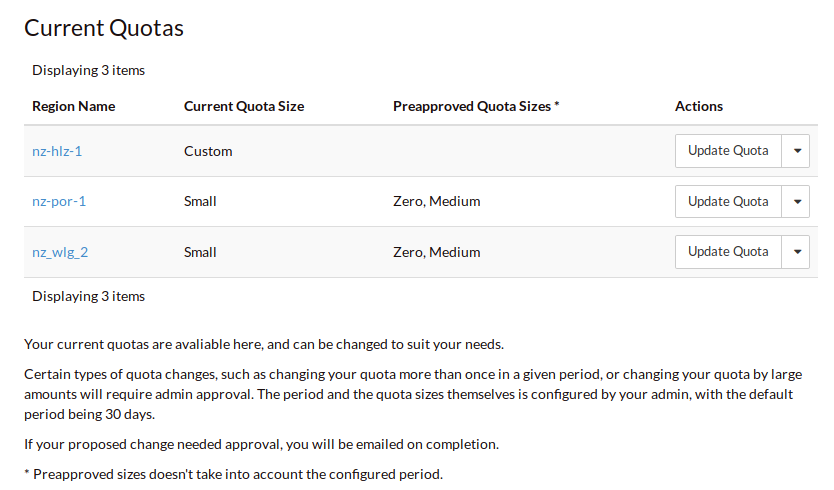
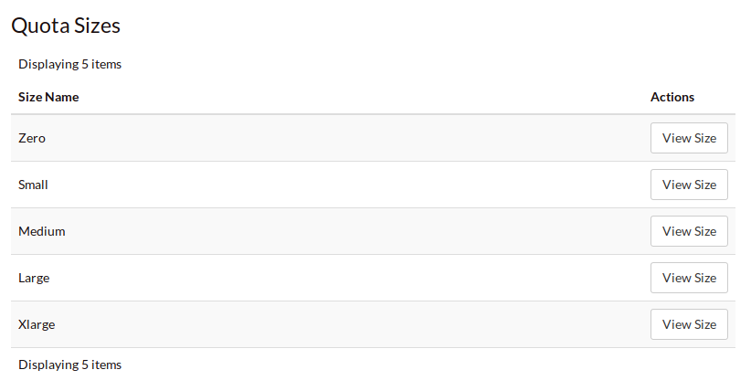
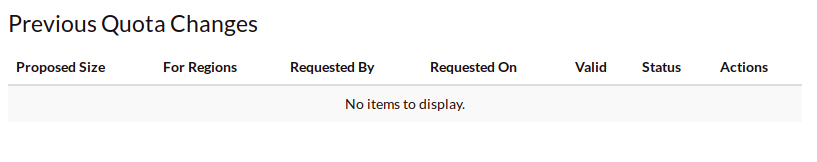
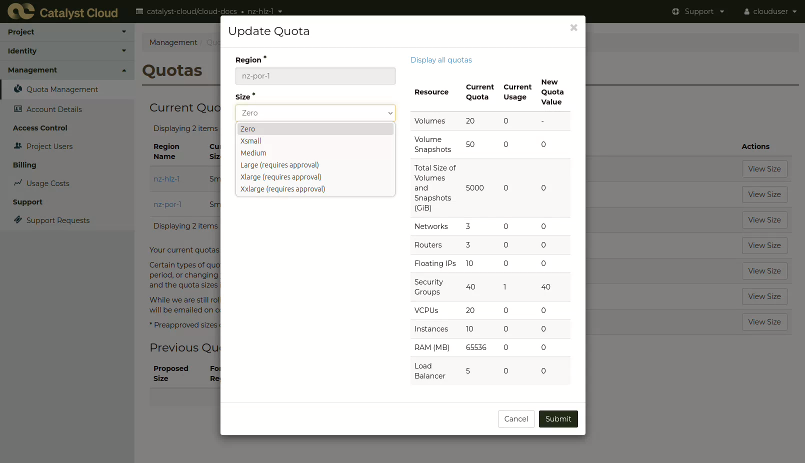
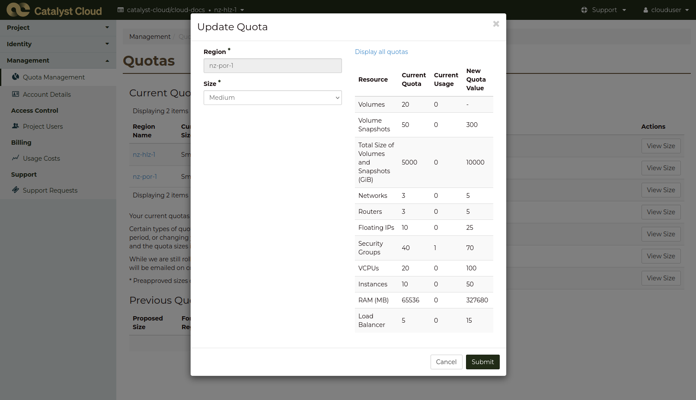
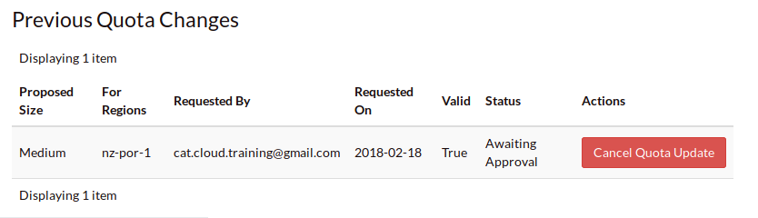
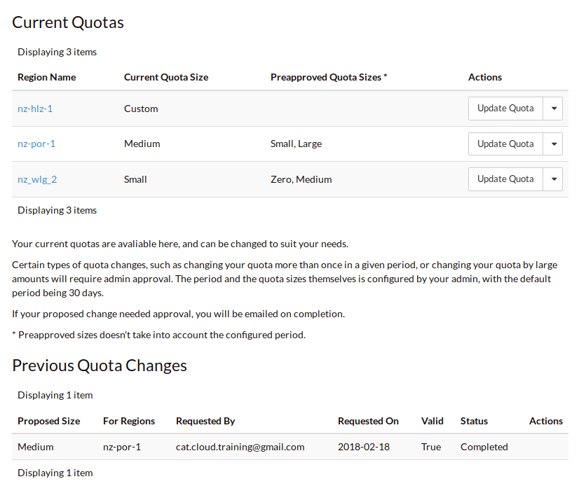
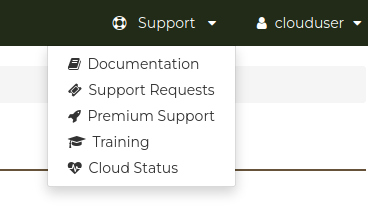

.. _administrating_the_catalyst_cloud:
.. _additional-info:

###############################
Additional info and terminology
###############################

The information below includes different management systems, terminology, and
general information that you will need to get started with your project.
Reading through these should give you an understanding of how to control and
manage your cloud project, as well as boost your current knowledge of the
Catalyst Cloud and how it functions.

.. _admin-projects:

********
Projects
********

Everything you do on the Catalyst Cloud is in a ``project``. Use projects to
separate the different things you work on. For example, have a project for each
organisation you work with, or one for each branch of your organisation.
Something done in one project cannot effect any other projects.

You can change which project you're working in on the dashboard, with the
dropdown in the top left corner.

Information on how to invite new people to your project can be found :ref:`here
<access_control>`.

The Catalyst Cloud provides an isolated and multi-tenanted approach to creating
workspaces. These workspaces are typically referred to as a ``project`` but for
historical reasons you may also see them referred to as a ``tenant`` or
a ``tenancy``.

.. _find-project-id:

Finding my project ID
=====================

Every project on the Catalyst Cloud has a ``project name`` (a user friendly
name) and a ``project id`` (an auto-generated UUID). There are a number of ways
to find your project ID and name.

Via the Dashboard
-----------------

The project ID and name can be found on the `API Access`_ panel by clicking on
the `View Credentials`_ button.

.. _API Access: https://dashboard.catalystcloud.nz/project/api_access/
.. _View Credentials: https://dashboard.catalystcloud.nz/project/api_access/view_credentials/

Via the CLI
-----------

If you are using the OpenStack command line interface you have most likely
sourced an openrc file, as explained in :ref:`command-line-interface`. If this
is the case, you can find your project ID by issuing the following command:

.. code-block:: bash

 $ echo $OS_PROJECT_ID
 1234567892b04ed3xxxxxxb7d808e214

 $ echo $OS_Project_NAME
 My-Example-Company-Ltd

Alternatively, you can use the ``openstack configuration show`` command:

.. code-block:: bash

 $ openstack configuration show -c auth.project_id -f value
 1234567892b04ed3xxxxxxb7d808e214

 $ openstack configuration show -c auth.project_name -f value
 My-Example-Company-Ltd

Creating new projects
=====================

You can request the creation of more projects via the `Support
Requests`_ panel.

.. _Support Requests: https://dashboard.catalystcloud.nz/management/tickets/

Changing project
================

Via the dashboard
-----------------

On the dashboard, you can change which project you are working on using the
dropdown on the top left corner.

Via the CLI
-----------

The command line interface picks up the project configuration from the
``$OS_PROJECT_NAME`` and ``$OS_PROJECT_ID`` environment variables.

To define these variable:

.. code-block:: bash

  export OS_PROJECT_NAME="project-name"
  export OS_PROJECT_ID="UUID"

If a project ID is specified, the project name is not used. If only the project
name is specified, the CLI will perform a lookup for the name to find the ID.

Alternatively you can use the ``--os-project-name`` and ``--os-project-id``
options to specify the project on each call.

.. note::

  Both of these variables are set
  when your source your project from an RC file in the command line.

Project access
==============

The person who signed up to the Catalyst Cloud gets by default the ``Project
Administrator`` role.

As a project administrator or moderator, you can invite and remove people from
your projects using the `Project Users Panel`_.

.. _Project Users Panel: https://dashboard.catalystcloud.nz/management/project_users/

Project isolation
=================

While projects are inherently secure, it is considered better to use
multiple projects where it's feasible to do so. For example, it is sensible
and useful to separate production workloads from development and testing
environments, if only to help mitigate the possibility of human error
impacting your business.

|

.. _admin-region:

*******
Regions
*******

Catalyst Cloud is delivered out of three regions across
New Zealand, one of which being dedicated to
geo-replicated object storage. On the dashboard, you can specify
which region to host your resources in depending on your
needs, with the dropdown in the top left corner. Each region is
completely independent and isolated (each with their own
*control plane*), providing fault tolerance and geographic diversity.

.. image:: assets/region_dropdown.png

Please visit our website for more information about our national
infrastructure:
https://catalystcloud.nz/about/national-infrastructure/

|

+-------------+-----------------+--------------------+----------------------+
| Region Code | Name            | PCI DSS certified? | ISO 27001 certified? |
+=============+=================+====================+======================+
| nz-por-1    | NZ Porirua 1    | Yes                | Yes                  |
+-------------+-----------------+--------------------+----------------------+
| nz-hlz-1    | NZ Hamilton 1   | Yes                | Yes                  |
+-------------+-----------------+--------------------+----------------------+

.. note::

  We encourage customers to use Porirua as their primary region, as it has the
  greatest capacity of all our regions.

Selecting a region
==================

Via the dashboard
-----------------

The web dashboard has a region selector dropbox on the top left corner. It
indicates the current region you are connected to and allows you to easily
switch to another region.

.. image:: assets/region_dropdown.png

Via the CLI
-----------

The command line interface picks up the region configuration from the
``$OS_REGION_NAME`` environment variable. To define the variable:

.. code-block:: bash

  export OS_REGION_NAME="region-code"

The easiest way to get this information set is to download the RC file for your
project from the drop down tab at the top right of the dashboard; and use it as
your source file while working on the command line. The RC file sets a number
of variables like ``OS_REGION_NAME``. There is a comprehensive tutorial on
:ref:`how to configure the CLI <source-rc-file>` in our documentation

Alternatively you can use the ``--os-region-name`` option to specify the region
on each call.

Via the APIs
------------

The API request you use to authenticate with the Catalyst Cloud allows you to
scope a token on a given region. The token can then be used to interact with
the API endpoints of the other services hosted in the same region.

Data traffic between regions
============================

The connectivity between compute instances hosted on different regions takes
place over either our wide area network (WAN) or the Internet, when allowed by
your security groups and network configuration.

Contrary to data traffic within a given region, there are data transfer costs
applicable to data traffic between regions.

Data replication
================

With the exception of multi-region object storage service, resources are not
replicated automatically across regions unless you do so. This provides users
the flexibility to introduce replication where required and to fail-over
resources independently when needed.

|

Availability zones
==================

The Catalyst Cloud does not use availability zones as a construct for
high-availability within regions. Instead, it uses server groups with
anti-affinity polices to ensure compute instances are scheduled in different
physical servers.

For more information, please refer to the :ref:`anti-affinity` section of the
documentation.

******
Quotas
******

.. _quota-info:

The Catalyst Cloud provides customers with a quota mechanism to protect them
from accidentally launching too many resources. This helps prevent unexpected
and significant costs being invoiced to our customers. In fact, every cloud
provider has a similar mechanism, but most do not expose this information to
their customers.

We allow customers to see their current per region quota on the overview page
of the dashboard. Quotas are a soft cap that can be changed at any time
according to your needs. A quota change may be requested via the `Quota
Management`_ panel.

Catalyst may give you a call if you are about to exceed your quota and ask you
whether you would like us to pro-actively increase the quota for you.

.. _Quota Management: https://dashboard.catalystcloud.nz/management/quota/

.. _quota_management:

Quota management
================

The **Current Quotas** block provides a view of the current quota limits that
are applied to each region in the current project. It also shows the available
**Pre-approved Quota Sizes** that can be selected and the actions that can be
taken for the quota in each region.

|

By clicking on the *View Size* action on the **Quota Sizes** table it is
possible to see a breakdown of the limits for each resource within that quota
band.

|

Finally the **Previous Quota Changes** gives a historical view of any quota
adjustments that have been made within the current project.

|

Updating a quota
================
To change the current quota limit for a given region, click on the
*Update Quota* action, the following form will be displayed

|

Select the new quota value and click submit

|

If your requested change does not fall into the - category the
**Previous Quota Changes** area will display a message showing the current
state of your request.

|

For pre-approved and accepted changes the display will update to show the new
*Current Quota Size* next to the appropriate region and the **Previous Quota
Changes** will

|

Pre-approved vs requires approval
=================================

Pre-approved changes do not require any intervention from Catalyst to be
actioned and include any changes that would be a step down in quota size or any
single step up to the next size tier.

Pre-approved sizes changes can be made as follows:

- for a decrease in quota size, no approval is necessary and this can be done
  multiple times in the current 30 day time period.
- for an increase in quota size, one pre-approved change can be made within the
  current 30 day time period. All subsequent increases, regardless of whether
  they would normally be pre-approved, will require approval from the Catalyst
  Cloud team.

|

.. note::

    Quota limits do not apply to object storage usage at this time.

.. _admin-support:

***************
Getting support
***************

If you experience issues with the Catalyst Cloud, please check to
see if the problem(s) are covered further on in this documentation.
If no solution is found you will need to raise a support request with
the support dropdown in the top right corner of the dashboard.

If you are an organisation with more complex support needs, you may
want to consider our premium support.

Status page
===========

Our status page shows the state of our services in each region and also informs
you about planned maintenance. The status page can be found here:
https://status.catalystcloud.nz/

Support requests
================

Raising a support request
-------------------------

If you need help, you can raise a support request with Catalyst via the `Support
Requests <https://dashboard.catalystcloud.nz/management/tickets/>`_ panel.

Most requests are resolved within one business day. If you would like faster
response times or additional support, please consider purchasing one of our
`premium support packages
<https://catalystcloud.nz/support/premium-support/>`_. Our target response
times for priority one incidents are listed on the `premium support page
<https://catalystcloud.nz/support/premium-support/>`_.

Contacting your account manager
-------------------------------

Customers that have a premium support contract from
Catalyst have a technical account manager. You
should have received the contact details for your
account manager when you
applied for premium support.

Contacting a solutions architect
--------------------------------

Premium support customers have access to cloud solution architects who can
provide guidance on the best way to implement your applications on the cloud.
Please contact your account manager to arrange a discussion with a cloud
solutions architect.

Training
========

Catalyst provides training on how to use the Catalyst Cloud in Auckland,
Wellington and Christchurch. Upcoming training sessions can be found at
https://www.catalyst.net.nz/training.

You can also request training to be delivered on your premises or customised
for the needs of your team. Please contact Catalyst
to discuss your needs: https://www.catalyst.net.nz/contact-us

|

***********
Terminology
***********

Catalyst Cloud uses natural names for its services. For example, we call our
compute service “compute”, instead of Nova or EC2.

If you have previous cloud computing or OpenStack experience, the table below
describes how our services map back to OpenStack code-names and other cloud
providers.

+--------------------------------+-----------------+-----------------+
| Service                        | OpenStack       | Amazon AWS      |
+================================+=================+=================+
| Identity and Access Control    | Keystone        | IAM             |
+--------------------------------+-----------------+-----------------+
| Compute                        | Nova            | EC2             |
+--------------------------------+-----------------+-----------------+
| Network                        | Neutron         | VPC             |
+--------------------------------+-----------------+-----------------+
| Block Storage                  | Cinder          | EBS             |
+--------------------------------+-----------------+-----------------+
| Object Storage                 | Swift           | S3              |
+--------------------------------+-----------------+-----------------+
| Load Balancer                  | Octavia         | ELB             |
+--------------------------------+-----------------+-----------------+
| Orchestration                  | Heat            | Cloud Formation |
+--------------------------------+-----------------+-----------------+
| Telemetry                      | Ceilometer      | Cloud Watch     |
+--------------------------------+-----------------+-----------------+
| Billing                        | Distil          |                 |
+--------------------------------+-----------------+-----------------+
| Registration                   | StackTask       |                 |
+--------------------------------+-----------------+-----------------+

Please note that functionality between cloud providers differs. The table above
is only intended to map the broader domain space of each cloud service, as
opposed to specific features.

Now that you understand the basics of the Catalyst Cloud, lets dive into a
hands on example using the web dashboard!

:ref:`Previous page <shared_responsibility_model>` -
:ref:`Next page <first-instance-with-dashboard>`
