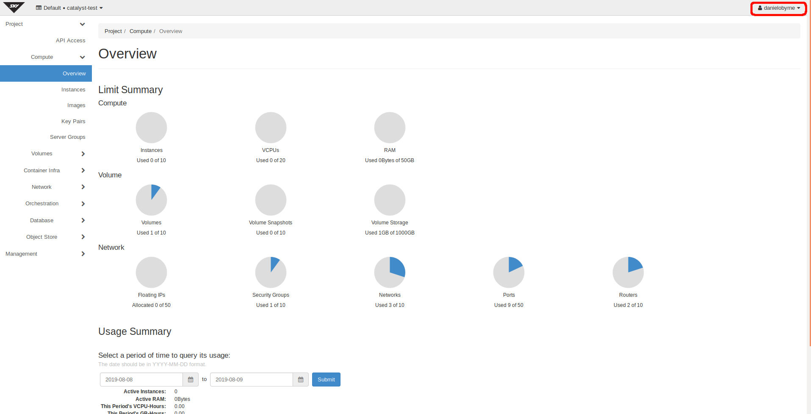
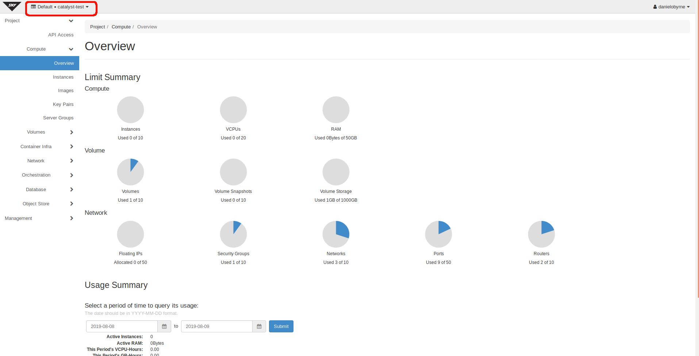

.. _administrating_the_sky-tv_cloud:

#################################
Administrating the Sky TV Cloud
#################################

There are a few small points that are important to be aware of before diving
into the Sky TV cloud.

.. _admin-support:

***************
Getting support
***************

If you experience issues with the Sky TV, please check to
see if the problem(s) are covered further on in this documentation.
If no solution is found you will need to raise a support request with
the support dropdown in the top right corner of the dashboard.

If you are an organisation with more complex support needs, you may
want to consider our premium support.

Status page
===========

Our status page shows the state of our services in each region and also informs
you about planned maintenance. The status page can be found here:
https://catalystcloud.nz/support/status/

Support requests
================

Raising a support request
-------------------------

If you need help, you can raise a support request with Catalyst via the `Support
Requests <https://dashboard.cloud.catalyst.net.nz/management/tickets/>`_ panel.

Most requests are resolved within one business day. If you would like faster
response times or additional support, please consider purchasing one of our
`premium support packages
<https://catalystcloud.nz/support/premium-support/>`_. Our target response
times for priority one incidents are listed on the `premium support page
<https://catalystcloud.nz/support/premium-support/>`_.

Contacting your account manager
-------------------------------

Customers that have a premium support contract from
Catalyst have a technical account manager. You
should have received the contact details for your
account manager when you
applied for premium support.

Contacting a solutions architect
--------------------------------

Premium support customers have access to cloud solution architects who can
provide guidance on the best way to implement your applications on the cloud.
Please contact your account manager to arrange a discussion with a cloud
solutions architect.

Training
========

Catalyst provides training on how to use the Sky TV cloud in Auckland,
Wellington and Christchurch. Upcoming training sessions can be found at
https://catalyst.net.nz/training/upcoming-training.

You can also request training to be delivered on your premises or customised
for the needs of your team. Please contact Catalyst via our training page
to discuss your needs: https://catalyst.net.nz/training-services

.. _admin-region:

********
Projects
********

Everything you do on the Sky TV cloud is in a ``project``. Use projects to
separate the different things you work on. For example, have a project for each
organisation you work with, or one for each branch of your organisation.
Something done in one project cannot effect any other projects.

You can change which project you're working in on the dashboard, with the
dropdown in the top left corner.

Information on how to invite new people to your project can be found on
the catalyst cloud documentation.

The Sky TV cloud provides an isolated and multi-tenanted approach to creating
workspaces. These workspaces are typically referred to as a ``project`` but for
historical reasons you may also see them referred to as a ``tenant`` or
a ``tenancy``.

.. _find-project-id:

Finding my project ID
=====================

Every project on the Sky TV cloud has a ``project name`` (a user friendly
name) and a ``project id`` (an auto-generated UUID). There are a number of ways
to find your project ID and name.

Via the Dashboard
-----------------

The project ID and name can be found on the `API Access`_ panel by clicking on
the `View Credentials`_ button.

.. _API Access: https://dashboard.cloud.catalyst.net.nz/project/api_access/
.. _View Credentials: https://dashboard.cloud.catalyst.net.nz/project/api_access/view_credentials/

Creating new projects
=====================

You can request the creation of more projects via the `Support
Requests`_ panel.

.. _Support Requests: https://dashboard.cloud.catalyst.net.nz/management/tickets/

:ref:`Previous page <access_to_sky-tv_cloud>` -
