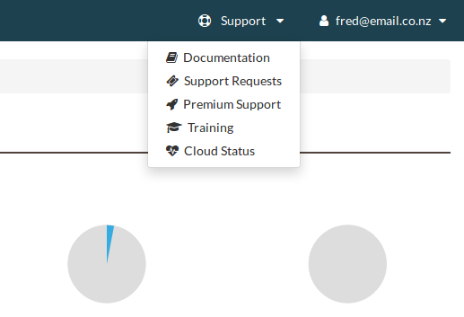

.. _administrating_the_catalyst_cloud:

#################################
Administrating the Catalyst Cloud
#################################

There are a few small points that are important to be aware of before diving
into the Catalyst Cloud.

***************
Getting support
***************

If the Catalyst Cloud appears to be broken, and the documentation doesn't help,
try raising a support request with the support dropdown in the top right corner.

If you're an organisation with more complex support needs, you may want to get
premium support.

:ref:`More info here. <getting-support>`

*******
Regions
*******

The Catalyst Cloud is delivered out of three data centres across New Zealand. On
the dashboard, you can specify which data centre to host your resources in
depending on your needs, with the dropdown in the top left corner.

:ref:`More info here. <regions>`

.. image:: assets/region_dropdown.png

********
Projects
********

Everything you do on the Catalyst Cloud is in a project. Use projects to
separate the different things you work on. For example, have a project for each
organisation you work with, or one for each branch of your organisation.
Something done in one project cannot effect any other projects.

You can change which project you're working in on the dashboard, with the
dropdown in the top left corner.

Information on how to invite new people to your project can be found :ref:`here
<access_control>`.

More info on projects :ref:`here <project_info>`.

.. image:: assets/project_dropdown.png

|

Now that you understand the basics of the Catalyst Cloud, lets dive into a hands
on example using the web dashboard!

:ref:`Next page <first-instance-with-dashboard>`
