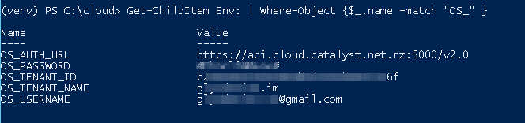

.. _command-line-interface:

############################
Command line interface (CLI)
############################

This section describes how you can install and configure the Catalyst Cloud
command line interface.

******
Set up
******

The OpenStack CLI can be installed in multiple ways. The recommended method for
the Catalyst Cloud is to create a python virtual environment and use ``pip`` to
install it. This method has the benefit of installing the latest version of the
CLI (operating system packages tend to install an outdated version) and
prevents conflicts between python libraries (dependencies are isolated in the
virtual environment).

Working with virtual environments
=================================

If you're not familiar with Python virtual environments, we recommend
reading `the virtualenv section of the Python documentation`_ for an overview.

Below we provide a cheat sheet for the actions and commands you will use the
most.

.. _the virtualenv section of the Python documentation: http://docs.python-guide.org/en/latest/dev/virtualenvs/

Create a virtual environment
----------------------------

To create a new virtual environment, go to the directory where you would like
it to be placed and run the command below:

.. code-block:: bash

  virtualenv venv

Where ``venv`` is the name of the virtual environment you would like to create.
It is common practice to use ``venv`` as the name.

.. _activate-venv:

Activate a virtual environment
------------------------------

When you activate a virtual environment, virtualenv overwrites (temporarily)
some environment variables to place the ``venv/bin`` directory on your
``$PATH`` and force the use of the Python interpreter and libraries installed
in the virtual environment.

To activate a virtual environment:

.. code-block:: bash

  source venv/bin/activate

When activated, you will notice that the virtual environment name is now shown
on the left side of the prompt. This is done to remind you that you are working
"inside" this virtual environment.

Deactivate a virtual environment
--------------------------------

Once you are done working in the virtual environment, you can deactivate it.
This will revert the environment variables back to what they were, prior to it
being activated.

To deactivate a virtual environment:

.. code-block:: bash

  deactivate

Installing the CLI
==================

Ubuntu Linux 16.04
------------------

Ubuntu 16.04 uses Python 3.x by default. The CLI currently works best with
Python 2.7.x, so the procedure below will also install it as a dependency.

.. code-block:: bash

  # Install python 2.7.x, pip and virtualenv
  sudo apt-get install python python-pip python-virtualenv

  # Create a new virtual environment for Python 2.7.x and activate it
  virtualenv venv
  source venv/bin/activate

  # Install Python openstackclient library into your virtual environment
  pip install python-openstackclient

  # Uncomment the line below if you would like to install the deprecated
  # openstack CLI in addition to the new unified CLI
  # pip install python-{ceilometerclient,cinderclient,glanceclient,heatclient,keystoneclient,neutronclient,novaclient,swiftclient}

In case you would like to test the CLI with Python 3.x, please use this
procedure instead:

.. code-block:: bash

  # Make sure you have virtualenv and pip code dependencies installed
  sudo apt-get install python3-dev python-pip python-virtualenv

  # Create a new virtual environment for Python 3.x and activate it
  virtualenv -p /usr/bin/python3 venv
  source venv/bin/activate

  # Install Python openstackclient library into your virtual environment
  pip install python-openstackclient

  # Uncomment the line below if you would like to install the deprecated
  # openstack CLI in addition to the new unified CLI
  # pip install python-{ceilometerclient,cinderclient,glanceclient,heatclient,keystoneclient,neutronclient,novaclient,swiftclient}

.. note::

    Running the OpenStack CLI in interactive mode with Python 3.x will result
    in an error at this time due to a known issue: see
    https://bugs.launchpad.net/python-openstackclient/+bug/1505268 If complete
    commands are run however they will work as expected.

Ubuntu Linux 14.04
------------------

Ubuntu 14.04 uses Python version: 2.7.6 by default. As a result, you do not
need to install a different version of python.

.. code-block:: bash

  # Make sure you have pip and virtualenv installed
  sudo apt-get install python-pip python-virtualenv python-dev

  # Create a new virtual environment for Python and activate it
  virtualenv venv
  source venv/bin/activate

  # Install Python openstackclient library and the Python timezone definitions
  # into your virtual environment
  pip install pytz python-openstackclient

  # Uncomment the line below if you would like to install the deprecated
  # openstack CLI in addition to the new unified CLI
  # pip install python-{ceilometerclient,cinderclient,glanceclient,heatclient,keystoneclient,neutronclient,novaclient,swiftclient}

Debian Linux 8
--------------

.. code-block:: bash

  # Make sure you have virtualenv and pip code dependencies installed
  sudo apt-get install gcc python-dev python-virtualenv

  # Create a new virtual environment for Python 3.x and activate it
  virtualenv venv
  source venv/bin/activate

  # Install Python openstackclient library and the Python timezone definitions
  # into your virtual environment
  pip install pytz python-openstackclient

  # Uncomment the line below if you would like to install the deprecated
  # openstack CLI in addition to the new unified CLI
  # pip install python-{ceilometerclient,cinderclient,glanceclient,heatclient,keystoneclient,neutronclient,novaclient,swiftclient}

CentOS Linux 7
--------------

.. code-block:: bash

  # Make sure you have python development tools and wget installed
  sudo yum install python-devel gcc wget

  # retrieve the pip installer script and install pip and virtualenv
  wget https://bootstrap.pypa.io/get-pip.py
  sudo python get-pip.py
  sudo pip install virtualenv

  # Create a new virtual environment for Python 3.x and activate it
  virtualenv venv
  source venv/bin/activate

  # Install Python openstackclient library on your virtual environment
  # pip install python-openstackclient

  # Uncomment the line below if you would like to install the deprecated
  # openstack CLI in addition to the new unified CLI
  # pip install python-{ceilometerclient,cinderclient,glanceclient,heatclient,keystoneclient,neutronclient,novaclient,swiftclient}

Mac OS X
--------

.. code-block:: bash

  # from a terminal session install pip and virtualenv
  sudo easy_install pip
  sudo pip install virtualenv

  # Create a new virtual environment and activate it
  virtualenv venv
  source venv/bin/activate

  # Install Python openstackclient library on your virtual environment
  pip install python-openstackclient

  # Uncomment the line below if you would like to install the deprecated
  # openstack CLI in addition to the new unified CLI
  # pip install python-{ceilometerclient,cinderclient,glanceclient,heatclient,keystoneclient,neutronclient,novaclient,swiftclient}

Windows Server 2012 R2
----------------------

A good overview for the setup and configuration of Python, pip and virtualenv
on Windows can be found at http://www.tylerbutler.com/2012/05/how-to-install-python-pip-and-virtualenv-on-windows-with-powershell/

Assuming that Python and pip have successfully been installed then

.. code-block:: powershell

  # From a PowerShell session started with administration rights
  # create and activate a virtual environment
  virtualenv.exe venv
  .\venv\scripts\activate

  # Install Python openstackclient library on your virtual environment
  pip install python-openstackclient

  # Uncomment the line below if you would like to install the deprecated
  # openstack CLI in addition to the new unified CLI
  # pip install python-{ceilometerclient,cinderclient,glanceclient,heatclient,keystoneclient,neutronclient,novaclient,swiftclient}

If any errors are encountered while pip is building packages it may be
necessary to install the `Microsoft Visual C++ Compiler for Python 2.7`_ and retry.

.. _Microsoft Visual C++ Compiler for Python 2.7: https://www.microsoft.com/en-gb/download/details.aspx?id=44266

Configuring the CLI
===================

.. _source-rc-file:

Source an OpenStack RC file
---------------------------

When no configuration arguments are passed, the OpenStack client tools will try
to obtain their configuraton from environment variables. To help you define
these variables, the cloud dashboard allows you to download an OpenStack RC file
from which you can easily source the required configuration.

To download an OpenStack RC file from the dashboard:

* Log in to your project on the dashboard and select your preferred region.

* From the left hand menu select "API Access" and click on
  "Download OpenStack RC File v2.0". Save this file on the host where the client
  tools are going to be used from.

* Source the configuration from the OpenStack RC file:

  .. code-block:: bash

    source projectname-openrc.sh

* When prompted for a password, enter the password of the user who downloaded
  the file. Note that your password is not displayed on the screen as you type
  it in.

  .. warning::

    You should never type in your password on the command line (or pass it as
    an argument to the client tools), because the password will be stored in
    plain text in the shell history file. This is unsafe and could allow a
    potential attacker to compromise your credentials.

* You can confirm the configuration works by running a simple command, such as
  ``openstack network list`` and ensuring it returns no errors.

.. note::

  While there is also a V3 version of the RC file available, we recommend using the v2.0 version
  unless otherwise requested by Catalyst Cloud support staff. This is due to the fact that at the
  current time not all backend services fully support the V3 version.

|

Setting up the command line environment on Windows
--------------------------------------------------

As the standard OpenStack RC file will not work in its current form, it is necessary to take a
different approach.

To do this we will need to create the equivalent script using PowerShell. Add the following lines,
replacing the placeholder entries with the appropriate details from your OpenStack RC file which
can be obtained following the steps above.

.. code-block:: bash

  $env:OS_AUTH_URL = "https://api.cloud.catalyst.net.nz:5000/v2.0"
  $env:OS_TENANT_NAME = "<tenant-name>"
  $env:OS_TENANT_ID = "<tenant-id>"
  $env:OS_USERNAME = "<username>"

  $password = Read-Host 'Please enter your OpenStack Password' -AsSecureString
  $env:OS_PASSWORD = [Runtime.InteropServices.Marshal]::PtrToStringAuto([Runtime.InteropServices.Marshal]::SecureStringToBSTR($password))

Save the file and run it from a PowerShell session. To confirm if the variables were set correctly,
run the following command

.. code-block:: bash

  Get-ChildItem Env: | Where-Object {$_.name -match "OS_"}

the output should show the following 5 variables

|

*************
Using the CLI
*************

Before using the CLI, always remember to :ref:`activate-venv` and
:ref:`source-rc-file`.

Please refer to http://docs.openstack.org/cli-reference/openstack.html for a
reference of all commands supported by the CLI.

Finding your way
================

The command ``openstack help`` will list all commands supported by the
OpenStack CLI. You can then use ``openstack COMMAND --help`` to understand how
to use a command.
