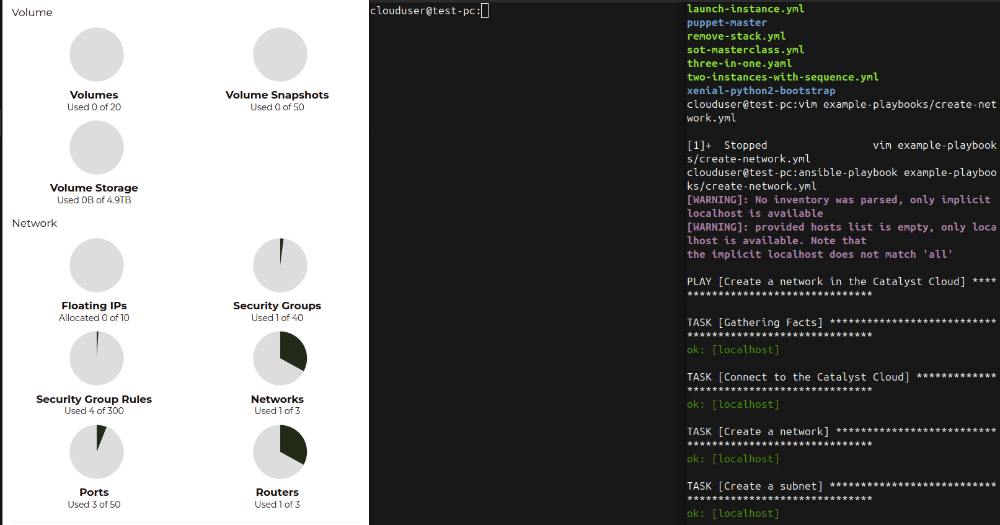

.. _introduction-to-catalyst-cloud:

############################
The basics of Catalyst Cloud
############################

This section of the documentation is for people that are entirely new to cloud
computing and/or the Catalyst Cloud.

***************************
What is the Catalyst Cloud?
***************************

Catalyst Cloud is a cloud computing platform, based entirely in New Zealand.

Catalyst Cloud was built with the open source project, `OpenStack`_. OpenStack
is a piece of software that allows users like yourself to rent servers. You can
rent things such as storage space, compute capacity, or internet access. The
building blocks you need to run a business's applications.

.. _`OpenStack`: https://www.openstack.org/software/

OpenStack gives you the ability to rent exactly what you need, without
wastefully renting capacity you don't need, by allowing you to change how much
you're renting quickly, easily, and automatically, through a variety of tools.

To rent resources on Catalyst Cloud, you provision services. Catalyst Cloud
services are pieces of hardware and software that we have in one of our data
centres, that we make easy and convenient to use by controlling them with
OpenStack.

By exposing our hardware and software as services, we remove a lot of complexity
from your day to day work. For example: you need to give a server it's own
public IP address. You open a terminal and run:

.. code-block:: console

  $ openstack floating ip create public-net

  +---------------------+--------------------------------------+
  | Field               | Value                                |
  +---------------------+--------------------------------------+
  | created_at          | None                                 |
  | description         | None                                 |
  | fixed_ip_address    | None                                 |
  | floating_ip_address | 150.242.41.224                       |
  | floating_network_id | 849ab1e9-7ac5-4618-8801-e6176fbbcf30 |
  | id                  | 415fa158-fd7d-4b43-9002-0a55aa22a753 |
  | name                | 150.242.41.224                       |
  | port_id             | None                                 |
  | project_id          | 8ccc3286887e49cb9a40f023eba693b4     |
  | qos_policy_id       | None                                 |
  | revision_number     | None                                 |
  | router_id           | None                                 |
  | status              | DOWN                                 |
  | subnet_id           | None                                 |
  | tags                | []                                   |
  | updated_at          | None                                 |
  +---------------------+--------------------------------------+

Now you've rented a public IP address. Now you run:

.. code-block:: console

  $ openstack server add floating ip my_server_name 150.242.41.224

Just like that, your server has a public IP address in seconds. Quick, easy, and
powerful. Every action on Catalyst Cloud can be performed just as quickly.

Now we understand the basic idea behind Catalyst Cloud, let's explore what
services Catalyst Cloud provides.

:ref:`Next page <services_on_the_catalyst_cloud>`
