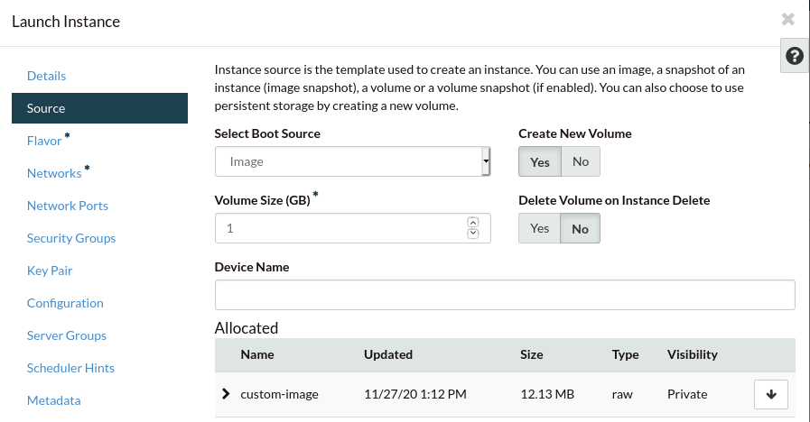
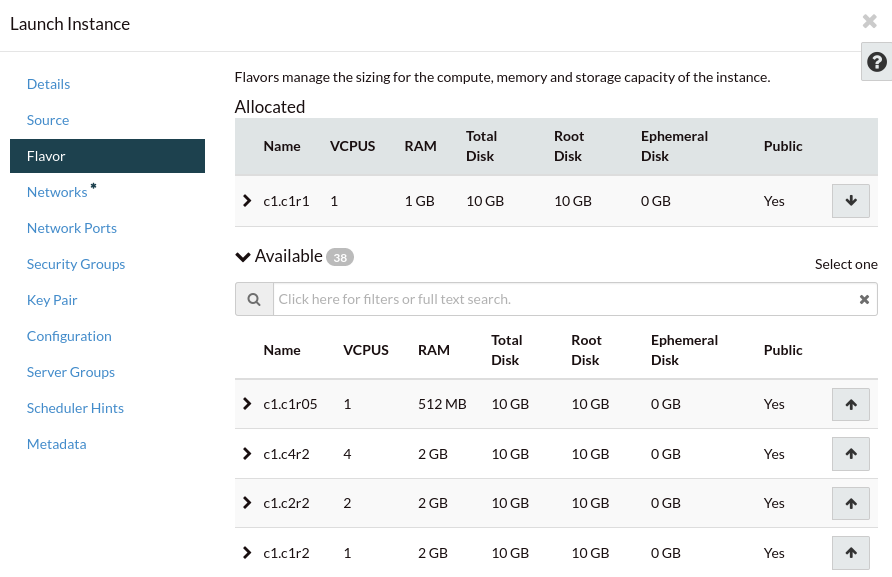

#########################################
Launching an instance from a custom image
#########################################

On the dashboard you will find the image you uploaded on “Images & Snapshots”
under your private images. Click on the Launch button and when you reach the
source section, select “Boot from image (creates a new volume).” As the
instance boot source. Also ensure the volume size is at least the same size as
the image uploaded:

If you are importing an existing virtual machine, for its first boot you
should choose a flavor that provides at least the same amount of CPU and RAM
as the VM had before. Once you confirm the compute instance is booting
appropriately, you can resize it to a smaller flavor if you wish:

.. warning::

  Remember that your VM has been imported exactly as it was before, therefore
  there might be some things that may prevent you from connecting to it
  remotely (for example: a host base firewall blocking connections). You can
  use the console and your existing user credentials to connect to your
  compute instance and make adjustments to its configuration as required.
