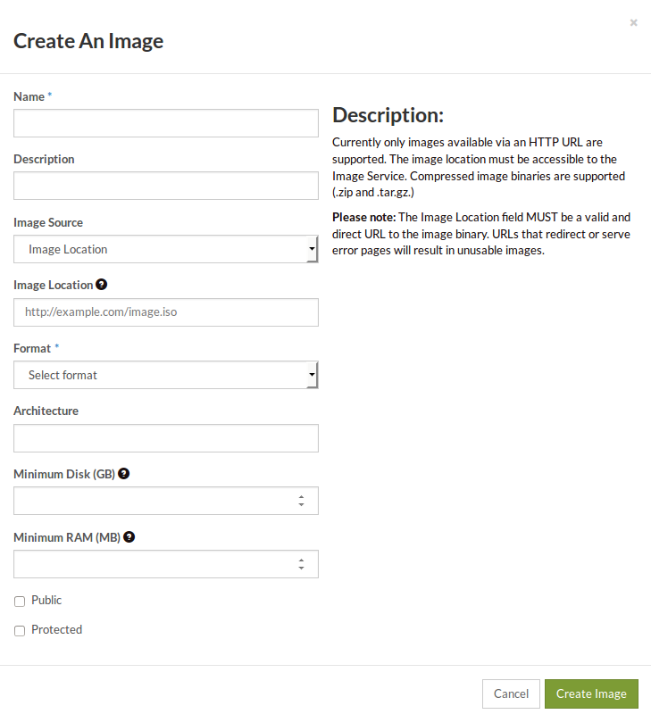

.. _upload_images:

##################################
Uploading images to Catalyst Cloud
##################################

Please make sure you have :ref:`converted your image to RAW <convert_image_to_raw>`
before uploading it to our cloud.

**************************
Via the command line tools
**************************
.. Warning::

  If the Image you are trying to upload is larger than 5GB you **must** use
  the OpenStack CLI to upload it to the cloud. This is due to a cap being
  placed for uploads via our dashboard.

Ensure that you have the OpenStack command line tools
installed and that you have sourced an openrc file, as explained in the
:ref:`CLI tools and SDKs section<command-line-interface>`.

To upload the converted image to Catalyst Cloud:

.. code-block:: bash

  $ openstack image create --disk-format raw --container-format bare --file raw-image.raw --private test-image
  +------------------+----------------------------------------------------------------------------------------------------------+
  | Field            | Value                                                                                                    |
  +------------------+----------------------------------------------------------------------------------------------------------+
  | checksum         | 84add06465aa22360xxxxxx0f90699be                                                                         |
  | container_format | bare                                                                                                     |
  | created_at       | 2017-08-22T01:17:58Z                                                                                     |
  | disk_format      | raw                                                                                                      |
  | file             | /v2/images/2442ee5a-ddd4-4b7d-b08f-xxxxxxxxxxxx/file                                                     |
  | id               | 2442ee5a-ddd4-4b7d-b08f-xxxxxxxxxxxx                                                                     |
  | min_disk         | 0                                                                                                        |
  | min_ram          | 0                                                                                                        |
  | name             | test-image                                                                                               |
  | owner            | b24exxxxxxxxxxxxxxxxxxxxxxxxxc6f                                                                         |
  | properties       | direct_url='rbd://b08xxxxx-xxxx-xxxx-a84c-xxxxxxxxxxxx/images/2442ee5a-ddd4-4b7d-b08f-xxxxxxxxxxxx/snap' |
  | protected        | False                                                                                                    |
  | schema           | /v2/schemas/image                                                                                        |
  | size             | 8589934592                                                                                               |
  | status           | active                                                                                                   |
  | tags             |                                                                                                          |
  | updated_at       | 2017-08-22T01:30:26Z                                                                                     |
  | virtual_size     | None                                                                                                     |
  | visibility       | private                                                                                                  |
  +------------------+----------------------------------------------------------------------------------------------------------+

*****************
Via our dashboard
*****************

On the images panel, click on "Create Image". The Create Image dialogue will be
displayed as shown below:

#. On the image source, select "Browse" to upload an image from your file
   system.

#. Select the appropriate format for your image. We strongly recommend the use
   of RAW images only.

#. Set the minimum disk size to at least the size of the image. If you are
   using a compressed format, like QCOW2, use the expanded size of the image.

Finally, click on "Create Image" and wait until the image has been uploaded.
