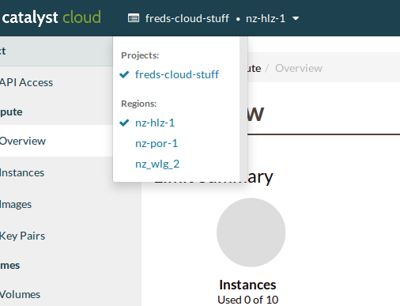

.. _regions:

#######
Regions
#######

The Catalyst Cloud provides three regions in New Zealand. Regions are data
centres that are completely independent and isolated (each with their own
`control plane`), providing fault tolerance and geographic diversity.

Please visit our website for more information about our national infrastructure:
https://catalystcloud.nz/about/national-infrastructure/

+-------------+-----------------+--------------------+----------------------+
| Region Code | Name            | PCI DSS certified? | ISO 27001 certified? |
+=============+=================+====================+======================+
| nz-por-1    | NZ Porirua 1    | Yes                | In progress          |
+-------------+-----------------+--------------------+----------------------+
| nz_wlg_2    | NZ Wellington 2 | Compliant          | In progress          |
+-------------+-----------------+--------------------+----------------------+
| nz-hlz-1    | NZ Hamilton 1   | Yes                | Yes                  |
+-------------+-----------------+--------------------+----------------------+

.. note::

  We encourage customers to use Porirua as their primary region, as it has the
  greatest capacity of all our regions.

******************
Selecting a region
******************

Via the dashboard
=================

The web dashboard has a region selector dropbox on the top left corner. It
indicates the current region you are connected to and allows you to easily
switch to another region.

Via the CLI
===========

The command line interface picks up the region configuration from the
``$OS_REGION_NAME`` environment variable. To define the variable:

.. code-block:: bash

  export OS_REGION_NAME="region-code"

Alternatively you can use the ``--os-region-name`` option to specify the region
on each call.

Via the APIs
============

The API request you use to authenticate with the Catalyst Cloud allows you to
scope a token on a given region. The token can then be used to interact with
the API endpoints of the other services hosted in the same region.

****************************
Data traffic between regions
****************************

The connectivity between compute instances hosted on different regions takes
place over either our wide area network (WAN) or the Internet, when allowed by
your security groups and network configuration.

Contrary to data traffic within a given region, there are data transfer costs
applicable to data traffic between regions.

****************
Data replication
****************

With the exception of multi-region object storage service, resources are not
replicated automatically across regions unless you do so. This provides users
the flexibility to introduce replication where required and to fail-over
resources independently when needed.
