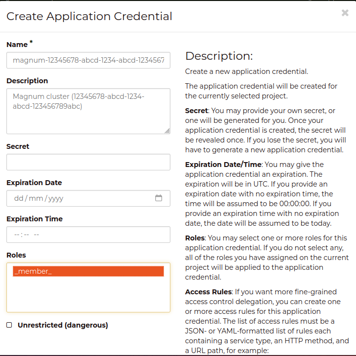

# Application Credentials

An Application Credential is created for the cluster on creation.  The 
credential is used by the Catalyst Cloud Kubernetes Service to manage cloud 
resources for the cluster.  The application credential is owned by the user who
created the cluster, so it is important to take care when managing the users in 
your project.

:::{important}
If the user that created the cluster is removed from the project or disabled 
then the cluster will be prevented from actions that require access to cloud 
resources, such as creating/updating ingress load balancers, persistent volume 
operations, or scaling of worker nodes.
:::

## Updating the Application Credentials for your cluster

If you need to change the application credential associated with the cluster, 
then you will need to create a new application credential and open a support 
request for us to update the cluster.

### Creating a new application credential

Select a suitable user in your project and authenticate as that user on Catalyst 
Cloud, either via an OpenRC file or the Dashboard.

The key information that you will need is the id of the cluster.  The id can be 
found by using the `openstack coe cluster list` command or via the Dashboard.

When creating a new application credential, using the methods below, ensure that
it has the following details:
- The `Name` is "magnum-{id}" where `{id}` is your cluster's id
- The `Description` is "Magnum cluster ({id})" where `{id}` is your cluster's id
- The credential has the "\_member\_" role

#### Via the CLI

You can use the OpenStack CLI to create the application credential, replacing 
`12345678-abcd-1234-abcd-123456789abc` with the ID of your cluster.

```shell
openstack application credential create --role _member_ --description "Magnum cluster (12345678-abcd-1234-abcd-123456789abc)" magnum-12345678-abcd-1234-abcd-123456789abc
```

#### Via the Dashboard

On the Dashboard the Application Credentials panel is located under the 
*Identity* menu on the left hand bar.  You can create a new application 
credential following the example below, replacing
`12345678-abcd-1234-abcd-123456789abc` with the ID of your cluster.



:::{important}
Record the secret for the Application Credential as you will need to share it 
with us.
:::

### Open a support ticket

Create a support ticket to let us know that you want to update the application 
credential associated with your cluster.  We will respond with instructions on 
how to share the secret with us.  

### What do we do

We will change the settings of your cluster to use the new application credential
and will trigger an update of the services managing your cluster.  There should 
be no interruption or outage of your cluster when the update is applied. 
