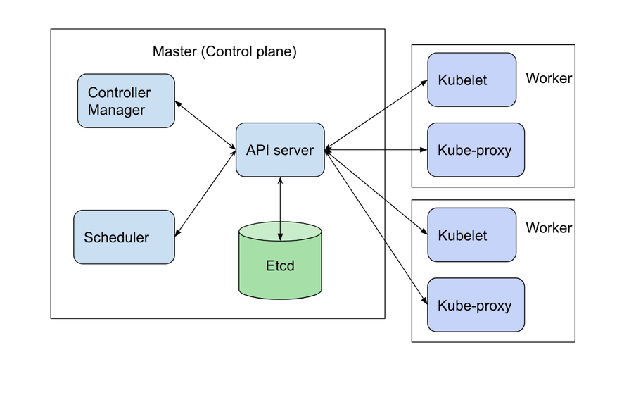

########
Clusters
########

This section shows a more in depth view of clusters and their uses. It
goes over the process of creating clusters, similar to the quickstart section
but the difference in the following example is that it covers private clusters
and more production ready clusters.

******************
What is a cluster?
******************

A container cluster is the foundation of the Kubernetes Engine, it consists of
one or more **master node(s)** and one or more **worker node(s)**. It is made
up of a collection of compute, networking, and storage resources necessary to
run any given workloads. Communication between them is achieved by way of a
shared network.

The ``master`` server is the control plane of the cluster consisting of a
collection of services responsible for providing the centralised scheduling,
logic and management of all aspects of the cluster. While it is possible to run
a cluster with a single master which hosts all of the required services it is
more advisable, especially for production environments, to deploy your clusters
in a multi-master *highly available* configuration.

The following diagram shows the relation more clearly
*(image sourced from rancher.com)*

Some of the key services running on the master are:

- The interface to the cluster via the ``API Server``, which provides a
  RESTful API frontend to the control plane.
- Configuration and state of the cluster is managed by the ``cluster store``.
  This is based on ``etcd``, which is a distributed key-value store, and
  provides the single source of truth for the cluster and as such is the only
  stateful component within the cluster.
- The ``scheduler``

The other half of the cluster is the machines designated as ``nodes``,
previously referred to as minions. They are responsible for accepting and
running workloads assigned by the master using appropriate local and external
resources.

********************
The cluster template
********************

A cluster template is a collection of parameters to describe how a cluster can
be constructed. Some parameters are relevant to the infrastructure of the
cluster, while others are for the particular COE. These templates work as a
blueprint for cluster creation, changing certain parameters for your cluster.

Traditionally a cloud provider may supply pre-defined templates for users and
it may also be possible, in some situations, for users to create their own
templates. Initially Catalyst Cloud will only support the use of the
pre-defined templates.

.. Note::

  From cluster template version ``v1.12.10`` onwards, as a security best
  practice, the behaviour when creating a new cluster is for it to be
  created as a :ref:`private-cluster`. This means that the cluster will not be
  reachable directly from the internet by default.

Template types
--------------

The naming convention used for the templates is broken down as follows:

* **kubernetes-v1.11.2** : this is the version of kubernetes that the template
  will use to create the cluster.
* **-prod** or **-dev**: the type of environment to be created (see below).
* **-20190912**: the date on which the template was created.

The difference between the development and production templates are:

* **Production**: creates a Kubernetes cluster that is intended for production
  workloads. It creates three or more master nodes and three or more worker
  nodes. The master nodes will have a loadbalancer deployed in front of them to
  provide high availability for the Kubernetes API. This template also deploys
  Prometheus and Grafana to provide cluster metrics.
* **Development**: creates a minimal Kubernetes cluster with a single master
  and a single worker node. As the name suggests, it should not be used for
  production.

Viewing templates
-----------------

When running the openstack command line tools ensure that you have sourced a
valid openrc file first. For more information on this see :ref:`source-rc-file`

.. Note::

  In order to be able to create a Kubernetes cluster the user needs to ensure
  that they have been allocated the ``heat_stack_owner`` role.

Then list all of the available cluster templates.

.. code-block:: bash

  $ openstack coe cluster template list
  +--------------------------------------+-----------------------------------+
  | uuid                                 | name                              |
  +--------------------------------------+-----------------------------------+
  | 18a9fa94-95f4-46a4-be3c-c8fae025ce97 | kubernetes-v1.13.12-dev-20191129  |
  | a04e8d58-bd81-4eae-9242-144dc75b3821 | kubernetes-v1.13.12-prod-20191129 |
  | 681241fd-682a-418e-aa1e-8238ceca834e | kubernetes-v1.15.11-dev-20200330  |
  | 77b71c57-7ad3-49fc-a5c2-80962325e7a1 | kubernetes-v1.15.11-prod-20200330 |
  | e7be8a37-c5a6-4dfa-853c-8ff0653ede31 | kubernetes-v1.14.10-dev-20200422  |
  | 9ab35677-8644-4d3c-bb81-281f7ec52e31 | kubernetes-v1.14.10-prod-20200422 |
  | 2cb17a1a-bafd-48c4-a466-c690524d325d | kubernetes-v1.15.11-dev-20200501  |
  +--------------------------------------+-----------------------------------+

To find more information on which template you want to use, you can view each
template via the `Cluster Templates`_ tab on our dashboard. For information
on how volumes work and storage types in a cluster refer to the
:ref:`storage<storage>` section under the kubernetes documentation.

Default volume types and sizes
==============================

Here we outline the defaults settings of our volumes across the different
regions of the Catalyst Cloud. Additionally, we cover where to find
information on changing these defaults using labels, and the best practices
concerning NVMe.

The following is a table that shows you the different sizes and types of
volumes that are used by default across the different regions:

+------------------+--------------+--------+----------------------+
| Volume           | Region       |  Size  |  Type                |
+==================+==============+========+======================+
| docker volume    | Hamilton     | 20GB   | b1.sr-r3-nvme-1000   |
+------------------+--------------+--------+----------------------+
|                  | Porirua      | 20GB   | b1.sr-r3-nvme-1000   |
+------------------+--------------+--------+----------------------+
|                  | Wellington   | 20GB   | b1.standard          |
+------------------+--------------+--------+----------------------+
| etcd volume      | Hamilton     | 20GB   | b1.sr-r3-nvme-1000   |
+------------------+--------------+--------+----------------------+
|                  | Porirua      | 20GB   | b1.sr-r3-nvme-1000   |
+------------------+--------------+--------+----------------------+
|                  | Wellington   | 20GB   | b1.standard          |
+------------------+--------------+--------+----------------------+
| boot volume      | Hamilton     | 10GB   | b1.sr-r3-nvme-1000   |
+------------------+--------------+--------+----------------------+
|                  | Porirua      | 10GB   | b1.sr-r3-nvme-1000   |
+------------------+--------------+--------+----------------------+
|                  | Wellington   | 10GB   | b1.standard          |
+------------------+--------------+--------+----------------------+

You will notice that for the the volumes in the Hamilton and Porirua region,
they use an NVMe volume type but the Wellington region does not. This is
because we have not yet set up NVMe in our Wellington region, however we are
working on implementing NVMe across all our regions and hope to update this
soon.

To change these defaults you will have to change the labels for your template.
The process of which is detailed under: :ref:`modifying_a_cluster_with_labels`.

Best practices with NVMe
------------------------

We use NVMe for our volumes because it reduces the time it takes to pull and
start your pods, making for an overall faster cluster. In addition, using NVMe
ensures that the IOPS for the etcd volume are sufficient to a point that they
will not fail due to disk pressure, making for a more reliable and resilient
cluster overall.

.. _`Cluster Templates`: https://dashboard.cloud.catalyst.net.nz/project/cluster_templates

.. _setting_up_kubectl:

***************************************
Interacting with the Kubernetes service
***************************************

There are two main ways, Catalyst Cloud supports, when wanting to interact with
the kubernetes service. There is the kubernetes CLI and the Container infra
section on the  Catalyst Cloud dashboard. In this section of the documentation
we will cover the command line methods in greater depth. To know more about
the dashboard approach, please see the :ref:`k8s-quickstart` section of the
documents.

Getting kubectl
---------------

To deploy and manage applications on kubernetes through the command line,
we use the Kubernetes command-line tool, `kubectl`_. With this tool you can
inspect cluster resources; create, delete, and update components; and look at
your new cluster and bring up example apps. It's basically the Kubernertes
Swiss army knife.

The details for getting the latest version of kubectl can be found `here`_.

.. _`kubectl`: https://kubernetes.io/docs/reference/kubectl/kubectl/
.. _`here`: https://kubernetes.io/docs/tasks/tools/install-kubectl/#kubectl-install-1

To install these tools on Linux via the command line as a simple binary,
perform the following steps:

.. code-block:: bash

  $ curl -LO https://storage.googleapis.com/kubernetes-release/release/$(curl -s \
  https://storage.googleapis.com/kubernetes-release/release/stable.txt)/bin/linux/amd64/kubectl

  $ chmod +x ./kubectl
  $ sudo mv ./kubectl /usr/local/bin/kubectl

The basic format of a kubectl command looks like this:

.. code-block:: bash

  kubectl [command] [TYPE] [NAME] [flags]

where command, TYPE, NAME, and flags are:

- ``command``: the operation to perform
- ``TYPE``: the resource type to act on
- ``NAME``: the name of the resource in question
- ``flags``: optional flags to provide extra

Cluster Access Using kubeconfig Files
-------------------------------------

The kubectl command-line tool uses kubeconfig files to find the information it
needs to choose a cluster and communicate with the API server of a cluster.
These files provide information about clusters, users, namespaces, and
authentication mechanisms.

Getting the cluster config
--------------------------

We use our cluster config to configure our native command line to communicate
with our cluster. To do so we have to source the config file of our
cluster using the following command.

For example: ``eval $(openstack coe cluster config <cluster-name>)``

.. code-block:: bash

  $ eval $(openstack coe cluster config k8s-cluster)

This will download the necessary certificates and create a config file within
the directory that you are running the command from. If you wish to save the
configuration to a different location you can use the
``--dir <directory_name>`` parameter to select a different destination.

.. Note::

  If you are running multiple clusters or are deleting and re-creating cluster it is necessary to
  ensure that the current ``kubectl configuration`` is referencing the right cluster. The
  following section will outline this in more detail.

Viewing the cluster
-------------------

It is possible to view details of the cluster with the following command. This
will return the address of the master and the services running there.

.. code-block:: bash

  $ kubectl cluster-info
  Kubernetes master is running at https://103.254.156.157:6443
  Heapster is running at https://103.254.156.157:6443/api/v1/namespaces/kube-system/services/heapster/proxy
  CoreDNS is running at https://103.254.156.157:6443/api/v1/namespaces/kube-system/services/kube-dns:dns/proxy

In order to view more in depth information about the cluster simply add the
dump option to the above example. This generates output suitable for debugging
and diagnosing cluster problems. By default, it redirects everything to stdout.

.. code-block:: bash

  $ kubectl cluster-info dump

******************************
Deploying a Kubernetes cluster
******************************

If you are wanting to set up a cluster via the Catalyst Cloud dashboard, there
is a :ref:`guide<dashboard-cluster-creation>` under the quickstart section you
can follow.

Private vs Public cluster API access
------------------------------------

Any cluster created using one of the predefined templates will, by default, be
created as a ``private cluster``. This means that the Kubernetes API will
**not** be accessible from the internet and access will need to be via a
bastion or jumphost server within the cloud project.

If you would prefer to create a ``publicly accessible cluster`` then simply
add the following option to the cluster creation command.

.. code-block:: bash

  --floating-ip-enabled

The actual usage would look like this.

.. code-block:: console

  $ openstack coe cluster create <Cluster name> \
    --cluster-template <Template ID> \
    --floating-ip-enabled

.. Note::

  This quickstart guide covers the steps to creating a kubernetes cluster
  from scratch. But if you wish to create a cluster on an existing
  private network then you can refer to the relevant section in
  :ref:`the private-cluster <cluster-on-existing-net>` documentation.

Creating a cluster
------------------

To create a new **production** cluster run the following command:

.. code-block:: bash

  $ openstack coe cluster create k8s-cluster \
  --cluster-template kubernetes-v1.14.10-prod-20200422 \
  --keypair my-ssh-key \
  --node-count 3 \
  --master-count 3

To create a new **development** cluster run the following command:

.. code-block:: bash

  $ openstack coe cluster create k8s-cluster \
  --cluster-template kubernetes-v1.14.10-dev-20200422 \
  --keypair my-ssh-key \
  --node-count 3 \
  --master-count 1

  Request to create cluster c191470e-7540-43fe-af32-ad5bf84940d7 accepted

.. _modifying_a_cluster_with_labels:

Customizing clusters using labels
---------------------------------

It is possible to override the behaviour of a template by adding or modifying
the labels supplied by the template. To do this the entire list of existing
labels in the template must be provided as a set of key=value pairs, overriding
the required ones as necessary.

To get the list of existing labels on a template simple view the template like
so.

.. code-block:: bash

  openstack coe cluster template show kubernetes-v1.15.6-dev-20191129 -f yaml
  insecure_registry: '-'
  labels:
    auto_healing_controller: magnum-auto-healer
    auto_healing_enabled: 'true'
    auto_scaling_enabled: 'false'
    cloud_provider_enabled: 'true'
    cloud_provider_tag: 1.14.0-catalyst
    container_infra_prefix: docker.io/catalystcloud/
    heat_container_agent_tag: stein-dev
    ingress_controller: octavia
    k8s_keystone_auth_tag: v1.15.0
    keystone_auth_enabled: 'true'
    kube_dashboard_enabled: 'true'
    kube_tag: v1.15.6
    magnum_auto_healer_tag: v1.15.0-catalyst.0
    master_lb_floating_ip_enabled: 'false'
    octavia_ingress_controller_tag: 1.14.0-catalyst
    prometheus_monitoring: 'true'

  <-- truncated for brevity -->

Then convert this into a comma separated key value list like so.

.. warning::

  ensure there is **no whitespace** added around commas ","  or equal signs '='
  when creating the list

.. code-block:: bash

  auto_healing_controller=magnum-auto-healer,auto_healing_enabled=true, \
  auto_scaling_enabled=false,cloud_provider_enabled=true, \
  cloud_provider_tag=1.14.0-catalyst, \
  container_infra_prefix=docker.io/catalystcloud/, \
  heat_container_agent_tag=stein-dev,ingress_controller=octavia, \
  k8s_keystone_auth_tag=v1.15.0,keystone_auth_enabled=true, \
  kube_dashboard_enabled=true,kube_tag=v1.15.6, \
  magnum_auto_healer_tag=v1.15.0-catalyst.0, \
  master_lb_floating_ip_enabled=false, \
  octavia_ingress_controller_tag=1.14.0-catalyst,prometheus_monitoring=true

This will then be passed as the argument to the **labels** parameter.

.. code-block:: bash

  openstack coe cluster create k8s-cluster \
  --cluster-template kubernetes-v1.13.10-prod-20190912 \
  --labels auto_healing_controller=magnum-auto-healer,auto_healing_enabled=true,<-- truncated -->
  --keypair my-ssh-key \
  --node-count 3 \
  --master-count 3

.. warning::

  If the complete list of labels is not provided it is likely that the cluster
  will fail to deploy correctly and will end up in a FAILED or UNHEALTHY state.

Checking the status of the cluster
----------------------------------

A cluster will take on average 10 to 15 minutes be created.

You can use the following command to check the status of the cluster:

.. code-block:: bash

  $ openstack coe cluster list
  +--------------------------------------+-------------+----------+------------+--------------+--------------------+
  | uuid                                 | name        | keypair  | node_count | master_count | status             |
  +--------------------------------------+-------------+----------+------------+--------------+--------------------+
  | c191470e-7540-43fe-af32-ad5bf84940d7 | k8s-cluster | testkey  |          1 |            1 | CREATE_IN_PROGRESS |
  +--------------------------------------+-------------+----------+------------+--------------+--------------------+

Alternatively, you can check the status of the cluster on the `Clusters panel`_
, in the ``Container Infra`` section of the Dashboard.

.. _`Clusters panel`: https://dashboard.cloud.catalyst.net.nz/project/clusters

Please wait until the status changes to ``CREATE_COMPLETE`` to proceed.

Accessing a private cluster
---------------------------

Once the cluster state is ``CREATE_COMPLETE`` and you have successfully
retrieved the cluster config, we need to confirm that we are able to access the
cluster.

.. Note::

  The use of the bastion server is unnecessary if you created a public cluster
  that is directly accessible from the internet.

If you did not override the default behaviour you will have created a **private
cluster**. In order to access this you will need to create a bastion host
within your cloud project to allow you to reach the Kubernetes API.

.. Warning::

  When using a bastion server to access a private cluster you will need to
  delete the bastion before trying to delete the cluster.

  Failure to do so will leave your cluster in a **DELETE_FAILED** state that
  will require assistance from the Catalyst Cloud team to resolve.

For the purpose of this example let's assume we deployed a bastion host with
the following characteristics:

* name - bastion
* flavor - c1.c1r1
* image - ubuntu-18.04-x86_64
* network - attached to the Kubernetes cluster network
* security group - bastion-ssh-access
* security group rules - ingress TCP/22 from 114.110.xx.xx ( public IP to allow
  traffic from)

The following commands are to check our setup and gather the information we
need to set up our SSH forward in order to reach the API endpoint.

Find the instance's external public IP address

.. code-block:: bash

  $ openstack server show bastion -c addresses -f value
  private=10.0.0.16, 103.197.62.38

Confirm that we have a security group applied to our instance that allows
inbound TCP connections on port 22 from our current public IP address. In this
case our security group is called bastion-ssh-access and out public IP is
114.110.xx.xx.

.. code-block:: bash

  $ openstack server show bastion -c security_groups -f value
  name='bastion-ssh-access'
  name='default'

  $ openstack security group rule list bastion-ssh-access
  +--------------------------------------+-------------+-----------+------------------+------------+-----------------------+
  | ID                                   | IP Protocol | Ethertype | IP Range         | Port Range | Remote Security Group |
  +--------------------------------------+-------------+-----------+------------------+------------+-----------------------+
  | 42c1320c-98d5-4275-9c2d-b81b0eadac29 | tcp         | IPv4      | 114.110.xx.xx/32 | 22:22      | None                  |
  +--------------------------------------+-------------+-----------+------------------+------------+-----------------------+

Finally we need the IP address for the Kubernetes API endpoint

.. code-block:: bash

  $ openstack coe cluster show k8s-prod -c api_address -f value
  https://10.0.0.5:6443

We will make use of SSH's port forwarding ability in order to allow us to
connect from our local machine's environment. To do this run the following
command in your shell.

.. code-block:: bash

  ssh -f -L 6443:10.0.0.5:6443 ubuntu@103.197.62.38 -N

* -f fork the process in background
* -N do not execute any commands
* -L specifies what connections are given to the localhost. In this example we use the
   ``port:host:hostport`` to bind 6443 on localhost to 6443 on the API endpoint at 10.0.0.5
* The **ubuntu@103.197.62.38** is the credentials for SSH to log into the bastion host.

.. Note::

  Setting up the SSH forwarding is optional. You can choose to deploy a cloud
  instance on the Kubernetes cluster network with appropriate remote access
  and SSH on it and run all of your cluster interactions from there.

As a quick test we can run the following curl command to check that we get a
response from the API server.

.. code-block:: bash

  $ curl https://localhost:6443 --insecure
  {
    "kind": "Status",
    "apiVersion": "v1",
    "metadata": {

    },
    "status": "Failure",
    "message": "forbidden: User \"system:anonymous\" cannot get path \"/\"",
    "reason": "Forbidden",
    "details": {

    },
    "code": 403
  }

If the curl request returned a JSON response similar to that shown above you
can run the following command to confirm that Kubernetes is working as
expected.

First, if you are running a private cluster and connecting over the SSH tunnel
you will need to edit the kubeconfig file you retrieved earlier and make the
following change.

Find the ``server`` entry that points to the Kubernetes API.

.. code-block:: bash

  server: https://10.0.0.5:6443

Change it so that it points to the localhost address instead.

.. code-block:: bash

  server: https://127.0.0.1:6443

Then run kubectl to confirm that the cluster responds correctly.

.. Note::

    If you have not yet set up the Kubernetes command line tools see :ref:`setting_up_kubectl` for details.

.. code-block:: bash

  $ kubectl cluster-info
  Kubernetes master is running at https://103.254.156.157:6443
  Heapster is running at https://103.254.156.157:6443/api/v1/namespaces/kube-system/services/heapster/proxy
  CoreDNS is running at https://103.254.156.157:6443/api/v1/namespaces/kube-system/services/kube-dns:dns/proxy

You can now proceed with deploying your applications into the cluster using
kubectl or whatever your preferred mechanism may be.

**********************************
Accessing the Kubernetes dashboard
**********************************

.. include:: dashboard-access.rst

*******************************
Managing cluster configurations
*******************************

When working with multiple clusters or a cluster that has been torn down and
recreated it is necessary to ensure that you have the correct ``cluster
context`` loaded in order for kubectl to interact with the intended cluster.

In order to see the current configuration and context that ``kubectl`` is
using, run the following.

.. code-block:: bash

  $ kubectl config view
  apiVersion: v1
  clusters:
  - cluster:
      certificate-authority: /home/testuser/tmp/ca.pem
      server: https://202.49.241.204:6443
    name: k8s-m1-n1
  contexts:
  - context:
      cluster: k8s-m1-n1
      user: admin
    name: default
  current-context: default
  kind: Config
  preferences: {}
  users:
  - name: admin
    user:
      client-certificate: /home/testuser/tmp/cert.pem
      client-key: /home/testuser/tmp/key.pem

  $ kubectl config current-context
  default

This shows us the details of the current configuration file that kubectl is
referencing and also the specific cluster context within that, in this case
``default``. There is also an environment variable called ``$KUBECONFIG`` that
stores the path or paths to the various configurations that are available.

If we had run the command to retrieve the cluster configuration from a
directory called tmp within our home directory then the output would look
like this.

.. code-block:: bash

  echo $KUBECONFIG
  /home/testuser/tmp/config

If there was a second cluster that we wished to also be able to work with then
we need to retrieve the configuration and store it to a local directory.

.. Note::

  At the current time it is not possible to store multiple cluster
  configurations within the same directory. There is a change coming in a future
  release that will make this possible using a converged configuration file.

If you run ``eval $(openstack coe cluster config <cluster-name>)`` within a
directory that already contains the configuration for a cluster it will fail.
If this is intentional, as in the case of upgrading a cluster that has been
rebuilt, then this is possible by adding the ``--force`` flag, like this.

.. code-block:: bash

  $ eval $(openstack coe cluster config --force k8s-cluster )

If you are wanting to download the configuration for another cluster then we
can use the ``-dir`` flag and pass in the location for the configuration to be
saved. Here we will save our new configuration into a directory called
``.kube/`` under the users home directory.

.. code-block:: bash

  $ eval $(openstack coe cluster config --dir ~/.kube/ k8s-cluster-2)

If we now check the current config we will see that it also says ``default``,
this is because the naming convention used in the creation of the local config
automatically is loaded with **default** as its value.

.. code-block:: bash

  $ kubectl config current-context
  default

If we view the actual config however we can see that this is indeed a different
file to the one we view previously.

.. code-block:: bash

  $ kubectl config view
  apiVersion: v1
  clusters:
  - cluster:
      certificate-authority: /home/testuser/.kube/ca.pem
      server: https://202.49.240.103:6443
    name: k8s-cluster-2
  contexts:
  - context:
      cluster: k8s-cluster-2
      user: admin
    name: default
  current-context: default
  kind: Config
  preferences: {}
  users:
  - name: admin
    user:
      client-certificate: /home/testuser/.kube/cert.pem
      client-key: /home/testuser/.kube/key.pem

To make things more useful we can change and confirm the new name of the
context in the following manner.

.. code-block:: bash

  $ kubectl config rename-context default test
  $ kubectl config current-context
  test

The final step needed to give us access to both of our clusters is to update
the ``$KUBECONFIG`` environment variable so that it knows about both and allows
us to see them in a single view.

.. code-block:: bash

  $ export KUBECONFIG=~/tmp/config:~/.kube/config
  $ kubectl config get-contexts
  CURRENT   NAME      CLUSTER        AUTHINFO   NAMESPACE
            default   k8s-cluster    admin
  *         test      k8s-cluster-2  admin

Now we can simply switch between the various contexts available to us in the
following manner.

.. code-block:: bash

  kubectl config use-context default
