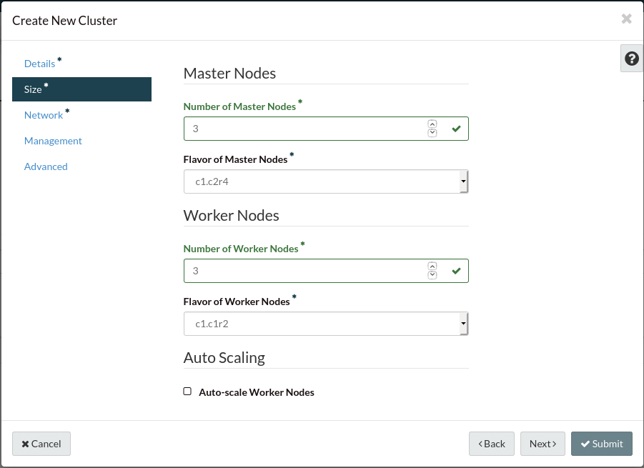
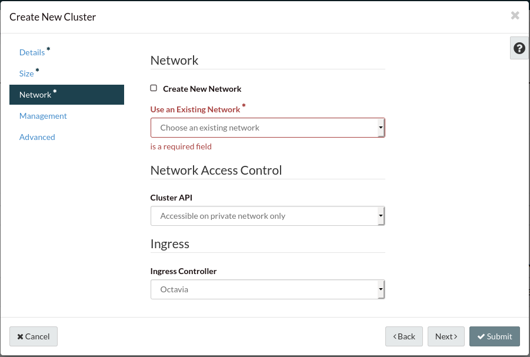

Creating a cluster from the Catalyst Cloud Dashboard
====================================================

One of the ways to create a kubernetes cluster is by using the section on our
dashboard labelled **Clusters** under the **Container Infra** tab. From here
you will see the following screen:

.. image:: _containers_assets/cluster-main-screen.png

This screen gives you an overview of your clusters, their status and how many
clusters you have measured against your quota. To create a new cluster from
here, click on the *+ Create Cluster* button and you will be met with this
screen:

.. image:: _containers_assets/create-cluster.png

Pick a name for your new cluster, add a keypair, choose the region you want
to deploy this cluster in, and choose from the dropdown list one of the
templates that we have available. In our case, we are going to be using
kubernetes-v1.14.10-dev-20200422. Once that is done your screen should look
something like this:

.. image:: _containers_assets/quickstart-template-picked.png

We then move on to the size of our cluster. If you leave these fields free they
will take on the default outlined in the template. But for these purposes we
will deploy this cluster with the recommended minimum for both Master and
Worker nodes, which is three of each.

.. Note::

  When manually selecting a size, make sure that the flavor of your master
  nodes is larger than c1.r1 and that it is larger than the flavor of your
  worker nodes.

Next we have the final required settings which is the network we want to deploy
our cluster on. We can either choose an existing network that we have already
prepared, or create a new network that will be attached to the cluster.
Additionally while in this tab, we can select whether we want our cluster to
be visible from only our private network or visible to the public and we can
choose the type of ingress controller that we want our cluster to utilize.

The other tabs ``management`` and ``advanced`` allow you to set autohealing on
your nodes and add labels to your cluster respectfully.

Once you have set all of these parameters, you can click submit and your
cluster will start being built. This process can take up to 20 minutes
depending on the size of the cluster you are trying to build. Once it is built
however, you will be able to access the cluster in the ways detailed below.

