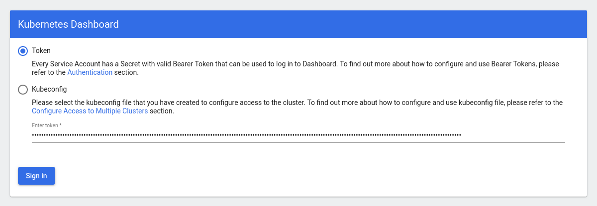
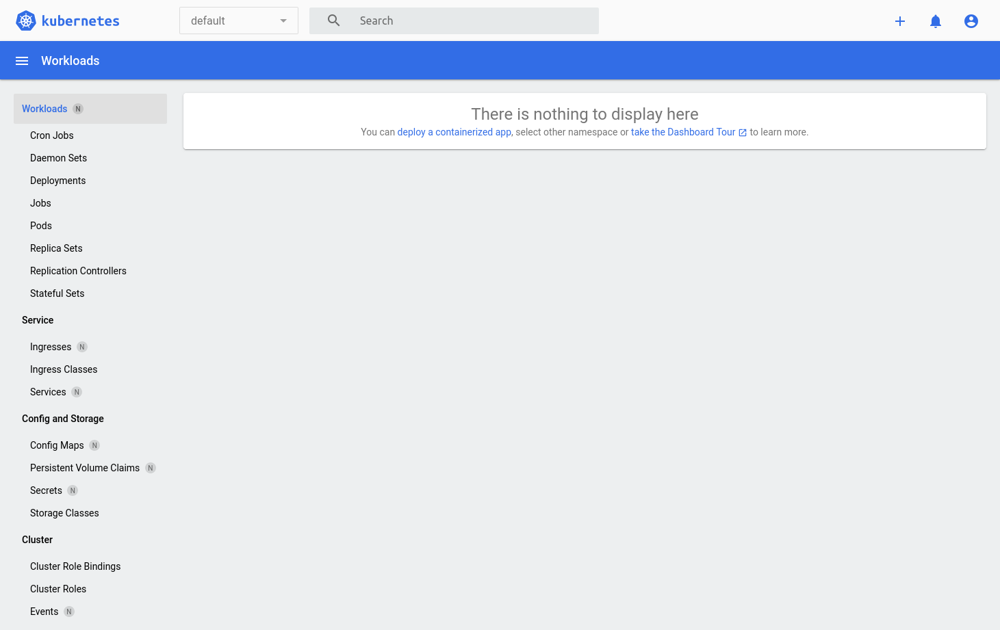

###########
Quick start
###########

This quick start guide assumes you have working knowledge of Catalyst Cloud
:ref:`command-line-interface` and familiarity with Kubernetes.

******************************
Deploying a Kubernetes cluster
******************************

Choosing a cluster template
===========================

A cluster template is a blue-print to build a Kubernetes cluster (similar to
machine images for the compute service). The cluster template specifies what
version of Kubernetes will be installed and the features that will be enabled.

.. Note::

  In order to be able to create a Kubernetes cluster the user needs to ensure
  that they have been allocated the ``heat_stack_owner`` role.

The following command will list all cluster templates available:

.. code-block:: bash

  $ openstack coe cluster template list
  +--------------------------------------+----------------------------------+
  | uuid                                 | name                             |
  +--------------------------------------+----------------------------------+
  | cf6f8cab-8d22-4f38-a88b-25f8a41e5b77 | kubernetes-v1.11.2-dev-20181008  |
  | 53b3e77f-b004-437c-9626-2d25ddb15329 | kubernetes-v1.11.2-prod-20181008 |
  +--------------------------------------+----------------------------------+

Template types
--------------

There are currently two types of templates available on the Catalyst Cloud:

* ``dev`` creates a small Kubernetes cluster with a single master and a single
  worker node. As the name suggests, it should not be used for production.
* ``prod`` creates a Kubernetes cluster with three master nodes (in high
  availability) and three worker nodes.

.. warning::

  Please note that despite having a template called "production", the Kubernetes
  service on the Catalyst Cloud is still in alpha and should not be used for
  production workloads.

Ensure quota is sufficient
==========================

A small quota is sufficient to deploy the production cluster template if your
project is empty. However, if you already have some resources allocated, you
may want to increase your quota to ensure there is sufficient capacity available
to deploy Kubernetes.

By default, the production Kubernetes template allocates:

* 6 compute instances
* 18 vCPUs
* 36 GB of RAM
* 8 floating IPs
* 3 security groups
* 3 volumes
* 60 GB of block storage space

As a ``project admin`` you can change your quota using the `quota management`_
panel in the dashboard.

.. _`quota management`: https://dashboard.cloud.catalyst.net.nz/management/quota/

Creating a cluster
==================

To create a new **development** cluster run the following command:

.. code-block:: bash

  $ openstack coe cluster create k8s-dev-cluster \
  --cluster-template kubernetes-v1.11.2-dev-20181008 \
  --keypair my-ssh-key \
  --node-count 1 \
  --master-count 1

  Request to create cluster c191470e-7540-43fe-af32-ad5bf84940d7 accepted

To create a new **production** cluster, run the following command:

.. code-block:: bash

  $ openstack coe cluster create k8s-prod-cluster \
  --cluster-template kubernetes-v1.11.2-prod-20181008 \
  --keypair my-ssh-key \
  --node-count 3 \
  --master-count 3

  Request to create cluster c191470e-7540-43fe-af32-ad5bf84940d7 accepted

Checking the status of the cluster
==================================

Depending on the template used, it will take 5 to 15 minutes for the cluster to
be created.

You can use the following command to check the status of the cluster:

.. code-block:: bash

  $ openstack coe cluster list
  +--------------------------------------+-------------+----------+------------+--------------+--------------------+
  | uuid                                 | name        | keypair  | node_count | master_count | status             |
  +--------------------------------------+-------------+----------+------------+--------------+--------------------+
  | c191470e-7540-43fe-af32-ad5bf84940d7 | k8s-cluster | testkey  |          1 |            1 | CREATE_IN_PROGRESS |
  +--------------------------------------+-------------+----------+------------+--------------+--------------------+

Please wait until the status changes to ``CREATE_COMPLETE`` to proceed.

*****************************
Setting up the Kubernetes CLI
*****************************

Getting kubectl
===============

Detailed instructions for downloading and setting up the latest version of
kubectl can be found `here`_.

.. _`here`: https://kubernetes.io/docs/tasks/tools/install-kubectl/

Run the following commands to install kubectl on Linux as a static binary:

.. code-block:: bash

  $ curl -LO https://storage.googleapis.com/kubernetes-release/release/$(curl -s \
  https://storage.googleapis.com/kubernetes-release/release/stable.txt)/bin/linux/amd64/kubectl
  $ chmod +x ./kubectl
  $ sudo mv ./kubectl /usr/local/bin/kubectl

******************************
Configuring the Kubernetes CLI
******************************

The kubectl command-line tool uses kubeconfig files to determine how to coonect
to the APIs of the Kubernetes cluster.

Getting the cluster config
==========================

The following command will download the necessary certificates and create a
configuration file on your current directory. It will also export the
``KUBECONFIG`` variable on your behalf:

.. code-block:: bash

  $ eval $(openstack coe cluster config k8s-cluster)

If you wish to save the configuration to a different location you can use the
``--dir <directory_name>`` parameter to select a different destination.

.. Note::

  If you are running multiple clusters, or are deleting and re-creating a
  cluster, it is necessary to ensure that the current ``kubectl configuration``
  is referencing the correct cluster configuration.

Testing the cluster
===================

Once the cluster state is ``CREATE_COMPLETE`` and you have successfully
retrieved the cluster config, you can proceed with deploying your applications
into the cluster using kubectl or whatever your preferred mechanism may be.

As a quick check, you can run the following command to confirm that Kubernetes
is working as expected:

.. code-block:: bash

  $ kubectl cluster-info
  Kubernetes master is running at https://103.254.156.157:6443
  Heapster is running at https://103.254.156.157:6443/api/v1/namespaces/kube-system/services/heapster/proxy
  CoreDNS is running at https://103.254.156.157:6443/api/v1/namespaces/kube-system/services/kube-dns:dns/proxy

**********************************
Accessing the Kubernetes dashboard
**********************************

The Catalyst Kubernetes Service enables the Kubernetes web dashboard by default
(this behaviour can be overwritten if desirable).

In order to access the Kubernetes dashboard, you will need retrieve the admin
token for the cluster using the following command:

::

  $ kubectl -n kube-system describe secret $(kubectl -n kube-system get secret | grep admin-token | awk '{print $1}')
  Name:         admin-token-f5728
  Namespace:    kube-system
  Labels:       <none>
  Annotations:  kubernetes.io/service-account.name=admin
                kubernetes.io/service-account.uid=cc4416d1-ca82-11e8-8993-123456789012

  Type:  kubernetes.io/service-account-token

  Data
  ====
  ca.crt:     1054 bytes
  namespace:  11 bytes
  token:      1234567890123456789012.eyJpc3MiOiJrdWJlcm5ldGVzL3NlcnZpY2VhY2NvdW50Iiwia3ViZXJuZXRlcy5pby9zZXJ2aWNlYWNjb3VudC9uYW1lc3BhY2UiOiJrdWJlLXN5c3RlbSIsImt1YmVybmV0ZXMuaW8vc2VydmljZWFjY291bnQvc2VjcmV0Lm5hbWUiOiJhZG1pbi10b2tlbi1mNTcyOCIsImt1YmVybmV0ZXMuaW8vc2VydmljZWFjY291bnQvc2VydmljZS1hY2NvdW50Lm5hbWUiOiJhZG1pbiIsImt1YmVybmV0ZXMuaW8vc2VydmljZWFjY291bnQvc2VydmljZS1hY2NvdW50LnVpZCI6ImNjNDQxNmQxLWNhODItMTFlOC04OTkzLWZhMTYzZTEwZWY3NiIsInN1YiI6InN5c3RlbTpzZXJ2aWNlYWNjb3VudDprdWJlLXN5c3RlbTphZG1pbiJ9.ngUnhjCOnIQYOAMzyx9TbX7dM2l4ne_AMiJmUDT9fpLGaJexVuq7EHq6FVfdzllgaCINFC2AF0wlxIscqFRWgF1b1SPIdL05XStJZ9tMg4cyr6sm0XXpzgkMLsuAzsltt5GfOzMoK3o5_nqn4ijvXJiWLc4XkQ3_qEPHUtWPK9Jem7p-GDQLfF7IvxafJpBbbCR3upBQpFzn0huZlpgdo46NAuzTT6iKhccnB0IyTFVgvItHtFPFKTUAr4jeuCDNlIVfho99NBSNYM_IwI-jTMkDqIQ-cLEfB2rHD42R-wOEWztoKeuXVkGdPBGEiWNw91ZWuWKkfslYIFE5ntwHgA

In a separate terminal run the ``kubectl proxy`` command to allow for your
browser to connect to the Kubernetes dashboard.

.. code-block:: bash

  $ kubectl proxy
  Starting to serve on 127.0.0.1:8001

Once the proxy is ready, open following URL on your browser:

``http://localhost:8001/api/v1/namespaces/kube-system/services/https:kubernetes-dashboard:/proxy``

You will be presented with a login screen, as illustrated below. Select
``Token`` as the authentication type and paste in the authentication token
acquired in the previous step.

Once successfully authenticated you will be able to view the Kubernetes
dashboard, as illustrated below.

.. _simple_lb_deployment:

***********************************
Deploying a hello world application
***********************************

It is possible to have a loadbalancer created on your behalf by Kubernetes
through the underlying Catalyst Cloud infrastructure services.

For this example we are going to deploy a container running a simple flask app
that will respond with a basic 'Hello World' message that includes the host
name and IP of the node responding to the request. This will sit behind a
loadbalancer that will be publicly available on the internet via a floating ip
and will serve requests to the application servers using the ``round robin``
algorithm.

The container image in question **chelios/helloworld version_1.1** runs the
following application

.. literalinclude:: _containers_assets/app.py

Creating the application deployment
===================================

First we need to create a manifest like this.

.. literalinclude:: _containers_assets/helloworld-deployment_1.yaml

This provides the following parameters for a deployment:

* number of ``replicas`` - 3
* deployment ``image`` - chelios/helloworld version_1.1.
* pod ``labels``, to identify the app to the service - app: helloworld
* ``containerPort`` to expose the application on - 5000

  - This port also uses a name, in this case **helloworld-port**, which
    allows us to refer to it by name rather than value in the service.

To deploy the application run the following command.

.. code-block:: bash

  $ kubectl create -f helloworld-deployment_1.yaml
  deployment.apps/helloworld-deployment created

Check the state of the pods to confirm that they have all been deployed
correctly.

.. code-block:: bash

  $ kubectl get pods
  NAME                                     READY   STATUS              RESTARTS   AGE
  helloworld-deployment-5bdfcbb467-648bd   1/1     Running             0          43s
  helloworld-deployment-5bdfcbb467-wlb6n   0/1     ContainerCreating   0          43s
  helloworld-deployment-5bdfcbb467-zrlvl   1/1     Running             0          43s

Creating the loadbalancer service
=================================

The deployment itself however does not provide a means for us to expose the
application outside of the cluster. In order to do this we need to
create a service to act as a go between.

The manifest for our service definition will look like this.

.. literalinclude:: _containers_assets/helloworld-service.yaml

The parameters of interest here are:

- the ``selector`` which links the service to the app using the label
  **helloworld**.
- The ``port`` that it exposes externally - 80.
- The ``targetPort`` on the pods to link back to, in this case the named port,
  **helloworld-port** that we created on the deployment.

To create the service run the following command.

.. code-block:: bash

  kubectl create -f helloworld-service.yaml
  service/helloworld-service created

The final step is to check on the state of the service and wait until the
loadbalancer is active and the ``LoadBalancer Ingress`` field has received a
publicly accessible floating IP address.

.. code-block:: bash

  kubectl describe svc helloworld-service
  Name:                     helloworld-service
  Namespace:                default
  Labels:                   <none>
  Annotations:              <none>
  Selector:                 app=helloworld
  Type:                     LoadBalancer
  IP:                       10.254.241.125
  LoadBalancer Ingress:     202.49.241.67
  Port:                     <unset>  80/TCP
  TargetPort:               helloworld-port/TCP
  NodePort:                 <unset>  32548/TCP
  Endpoints:                192.168.209.128:5000,192.168.209.129:5000,192.168.43.65:5000
  Session Affinity:         None
  External Traffic Policy:  Cluster
  Events:
    Type     Reason                      Age                From                Message
    ----     ------                      ----               ----                -------
    Normal   EnsuringLoadBalancer        10m (x2 over 12m)  service-controller  Ensuring load balancer
    Normal   EnsuringLoadBalancer        60s                service-controller  Ensuring load balancer

Once your service is in this state you should be able to browse to the IP
address assign to the LoadBalancer Ingress field and see a simple text output
similar to the following.

.. code-block:: bash

  Hello World! From Server : helloworld-deployment-5bdfcbb467-c7rln @ 192.168.209.129

If you refresh the browser you should also see the response update to reflect
different host responses as the loadbalancer attempts to round robin the
requests.
