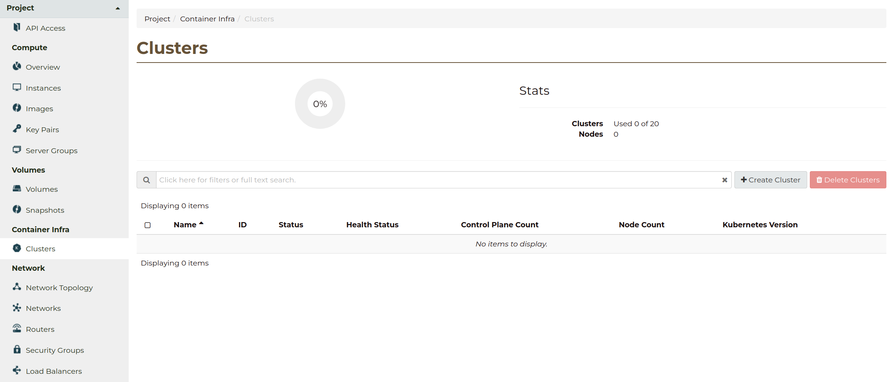
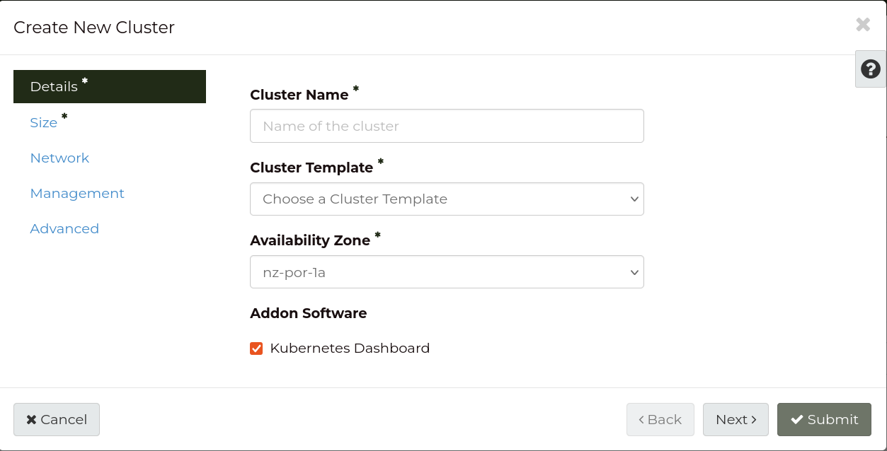
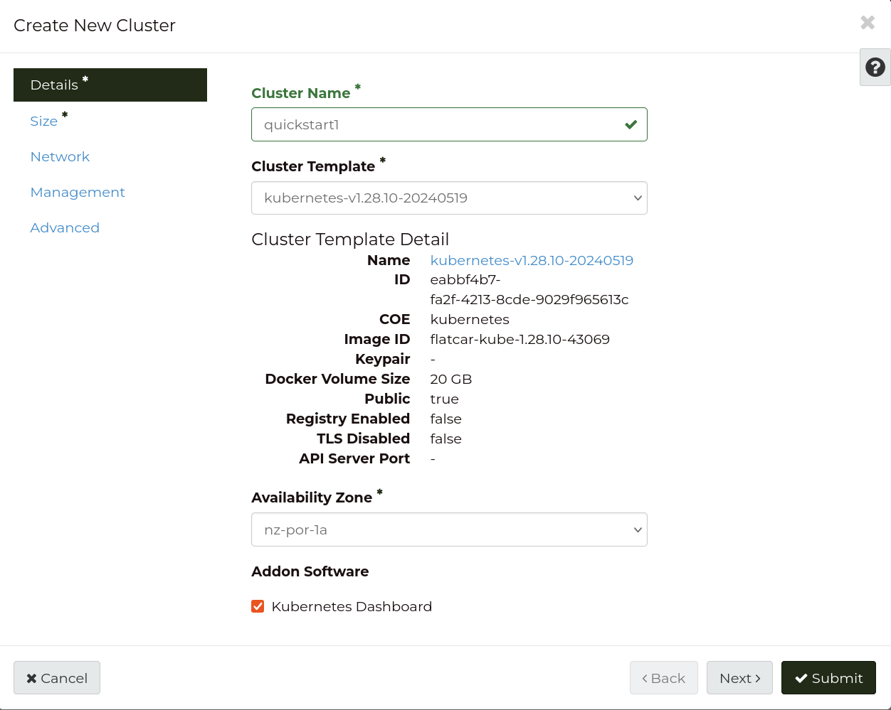
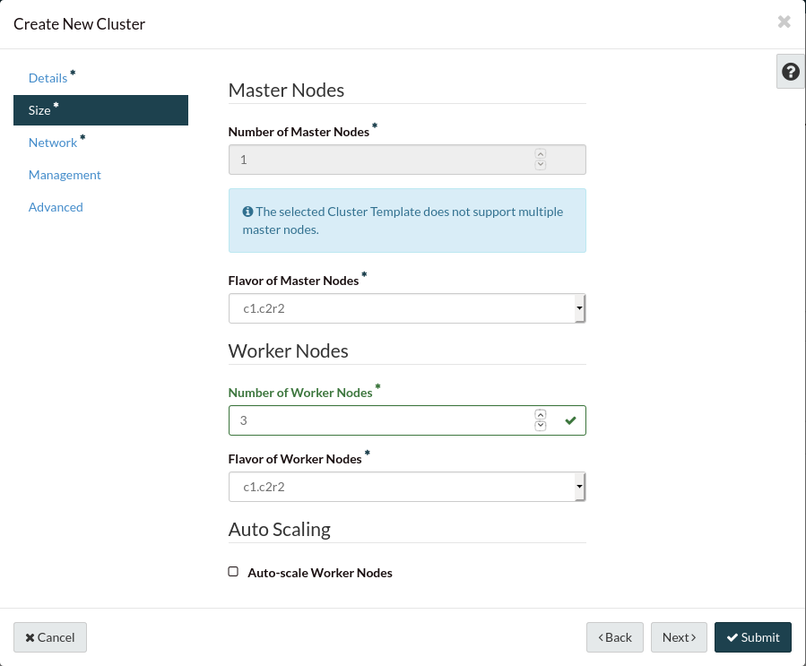
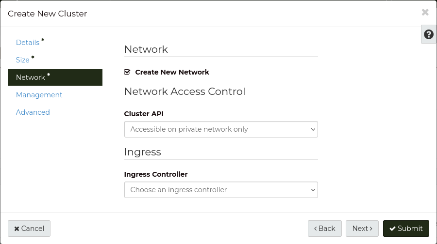
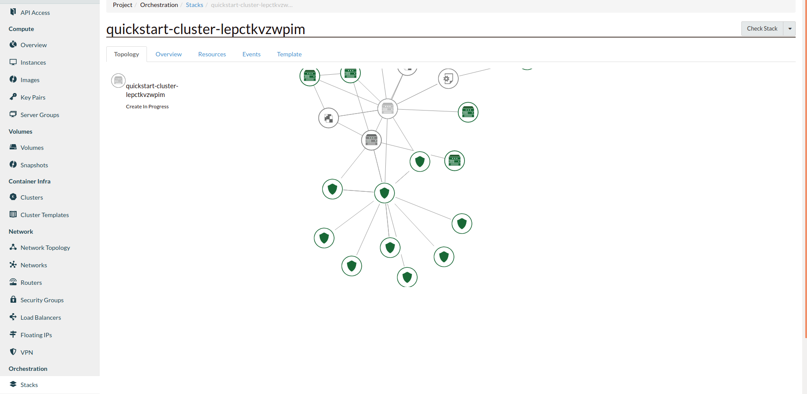
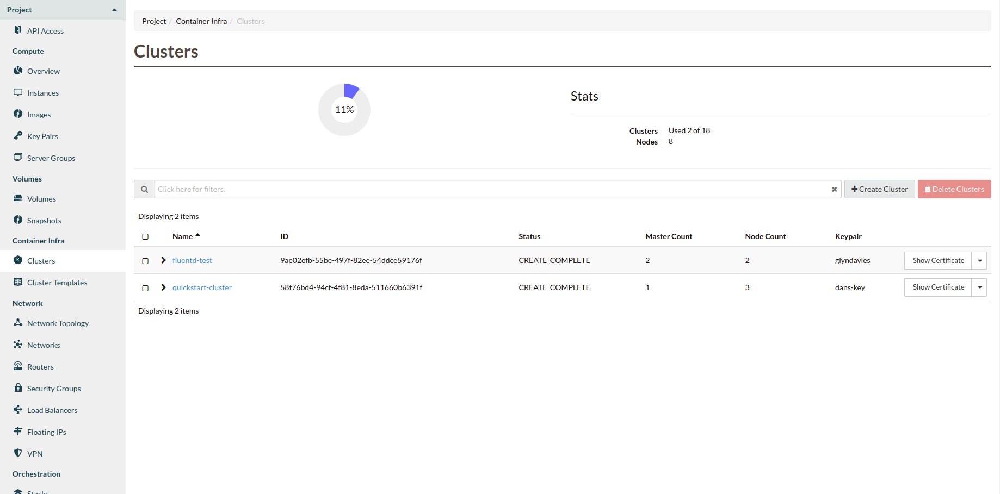

.. _k8s-quickstart:

###########
Quick start
###########

The purpose of this quick start is to help you create a cluster that you can
test and experiment with, so that you can gain a better understanding of how
the Kubernetes platform works. To do this, we are going to be creating a
cluster using the development template with network access from the public
internet. We are using these options because the template creates a small
cluster, meaning less of an operational cost, and the wider access that is
provided by a publicly accessible cluster means that it's easier for us to
conduct tests with multiple people and from multiple locations. However,
because the cluster will be publicly accessible, this guide should **not** be
used to create a production ready cluster.

.. Note::

  This documentation assumes python-magnumclient is 2.12.0 or above please
  refer to the :ref:`upgrading-the-cli` section of the documentation for
  upgrade instructions as we recommend the use of the latest
  version of the CLI to interact with the service.

**************
Pre-requisites
**************

Ensure user has the required privileges
=======================================

In order to create a Kubernetes cluster you need to ensure the user has been
allocated the ``heat_stack_owner`` role.

Ensure quota is sufficient
==========================

A small quota is sufficient to deploy the development cluster template if your
project is empty. However, if you already have some resources allocated, you
may want to increase your quota to ensure there is sufficient capacity
available to deploy Kubernetes.

By default, the development Kubernetes template allocates:

* 4 compute instances
* 8 vCPUs
* 16 GB of RAM
* 4 block storage volumes
* 40 GB of block storage space
* 3 security groups
* 1 load balancer

As a ``project admin`` you can change your quota using the `Quota Management`_
panel in the dashboard, under the Management section.

.. _`Quota Management`: https://dashboard.cloud.catalyst.net.nz/management/quota/

Download and install kubectl
============================

The ``kubectl`` command line tool is the canonical way to interact with
Kubernetes clusters and required by this tutorial. The instructions below can
be used to quickly install ``kubectl`` on Linux as a static binary:

.. code-block:: bash

  $ curl -LO https://storage.googleapis.com/kubernetes-release/release/$(curl -s \
  https://storage.googleapis.com/kubernetes-release/release/stable.txt)/bin/linux/amd64/kubectl
  $ chmod +x ./kubectl
  $ sudo mv ./kubectl /usr/local/bin/kubectl

For other platforms or installation methods, please refer to the `detailed
instructions on how to install kubectl`_.

.. _`detailed instructions on how to install kubectl`: https://kubernetes.io/docs/tasks/tools/install-kubectl/

Choosing a cluster template
===========================

.. Warning::

  In an effort to make the process of getting started with Kubernetes on the
  Catalyst Cloud a much simpler process, we have decided to modify the default
  behaviour of the **development templates** we provide.

  Effective from 1 July 2020, when one of these templates is used in the
  creation of a new cluster it will, by default, provision a **floating IP** on
  the Kubernetes API endpoint meaning that the resulting cluster will be
  **publicly accessible over the internet**. It is possible to restrict access
  to a public cluster, see :ref:`limiting_access` for more details.

  If you wish to revert to the original behaviour of having a private cluster
  please launch your cluster with the following flag
  ``--floating-ip-disabled``

  As a reminder, it is considered best practice that production workloads are
  **not** deployed on a publicly accessible cluster.

A cluster template is a blue-print to build a Kubernetes cluster (similar to
machine images for the compute service). The cluster template specifies what
version of Kubernetes will be installed and the features that will be enabled.
For this quickstart, we are going to be using a development template. In
comparison to a production template, the dev templates are locked to one master
node rather than three and they have smaller sizes for their NVMe volumes.

The following command will list all cluster templates available:

.. code-block:: bash

  $ openstack coe cluster template list
  +--------------------------------------+-----------------------------------+
  | uuid                                 | name                              |
  +--------------------------------------+-----------------------------------+
  | d4715786-441d-4c59-bb0f-XXXXXXXXXXXX | kubernetes-v1.19.6-dev-20210211   |
  | 5c999fc7-715d-4213-9b4e-XXXXXXXXXXXX | kubernetes-v1.19.6-prod-20210211  |
  | 76f3a1ed-d970-40d1-962e-XXXXXXXXXXXX | kubernetes-v1.18.14-dev-20210211  |
  | bef3162b-2a15-4df2-b637-XXXXXXXXXXXX | kubernetes-v1.18.14-prod-20210211 |
  | 7946001d-222b-43fd-8ffa-XXXXXXXXXXXX | kubernetes-v1.17.16-dev-20210211  |
  | 35ec1bbf-c2e1-4cd9-8677-XXXXXXXXXXXX | kubernetes-v1.17.16-prod-20210211 |
  | aadf25a0-46c5-4a40-ac37-XXXXXXXXXXXX | kubernetes-v1.20.4-prod-20210412  |
  +--------------------------------------+-----------------------------------+

We want to use the latest development template (which in the example above is
``kubernetes-v1.19.6-dev-20200615``).

Alternatively, a list of cluster templates can be seen in the
**Cluster Template** dropdown of the **Create New Cluster** dialogue in the
dashboard, under the **Container Infra** section.

.. Note::

  Templates that are from the v1.20.x range onwards use containerd at runtime to
  create a cluster.

.. _dashboard-cluster-creation:

***********************************************
Creating a Kubernetes cluster via the dashboard
***********************************************

The simplest way to create a kubernetes cluster is through the Catalyst Cloud
dashboard. The dashboard allows you to create, manage and monitor the current
status of your clusters. For our quickstart, we are going to stick mostly to
the default development template but we will make some changes through the
process. From the **cluster** screen under the **container infra** tab, you
will see the following:

This screen gives you an overview of your clusters, their status and how many
clusters you have measured against your quota. To create a new cluster from
here, click on the *+ Create Cluster* button:

Pick a name for your new cluster, add a keypair, choose the availability zone
you want to deploy this cluster in, and choose from the dropdown list the
latest development template available. Once that is done your screen should
look something like this:

We then move on to the size of our cluster. If you leave these fields empty
they will take on the defaults outlined in the template, which is fine for our
purposes. Since we have selected a development template, our number of
master nodes is already locked to only one node. If we wanted to we can still
specify the number of worker nodes, for this example we are using three nodes,
which is the default anyway.

.. Note::

  When manually selecting a size, make sure that the flavor of your master
  nodes is larger than c1.r1 if the default has not already been set higher.

Next we have the final required parameter, which is the network we want to
deploy our cluster on. We can either choose an existing network or to create a
new one. Additionally, we can select whether we want our cluster API to be
accessible on the internet or only from our private network.

For our quickstart, we are going to be creating a new network for our cluster
and we are going to make it available publicly:

The other tabs: **management** and **advanced** allow you to set auto healing
on your nodes and use labels to customise more advanced settings and features
of the cluster. There is no need to change anything in these tabs for this
tutorial.

Once you have set all of these parameters, you can click submit and your
cluster will begin creation. This process can take up to 20 minutes
depending on the size of the cluster you are trying to build. You can monitor
the progress of the cluster on the *Stack* screen under the *Orchestration*
tab.

Once the cluster has reached the ``CREATE_COMPLETE`` stage, you will be able
to see it's status on the main *container infra* tab along with any other
clusters you have created in the past.

*****************************************
Creating a Kubernetes cluster via the CLI
*****************************************

If you have already created the cluster using the dashboard, you can safely
skip this step of the tutorial. In this section we illustrate how the same
operation can be done using the more powerful (and easier to automate) CLI.

Before proceeding, please ensure you have :ref:`installed the
CLI<installing_cli_os>` and :ref:`sourced an openrc file
<configuring-the-cli>`.

To create a new **development** cluster that is publicly accessible run the
following command:

.. code-block:: bash

  $ openstack coe cluster create k8s-cluster \
  --cluster-template kubernetes-v1.19.6-dev-20210211 \
  --keypair my-ssh-key \
  --node-count 3 \
  --master-count 1

  Request to create cluster c191470e-7540-43fe-af32-xxxxxxxxxxxx accepted

This command will create a cluster that should be identical to the one we
created using the dashboard method.

.. Note::

  Templates in the v1.20.x series onward need to specify the additional label:
  ``master_lb_floating_ip_enabled=True`` if you want to create a public cluster.

Checking the status of the cluster
==================================

Cluster creation may take up to 20 minutes, depending on the size of the
cluster. You can use the following command to monitor the status of the
cluster:

.. code-block:: bash

  $ openstack coe cluster list
  +--------------------------------------+-------------+----------+------------+--------------+--------------------+
  | uuid                                 | name        | keypair  | node_count | master_count | status             |
  +--------------------------------------+-------------+----------+------------+--------------+--------------------+
  | c191470e-7540-43fe-af32-xxxxxxxxxxxx | k8s-cluster | testkey  |          1 |            1 | CREATE_IN_PROGRESS |
  +--------------------------------------+-------------+----------+------------+--------------+--------------------+

Alternatively, you can check the status of the cluster on the `Clusters`_
panel, in the **Container Infra** section of the Dashboard.

.. _`Clusters`: https://dashboard.cloud.catalyst.net.nz/project/clusters

Once these steps have been followed you will and your cluster state becomes
``CREATE_COMPLETE``, you will be ready to use.

***************************
Interacting with Kubernetes
***************************

Cluster access via the CLI
==========================

The ``kubectl`` command-line tool uses kubeconfig files to determine how to
connect to the APIs of the Kubernetes cluster. The following command will
download the necessary certificates and create a configuration file in your
current directory. It will also export the ``KUBECONFIG`` variable on your
behalf:

.. code-block:: bash

  $ eval $(openstack coe cluster config k8s-cluster)

.. note::

  If you close your terminal session, the ``$KUBECONFIG`` variable exported by
  the command above will be lost. For convenience, you may want to add this
  environment variable to your shell profile, so it is always set.

If you wish to save the configuration to a different location you can use the
``--dir <directory_name>`` parameter to select a different destination.

.. warning::

  If you are running multiple clusters, or are deleting and re-creating a
  cluster, it is necessary to ensure that the current ``kubectl configuration``
  is referencing the correct cluster configuration.

Once we have the CLI configured by pointing the ``$KUBECONFIG`` variable to a
configuration file, we can then begin to use ``kubectl`` to interact with the
cluster. To test everything works, we can issue a simple command to show the
details of the cluster:

.. code-block:: bash

  $ kubectl cluster-info
  Kubernetes master is running at https://103.254.156.157:6443
  CoreDNS is running at https://103.254.156.157:6443/api/v1/namespaces/kube-system/services/kube-dns:dns/proxy

  To further debug and diagnose cluster problems, use 'kubectl cluster-info dump'.

In order to view more in depth information about the cluster simply add the
dump option to the above example. This generates output suitable for debugging
and diagnosing cluster problems. By default, it redirects everything to stdout.

.. code-block:: bash

  $ kubectl cluster-info dump

Cluster access via the Kubernetes dashboard
===========================================

.. include:: dashboard-access.rst

.. _simple_lb_deployment:

*********************************
Running a hello world application
*********************************

For this example we are going to deploy a container running a simple flask app
that will respond with a basic 'Hello World' message that includes the host
name and IP of the node responding to the request. This will sit behind a
loadbalancer that will be publicly available on the internet via a floating ip
and will serve requests to the application servers using the **round robin**
algorithm.

The container image in question (**catalystcloud/helloworld version_1.1**) will
be pulled by Kubernetes from the Docker Hub. The code below illustrates what
this simple flask application does (there is no need to copy it):

.. literalinclude:: _containers_assets/app.py

Creating the application deployment
===================================

First we need to create a manifest like this. If you're following along with
this example you should save this file as ``helloworld-deployment_1.yaml``

.. literalinclude:: _containers_assets/helloworld-deployment_1.yaml

Note how the deployment specifies three replicas and exposes the application on
port 8080.

To deploy the application run the following command:

.. code-block:: bash

  $ kubectl create -f helloworld-deployment_1.yaml
  deployment.apps/helloworld-deployment created

Check the state of the pods to confirm that they have all been deployed
correctly. Once the status of all pods is ``Running`` you can continue to the
next section.

.. code-block:: bash

  $ kubectl get pods
  NAME                                     READY   STATUS              RESTARTS   AGE
  helloworld-deployment-5bdfcbb467-648bd   1/1     Running             0          43s
  helloworld-deployment-5bdfcbb467-wlb6n   0/1     ContainerCreating   0          43s
  helloworld-deployment-5bdfcbb467-zrlvl   1/1     Running             0          43s

Creating the loadbalancer service
=================================

The deployment itself however does not provide a means for us to expose the
application outside of the cluster. In order to do this we need to create a
service to act as a go between.

The manifest for our service definition will look like this.

.. literalinclude:: _containers_assets/helloworld-service.yaml

Note how it binds to port 80 TCP and uses a selector to direct traffic to pods
that match the label ``helloworld``.

To create the service run the following command.

.. code-block:: bash

  kubectl create -f helloworld-service.yaml
  service/helloworld-service created

Behind the scenes, Kubernetes will create a load balancer on the Catalyst Cloud
and configure it to direct traffic to the application pods inside the cluster.

The final step is to check on the state of the service and wait until the
loadbalancer is active and the ``LoadBalancer Ingress`` field has received a
publicly accessible floating IP address.

.. code-block:: bash

  kubectl describe svc helloworld-service
  Name:                     helloworld-service
  Namespace:                default
  Labels:                   <none>
  Annotations:              <none>
  Selector:                 app=helloworld
  Type:                     LoadBalancer
  IP:                       10.254.241.125
  LoadBalancer Ingress:     202.49.241.67
  Port:                     <unset>  80/TCP
  TargetPort:               helloworld-port/TCP
  NodePort:                 <unset>  32548/TCP
  Endpoints:                192.168.209.128:8080,192.168.209.129:8080,192.168.43.65:8080
  Session Affinity:         None
  External Traffic Policy:  Cluster
  Events:
    Type     Reason                      Age                From                Message
    ----     ------                      ----               ----                -------
    Normal   EnsuringLoadBalancer        10m (x2 over 12m)  service-controller  Ensuring load balancer
    Normal   EnsuringLoadBalancer        60s                service-controller  Ensuring load balancer

Once your service is in this state you should be able to browse to the IP
address shown in the LoadBalancer Ingress field and see a simple text output
similar to the following.

.. code-block:: bash

  Hello World! From Server : helloworld-deployment-5bdfcbb467-c7rln @ 192.168.209.129

If you refresh the browser you should also see the response update to reflect
different host responses as the load balancer attempts to round robin the
requests.
