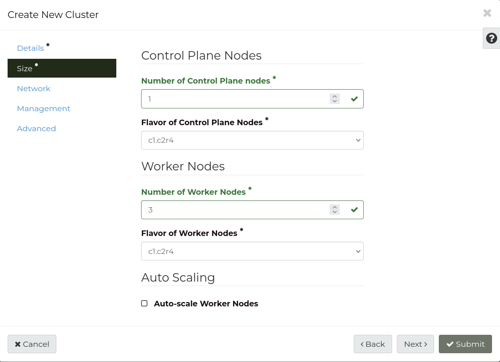
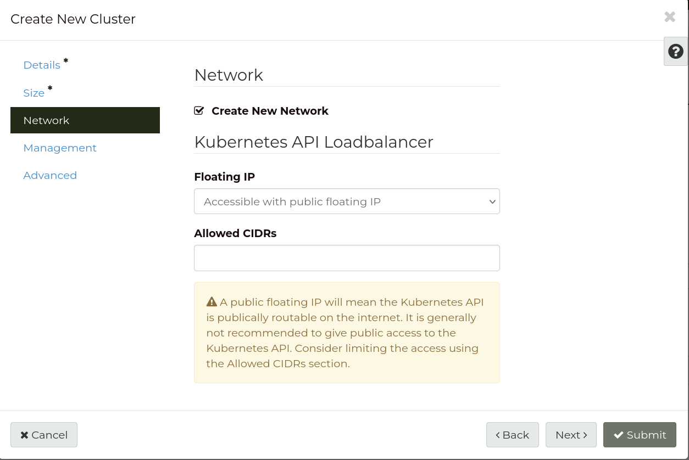
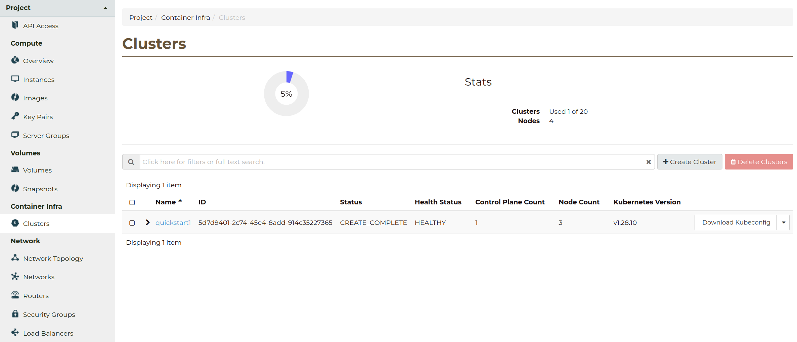

.. _k8s-quickstart:

###########
Quick Start
###########

In this guide, we will create a Kubernetes cluster using the dashboard,
and deploy a simple application to it.

.. warning::

  The Kubernetes cluster deployed in this guide is not intended
  to be used for production workloads.

*************
Prerequisites
*************

Ensure user has the required privileges
=======================================

In order to manage Kubernetes clusters, your Catalyst Cloud user account
must be allocated the following roles in the project:

* The :ref:`project_member_role` (``_member_``) role, for viewing, creating and deleting
  Kubernetes clusters using the Catalyst Cloud CLI or dashboard.
* The :ref:`Kubernetes Admin <k8s-rbac-roles>` (``k8s_admin``) role, for granting
  access to download the **kubeconfig** file, which is required to interact
  with Kubernetes using the ``kubectl`` tool or the Kubernetes dashboard.

.. note::

  User roles for Kubernetes RBAC are separate from the standard roles.
  To interact with Kubernetes after your cluster is created,
  even Project Admins need to grant themselves the appropriate roles.

  For more information, please refer to :ref:`kubernetes-user-access`.

Ensure quota is sufficient
==========================

A small quota is sufficient to deploy the development cluster template if your
project is empty. However, if you already have some resources allocated, you
may want to increase your quota to ensure there is sufficient capacity
available to deploy Kubernetes.

By default, Kubernetes templates allocate:

* 4 compute instances
* 8 vCPUs
* 16 GB of RAM
* 4 block storage volumes
* 40 GB of block storage space
* 3 security groups
* 1 load balancer

As a :ref:`project_admin_role` you can change your quota using the `Quota Management`_
panel in the dashboard, under the Management section.

.. _`Quota Management`: https://dashboard.catalystcloud.nz/management/quota/

.. _dashboard-cluster-creation:

Install the required tools
==========================

This Quick Start guide for the most part involves using the Catalyst Cloud and Kubernetes
dashboards to perform tasks, but some specific steps require use of command line tools.

Please make sure you have:

* Installed the :ref:`Catalyst Cloud command line tools <sdks_and_toolkits>`, and sourced
  the OpenRC file for your project in your terminal session.
* Downloaded and installed `kubectl <https://kubernetes.io/releases/download/#kubectl>`__,
  the Kubernetes command line client.

*****************************
Creating a Kubernetes cluster
*****************************

The Catalyst Cloud dashboard allows you to create, manage and monitor
the current status of your clusters.

From the **Clusters** page under the **Container Infra** tab, you
will see the following:

This page gives you an overview of your clusters, their status and how many
clusters you have, measured against your quota.

To create a new cluster, click the **+ Create Cluster** button:

Pick a **Name** for your new cluster, select a **Keypair** to use, and choose the
latest **Cluster Template** available from the drop-down list.

.. note::

  If you do not yet have a keypair available, you can add one by
  :ref:`creating a new keypair <creating-keypair>`, or
  :ref:`importing an existing keypair <importing-keypair>`.

Once that is done your screen should look something like this:

.. image:: _containers_assets/quickstart-template-picked.png
    :align: center

Next, select the **Size** tab to configure the size and number of nodes in the cluster.

There are two types of nodes in Catalyst Cloud Kubernetes clusters:
**Control Plane Nodes** (referred to in the dashboard as **Master Nodes**), and **Worker Nodes**.

Control Plane Nodes are where the Kubernetes control plane is hosted,
and Worker Nodes run the container deployments uploaded to Kubernetes.

You may create any number of Worker Nodes, however Control Plane Nodes
must be created with an uneven number e.g. 1, 3 or 5.

In the example below, the cluster will be created with **1** Control Plane Node and **3** Worker Nodes.

The flavors of the Control Plane Nodes and Worker Nodes
can also be configured individually. For this guide we will use the default values.

Select the **Network** tab to configure the cluster's network access.

A few options are available here, but for this guide, just make sure that
**Create New Network** is checked (the default), to create a new virtual network for the cluster.

Finally, select the **Advanced** tab to set one more option.

To enable access to the Kubernetes API from the public Internet,
add the following label to **Additional Labels**:

.. code-block:: bash

  master_lb_floating_ip_enabled=true

The form should be filled out like this:

.. image:: _containers_assets/quickstart-advanced.png
    :align: center

That should be everything you need to configure,
so press the **Submit** button to create the cluster.

You will be returned to the **Clusters** page, where you can monitor the state
of your Kubernetes clusters. Our new cluster should be listed,
in ``CREATE_IN_PROGRESS`` state.

Creating a new Kubernetes cluster can take up to 20 minutes,
depending on the size of the cluster you are trying to build.

Once the cluster has reached the ``CREATE_COMPLETE`` state, it is now up and running,
and you can start using it.

***************************
Interacting with Kubernetes
***************************

.. _quickstart-configuring-kubectl:

Configuring ``kubectl``
=======================

The `kubectl <https://kubernetes.io/docs/reference/kubectl/kubectl>`__ tool allows you
to interact with your Catalyst Cloud Kubernetes cluster using the command line.

As the Kubernetes dashboard of our cluster is not directly accessible from the Internet,
we will use ``kubectl`` to gain access to the Kubernetes dashboard.

First, run the following commands to create the **kubeconfig** file.
The kubeconfig file contains the required metadata used to authenticate
with the Kubernetes cluster.

.. tabs::

    .. group-tab:: Linux / macOS

      .. note::

        In the below examples, the kubeconfig file will be created in the current folder
        of your terminal session.

        If you wish to save the configuration to a different location, replace ``$(pwd)``
        with your preferred destination folder.

      The following command will create the kubeconfig in the target directory
      with the filename ``config``.

      .. code-block:: bash

        openstack coe cluster config quickstart-cluster --use-keystone --dir "$(pwd)"

      Now export the ``KUBECONFIG`` environment variable, to configure ``kubectl``
      to connect to your cluster.

      .. code-block:: bash

        export KUBECONFIG="$(pwd)/config"

    .. group-tab:: Windows (PowerShell)

      .. note::

        In the below examples, the kubeconfig file will be created in the current folder
        of your terminal session.

        If you wish to save the configuration to a different location, replace ``$pwd``
        with your preferred destination folder.

      The following command will create the kubeconfig in the target directory
      with the filename ``config``.

      .. code-block:: powershell

        openstack coe cluster config quickstart-cluster --use-keystone --dir $pwd

      Now define the ``KUBECONFIG`` environment variable, to configure ``kubectl``
      to connect to your cluster.

      .. code-block:: powershell

        $Env:KUBECONFIG = $pwd\config

    .. group-tab:: Windows (Command Prompt)

      .. note::

        In the below examples, the kubeconfig file will be created in the current folder
        of your terminal session.

        If you wish to save the configuration to a different location, replace ``%cd%``
        with your preferred destination folder.

      The following command will create the kubeconfig in the target directory
      with the filename ``config``.

      .. code-block:: bat

        openstack coe cluster config quickstart-cluster --use-keystone --dir %cd%

      Now define the ``KUBECONFIG`` environment variable, to configure ``kubectl``
      to connect to your cluster.

      .. code-block:: bat

        set KUBECONFIG=%cd%\config

.. note::

  The kubeconfig file uses the Catalyst Cloud authentication token in your terminal's environment
  (provided by the OpenRC file) to authenticate with the Kubernetes API.

  To be able to use ``kubectl``, your OpenRC file for the project must be sourced
  (already done if you successfully created the kubeconfig),
  **and** the ``KUBECONFIG`` environment variable must be defined.

Once we have the CLI configured, we can then begin to use ``kubectl`` to interact with the
cluster.

To test everything works, run the ``kubectl cluster-info`` command to
show the details of the cluster:

.. code-block:: console

  $ kubectl cluster-info
  Kubernetes control plane is running at https://192.0.2.1:6443
  CoreDNS is running at https://192.0.2.1:6443/api/v1/namespaces/kube-system/services/kube-dns:dns/proxy

  To further debug and diagnose cluster problems, use 'kubectl cluster-info dump'.

Accessing the Kubernetes dashboard
==================================

Now that we have ``kubectl`` available, we can access the Kubernetes dashboard.

.. tabs::

    .. group-tab:: Linux / macOS

      In the currently open terminal (with your OpenRC file sourced), run the following command
      to fetch the authentication token from the environment, and copy it to the clipboard.

      We will use this once the dashboard is open.

      .. code-block:: bash

        echo $OS_TOKEN

    .. group-tab:: Windows (PowerShell)

      In the currently open terminal (with your OpenRC file sourced), run the following command
      to fetch the authentication token from the environment, and copy it to the clipboard.

      We will use this once the dashboard is open.

      .. code-block:: powershell

        echo $Env:OS_TOKEN

    .. group-tab:: Windows (Command Prompt)

      In the currently open terminal (with your OpenRC file sourced), run the following command
      to fetch the authentication token from the environment, and copy it to the clipboard.

      We will use this once the dashboard is open.

      .. code-block:: bat

        echo %OS_TOKEN%

Now run the following command in the same terminal window:

.. code-block:: bash

  kubectl proxy

This starts a proxy session which allows you to access the dashboard.

.. code-block:: console

  $ kubectl proxy
  Starting to serve on 127.0.0.1:8001

Once the proxy is running, open the following URL in your browser:

http://localhost:8001/api/v1/namespaces/kubernetes-dashboard/services/https:kubernetes-dashboard:https/proxy

You will be presented with a login screen, as shown below. Select
**Token** as the authentication type and paste in the authentication token
acquired in the previous steps.

.. image:: _containers_assets/kubernetes_dashboard_login.png
    :align: center

Press **Sign in** to login, and you should now have the Kubernetes dashboard open in your browser.

.. image:: _containers_assets/kubernetes_dashboard1.png
   :align: center

.. _simple_lb_deployment:

***************************
Running a basic application
***************************

Let's try creating a deployment for a basic application on Kubernetes.

First, click the **+** button in the top right of the dashboard
to open the **Create new resource** form.

.. image:: _containers_assets/kubernetes-create-new-resource-button.png
   :align: center

Select **Create from input**, and paste the following YAML into the form.

This YAML creates a new deployment called ``quickstart-nginx``,
which consists of a single ``nginx`` web server, serving the default test page via HTTP (port 80).

.. code-block:: yaml

  apiVersion: apps/v1
  kind: Deployment
  metadata:
    name: quickstart-nginx
    labels:
      app: quickstart-nginx
  spec:
    replicas: 1
    selector:
      matchLabels:
        app: quickstart-nginx
    template:
      metadata:
        labels:
          app: quickstart-nginx
      spec:
        containers:
        - name: nginx
          image: nginx:latest
          ports:
          - containerPort: 80

The filled in form should look like this:

.. image:: _containers_assets/kubernetes-create-new-resource-page.png
   :align: center

Press **Upload** to create the deployment.

You will now directed back to the home page, where the new deployment
will be tracked in real time:

.. image:: _containers_assets/kubernetes-create-new-resource-complete.png
   :align: center

Let's check that our new application is working properly.
This application is not accessible from the Internet, so we will need to
create a port forward from the local machine to the application in the cluster.

Since the terminal window we have been using is currently running the
``kubectl proxy`` command for the Kubernetes dashboard,
open a new terminal window.
Make sure to source your OpenRC file, and set the ``KUBECONFIG``
environment variable (as shown in :ref:`quickstart-configuring-kubectl`).

Then, run the following command to create the port forward to the application:

.. code-block:: bash

  kubectl port-forward deployment/quickstart-nginx 8888:80

This maps port 80 from the application to port 8888 on the local machine.

.. code-block:: console

  $ kubectl port-forward deployment/quickstart-nginx 8888:80
  Forwarding from 127.0.0.1:8888 -> 80
  Forwarding from [::1]:8888 -> 80

You should now be able to open the following URL and access the application:

http://localhost:8888

If the following page is returned, congratulations!
Your first deployment on a Catalyst Cloud Kubernetes cluster is working correctly.

.. image:: _containers_assets/nginx-test-page.png
   :align: center
