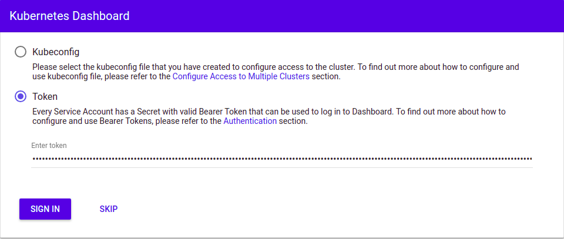

###########
Quick start
###########

This quick start guide assumes you have working knowledge of Catalyst Cloud
:ref:`command-line-interface` and familiarity with Kubernetes.

******************************
Deploying a Kubernetes cluster
******************************

Choosing a cluster template
===========================

A cluster template is a blue-print to build a Kubernetes cluster (similar to
machine images for the compute service). The cluster template specifies what
version of Kubernetes will be installed and the features that will be enabled.

The following command will list all cluster templates available:

.. code-block:: bash

  $ openstack coe cluster template list
  +--------------------------------------+----------------------------------+
  | uuid                                 | name                             |
  +--------------------------------------+----------------------------------+
  | cf6f8cab-8d22-4f38-a88b-25f8a41e5b77 | kubernetes-v1.11.2-dev-20181008  |
  | 53b3e77f-b004-437c-9626-2d25ddb15329 | kubernetes-v1.11.2-prod-20181008 |
  +--------------------------------------+----------------------------------+

Template types
--------------

There are currently two types of templates available on the Catalyst Cloud:

* ``dev`` creates a small Kubernetes cluster with a single master and a single
  worker node. As the name suggests, it should not be used for production.
* ``prod`` creates a Kubernetes cluster with three master nodes (in high
  availability) and three worker nodes.

.. warning::

  Please note that despite having a template called "production", the Kubernetes
  service on the Catalyst Cloud is still in alpha and should not be used for
  production workloads.

Creating a cluster
==================

To create a new **development** cluster run the following command:

.. code-block:: bash

  $ openstack coe cluster create k8s-dev-cluster \
  --cluster-template kubernetes-v1.11.2-dev-20181008 \
  --keypair my-ssh-key \
  --node-count 1 \
  --master-count 1

  Request to create cluster c191470e-7540-43fe-af32-ad5bf84940d7 accepted

To create a new **production** cluster, run the following command:

.. code-block:: bash

  $ openstack coe cluster create k8s-prod-cluster \
  --cluster-template kubernetes-v1.11.2-prod-20181008 \
  --keypair my-ssh-key \
  --node-count 3 \
  --master-count 3

  Request to create cluster c191470e-7540-43fe-af32-ad5bf84940d7 accepted

Checking the status of the cluster
==================================

Depending on the template used, it will take 5 to 15 minutes for the cluster to
be created.

You can use the following command to check the status of the cluster:

.. code-block:: bash

  $ openstack coe cluster list
  +--------------------------------------+-------------+----------+------------+--------------+--------------------+
  | uuid                                 | name        | keypair  | node_count | master_count | status             |
  +--------------------------------------+-------------+----------+------------+--------------+--------------------+
  | c191470e-7540-43fe-af32-ad5bf84940d7 | k8s-cluster | testkey  |          1 |            1 | CREATE_IN_PROGRESS |
  +--------------------------------------+-------------+----------+------------+--------------+--------------------+

Please wait until the status changes to ``CREATE_COMPLETE`` to proceed.

*****************************
Setting up the Kubernetes CLI
*****************************

Getting kubectl
===============

Detailed instructions for downloading and setting up the latest version of
kubectl can be found `here`_.

.. _`here`: https://kubernetes.io/docs/tasks/tools/install-kubectl/

Run the following commands to install kubectl on Linux as a static binary:

.. code-block:: bash

  $ curl -LO https://storage.googleapis.com/kubernetes-release/release/$(curl -s \
  https://storage.googleapis.com/kubernetes-release/release/stable.txt)/bin/linux/amd64/kubectl
  $ chmod +x ./kubectl
  $ sudo mv ./kubectl /usr/local/bin/kubectl

******************************
Configuring the Kubernetes CLI
******************************

The kubectl command-line tool uses kubeconfig files to determine how to coonect
to the APIs of the Kubernetes cluster.

Getting the cluster config
==========================

The following command will download the necessary certificates and create a
configuration file on your current directory. It will also export the
``KUBECONFIG`` variable on your behalf:

.. code-block:: bash

  $ eval $(openstack coe cluster config k8s-cluster)

If you wish to save the configuration to a different location you can use the
``--dir <directory_name>`` parameter to select a different destination.

.. Note::

  If you are running multiple clusters, or are deleting and re-creating a
  cluster, it is necessary to ensure that the current ``kubectl configuration``
  is referencing the correct cluster configuration.

Testing the cluster
===================

Once the cluster state is ``CREATE_COMPLETE`` and you have successfully
retrieved the cluster config, you can proceed with deploying your applications
into the cluster using kubectl or whatever your preferred mechanism may be.

As a quick check, you can run the following command to confirm that Kubernetes
is working as expected:

.. code-block:: bash

  $ kubectl cluster-info
  Kubernetes master is running at https://103.254.156.157:6443
  Heapster is running at https://103.254.156.157:6443/api/v1/namespaces/kube-system/services/heapster/proxy
  CoreDNS is running at https://103.254.156.157:6443/api/v1/namespaces/kube-system/services/kube-dns:dns/proxy

**********************************
Accessing the Kubernetes dashboard
**********************************

The Catalyst Kubernetes Service enables the Kubernetes web dashboard by default
(this behaviour can be overwritten if desirable).

In order to access the Kubernetes dashboard, you will need retrieve the admin
token for the cluster using the following command:

::

  $ kubectl -n kube-system describe secret $(kubectl -n kube-system get secret | grep admin-token | awk '{print $1}')
  Name:         admin-token-f5728
  Namespace:    kube-system
  Labels:       <none>
  Annotations:  kubernetes.io/service-account.name=admin
                kubernetes.io/service-account.uid=cc4416d1-ca82-11e8-8993-123456789012

  Type:  kubernetes.io/service-account-token

  Data
  ====
  ca.crt:     1054 bytes
  namespace:  11 bytes
  token:      1234567890123456789012.eyJpc3MiOiJrdWJlcm5ldGVzL3NlcnZpY2VhY2NvdW50Iiwia3ViZXJuZXRlcy5pby9zZXJ2aWNlYWNjb3VudC9uYW1lc3BhY2UiOiJrdWJlLXN5c3RlbSIsImt1YmVybmV0ZXMuaW8vc2VydmljZWFjY291bnQvc2VjcmV0Lm5hbWUiOiJhZG1pbi10b2tlbi1mNTcyOCIsImt1YmVybmV0ZXMuaW8vc2VydmljZWFjY291bnQvc2VydmljZS1hY2NvdW50Lm5hbWUiOiJhZG1pbiIsImt1YmVybmV0ZXMuaW8vc2VydmljZWFjY291bnQvc2VydmljZS1hY2NvdW50LnVpZCI6ImNjNDQxNmQxLWNhODItMTFlOC04OTkzLWZhMTYzZTEwZWY3NiIsInN1YiI6InN5c3RlbTpzZXJ2aWNlYWNjb3VudDprdWJlLXN5c3RlbTphZG1pbiJ9.ngUnhjCOnIQYOAMzyx9TbX7dM2l4ne_AMiJmUDT9fpLGaJexVuq7EHq6FVfdzllgaCINFC2AF0wlxIscqFRWgF1b1SPIdL05XStJZ9tMg4cyr6sm0XXpzgkMLsuAzsltt5GfOzMoK3o5_nqn4ijvXJiWLc4XkQ3_qEPHUtWPK9Jem7p-GDQLfF7IvxafJpBbbCR3upBQpFzn0huZlpgdo46NAuzTT6iKhccnB0IyTFVgvItHtFPFKTUAr4jeuCDNlIVfho99NBSNYM_IwI-jTMkDqIQ-cLEfB2rHD42R-wOEWztoKeuXVkGdPBGEiWNw91ZWuWKkfslYIFE5ntwHgA

In a separate terminal run the ``kubectl proxy`` command to allow for your
browser to connect to the Kubernetes dashboard.

.. code-block:: bash

  $ kubectl proxy
  Starting to serve on 127.0.0.1:8001

Once the proxy is ready, open following URL on your browser:
http://localhost:8001/api/v1/namespaces/kube-system/services/https:kubernetes-dashboard:/proxy

You will be presented with a login screen, as illustrated below. Select
**Token** as the authentication type and paste in the authentication token
acquired in the previous step.

Once successfully authenticated you will be able to view the Kubernetes
dashboard, as illustrated below.

.. image:: _containers_assets/kubernetes_dashboard1.png
   :align: center
