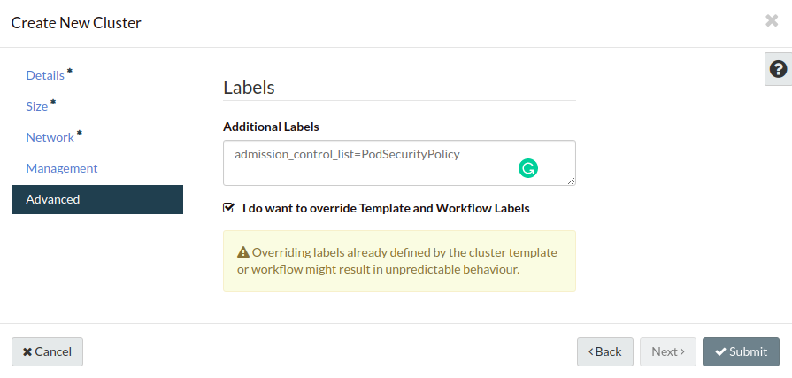

########
Security
########

*****************
Admission Control
*****************

After Kubernetes API server received API request from client side, and just
before persisting the resource in etcd, there are a list of admission controller
which will intercepts the API request to validate and/or mutate the request.
Please refer `Kubernetes official document`_ for the full list of admission controller.

.. _`Kubernetes official document`: https://kubernetes.io/docs/reference/access-authn-authz/admission-controllers/

Catalyst Cloud Kubernetes Service does support setting admission controllers
when create a new cluster by specifying labels. In Kubernetes v1.18.x, below
admission controllers are enabled by default:

* NamespaceLifecycle
* LimitRanger
* ServiceAccount
* TaintNodesByCondition
* Priority
* DefaultTolerationSeconds
* DefaultStorageClass
* StorageObjectInUseProtection
* PersistentVolumeClaimResize
* RuntimeClass
* CertificateApproval
* CertificateSigning
* CertificateSubjectRestriction
* DefaultIngressClass
* MutatingAdmissionWebhook
* ValidatingAdmissionWebhook
* ResourceQuota

How to override admission controllers
=====================================

There are some other useful admission controller can be enabled to enhance
the security of Kubernetes cluster. To override existing admission controllers,
user can do it by either command line or dashboard with label
``admission_control_list``.

Command Line
~~~~~~~~~~~~

With command line, when creating a new Kubernetes cluster, please use label
``admission_control_list`` and make sure --merge-labels used as well.

.. code-block:: bash

  openstack coe cluster create k8s-1 --merge-labels --labels admission_control_list=NamespaceLifecycle,LimitRanger,SecurityContextDeny,ServiceAccount,ResourceQuota,PodSecurityPolicy --cluster-template kubernetes-v1.18.2-prod-20200630

.. Note::
  To override the default admission controller list, you have to provider
  the full list you want to apply. For instance, in above example, you also
  need to at least provide admission controller like ServiceAccount, NamespaceLifecycle
  and etc to make sure it won't break the cluster bootstrap. We recommend to
  at least include these admission controllers: ``NamespaceLifecycle``, ``LimitRanger``,
  ``SecurityContextDeny``, ``ServiceAccount``, ``ResourceQuota``.

Dashboard
~~~~~~~~~

When using dashboard to create Kubernetes cluster, on the last Advanced tag,
you can set additional labels as below:

