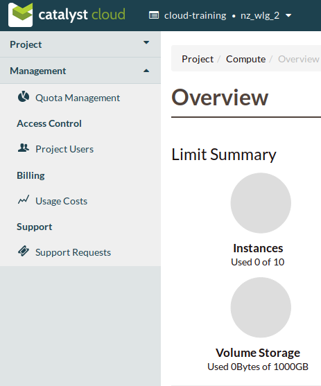

##########
Management
##########

The Management portal is available from the left hand menu of the cloud dashboard. For a standard
user, that is someone that does not have one of the administrator roles of ``Project Admin``
or ``Project Moderator`` assigned to them, only the following options are available:

- Billing - Usage Costs
- Support - Support Requests

.. image:: _static/menu_non-admin.png

|

For a user that does have an admin role assigned to their user account it also provides access to:

- Quota Management
- Access Control - Project Users

.. note::

    The **Project Admin** role is given to the person that signed up for the account.

****************
Quota Management
****************

Catalyst provides the ability to manage your own project resource quotas on a per region basis.

The **Current Quotas** block provides a view of the current quota limits that are applied to each
region in the current project. It also shows the available **Preapproved Quota Sizes** that can be
selected and the actions that can be taken for the quota in each region.

.. image:: _static/current_quotas.png

|

By clicking on the *View Size* action on the **Quota Sizes** table it is possible to see a
breakdown of the limits for each resource within that quota band.

.. image:: _static/quota_sizes.png

|

Finally the **Previous Quota Changes** gives a historical view of any quota adjustments that have
been made within the current project.

.. image:: _static/previous_quota_changes.png

|

Updating a Quota
================
To change the current quota limit for a given region, click on the *Update Quota* action, the
following form will be displayed

.. image:: _static/update_quota_sizes.png

|

Select the new quota value and click submit

.. image:: _static/increase_quota.png

|

If your requested change does not fall into the preapproved category the **Previous Quota Changes**
area will display a message showing the current state of your request.

.. image:: _static/pending_change.png

|

For preapproved and accepted changes the display will update to show the new *Current Quota Size*
next to the appropriate region and the **Previous Quota Changes** will

.. image:: _static/quota_updated.png

|

Preapproved vs requires approval
================================

Preapproved changes do not require any intervention from Catalyst to be actioned and include any
changes that would be a step down in quota size or any single step up to the next size tier.

Preapproved sizes changes can be made as follows:

- for a decrease in quota size, no approval is necessary and this can be done multiple times in the
  current 30 day time period.
- for an increase in quota size, one preapproved change can be made within the current 30 day time
  period. All subsequent increases, regardless of whether they would normally be preapproved, will
  require approval from the Catalyst Cloud team.

|

.. note::

    Quota limits do not apply to object storage usage at this time.

**************
Access Control
**************

Project Users
=============
From this screen it is possible to manage which users have access to the project and the
permissions that they will be assigned.

.. image:: _static/project_users.png

Roles
-----
There are several roles that can be given to a user and these are able to be amended once a user
has accepted their invitation to the project.

**Project Admin**

The *Project Admin* role allows users to have full control over your project, including adding
moderators and inviting other people to join it.

**Project Moderator**

The *Project Moderator* role can invite other people to join your project and update their roles,
but cannot change the project admin.

**Project Member**

The *Project Member* role gives people access to all services on your project, but does not allow
them to invite other people to join the project or update roles.

**Heat Stack Owner**

The *Heat Stack Owner* role allows users access to the Heat Cloud Orchestration Service. Users who
attempt to use Heat when they do not have this role will receive an error stating they are missing
the required role. This role is required for interacting with the Cloud Orchestration Service,
regardless of other roles.

For more information on this service, please consult the documentation at Cloud orchestration.

**Compute Start/Stop**

The *Compute Start/Stop* role allows users to start, stop, hard reboot and soft reboot compute
instances. Other, more destructive or creative actions will fail. This role is implied when a user
also has *Project Member*.

**Object Storage**

The *Object Storage* role allows users to create, update and delete containers, and objects within
those containers. Creative and destructive actions related to compute, network and block storage
will fail. This role is implied when a user also has *Project Member*.

Adding a new user
-----------------
To add a new user click on "Invite User",  add the email of the user that you wish to invite and
select the 'Roles' that you wish to assign to them, then click "Invite".

|

.. image:: _static/invite_user.png

|

Once a new project member has been invited the "Invited Users" count will increase.

.. image:: _static/invited_count.png

|

Once the user clicks on the link in the invitation email the "Invited Users" count will decrease by
1 and the user will appear in the Project Users panel.

Updating a user
---------------
Selecting the "Update User" action from the main "Project Users" screen will load the same panel as
the one presented when inviting a new user. It is then possible to modify the current roles
assigned to the user.

Revoking user access
--------------------
To remove access to a project you can select 'Revoke User' from the Actions drop down on an
individual user

|

.. image:: _static/revoke_user.png

or select multiple users using the check boxes on the Project Users list and then
click "Revoke Users" on the upper right of the page.

|

.. image:: _static/revoke_multiple_users.png
