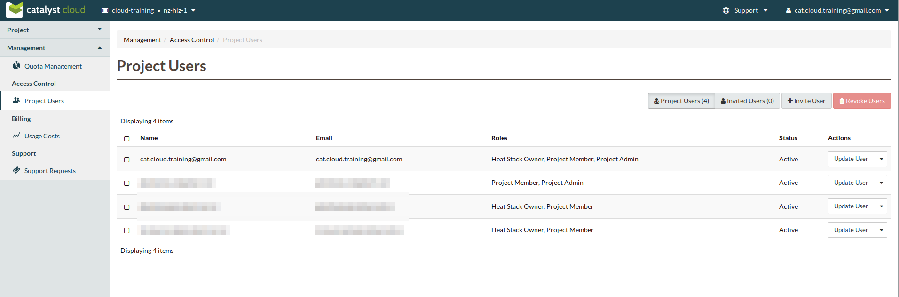
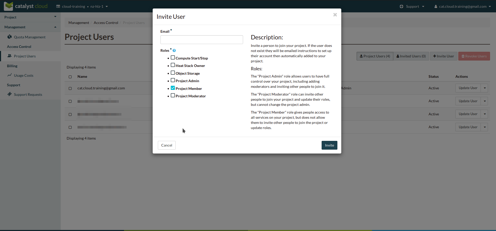
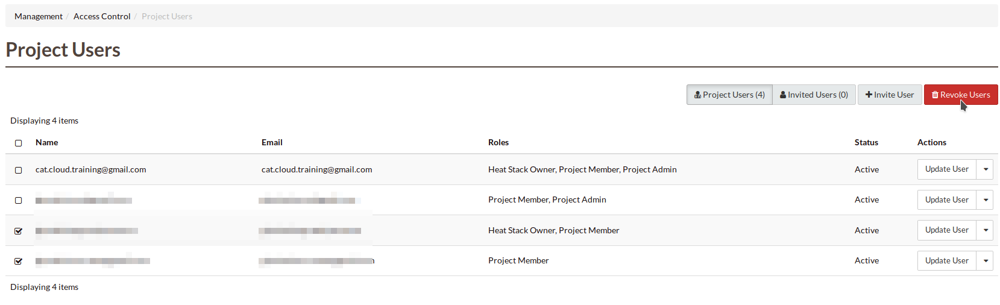

.. _access_control:

##############
Access Control
##############

*************
Project Users
*************
From this screen it is possible to manage which users have access to the project and the
permissions that they will be assigned.

Roles
=====
There are several roles that can be given to a user and these are able to be amended once a user
has accepted their invitation to the project.

Project Admin
-------------

The *Project Admin* role allows users to have full control over your project, including adding
moderators and inviting other people to join it.

Project Moderator
-----------------

The *Project Moderator* role can invite other people to join your project and update their roles,
but cannot change the project admin.

Project Member
--------------

The *Project Member* role gives people access to all services on your project, but does not allow
them to invite other people to join the project or update roles.

Heat Stack Owner
----------------

The *Heat Stack Owner* role allows users access to the Heat Cloud Orchestration Service. Users who
attempt to use Heat when they do not have this role will receive an error stating they are missing
the required role. This role is required for interacting with the Cloud Orchestration Service,
regardless of other roles.

For more information on this service, please consult the documentation at Cloud orchestration.

Compute Start/Stop
------------------

The *Compute Start/Stop* role allows users to start, stop, hard reboot and soft reboot compute
instances. Other, more destructive or creative actions will fail. This role is implied when a user
also has *Project Member*.

Object Storage
--------------

The *Object Storage* role allows users to create, update and delete containers, and objects within
those containers. Creative and destructive actions related to compute, network and block storage
will fail. This role is implied when a user also has *Project Member*.

Adding a new user
=================
To add a new user click on "Invite User",  add the email of the user that you wish to invite and
select the 'Roles' that you wish to assign to them, then click "Invite".

|

|

Once a new project member has been invited the "Invited Users" count will increase.

.. image:: ../_static/invited_count.png

|

Once the user clicks on the link in the invitation email the "Invited Users" count will decrease by
1 and the user will appear in the Project Users panel.

Updating a user
===============
Selecting the "Update User" action from the main "Project Users" screen will load the same panel as
the one presented when inviting a new user. It is then possible to modify the current roles
assigned to the user.

Revoking user access
====================
To remove access to a project you can select 'Revoke User' from the Actions drop down on an
individual user

|

.. image:: ../_static/revoke_user.png

or select multiple users using the check boxes on the Project Users list and then
click "Revoke Users" on the upper right of the page.

|

