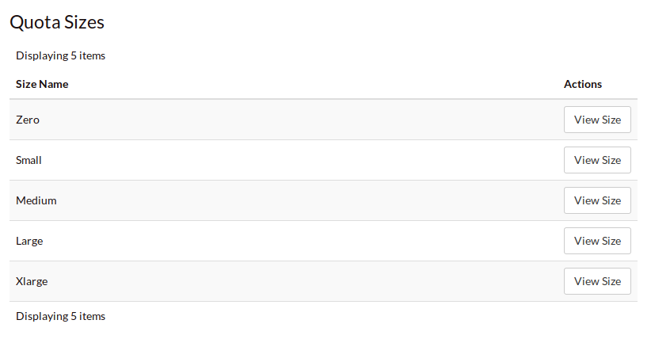
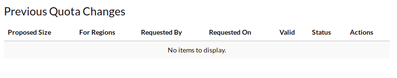
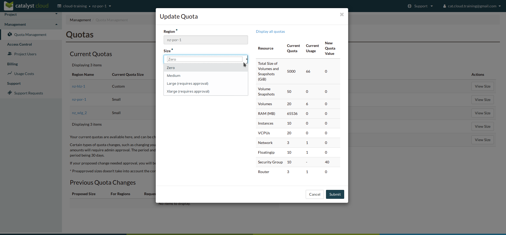
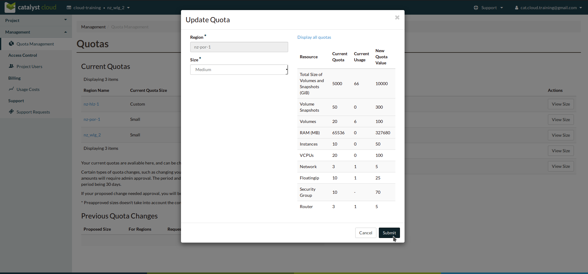
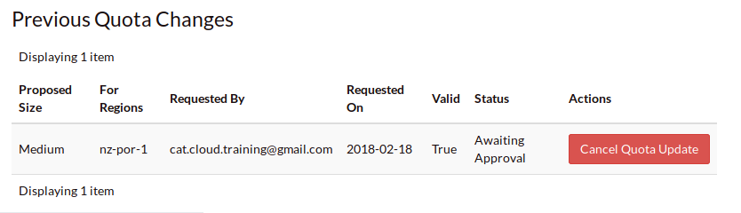
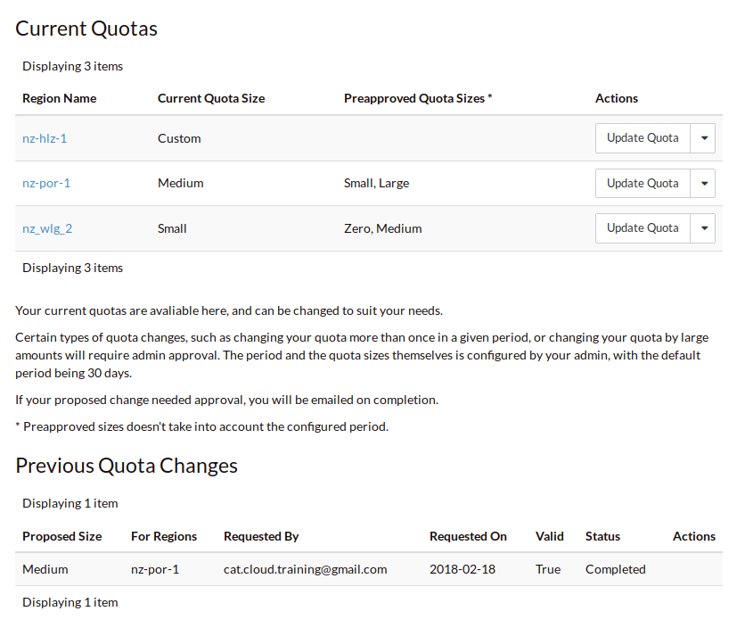

################
Quota Management
################

Catalyst provides the ability to manage your own project resource quotas on a
per region basis.

The **Current Quotas** block provides a view of the current quota limits that
are applied to each region in the current project. It also shows the available
**Preapproved Quota Sizes** that can be selected and the actions that can be
taken for the quota in each region.

.. image:: ../_static/current_quotas.png

|

By clicking on the *View Size* action on the **Quota Sizes** table it is possible
to see a breakdown of the limits for each resource within that quota band.

|

Finally the **Previous Quota Changes** gives a historical view of any quota
adjustments that have been made within the current project.

|

****************
Updating a Quota
****************
To change the current quota limit for a given region, click on the *Update Quota*
action, the following form will be displayed

|

Select the new quota value and click submit

|

If your requested change does not fall into the preapproved category the
**Previous Quota Changes** area will display a message showing the current state
of your request.

|

For preapproved and accepted changes the display will update to show the new
*Current Quota Size* next to the appropriate region and the **Previous Quota
Changes** will

|

********************************
Preapproved vs requires approval
********************************

Preapproved changes do not require any intervention from Catalyst to be actioned
and include any changes that would be a step down in quota size or any single
step up to the next size tier.

Preapproved sizes changes can be made as follows:

- for a decrease in quota size, no approval is necessary and this can be done
  multiple times in the current 30 day time period.
- for an increase in quota size, one preapproved change can be made within the
  current 30 day time period. All subsequent increases, regardless of whether
  they would normally be preapproved, will require approval from the Sky TV team.

|

.. note::

    Quota limits do not apply to object storage usage at this time.
