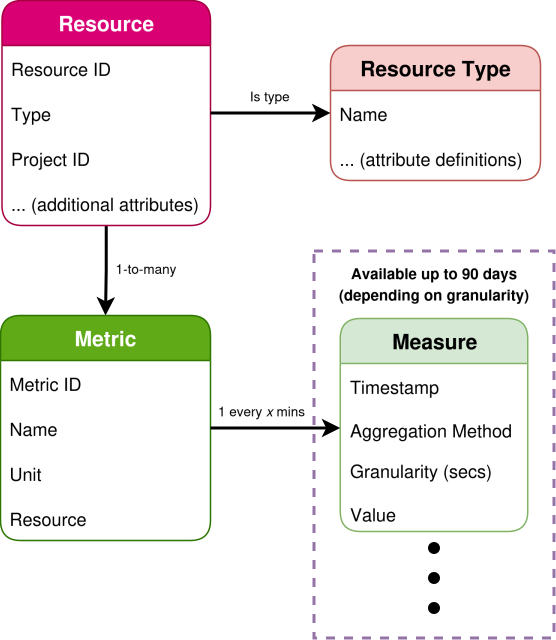

.. _metrics-overview:

########
Overview
########

This page gives an overview on the concepts around the data structures provided
by the Metrics Service, what kind of metrics we provide, and other information
such as retention periods for data. This should help give you a better understanding
when interacting with the Metrics Service APIs.

To learn how to actually use the Metrics Service, see :ref:`metrics-getting-started`.
To look at the resource types and metrics we offer, see the :ref:`metrics-reference`.

.. contents::
    :local:
    :depth: 3
    :backlinks: none

**********
Background
**********

The Metrics Service is powered by `Gnocchi`_, a time series database
specialised in storing and exposing metrics enriched with resource metadata.

.. _`Gnocchi`: https://gnocchi.osci.io

There are multiple different object types that can be interacted with
to get information and metrics for cloud resources.

.. _metrics-resources:

*********
Resources
*********

An object representing a Catalyst Cloud resource (e.g. instance, volume, image).

A **resource** object in the Metrics Service mirrors the state of a cloud resource,
including a number of attributes pertaining to that resource (e.g. name, flavour, volume type).

Resources are of a particular **resource type**, which determines the kind of metadata
associated with the resource. Resources have a unique **ID** field which is used when
making queries against resources, and one or more :ref:`metrics <metrics-metrics>`
that can be queried for :ref:`measures <metrics-measures>`.

When attributes on a resource change (e.g. renamed), the corresponding object in the
Metrics Service is updated accordingly. When a resource is deleted, the corresponding
object in the Metrics Service will be marked with an "ended at" timestamp,
allowing you to track and distinguish active resources from deleted ones in queries.

The Metrics Service keeps track of metadata changes,
and a full history of changes can be queried up to 90 days in the past.
Deleted resources, or old resources without any measures published
for them, also expire after about 90 days.

Here is an example of a resource and its associated metadata and metrics:

.. code-block:: console

  $ openstack metric resource show --type instance af6b97d9-d172-4e06-b565-db1e97097340
  +-----------------------+---------------------------------------------------------------------+
  | Field                 | Value                                                               |
  +-----------------------+---------------------------------------------------------------------+
  | id                    | af6b97d9-d172-4e06-b565-db1e97097340                                |
  | creator               | 42dcfd23b04a4006b9e2b08c0a835aeb:70d50fbf0c2148689aa2c319351e634d   |
  | started_at            | 2025-03-18T02:16:55.790609+00:00                                    |
  | revision_start        | 2025-03-18T22:00:58.683260+00:00                                    |
  | ended_at              | None                                                                |
  | user_id               | 517bcd700274432d96f43616ac1e37ea                                    |
  | project_id            | 9864e20f92ef47238becfe06b869d2ac                                    |
  | original_resource_id  | af6b97d9-d172-4e06-b565-db1e97097340                                |
  | type                  | instance                                                            |
  | display_name          | test-instance                                                       |
  | image_ref             | None                                                                |
  | flavor_id             | 28153197-6690-4485-9dbc-fc24489b0683                                |
  | server_group          | None                                                                |
  | flavor_name           | c1.c1r1                                                             |
  | os_distro             | ubuntu                                                              |
  | os_type               | linux                                                               |
  | host                  | None                                                                |
  | revision_end          | None                                                                |
  | metrics               | compute.instance.booting.time: c418003f-5115-4bd3-a56e-270d90e26b2f |
  |                       | cpu: 6febda4a-4a3f-485f-b6e2-5f94d55e39b0                           |
  |                       | disk.ephemeral.size: d0add36c-6208-40d3-a8d0-2f5ab3a550bd           |
  |                       | disk.root.size: b4e3d818-444b-46a9-b874-c82fd78e3a66                |
  |                       | instance: 53c46abc-5336-49a8-ac76-fc5aed5e5154                      |
  |                       | memory: 1e87f21e-2238-41f0-80fd-950e3e2f9bcf                        |
  |                       | vcpus: 9d60abe7-b1d7-425d-8d89-6c0eecd38c47                         |
  | created_by_user_id    | 42dcfd23b04a4006b9e2b08c0a835aeb                                    |
  | created_by_project_id | 70d50fbf0c2148689aa2c319351e634d                                    |
  +-----------------------+---------------------------------------------------------------------+

.. _metrics-metrics:

*******
Metrics
*******

An object representing a type of time series that can be queried for a :ref:`resource <metrics-resources>`.

Metrics have a unique **ID** (metric objects are unique to each resource),
a **name** corresponding to the type of data collected (e.g. ``cpu``, ``volume.size``),
and a **unit** which documents the unit the measures are in.

Depending on the :ref:`metric type <metrics-metric-types>`, one or more
:ref:`aggregation methods <metrics-aggregation-methods>` and
:ref:`granularities <metrics-granularity>` are available when querying measures.
For more information, see the :ref:`metrics-reference`.

Resources have multiple metric objects associated with them,
each one corresponding to the different types of data collected.

Here is an example of a metric object:

.. code-block:: console

  $ openstack metric show --resource-id af6b97d9-d172-4e06-b565-db1e97097340 cpu
  +--------------------------------+-------------------------------------------------------------------+
  | Field                          | Value                                                             |
  +--------------------------------+-------------------------------------------------------------------+
  | id                             | 6febda4a-4a3f-485f-b6e2-5f94d55e39b0                              |
  | creator                        | 42dcfd23b04a4006b9e2b08c0a835aeb:70d50fbf0c2148689aa2c319351e634d |
  | name                           | cpu                                                               |
  | unit                           | ns                                                                |
  | archive_policy/name            | met1.telemetry-high-rate                                          |
  | resource/id                    | af6b97d9-d172-4e06-b565-db1e97097340                              |
  | resource/creator               | 42dcfd23b04a4006b9e2b08c0a835aeb:70d50fbf0c2148689aa2c319351e634d |
  | resource/started_at            | 2025-03-18T02:16:55.790609+00:00                                  |
  | resource/revision_start        | 2025-03-18T22:00:58.683260+00:00                                  |
  | resource/ended_at              | None                                                              |
  | resource/user_id               | 517bcd700274432d96f43616ac1e37ea                                  |
  | resource/project_id            | 9864e20f92ef47238becfe06b869d2ac                                  |
  | resource/original_resource_id  | af6b97d9-d172-4e06-b565-db1e97097340                              |
  | resource/type                  | instance                                                          |
  | resource/revision_end          | None                                                              |
  | resource/created_by_user_id    | 42dcfd23b04a4006b9e2b08c0a835aeb                                  |
  | resource/created_by_project_id | 70d50fbf0c2148689aa2c319351e634d                                  |
  +--------------------------------+-------------------------------------------------------------------+

``archive_policy`` refers to the **archive policy** of the metric,
which is managed by Catalyst Cloud and determines the metric's
available :ref:`aggregation methods <metrics-aggregation-methods>`
and :ref:`granularities <metrics-granularity>`. The ``resource``
fields output some of the details of the resource
the metric belongs to, for convenience.

.. _metrics-measures:

********
Measures
********

The pre-aggregated datapoint values stored for a metric for certain time periods.

Measures are generated from the raw data measurements provided by our telemetry services.
When querying measures for a given :ref:`aggregation method <metrics-aggregation-methods>`
(e.g. ``mean``, ``max``, or ``sum``), the Metrics Service returns measures in the following format:

.. list-table::
   :width: 50%
   :header-rows: 1

   * - Timestamp (ISO 8601)
     - Granularity (secs)
     - Value
   * - 2025-08-08T04:00:00+00:00
     - 600
     - 950000000.0
   * - 2025-08-08T04:10:00+00:00
     - 600
     - 850000000.0
   * - 2025-08-08T04:20:00+00:00
     - 600
     - 920000000.0
   * - 2025-08-08T04:30:00+00:00
     - 600
     - 870000000.0

Here is a simple example for querying the amount of CPU time consumed
by an instance from the start of the hour in 10 minute intervals:

.. code-block:: console

  $ openstack metric measures show --resource-id af6b97d9-d172-4e06-b565-db1e97097340 cpu --aggregation rate:mean --granularity 600 --start "$(date '+%Y-%m-%dT%H:00:00')" --utc
  +---------------------------+-------------+-------------+
  | timestamp                 | granularity |       value |
  +---------------------------+-------------+-------------+
  | 2025-08-08T04:00:00+00:00 |       600.0 | 950000000.0 |
  | 2025-08-08T04:10:00+00:00 |       600.0 | 850000000.0 |
  | 2025-08-08T04:20:00+00:00 |       600.0 | 920000000.0 |
  | 2025-08-08T04:30:00+00:00 |       600.0 | 870000000.0 |
  +---------------------------+-------------+-------------+

.. _metrics-aggregation-methods:

*******************
Aggregation Methods
*******************

Depending on the :ref:`metric type <metrics-metric-types>`,
one or more **aggregation methods** are used to query measures.

Here are the aggregation methods available on our pre-aggregated metrics:

.. list-table::
  :width: 75%
  :header-rows: 1
  :widths: 15 60

  * - Aggregation Method
    - Description
  * - ``mean``
    - The mean of the collected datapoints for the time period.
      Available for most metric types.
  * - ``rate:mean``
    - The rate-of-change of the mean of the collected datapoints.
      Available for cumulative metrics, such as CPU time consumed.
  * - ``max``
    - The maximum value from the collected datapoints.
      Available for gauge metrics, such as block/object storage usage.
  * - ``sum``
    - All collected datapoints for the time period added together.
      Available for delta metrics, such as network traffic.
  * - ``last``
    - The last recorded datapoint (chronologically) for the time period.
      Available for status metrics.

When using the :ref:`metrics-aggregates-api` to re-aggregate measures on the fly,
additional aggregation methods are available. `Here is a full list of the available aggregation methods`_.

.. _`Here is a full list of the available aggregation methods`: https://gnocchi.osci.io/rest.html#capabilities

.. _metrics-granularity:
.. _metrics-granularity-frequency:
.. _metrics-frequency:
.. _metrics-frequency-granularity:

*********************
Granularity/Frequency
*********************

Some metrics have datapoints supplied at a higher **frequency** than others.
To accommodate this, metrics have multiple **granularities** that can be selected
when querying measures.

Using a higher granularity allows you to get more measures for a given
timespan, or more specific timestamps that give you a more accurate recording of
exactly when the measure was published. However, setting a higher granularity
means that measure queries can take longer, and the retention period for
higher granularities is shorter.

After the retention period has passed, old measures are **expired** and no longer available.

.. note::

  Although the Metrics Service supports storing data at frequencies of 60 seconds
  for certain types of metrics, we do not currently supply measures for most of those
  metric types at those frequencies.

  Using a granularity of 600 seconds or higher in your queries ensures
  that a measure is returned for every timestamp in most cases.

Here are our available granularity settings:

.. list-table::
   :width: 50%
   :header-rows: 1

   * - Granularity (secs)
     - Frequency Types
     - Retention Period
   * - 60
     - High
     - 5 days
   * - 600
     - High, Medium
     - 30 days
   * - 600
     - Long
     - 90 days
   * - 1800
     - Low
     - 30 days
   * - 3600
     - High, Medium, Low
     - 90 days

.. _metrics-collection-types:

****************
Collection Types
****************

Our metrics are collected using a number of different methods,
which determines how and when measures are generated.

.. list-table::
   :widths: 10 90
   :header-rows: 1

   * - Collection Type
     - Description
   * - Polling
     - Measures are collected by our telemetry services and published at regular intervals.
       Polling metrics are reliable due to being regularly collected, but if polling is the
       only method in which a metric is collected, it may take a short while before the first
       measure gets populated for newly created resources.
   * - Notification
     - Measures are published from notification events generated by the service,
       such as during resource state changes, or the service notifying that that
       a resource exists (once per hour). Notification metric measures become
       available soon after an event happens, but only get updated when such
       events happen.
   * - Push
     - The service itself publishes measures to the Metrics Service
       upon some kind of event (e.g. requests, data transfers).

.. _metrics-metric-types:

************
Metric Types
************

We classify our metrics under one of the following categories, depending on the kind of data they provide.
This determines the :ref:`aggregation methods <metrics-aggregation-methods>` available for use on a metric.

.. list-table::
   :widths: 10 50 30
   :header-rows: 1

   * - Metric Type
     - Description
     - Aggregation Methods
   * - Gauge
     - Collects aggregations of discrete/fluctuating values within a time period.
     - ``mean``, ``max``
   * - Cumulative
     - Collects the cumulative total of a quantity within a time period.
     - ``mean``, ``rate:mean``
   * - Delta
     - Collects aggregations of datapoints that add up to a quantity value within a time period.
     - ``mean``, ``sum``
   * - Status
     - Collects the numerical representation of the status of a resource within a time period.
     - ``last``
