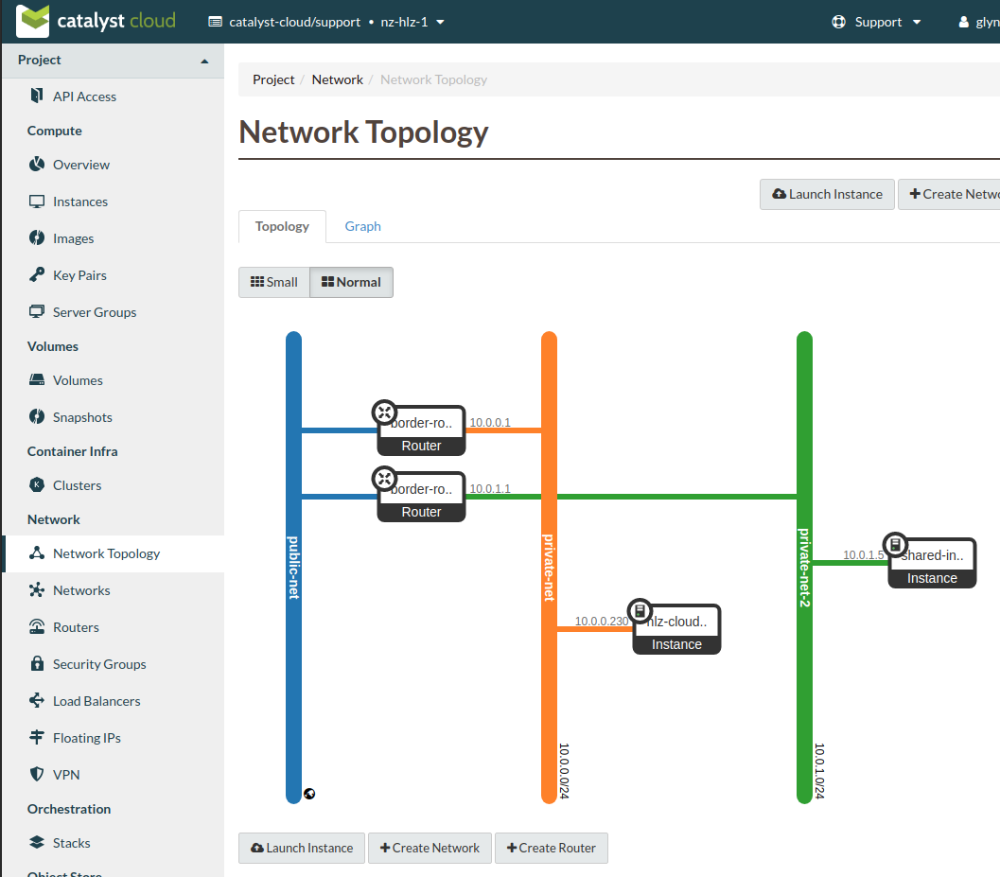
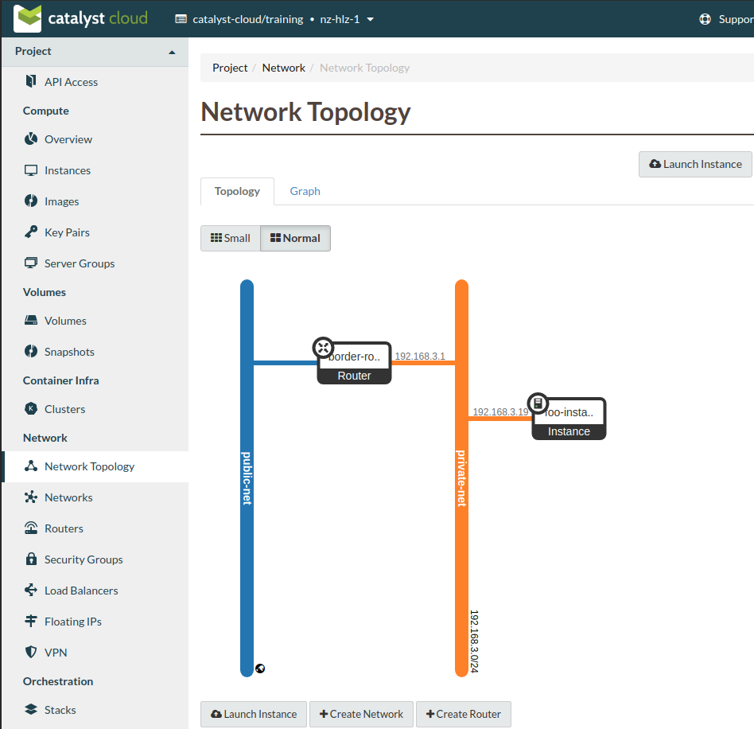
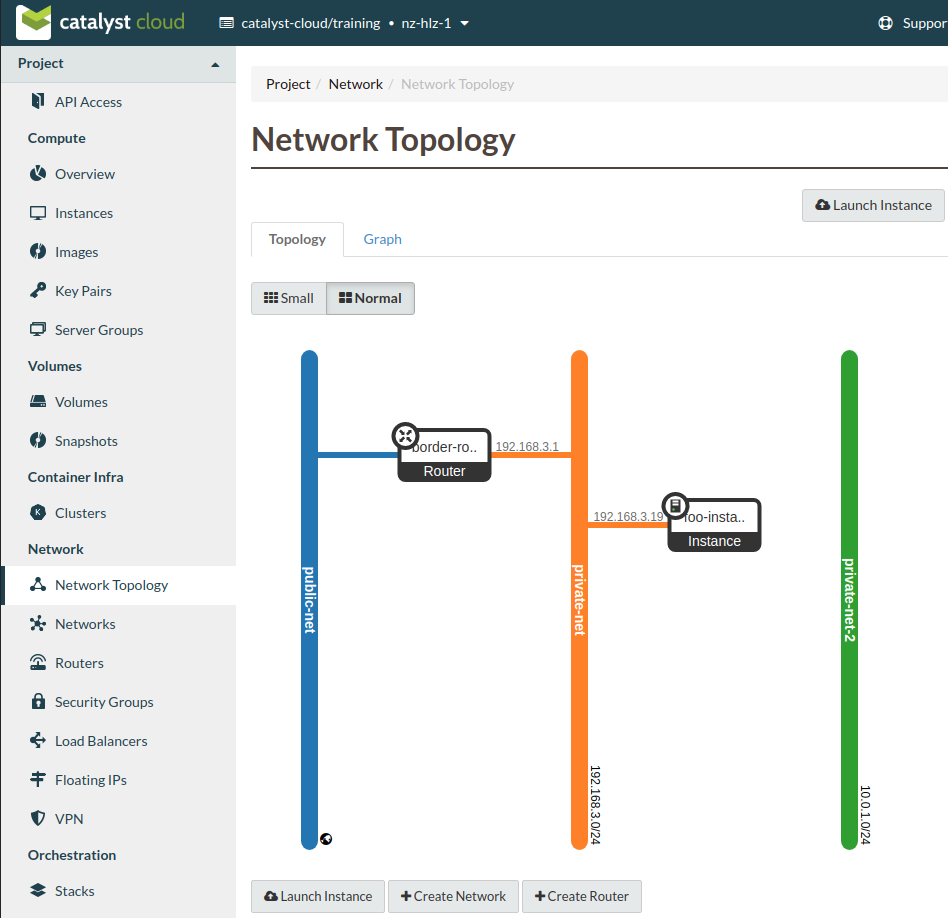
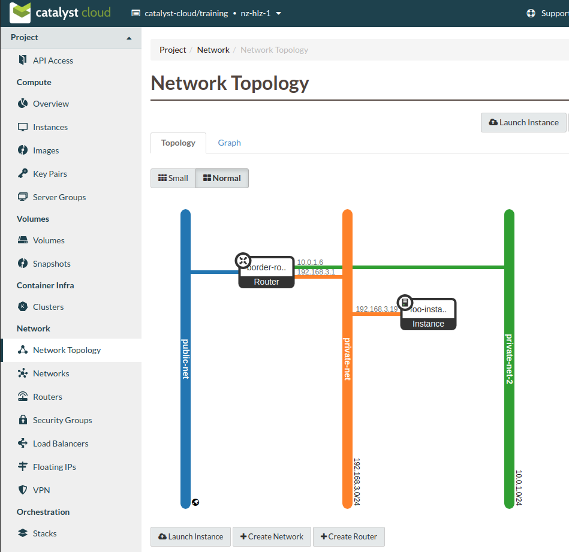

#########################
Creating a shared network
#########################

For the situation where there are two existing networks in separate projects
that need to be connected, a VPNaaS VPN would normally be the best option.
However, there is an another option available for networks that exist within
the same region.

This involves creating a **role based access** policy (RBAC) that allows the
users in another project to access one of your project's networks.

The process consists of the following steps:

* Create an RBAC policy to share a network with another project
* Connect the receiving project's router to the shared network
* Create a static route on the sharing project's router which points to the
  receiving router's IP address

*****************
A working example
*****************

For this example we will be using the following two projects within the
nz-hlz-1 (Hamilton) region. As the dashboard does not currently support the
creation of RBAC policies the majority of this example will require the use
of the command line tools.

* **catalyst-cloud/support**, will be the project that is sharing the network.
* **catalyst-cloud/training**, will be receiving the shared network.

The goal of this example is to share the network called **private-net-2** in
the project catalyst-cloud/support to the project catalyst-cloud/training in
order to allow access to the compute instance **shared-instance**.

The **sharing** project (catalyst-cloud/support) elements:

* router name : border-router-2
* network name : private-net-2
* subnet name : private-subnet-2
* subnet CIDR : 10.0.1.0/24

The **receiving** project (catalyst-cloud/training) elements:

* router name : border-router
* network name : private-net
* subnet name : private-subnet
* subnet CIDR : 192.168.3.0/24

Creating the RBAC policy
========================

|

**As a user authenticated in the** *catalyst-cloud/training* **project:**

Retrieve the UUID of the project.

.. code-block:: console

  $ openstack config show -c auth.project_id -f value -c auth.project_name -f value -f yaml
  auth.project_id: 83100bf293c94607xxxxxxa959ac0218
  auth.project_name: catalyst-cloud/training

Confirm what internal networks are currently available.

.. code-block:: console

  $ openstack network list --internal
  +--------------------------------------+---------------------+--------------------------------------+
  | ID                                   | Name                | Subnets                              |
  +--------------------------------------+---------------------+--------------------------------------+
  | f94e78e1-690e-4fad-81f7-35dc52e7d072 | private-net         | 5ea2199a-1a1e-40c5-a4cd-81dca872570c |
  +--------------------------------------+---------------------+--------------------------------------+

We can confirm this using the Network Topology view from the dashboard.

|
|

**As a user authenticated in the** *catalyst-cloud/support* **project:**

Retrieve the UUID of the network to be shared, in this case private-net-2.

.. code-block:: console

  $ openstack network show private-net-2 -c name -f value -c id -f value -f yaml
  id: b6b93acd-3511-4a35-b37e-7a66e792321f
  name: private-net-2

Create the network RBAC policy using ``access_as_shared`` for the policy
action.

.. code-block:: console

  $ openstack network rbac create --target-project 83100bf293c94607xxxxxxa959ac0218 \
  --action access_as_shared --type network b6b93acd-3511-4a35-b37e-7a66e792321f
  +-------------------+--------------------------------------+
  | Field             | Value                                |
  +-------------------+--------------------------------------+
  | action            | access_as_shared                     |
  | id                | 52cc1d1b-12e8-4d25-ab75-f9d1137ff5c7 |
  | name              | None                                 |
  | object_id         | b6b93acd-3511-4a35-b37e-7a66e792321f |
  | object_type       | network                              |
  | project_id        | eac679e489614xxxxxxce29d755fe289     |
  | target_project_id | 83100bf293c94607xxxxxxa959ac0218     |
  +-------------------+--------------------------------------+

  $ openstack network rbac list
  +--------------------------------------+-------------+--------------------------------------+
  | ID                                   | Object Type | Object ID                            |
  +--------------------------------------+-------------+--------------------------------------+
  | 52cc1d1b-12e8-4d25-ab75-f9d1137ff5c7 | network     | b6b93acd-3511-4a35-b37e-7a66e792321f |
  +--------------------------------------+-------------+--------------------------------------+

|
|

**As a user authenticated in the** *catalyst-cloud/training* **project:**

Now that the RBAC policy has been applied we should be able to view the shared
network in the recieving project, either from the CLI, like this:

.. code-block:: console

  $ openstack network list --internal
  +--------------------------------------+---------------+--------------------------------------+
  | ID                                   | Name          | Subnets                              |
  +--------------------------------------+---------------+--------------------------------------+
  | b6b93acd-3511-4a35-b37e-7a66e792321f | private-net-2 | 6cc1e626-4bc6-4436-8e72-b1e79c4e3dd9 |
  | f94e78e1-690e-4fad-81f7-35dc52e7d072 | private-net   | 5ea2199a-1a1e-40c5-a4cd-81dca872570c |
  +--------------------------------------+---------------+--------------------------------------+

or from the dashboard's topology view.

Now we need to create a port on the shared network. We can also give it a name
to make working with it easier. In this example we will use
**shared-network-port**.

Take note of the ``fixed-ip`` value in the subsequent output as this value will
be needed to set up a static route.

.. code-block:: console

  $ openstack port create --network private-net-2 shared-network-port
  +-------------------------+---------------------------------------------------------------------------------------+
  | Field                   | Value                                                                                 |
  +-------------------------+---------------------------------------------------------------------------------------+
  | admin_state_up          | UP                                                                                    |
  | allowed_address_pairs   |                                                                                       |
  | binding_host_id         | None                                                                                  |
  | binding_profile         | None                                                                                  |
  | binding_vif_details     | None                                                                                  |
  | binding_vif_type        | None                                                                                  |
  | binding_vnic_type       | normal                                                                                |
  | created_at              | None                                                                                  |
  | data_plane_status       | None                                                                                  |
  | description             | None                                                                                  |
  | device_id               |                                                                                       |
  | device_owner            |                                                                                       |
  | dns_assignment          | fqdn='host-10-0-1-6.openstacklocal.', hostname='host-10-0-1-6', ip_address='10.0.1.6' |
  | dns_domain              | None                                                                                  |
  | dns_name                |                                                                                       |
  | extra_dhcp_opts         | None                                                                                  |
  | fixed_ips               | ip_address='10.0.1.6', subnet_id='6cc1e626-4bc6-4436-8e72-b1e79c4e3dd9'               |
  | id                      | 6c0f0344-be2d-4996-9d86-9cd6f5c42735                                                  |
  | ip_allocation           | None                                                                                  |
  | mac_address             | fa:16:3e:63:6e:3d                                                                     |
  | name                    | shared-network-port                                                                   |
  | network_id              | b6b93acd-3511-4a35-b37e-7a66e792321f                                                  |
  | numa_affinity_policy    | None                                                                                  |
  | port_security_enabled   | False                                                                                 |
  | project_id              | 83100bf293c94607xxxxxxa959ac0218                                                      |
  | propagate_uplink_status | None                                                                                  |
  | qos_network_policy_id   | None                                                                                  |
  | qos_policy_id           | None                                                                                  |
  | resource_request        | None                                                                                  |
  | revision_number         | None                                                                                  |
  | security_group_ids      | fcf4a5f1-a37c-4c25-9c54-63680888dea3                                                  |
  | status                  | DOWN                                                                                  |
  | tags                    |                                                                                       |
  | trunk_details           | None                                                                                  |
  | updated_at              | None                                                                                  |
  +-------------------------+---------------------------------------------------------------------------------------+

We then add this port to the router in the receiving network, like so.

.. code-block:: console

  $ openstack router add port border-router shared-network-port

To confirm that we have our port added as an interface on the router run the
following,

.. code-block:: console

  $ openstack router show border-router -c interfaces_info -f value -f yaml
  interfaces_info:
  - ip_address: 10.0.1.6
    port_id: 6c0f0344-be2d-4996-9d86-9cd6f5c42735
    subnet_id: 6cc1e626-4bc6-4436-8e72-b1e79c4e3dd9
  - ip_address: 192.168.3.1
    port_id: e468db30-2b83-4a61-ad8a-3e57f469b6b9
    subnet_id: 5ea2199a-1a1e-40c5-a4cd-81dca872570c

or confirm via the topology view.

**As a user authenticated in the** *catalyst-cloud/support* **project:**

The final step in setting up our shared networking is applying a static route
to the sharing router.

This requires the following information:

* The CIDR value of the receiving subnet, which for this example is
  192.168.3.0/24
* The fixed IP address for the **shared-network-port** we created earlier,
  which for this example is 10.0.1.6

To add the the route run the following command.

.. code-block:: console

  $ openstack router set border-router-2 --route destination=192.168.3.0/24,gateway=10.0.1.6

Allowing access to traffic
==========================

For this example if we wished to allow SSH access from the receiving project to
the **shared-instance** we would need to add a security group with the
following rule and apply that to the instance.

Security group rule parameters:

* protocol : TCP
* port : SSH (22)
* direction : ingress
* CIDR : 192.168.3.0/24

Once this is in place it will be possible to SSH from a host in the receiving
project to the host on the shared network.

.. Note::

  It's worth being aware that the instances and ports within the sharing
  project will not be visible to the receiving project, so requires some
  co-orindation when configuring routes. Network discovery protocols will
  function within the network so hosts will be visible if they respond to ICMP or
  announce their presence.

Cleanup
=======

To remove this setup simply follow these steps.

**As a user authenticated in the** *catalyst-cloud/training* **project:**

Remove the network port

.. code-block:: console

  $ openstack router remove port border-router shared-network-port

**As a user authenticated in the** *catalyst-cloud/support* **project:**

Remove the RBAC policy, using it's UUID

.. code-block:: console

  $ openstack network rbac delete 52cc1d1b-12e8-4d25-ab75-f9d1137ff5c7

Also make sure to remove any unneeded security group rules that may have been
added as part of this process.
