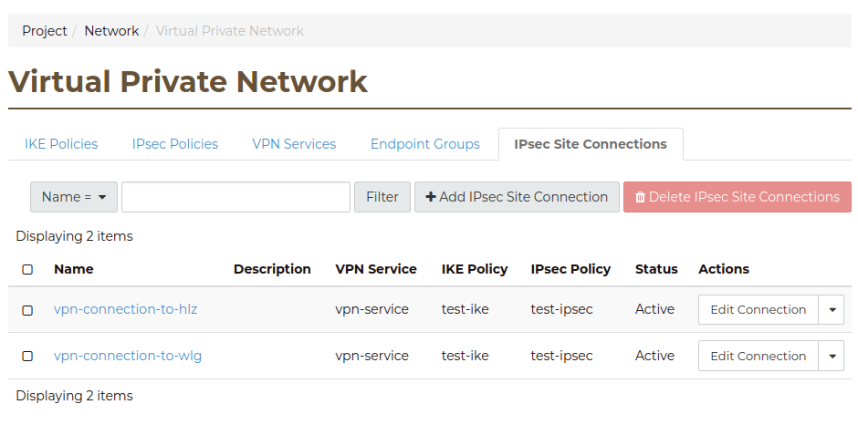

.. _vpn:

########################
Virtual private networks
########################

VPN as a Service is an OpenStack networking extension that provides
VPN services for your project. Currently this service is restricted to IPsec
based VPNs.

****************
A worked example
****************

In the following examples we will construct a VPN between the Hamilton region
(nz-hlz-1) and the Porirua region (nz-por-1) of our project. We will assume
that in both regions we have an identical network setup that looks like:

* A network called private-net.
* A subnet called private-subnet.
* A router to the Internet called border-router.

The only differences between the two setups will be the external IP address on
the router and the CIDR of the private subnets.

We will illustrate how to create the the VPN using the following approaches:

* Using the OpenStack command line tools.
* With a bash script.
* From the cloud dashboard

Requirements
============

In order to set up a VPN, we need to identify some key information:

* Router name
* Router IP address
* Subnet name
* Subnet CIDR range
* Remote peer router IP
* Remote peer subnet CIDR range
* A secret pre shared key

While we will be using the names of the router and subnet it is important to
note that these are not required to be unique so if your creating multiple VPN
connections it may be more appropriate to use the UUID values for these
elements in order to avoid ambiguity when running commands.

.. Note::

  IPSec relies on symmetrical encryption where both sides use the same private
  key. This key is known as a Pre Shared Key (PSK). You should ensure that you
  manage this key appropriately, so for example be sure that it is not
  committed to your configuration management system source control in plain
  text.

.. Warning::
  The Pre Shared Key should be between 20 to 40 characters long and consist of alphanumeric characters only.
  The Pre Shared Key must not contain the '&' character.

.. tabs::

  .. tab:: Command line

    The first thing we need to do prior to creating our VPN is to gather the
    relevant information, as mentioned above, for our existing network
    elements. We will create the first half of our VPN in the Hamilton region.

    To get the subnet's CIDR run the following command.

    .. code-block:: bash

      $ echo $OS_REGION_NAME
      nz-hlz-1

      $ openstack subnet list --name private-subnet -c Name -f value -c Subnet -f value -c ID -f value  -f table
      +--------------------------------------+----------------+-------------+
      | ID                                   | Name           | Subnet      |
      +--------------------------------------+----------------+-------------+
      | 1d701353-f120-413d-b33f-xxxxxxxxxxxx | private-subnet | 10.0.0.0/24 |
      +--------------------------------------+----------------+-------------+

    Next let's find the required router information.

    .. code-block:: console

      $ openstack router show border-router -c id -f value -c external_gateway_info -f value -f json
      {
        "external_gateway_info": {
          "network_id": "993e826c-74c2-4b44-ad6f-xxxxxxxxxxxx",
          "enable_snat": true,
          "external_fixed_ips": [
            {
              "subnet_id": "f44f9716-a08c-4972-909d-xxxxxxxxxxxx",
              "ip_address": "10.10.8.3"
            },
            {
              "subnet_id": "7cae5aac-2d01-4cba-a171-xxxxxxxxxxxx",
              "ip_address": "2404:130:4040:8::16"
            }
          ]
        },
        "id": "ddd82b49-8bae-4a25-ae94-xxxxxxxxxxxx"
      }

    From the JSON data, the **router IP address** is the IPv4 value associated
    with the ``ip_address`` key within the ``external_gateway_info``.

    As we are creating a VPN that connects our Catalyst Cloud project across
    two regions, the **remote peer router IP** and
    **remote peer subnet CIDR range** will be the values associated with the
    subnet and router in the other region.

    In this case we need to find the router IP and the subnet CIDR from the
    network located in the Porirua region. You can determine these in the same
    way as shown above while connected to the other region.

    .. code-block:: console

      $ echo $OS_REGION_NAME
      nz-por-1

      $ openstack subnet list --name private-subnet -c Name -f value -c Subnet -f value -f table
      +----------------+---------------+
      | Name           | Subnet        |
      +----------------+---------------+
      | private-subnet | 10.20.30.0/24 |
      +----------------+---------------+

      $ openstack router show border-router -c external_gateway_info -f value -c interfaces_info -f value -f json
      {
        "external_gateway_info": {
          "network_id": "849ab1e9-7ac5-4618-8801-xxxxxxxxxxxx",
          "enable_snat": true,
          "external_fixed_ips": [
            {
              "subnet_id": "aef23c7c-6c53-4157-8350-xxxxxxxxxxxx",
              "ip_address": "150.242.40.137"
            },
            {
              "subnet_id": "e8064b07-ac94-4172-91a1-xxxxxxxxxxxx",
              "ip_address": "2404:130:4020:8000::7637"
            }
          ]
        }
      }

    The values we need from the above output are:

    * remote peer router IP : 150.242.40.137
    * remote peer subnet CIDR : 10.20.30.0/24

    If you are setting up a VPN to a different peer, then the
    **remote peer router IP** will be the publicly accessible IPv4 address of
    that router, while the **remote peer subnet CIDR range** will be the subnet
    behind that router whose traffic you wish to route via the VPN to access
    the local subnet.

    .. note::

      If you are connecting to a remote peer that is not a Catalyst Cloud
      router, you may need to modify some of the parameters used in the
      following steps.

    By now you should have the required values so you can proceed to create a
    VPN.

    There are four steps to creating a VPN:

    * Create a VPN Service
    * Create a VPN IKE Policy
    * Create a VPN IPSec Policy
    * Create a VPN Endpoint Group for the local subnet
    * Create a VPN Endpoint Group for the peer CIDR
    * Create a VPN IPSec Site Connection

    This example will cover setting up one half of the VPN in the Hamilton region.

    First let's create a VPN Service called *vpn_service*.

    .. code-block:: console

      $ openstack vpn service create \
      --router border-router \
      vpn_service
      +----------------+--------------------------------------+
      | Field          | Value                                |
      +----------------+--------------------------------------+
      | Description    |                                      |
      | ID             | 99d8f06c-8cd8-44d6-9337-xxxxxxxxxxxx |
      | Name           | vpn_service                          |
      | Project        | 630116938c82479cxxxxxx3912c1d09c     |
      | Router         | ddd82b49-8bae-4a25-ae94-xxxxxxxxxxxx |
      | State          | True                                 |
      | Status         | PENDING_CREATE                       |
      | Subnet         | None                                 |
      | external_v4_ip | 10.10.8.3                            |
      | external_v6_ip | 2404:130:4040:8::16                  |
      | project_id     | 630116938c82479cxxxxxx3912c1d09c     |
      +----------------+--------------------------------------+

    Then create a VPN IKE policy called *ike_policy*.

    .. code-block:: console

      $ openstack vpn ike policy create \
      --auth-algorithm sha1 \
      --encryption-algorithm aes-256 \
      --phase1-negotiation-mode main \
      --pfs group14 \
      --ike-version v1 \
      --lifetime units=seconds,value=14400 \
      ike_policy
      +-------------------------------+--------------------------------------+
      | Field                         | Value                                |
      +-------------------------------+--------------------------------------+
      | Authentication Algorithm      | sha1                                 |
      | Description                   |                                      |
      | Encryption Algorithm          | aes-256                              |
      | ID                            | d64b4355-576f-4f68-989d-xxxxxxxxxxxx |
      | IKE Version                   | v1                                   |
      | Lifetime                      | {'units': 'seconds', 'value': 14400} |
      | Name                          | ike_policy                           |
      | Perfect Forward Secrecy (PFS) | group14                              |
      | Phase1 Negotiation Mode       | main                                 |
      | Project                       | 630116938c82479cxxxxxx3912c1d09c     |
      | project_id                    | 630116938c82479cxxxxxx3912c1d09c     |
      +-------------------------------+--------------------------------------+

    Then create a VPN IPSec policy called *ipsec_policy*.

    .. code-block:: bash

      $ openstack vpn ipsec policy create \
      --transform-protocol esp \
      --auth-algorithm sha1 \
      --encryption-algorithm aes-256 \
      --encapsulation-mode tunnel \
      --pfs group14 \
      --lifetime units=seconds,value=3600 \
      ipsec_policy
      +-------------------------------+--------------------------------------+
      | Field                         | Value                                |
      +-------------------------------+--------------------------------------+
      | Authentication Algorithm      | sha1                                 |
      | Description                   |                                      |
      | Encapsulation Mode            | tunnel                               |
      | Encryption Algorithm          | aes-256                              |
      | ID                            | 54367ef5-9e76-4827-888e-xxxxxxxxxxxx |
      | Lifetime                      | {'units': 'seconds', 'value': 3600}  |
      | Name                          | ipsec_policy                         |
      | Perfect Forward Secrecy (PFS) | group14                              |
      | Project                       | 630116938c82479cxxxxxx3912c1d09c     |
      | Transform Protocol            | esp                                  |
      | project_id                    | 630116938c82479cxxxxxx3912c1d09c     |
      +-------------------------------+--------------------------------------+

    Then create an Endpoint Group for the local subnet called *local_endpoint_group*.

    .. code-block:: bash

      $ openstack vpn endpoint group create --type subnet --value private-subnet local_endpoint_group
      +-------------+------------------------------------------+
      | Field       | Value                                    |
      +-------------+------------------------------------------+
      | Description |                                          |
      | Endpoints   | ['1d701353-f120-413d-b33f-xxxxxxxxxxxx'] |
      | ID          | 5d972e8d-e7a0-45ea-8d91-xxxxxxxxxxxx     |
      | Name        | local_endpoint_group                     |
      | Project     | 630116938c82479cxxxxxx3912c1d09c         |
      | Type        | subnet                                   |
      | project_id  | 630116938c82479cxxxxxx3912c1d09c         |
      +-------------+------------------------------------------+

     Then create an Endpoint Group for the remote peer CIDR called *peer_endppoint_group*.

    .. code-block:: bash

      $ openstack vpn endpoint group create --type cidr --value 10.20.30.0/24 peer_endpoint_group
      +-------------+--------------------------------------+
      | Field       | Value                                |
      +-------------+--------------------------------------+
      | Description |                                      |
      | Endpoints   | ['10.20.30.0/24']                    |
      | ID          | f34578dc-aae8-4c02-abeb-xxxxxxxxxxxx |
      | Name        | peer_endpoint_group                  |
      | Project     | 630116938c82479cxxxxxx3912c1d09c     |
      | Type        | cidr                                 |
      | project_id  | 630116938c82479cxxxxxx3912c1d09c     |
      +-------------+--------------------------------------+

    .. note::

      You can provide multiple ``--value`` arguments if you want to tunnel more
      than one CIDR range.

    Finally we create a VPN IPSec site connection called *vpn_site_connection*.
    This command makes use of the resources created in the last five steps.

    .. code-block:: bash

      $ openstack vpn ipsec site connection create \
      --initiator bi-directional \
      --vpnservice vpn_service \
      --ikepolicy ike_policy \
      --ipsecpolicy ipsec_policy \
      --dpd action=restart,interval=15,timeout=150 \
      --peer-address 150.242.40.137 \
      --peer-id 150.242.40.137 \
      --local-endpoint-group local_endpoint_group \
      --peer-endpoint-group peer_endpoint_group \
      --psk supersecretpsk \
      vpn_site_connection
      +--------------------------+-------------------------------------------------------+
      | Field                    | Value                                                 |
      +--------------------------+-------------------------------------------------------+
      | Authentication Algorithm | psk                                                   |
      | Description              |                                                       |
      | ID                       | 8b47f318-d91a-4040-9156-xxxxxxxxxxxx                  |
      | IKE Policy               | d64b4355-576f-4f68-989d-xxxxxxxxxxxx                  |
      | IPSec Policy             | 54367ef5-9e76-4827-888e-xxxxxxxxxxxx                  |
      | Initiator                | bi-directional                                        |
      | Local Endpoint Group ID  | 5d972e8d-e7a0-45ea-8d91-xxxxxxxxxxxx                  |
      | Local ID                 |                                                       |
      | MTU                      | 1500                                                  |
      | Name                     | vpn_site_connection                                   |
      | Peer Address             | 150.242.40.137                                        |
      | Peer CIDRs               |                                                       |
      | Peer Endpoint Group ID   | f34578dc-aae8-4c02-abeb-xxxxxxxxxxxx                  |
      | Peer ID                  | 150.242.40.137                                        |
      | Pre-shared Key           | supersecretpsk                                        |
      | Project                  | 630116938c82479cxxxxxx3912c1d09c                      |
      | Route Mode               | static                                                |
      | State                    | True                                                  |
      | Status                   | PENDING_CREATE                                        |
      | VPN Service              | 99d8f06c-8cd8-44d6-9337-xxxxxxxxxxxx                  |
      | dpd                      | {'action': 'restart', 'interval': 15, 'timeout': 150} |
      | project_id               | 630116938c82479cxxxxxx3912c1d09c                      |
      +--------------------------+-------------------------------------------------------+

    You have now stood up one end of the VPN. This process should be repeated
    at the other end using the same configuration options and PSK. Once both
    sides of the VPN are configured, the peers should automatically detect
    each other and bring up the VPN. When the VPN is up, the status will
    change to ``ACTIVE``.

  .. tab:: Bash script

    The Catalyst Cloud team have created a bash script that simplifies the
    procedure for creating a VPN. In order to run the script you will need to
    know the following information for each region you will be creating a VPN
    endpoint for. Details on how to obtain this information can be found
    in the Command Line example.

    * router name
    * router external IP address
    * subnet name
    * subnet CIDR range

    This script will require no modification when setting up region to region
    VPNs. If you are using it to connect a Catalyst Cloud router to a non
    Catalyst Cloud router, you may need to change some configuration options.

    This script currently only supports single CIDR ranges. If you are wanting
    to tunnel multiple ranges then it will require some modification.

    You can download the latest version of this script using the following
    command:

    .. code-block:: bash

      $ wget https://raw.githubusercontent.com/catalyst-cloud/catalystcloud-docs/master/source/network/_scripts/create-vpn.sh

      Below is an example of the script being used to create a region to region
      VPN on Catalyst Cloud:

    .. code-block:: bash

      ./create-vpn.sh
      ----------------------------------------------------------
      This script will setup a VPN in your project.
      You can select either:
      a single region that will connect to an external site
      or
      a site-to-site vpn between 2 regions for the same project
      ----------------------------------------------------------

      1) single
      2) site-to-site
      Select the VPN option you require or type 'q' to quit: 2

      -------------------------------------------------------
      Select the regions for your site-to-site VPN endpoints
      -------------------------------------------------------

      1) Hamilton
      2) Porirua
      3) Wellington
      Select region 1 for the site-to-site VPN or type 'q' to quit: 1

      1) Hamilton
      2) Porirua
      3) Wellington
      Select region 2 for the site-to-site VPN or type 'q' to quit: 2

      Please enter the name of your Hamilton router:
      border-router
      Please enter the name of your Hamilton subnet:
      private-subnet
      nz-por-1
      Please enter the name of your Porirua router:
      border-router
      Please enter the name of your Porirua subnet:
      private-subnet
      Please enter your pre shared key:
      supersecretkey
      Please enter the Hamilton router ip address
      103.197.61.206
      Please enter the Hamilton CIDR range
      192.168.3.0/24

      Please enter the Porirua router ip address
      150.242.41.251
      Please enter the Porirua CIDR range
      192.168.2.0/24

      --------------------------------------------------------
      Proceeding to create VPN with the following credentials:
      Region name = Hamilton
      region_1_router_name = border-router
      region_1_subnet_name = private-subnet
      region_1_router_ip = 103.197.61.206
      region_1_subnet = 192.168.3.0/24
      region_1_peer_router_ip = 150.242.41.251
      region_1_peer_subnet = 192.168.2.0/24

      Region name = Porirua
      region_2_router_name = border-router
      region_2_subnet_name = private-subnet
      region_2_router_ip = 150.242.41.251
      region_2_subnet = 192.168.2.0/24
      region_2_peer_router_ip = 103.197.61.206
      region_2_peer_subnet = 192.168.3.0/24

      pre_shared_key = supersecretkey
      --------------------------------------------------------

      creating endpoint for Hamilton
      +----------------+--------------------------------------+
      | Field          | Value                                |
      +----------------+--------------------------------------+
      | Description    |                                      |
      | ID             | 4c5faf25-dada-44c7-a7d4-xxxxxxxxxxxx |
      | Name           | vpn_service                          |
      | Project        | 83100bf293c94607xxxxxxa959ac0218     |
      | Router         | 34ea00e7-74bc-4f9f-b270-xxxxxxxxxxxx |
      | State          | True                                 |
      | Status         | PENDING_CREATE                       |
      | Subnet         | 5ea2199a-1a1e-40c5-a4cd-xxxxxxxxxxxx |
      | external_v4_ip | 103.197.61.206                       |
      | external_v6_ip | 2404:130:8020:8000::2:ce58           |
      +----------------+--------------------------------------+
      +-------------------------------+--------------------------------------+
      | Field                         | Value                                |
      +-------------------------------+--------------------------------------+
      | Authentication Algorithm      | sha1                                 |
      | Description                   |                                      |
      | Encryption Algorithm          | aes-256                              |
      | ID                            | ceebee2c-f5ac-44fa-a838-xxxxxxxxxxxx |
      | IKE Version                   | v1                                   |
      | Lifetime                      | {'units': 'seconds', 'value': 14400} |
      | Name                          | ike_policy                           |
      | Perfect Forward Secrecy (PFS) | group14                              |
      | Phase1 Negotiation Mode       | main                                 |
      | Project                       | 83100bf293c94607xxxxxxa959ac0218     |
      +-------------------------------+--------------------------------------+
      +-------------------------------+--------------------------------------+
      | Field                         | Value                                |
      +-------------------------------+--------------------------------------+
      | Authentication Algorithm      | sha1                                 |
      | Description                   |                                      |
      | Encapsulation Mode            | tunnel                               |
      | Encryption Algorithm          | aes-256                              |
      | ID                            | 77c66397-43e9-45db-b0cd-xxxxxxxxxxxx |
      | Lifetime                      | {'units': 'seconds', 'value': 3600}  |
      | Name                          | ipsec_policy                         |
      | Perfect Forward Secrecy (PFS) | group14                              |
      | Project                       | 83100bf293c94607xxxxxxa959ac0218     |
      | Transform Protocol            | esp                                  |
      +-------------------------------+--------------------------------------+
      +----------------+--------------------------------------+
      | Field          | Value                                |
      +----------------+--------------------------------------+
      | Description    |                                      |
      | ID             | 84303467-9c62-47c7-91c9-xxxxxxxxxxxx |
      | Name           | vpn_service                          |
      | Project        | 83100bf293c94607xxxxxxa959ac0218     |
      | Router         | d570c9c8-bde2-4f39-8fa9-xxxxxxxxxxxx |
      | State          | True                                 |
      | Status         | PENDING_CREATE                       |
      | Subnet         | 55c57cd5-1b94-4098-9cf6-xxxxxxxxxxxx |
      | external_v4_ip | 150.242.41.251                       |
      | external_v6_ip | 2404:130:4020:8000::1:9c3a           |
      +----------------+--------------------------------------+
      +-------------------------------+--------------------------------------+
      | Field                         | Value                                |
      +-------------------------------+--------------------------------------+
      | Authentication Algorithm      | sha1                                 |
      | Description                   |                                      |
      | Encryption Algorithm          | aes-256                              |
      | ID                            | a184e4c4-856f-4136-9ef1-xxxxxxxxxxxx |
      | IKE Version                   | v1                                   |
      | Lifetime                      | {'units': 'seconds', 'value': 14400} |
      | Name                          | ike_policy                           |
      | Perfect Forward Secrecy (PFS) | group14                              |
      | Phase1 Negotiation Mode       | main                                 |
      | Project                       | 83100bf293c94607xxxxxxa959ac0218     |
      +-------------------------------+--------------------------------------+
      +-------------------------------+--------------------------------------+
      | Field                         | Value                                |
      +-------------------------------+--------------------------------------+
      | Authentication Algorithm      | sha1                                 |
      | Description                   |                                      |
      | Encapsulation Mode            | tunnel                               |
      | Encryption Algorithm          | aes-256                              |
      | ID                            | 9b41de10-194d-4e1d-9f2a-xxxxxxxxxxxx |
      | Lifetime                      | {'units': 'seconds', 'value': 3600}  |
      | Name                          | ipsec_policy                         |
      | Perfect Forward Secrecy (PFS) | group14                              |
      | Project                       | 83100bf293c94607xxxxxxa959ac0218     |
      | Transform Protocol            | esp                                  |
      +-------------------------------+--------------------------------------+
      +--------------------------+-------------------------------------------------------+
      | Field                    | Value                                                 |
      +--------------------------+-------------------------------------------------------+
      | Authentication Algorithm | psk                                                   |
      | Description              |                                                       |
      | ID                       | 1521242f-7d63-43b7-aa62-xxxxxxxxxxxx                  |
      | IKE Policy               | a184e4c4-856f-4136-9ef1-xxxxxxxxxxxx                  |
      | IPSec Policy             | 9b41de10-194d-4e1d-9f2a-xxxxxxxxxxxx                  |
      | Initiator                | bi-directional                                        |
      | MTU                      | 1500                                                  |
      | Name                     | vpn_site_connection                                   |
      | Peer Address             | 103.197.61.206                                        |
      | Peer CIDRs               | 192.168.3.0/24                                        |
      | Peer ID                  | 103.197.61.206                                        |
      | Pre-shared Key           | pre_shared_key                                        |
      | Project                  | 83100bf293c94607xxxxxxa959ac0218                      |
      | Route Mode               | static                                                |
      | State                    | True                                                  |
      | Status                   | PENDING_CREATE                                        |
      | VPN Service              | 84303467-9c62-47c7-91c9-xxxxxxxxxxxx                  |
      | dpd                      | {'action': 'restart', 'interval': 15, 'timeout': 150} |
      +--------------------------+-------------------------------------------------------+

    Your VPN has been created, note that you will need to create appropriate security group rules.

    The script source is included below for reference:

    .. literalinclude:: _scripts/create-vpn.sh
      :language: bash

  .. tab:: Dashboard

   In this example we are going to set up a VPN connection in the Hamilton region to a remote router in the Porirua
   region with a public IP ``150.242.40.137`` that has the private subnet ``10.20.30.0/24`` connected to it.

   In the Hamilton region we already have defined a router named `border-router` that is connected to the public network and
   has a subnet called `private subnet` with a CIDR of ``10.0.0.0/24`` connected to one of it's interfaces.
   The steps to create these resources are covered in :doc:`adding-network`

   To create the VPN connection we are going to use the VPN screen which is accessed by clicking on the **VPN** item
   underneath the **Network** group on the left hand menu of the console:

   .. image:: _static/lhs-menu-network.png

   |

   Using the VPN screen we are going perform the following steps:

   * Create a VPN Service
   * Create a VPN IKE Policy
   * Create a VPN IPSec Policy
   * Create a VPN Endpoint Group for the local subnet
   * Create a VPN Endpoint Group for the peer CIDR
   * Create a VPN IPSec Site Connection

   **Create a VPN Service**

   First we select the **VPN Service** tab and click on the **+ Add VPN Service** button to create a VPN service.

   .. image:: _static/vpn-services-tab.png

   |

   In the **Add VPN Service** dialog we do the following:

   * name the VPN Service "vpn service"
   * select "border-router" as the router for this VPN service.

   .. Note::
     We do not select the subnet for the service as this will be done later using the endpoint groups.

   .. image:: _static/add-vpn-service.png

   |

   Click the **Add** button and the VPN service will be in the Pending Create state, it will become `Active` when we have
   completed the IPSec connection.

   .. image:: _static/vpn-service-pending-create.png

   |

   **Create IKE Policy**

   Next we create the IKE policy for the VPN connection by selecting the **IKE Policies** tab and clicking on the
   **+ Add IKE Policy** button.  In the dialog we named the policy "ike policy" we enter the following:

   * Name: ike policy
   * Encryption algorithm: change to "aes-256"
   * Lifetime value for IKE key: change to 14400
   * Perfect Forward Secrecy: change to "group14".

   .. image:: _static/add-ike-policy.png

   |

   **Create IPsec Policy**

   Next we are going to create the IPSec policy by selecting the **IPsec Policies** tab and clicking on the
   **+ Add IPsec Policy** button.  In the **Add IPsec Policy** dialog we are going to enter the following:

   * Name: ipsec policy
   * Encryption algorithm: aes-256
   * Perfect Forward Secrecy: group14

   The other fields we leave as the defaults.  Click the **Add** button and the policy is created.

   .. image:: _static/add-ipsec-policy.png

   |

   **Create Endpoint Groups**

   Next we are going to add to Endpoint Group one for the local subnet and the other for the remote subnet. Recall that
   the local subnet called `private subnet` has a CIDR of ``10.0.0.0/24`` and the remote subnet has a CIDR of
   ``10.20.30.0/24``. Select the **Endpoint Groups** tab and click on the **+ Add Endpoint Group** button.
   In the **Add Endpoint Group** dialog we are going to enter the following:

   * Name: local endpoint group
   * Type: Subnet (for local systems)
   * Local System Subnets: tick the box next to "10.0.0.0/24"

   Click the **Add** button to create the endpoint group.

   .. image:: _static/add-endpoint-group-local.png

   |

   Click the **+ Add Endpoint Group** button again and enter the following:

   * Name: peer endpoint group
   * Type: CIDR (for external systems)
   * External System CIDRs: 10.20.30.0/24

   Click the **Add** button to create the endpoint group.

   .. image:: _static/add-endpoint-group-peer.png

   |

   You should now have two endpoint groups:

   .. image:: _static/endpoint-groups-created.png

   |

   **Create an IPsec Site Connection**

   Finally we are able to create the connection by selecting the **IPsec Site Connections** tab and clicking the
   **+ Add IPsec Site Connection** button.

   In the **Add IPsec Site Connection** dialog we are entering the following values:

   * Name: vpn site connection
   * VPN service associated with this connection: vpn service
   * Endpoint group for local subnet(s): local endpoint group
   * IKE policy associated with this connection: ike policy
   * IPsec policy associated with this connection: ipsec policy
   * Peer gateway public IPv4/IPv6 Address or FQDN: 150.242.40.137
   * Peer router identity for authentication (Peer ID): 150.242.40.137
   * Endpoint group for remote peer CIDR(s): peer endpoint group
   * Pre-Shared Key (PSK) string: supersecretpsk

   Recall that ``150.242.40.137`` is the public IP address of the remote router.

   .. Note::
    Leave the **Remote peer subnet(s)** field blank this is an old method of defining the peer CIDRs which has been
    replaced by the Endpoint Groups.

   .. image:: _static/add-ipsec-site-connection.png

   |

   Then click **Optional Parameters** and change the following:

   * Dead peer detection actions: restart
   * Dead peer detection interval: 15
   * Dead peer detection timeout: 150

   .. image:: _static/add-ipsec-site-connection-optional.png

   |

   Click the **Add** button and the IPsec Site Connection will be created:

   .. image:: _static/ipsec-site-connection-pending-create.png

   |

   Once the IPsec site connection is created the VPN service will become active:

   .. image:: _static/vpn-service-active.png

   |

    This process should be repeated
    at the other end using the same configuration options and PSK. Once both
    sides of the VPN are configured, the peers should automatically detect
    each other and bring up the VPN.

*********************************
Creating multiple VPN connections
*********************************

There are situations where you may need multiple VPNs to your Catalyst Cloud project, for example if you have offices
in two locations and need VPNs from both to connect into your project.

To create another VPN to your Catalyst Cloud project you can create another IPsec Site Connection under the same
VPN Service by following these steps:

* Create a VPN IKE Policy (if your new VPN needs a different policy)
* Create a VPN IPSec Policy (if required)
* Create a VPN Endpoint Group for the peer CIDR
* Create a VPN IPSec Site Connection that uses the existing VPN Service

You should now have two VPN Connections running on the same Router.

.. Warning::

  A Router can only support one VPN Service. If you add additional VPN Services to the same router then the existing
  VPN Service will go down.

********************************
Troubleshooting a VPN connection
********************************

If your VPN connection fails to become active then we suggest using the following check list:

* Check that the settings in the IKE Policy match at your local end and in Catalyst Cloud
* Check that the settings in the IPSec Policy match at your local end and in Catalyst Cloud
* Check that the pre-shared key matches at both ends
* Check that the firewall at your end allows UDP traffic on ports 500 and 4500

